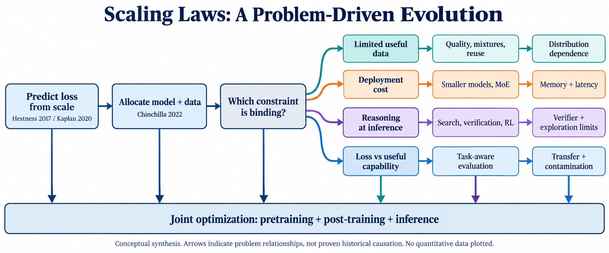

# Scaling Law：问题驱动的技术演化综述

**中文持续更新综述 · 首版核验：2026-09-16**

这份综述重建 scaling law 的研究对话：为什么需要预测扩大规模的收益，为什么只扩大模型不够，为什么数据、架构、后训练和推理又成为新的预算轴。每个阶段围绕 **问题 → 洞见 → 方法 → 证据 → 局限 → 后续分支** 展开。

**开始阅读：[完整综述](SURVEY.zh-CN.md)** · [PDF 阅读版](output/pdf/scaling-law-survey.zh-CN.pdf) · [文献索引](REFERENCES.md) · [社区雷达](docs/04-community-radar.md)



图中箭头表示本综述归纳的问题关系，不自动表示论文之间存在直接历史因果；此图不包含实验数据。

## 为什么这样组织

参考 [Jinhong Lin 的 post-training survey](https://github.com/JonnesLin/post-training-survey)，尤其是其设计文档、实现计划与中文正文。我们采用其“多条问题线 + 线内演化 + 跨线联系”的组织方法，并加入证据条件、阅读深度、版本修订和社区来源记录。[结构与生成方法拆解](docs/00-reference-method.md) 说明具体借鉴了什么。

## 七条问题线

| 问题线 | 核心问题 | 阅读入口 |
|---|---|---|
| T1 预测与预算 | 更多资源能换来多少收益？参数与数据如何分配？ | [预训练章](docs/01-pretraining-data-architecture.md) |
| T2 有效数据 | 数据不足、重复、质量不一时怎么继续扩展？ | [预训练章](docs/01-pretraining-data-architecture.md) |
| T3 架构与部署 | 活动参数、总参数和长期推理成本如何改变最优解？ | [预训练章](docs/01-pretraining-data-architecture.md) |
| T4 后训练 | 如何学到更能利用计算的策略？奖励和探索何时饱和？ | [后训练与推理章](docs/02-posttraining-inference.md) |
| T5 推理时计算 | 预算该给长思考、多候选、搜索还是验证？ | [后训练与推理章](docs/02-posttraining-inference.md) |
| T6 能力与评估 | loss 改善如何映射到能力？什么情况下外推失效？ | [评估与多模态章](docs/03-evaluation-multimodal.md) |
| T7 多模态迁移 | 语言中的规律能否迁移到视觉与图文混合？ | [评估与多模态章](docs/03-evaluation-multimodal.md) |

七条问题线合并在三篇技术长章中，避免将紧密联系的问题人为切开。完整阅读版串联导论、方法拆解、三篇技术章、社区雷达与综合结论。

## 覆盖与证据

以 LLM 为中心，纳入深度学习起源、理论与视觉/多模态的代表工作。本项目是有检索记录的**叙事性综述**，不是宣称无遗漏的系统综述，也未独立复现实验。首版包含45条去重论文/报告主源、12条社区记录，以及2026年已核验的代表性材料，但“检索到 2026-09-16”不表示已经覆盖这一日期以前的全部工作。

技术判断依据原论文、作者或机构的技术报告。X、YouTube、Reddit 用来发现问题和争议；互动数据注明观测来源与限制，不能替代研究证据。没有读取全文的材料明确列出阅读深度，未核验的近期主张进入待查队列。

## 更新与复用

- [方法与纳入标准](METHODOLOGY.md)
- [持续更新流程](UPDATING.md)
- [更新日志](CHANGELOG.md)
- [结构化文献](sources/) 与 [维护状态](data/state.json)
- [发布状态](PUBLISHING.md)

```bash
python3 scripts/build_survey.py
python3 scripts/validate.py
# PDF 需要 reportlab、Pillow、pypdf；matplotlib 用于数学排版
python3 scripts/build_pdf.py --check
```

章节 Markdown 与 sources 中的人工核验记录是维护源；完整综述与文献索引由脚本生成。数学表达以 Markdown 中的 LaTeX 为准，PDF 是便于阅读的排版版。原论文、社区内容和参考仓库仍属于各自作者；本项目不分发它们的全文。
