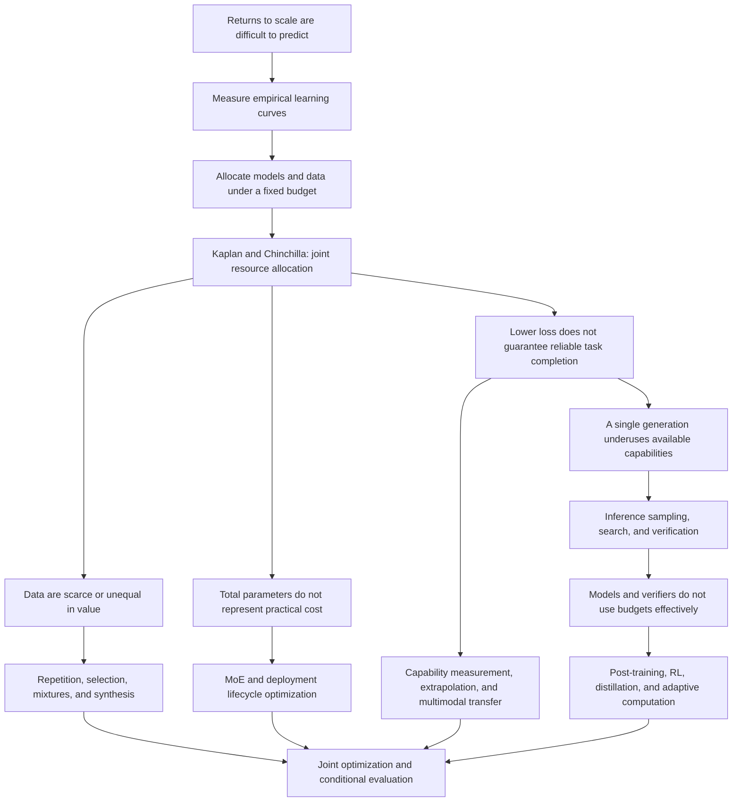

# Scaling Law: A Problem-Driven Review

Edition v0.3 · Searches and verification through 2026-09-16 · English living edition

From predicting returns to scale to jointly allocating pretraining, post-training, and inference budgets. This edition contains 161 distinct primary-source records and a separate community radar. It is a representative narrative review, not an exhaustive systematic review; the cited experiments have not been independently reproduced.

The figure is a conceptual synthesis, not an experimental curve; arrows do not automatically establish historical causation.

Reading links: [English homepage](README.md) · [Chinese edition](SURVEY.zh-CN.md) · [References](REFERENCES.en.md) · [Translation status](data/translation-status.json)

---

## Introduction: What Questions Do Scaling Laws Answer?

Training a large model begins with a resource decision: before spending the budget, can we estimate the benefits of adding model capacity, training data, or computation? If every configuration must be trained to completion before its performance is known, larger experiments become increasingly difficult to afford. Hestness and colleagues measured learning curves across tasks; Kaplan and colleagues subsequently connected language-model parameters, data, and training computation, turning the intuition that larger models might perform better into resource–performance relationships that could be fitted and compared. [Hestness et al., 2017](https://arxiv.org/abs/1712.00409); [Kaplan et al., 2020](https://arxiv.org/abs/2001.08361).

Predicting improvement, however, does not by itself identify the right allocation. Chinchilla showed that, at fixed training compute, allocating too much of the budget to parameters without a corresponding increase in training tokens can be inefficient. The central question shifted from whether to scale to which dimension to scale. Data scarcity and quality differences, sparse architectures, deployment costs, reward feedback, and inference-time computation subsequently added further constraints to this optimization problem. [Hoffmann et al., 2022](https://arxiv.org/abs/2203.15556).

The central argument of this survey is that **scaling-law research evolves as researchers discover what existing resource models omit and solve the allocation problem again.** This is a synthesis of the literature, not a unified theorem proposed by any one paper.

### Separate Three Questions That Are Often Conflated

| Level | Object of study | What it can answer | What does not follow directly |
|---|---|---|---|
| Empirical regularities | How loss or error changes with scale under a specified configuration | Behavior in the measured range and the validity of controlled extrapolation | Validity at arbitrary scales, distributions, or tasks |
| Resource optimality | Choosing models, data, and algorithms under a budget | Which configuration is more efficient for the stated objective | That training optimality also implies deployment optimality |
| Capabilities and systems | Actual success under a task, interface, and evaluation protocol | Whether a system delivers reliably and at what cost | That one average score completely describes its capabilities |

This distinction runs throughout the survey. Lower language-model cross-entropy, higher mathematical pass@1, finding a correct candidate among N samples, and delivering a correct answer to a user are different quantities. Even when all improve with computation, they need not share an exponent or conversion rule. Inference-time scaling in particular requires explicit accounting for selection and verification costs. [Snell et al., 2024](https://arxiv.org/abs/2408.03314).

### The Same Curve Can Address Four Different Decisions

To understand the subsequent branches, first identify where the budget is fixed. The first decision occurs before training: given total training compute, what model size, token count, and optimization schedule should we choose? The second arises once data and hardware constraints are known: when unique data are scarce, the model does not fit in memory, or context is too long, which variables remain available to increase? The third occurs before deployment: does a sufficiently large request volume justify longer training once in exchange for cheaper inference on every request? The fourth occurs when a request arrives: should this problem receive more generation, search, or verification, or should computation stop? The first three primarily change the system; the fourth allocates a per-problem budget within a trained system. [Chinchilla](https://arxiv.org/abs/2203.15556); [data-constrained scaling](https://arxiv.org/abs/2305.16264); [lifecycle costs](https://arxiv.org/abs/2401.00448); [Snell et al.](https://arxiv.org/abs/2408.03314).

**The following accounting framework connects these decisions; it is not presented as an already fitted, unified scaling law:**

$$
C_{\mathrm{total}}=C_{\mathrm{pre}}+C_{\mathrm{post}}+
Q\,\mathbb{E}_{x}\left[C_{\mathrm{serve}}(x)\right].
$$

Here, $C_{\mathrm{serve}}$ includes generation, selection or verification, and tool use; $Q$ is the expected request volume. Optimizing monetary cost, latency, or energy requires separate accounting rather than inserting those quantities into the same FLOP sum. The request distribution also matters: at the same average compute, assigning equal budgets to easy and difficult problems may underperform allocation by marginal benefit. Predicting difficulty and deciding when to stop also incur costs. The task-adaptive methods discussed later approximate this incompletely known optimization problem.

This explains a recurring misinterpretation. An experiment showing continued gains from increasing $D$ at fixed $N$ does not determine whether a larger $N$ is preferable at fixed $C$. Likewise, a model becoming more accurate with longer thinking does not establish that it is more efficient than another model at equal end-to-end cost. Apparently conflicting papers can be placed in the same research conversation only after identifying what was fixed, what changed, and what was measured.

Definitions used throughout the seven chapters appear in the [glossary and cost conventions](docs/en/glossary.md). In particular, data quality is not a universal scalar across tasks; sparse models require more than total parameter counts; verifier-assisted success cannot be attributed solely to the generator; and exact-match scores are not direct continuous measurements of internal capability.

### A Map of the Research Questions

The arrows represent the survey's explanatory connections. The text distinguishes direct responses to prior work, parallel approaches to the same bottleneck, and editorial synthesis; chronological ordering is not automatically treated as historical causation.

A more detailed account of paper relationships and branching rationales is available in the [research conversation map (Chinese)](docs/research-map.md).

### Reading Paths

For the classical allocation debate, start with the Kaplan–Chinchilla–reanalysis chain in [predictability and budgets](docs/en/01-predictability-budget.md), then read [data](docs/en/02-data.md) and [deployment costs](docs/en/03-architecture-deployment.md). To assess whether test-time scaling is taking over, begin with the proposers, verifiers, and allocation policies in [post-training](docs/en/04-posttraining.md) and [inference-time computation](docs/en/05-inference.md), then examine [capability evaluation](docs/en/06-theory-evaluation.md) and negative results. To follow new work, first identify the question raised in the community radar, return to the primary evidence, and decide which connection in the narrative should change.

This survey prioritizes representative studies that explain turning points rather than mechanically ranking papers by citations or social-media exposure. References to “current” or “latest” are relative to the search date, September 16, 2026. Reading scope and unresolved issues are disclosed in the chapters and metadata.

---

## T1 Predictability, Budgets, and Training Recipes: What Is the Same Curve Actually Comparing?

> Verification date: 2026-09-16. Scope: empirical pretraining laws, budget allocation, optimization across scales, overtraining, and capability extrapolation. Evidence comes from the original papers; this chapter does not claim exhaustive coverage through the verification date. Core methods, experiments, and limitations were checked in targeted readings of the full texts; experiments were not rerun, nor were all appendices independently recalculated. See the [foundational sources](sources/foundations.json) and [additional sources](sources/expansion-foundations.json) for sources and reading depth. Direct lines of inheritance are identified in the text; other connections are this survey's synthesis of how the research problems evolved.

### 1. The Initial Prediction Target Was the Marginal Return on Additional Resources

The early engineering problem was not a lack of awareness that larger models and more data might help. It was uncertainty about how much another order of magnitude of resources would improve performance, and whether a plateau reflected the task's limits or a problem with the implementation. Across translation, language, image, and speech tasks, Hestness et al. adjusted both model capacity and optimization settings to measure the relationship between dataset size and generalization error. They distinguished a small-data region resembling guessing, a region of power-law improvement, and eventual saturation. This made learning curves a planning tool, without proving that every task could improve indefinitely at the same slope. [Hestness et al., 2017](https://arxiv.org/html/1712.00409v1)

Measuring data scaling alone was still insufficient: with a fixed budget, increasing the parameter count reduces the number of training tokens that can be processed. Kaplan et al. placed parameters, data, and training compute within one empirical framework, emphasizing that the greater sample efficiency of large models could allow an early-stopped large model to outperform a smaller model trained more fully. Their compute-optimal estimate was approximately $N_{\rm opt}\propto C^{0.73}$, but it primarily counted non-embedding parameters and used compute adjusted for batch size. This exponent cannot be detached from those definitions and compared directly with any later FLOPs curve. [Kaplan et al., 2020, §1 and §6](https://arxiv.org/html/2001.08361v1)

#### From Loss Prediction to Practical Capabilities: GPT-3 and Gopher Exposed Another Layer of the Problem

GPT-3 was an important step in putting this resource perspective into practice: models ranging from 125M to 175B parameters received task examples without weight updates, demonstrating the potential for in-context learning to change with scale. It shifted attention from how much cross-entropy decreased to whether a single pretrained model could handle more tasks. These results could not, however, simultaneously establish optimal training budgets, the causal origins of each capability, and the absence of data contamination; the original report also disclosed shortcomings in its contamination filtering. Evaluation with a few prompt examples does not imply that the model never encountered relevant knowledge during pretraining. [Brown et al., 2020, §2–4](https://arxiv.org/html/2005.14165v4)

Gopher extended comparisons across model sizes to a broad range of tasks. Knowledge and reading comprehension improved more clearly, whereas some logic and mathematics tasks benefited less, and performance on some tasks even worsened with scale. Pretraining loss is therefore a compressed measure of model behavior, while capabilities emerge from the interaction of the model with task distributions, prompts, and evaluation. The point is not that average loss is useless, but that an average cannot by itself identify which capabilities have entered a regime of predictable improvement. [Rae et al., 2021/2022, §4.3](https://arxiv.org/html/2112.11446v2)

### 2. Chinchilla Revised Resource Allocation, Not Predictability Itself

Chinchilla directly revisited parameter/token allocation under a fixed compute budget. It estimated optimal configurations through three approaches: training-curve envelopes, IsoFLOP curves, and a parametric loss model. A 70B-parameter model trained on 1.4T tokens demonstrated the benefits of training a smaller model for longer, using a training compute budget comparable to Gopher's. One commonly used fit is

$$
L(N,D)=E+A N^{-\alpha}+B D^{-\beta},\qquad C\approx6ND.
$$

Here, $D$ counts processed tokens, $L$ is defined on a specified validation distribution, and the constants and exponents come from a particular training recipe. The expression $6ND$ is only an approximation for training dense Transformers; it does not include every context-related or systems overhead. [Hoffmann et al., 2022, §3–5](https://arxiv.org/html/2203.15556v1)

**This survey's algebraic explanation** substitutes $D=C/(6N)$ and sets the derivative to zero, yielding

$$
\alpha A N^{-\alpha}=\beta B D^{-\beta},\qquad
N_{\rm opt}\propto C^{\beta/(\alpha+\beta)},\quad
D_{\rm opt}\propto C^{\alpha/(\alpha+\beta)}.
$$

The optimal allocation balances the marginal returns from two reducible error terms. Only when their exponents are similar do the budget exponents for parameters and data both approach one-half. Roughly 20 tokens per parameter is thus an empirical approximation for a particular training objective and recipe, not an upper bound beyond which additional data becomes useless. The original paper's three fitting methods did not produce identical results either. [Tables 2 and 3 of the original paper](https://arxiv.org/html/2203.15556v1)

#### Why Can Smooth Curves Produce Different “Optima”?

Porian et al. directly investigated the differences between Kaplan and Chinchilla, examining output-layer costs, warmup, and how learning rate and batch size change with scale. After adjustments, their allocation trends on two datasets were closer to Chinchilla's. Observed scaling effects can therefore be entangled with insufficient optimization of small models or inconsistent cost accounting; they cannot all be interpreted as physical properties of model capacity. [Porian et al., 2024; revised version consulted](https://arxiv.org/html/2406.19146)

The fitting procedure itself also needs auditing. Besiroglu et al. reconstructed Chinchilla's data from figures and repeated its third, parametric fitting approach, identifying issues with the parameters and confidence intervals. Their new fit was closer to the trends from the paper's first two methods. This was a check based on limited available material, not a full replication using complete original training logs. The relatively robust conclusion that models and data should grow together should be distinguished from the more fragile claim that a particular set of constants can extrapolate precisely across four orders of magnitude. [Chinchilla Scaling: A replication attempt, 2024](https://arxiv.org/html/2404.10102)

### 3. Optimization Is Also a Scaling Variable: Tensor Programs and μP

These disagreements raise a deeper question. If the best learning rate and update magnitude change with width, a curve connecting models trained with uncalibrated hyperparameters may be measuring the quality of tuning. Yet searching for hyperparameters from scratch for every large model consumes budget that could otherwise support the final training run. **What needs to transfer is not only model capability, but also the training recipe.**

Tensor Programs IV approached this issue through infinite-width parameterizations. Some limits turn a network into a kernel model with approximately fixed features; other parameterizations preserve feature learning. This distinction provides a theoretical foundation for the subsequent μP work, but does not directly imply the loss exponents of real language models. It addresses how networks can maintain nontrivial learning dynamics as width changes. [Yang & Hu, 2020/2022](https://arxiv.org/html/2011.14522v3)

Tensor Programs V turned this idea into μTransfer: tune a narrow model, then transfer suitable base hyperparameters to a wider model. The mechanism is not simply to multiply the global learning rate by a constant. It coordinates initialization, learning rates, and readout scaling across different tensors so that updates have an appropriately sized effect on activations. For example, under its Adam recipe, if a hidden matrix's width multiplier is $m$, its learning rate is $\eta_{\rm base}/m$; vectors and input and output layers follow different rules. Extracting just one of these scaling formulas while retaining the other settings of standard parameterization does not implement μP. [Yang et al., 2022, Table 3 and Appendix B](https://arxiv.org/html/2203.03466v2)

The paper used a roughly 40M-parameter proxy to search for hyperparameters for a 6.7B GPT-3-style model, reporting a tuning budget of approximately 7% of the large model's pretraining FLOPs. This suggests that small models can help choose the optimization settings behind a loss curve, as well as estimate the curve itself. Experimental details matter, however: the large-model comparison used different positional encodings, and numerical issues led the μP run to use FP32 while the baseline used FP16. Consequently, the full downstream difference cannot be attributed solely to parameterization. The theoretical basis for width transfer is also stronger than for transfer across depth, batch size, or sequence length; regularization hyperparameters do not have the same guarantees. [§6.1 and §7.4 of the original paper](https://arxiv.org/html/2203.03466v2)

This survey therefore separates the cost of a scaling experiment into finding a recipe and executing it. The primary value of μP is to reduce the former and reduce optimization mismatch across scales, rather than to claim that changing parameterization improves every power-law exponent. This also explains why new scaling papers should report tuning budgets and failed runs: these costs determine whether a method can genuinely guide the next expensive training run.

### 4. Checking a Curve Requires More Than Final Weights

One of OPT's contributions was to document restarts, loss anomalies, and hardware problems that are difficult to infer from a final curve. Real training budgets include recovery and the work required to keep runs operating; they are not determined solely by successfully processed tokens. Its open models support external analysis, but data, implementations, and recipes still differ between OPT, GPT-3, and other families. Matching nominal parameter counts does not fully control these variables. [Zhang et al., 2022, §2.5](https://arxiv.org/html/2205.01068v4)

Pythia made the ability to study scaling a more explicit design objective: eight sizes, each trained on both the original and a deduplicated version of the data, for 16 models in total. It controlled data order within each data version and provided 154 checkpoints per model. This lets researchers ask when a behavior emerges and whether it changes consistently with training time and model size. The trade-off is that a uniform schedule does not automatically provide compute-optimal training for every size. A suite suited to studying dynamics has not necessarily solved the optimal budget-allocation problem. [Biderman et al., 2023, §2](https://arxiv.org/html/2304.01373v2)

OLMo extended openness to data, training code, logs, checkpoints, and evaluation. Its connection to the problem addressed by Pythia is clear: testing an empirical law requires allowing others to reconstruct the process that generated its data points. **This survey's assessment** is that open model suites are part of the measurement infrastructure for scaling laws. Their scientific value should not be judged solely by their leaderboard positions at release. [Groeneveld et al., 2024](https://arxiv.org/html/2402.00838v4)

### 5. Beyond the Training Optimum: LLaMA and the New Problem of Overtraining

Chinchilla optimizes the training cost of reaching a given loss. LLaMA explicitly included inference cost in its design motivation: a smaller model may be better suited to extensive subsequent use even if it requires more pretraining tokens. Its results made training beyond Chinchilla-style ratios a practical requirement. However, cross-family performance comparisons also change data and recipes, so they are not ablations of parameter count alone. [Touvron et al., 2023, Introduction](https://arxiv.org/html/2302.13971v1)

Here, overtraining means exceeding the tokens-per-parameter ratio that is optimal for training compute. It does not mean that validation performance has already deteriorated from overfitting. Gadre et al. therefore asked whether loss retains a stable structure away from the optimal frontier. They measured 104 models with 11M–6.9B parameters across three types of corpora, covering token multipliers $M=D/N$ from 5 to 640. Setting $\alpha=\beta=2\eta$ in the base model and substituting $M$ and $C\approx6ND$ gives

$$
L(C,M)=E+\left(aM^\eta+bM^{-\eta}\right)C^{-\eta}.
$$

This expression separates scaling compute from choosing training duration. Within the range where the fit holds, changing $M$ may primarily shift the curve's position without disrupting a common compute exponent. This is not an a priori guarantee: the approximate exponents, data recipes, and optimization settings in the experiments all require examination. [Gadre et al., 2024, §2–3](https://arxiv.org/html/2403.08540v2)

The authors also mapped validation loss to average error across a set of downstream tasks. Two boundaries matter: the task set was selected using small-model performance, and an average relationship cannot replace predictions for individual tasks, let alone automatically cover post-training. The experiments were also preceded by a hyperparameter search, so the small-model budget needed for prediction should not be described as the total cost of the study. This survey interprets the result as providing useful interpolation and extrapolation tools for deployment-oriented training, rather than establishing that arbitrarily long training yields the same returns. [Experimental setup and §6 of the original paper](https://arxiv.org/html/2403.08540v2)

### 6. Llama 3: Separating Budget Prediction from Task Prediction

The Llama 3 report illustrates how scaling laws can become a decision procedure for a large training run. The researchers trained smaller models of roughly 40M–16B parameters, spanning approximately $6\times10^{18}$ to $10^{22}$ FLOPs, found minimum losses along IsoFLOP curves, and estimated how the optimal token count changed with compute. Extrapolation suggested a configuration of about 402B parameters and 16.55T tokens; considering the flat region around the minimum, they ultimately selected 405B. This is closer to the engineering purpose of scaling laws than fitting a line after the fact: identifying candidate configurations and the basis for choosing between them before training the target model. [The Llama 3 Herd of Models, §3.2.1](https://arxiv.org/html/2407.21783v3)

Capability prediction is a separate layer. The first step fits the relationship between training compute and the negative log-likelihood of correct answers on the target task; the second maps that NLL to accuracy. The second step uses not only small models but also larger Llama 2 models as anchors, despite differences in data and tokenizers. Successful extrapolation in the report therefore validates a particular pipeline. It does not prove that all large-model tasks can be predicted precisely using only small models trained on the same distribution. [Ibid., §3.2.1](https://arxiv.org/html/2407.21783v3)

The report also exposes a hidden variable in token accounting: tokenizer improvements increased the number of characters represented by each token. Two models trained on a trillion tokens need not have processed the same amount of text. Loss comparisons must also respect their units: per-token cross-entropy over different vocabularies cannot be treated directly as the same quantity. Large-model technical reports should therefore be broken into separately testable claims, examining the controls for configuration selection, validation-loss prediction, task mapping, and systems implementation, rather than compressing the success of an entire model into “scaling works.” [Ibid., §3.1–3.3](https://arxiv.org/html/2407.21783v3)

### 7. Which Cost Should Be Optimized Next?

This line of work has advanced from a single learning curve to a conditional experimental procedure: specify the data distribution and evaluation objective, ensure comparable optimization quality across scales, fit under an explicit cost definition, and finally test on scales or tasks excluded from fitting. This procedure also explains why apparently contradictory optimal ratios may both be valid: they may optimize different training recipes or serve different deployment requirements.

For a model that will provide a long-running service, the objective must also include request volume, generation length, and hardware constraints. [T3 Architecture and Deployment](docs/en/03-architecture-deployment.md) develops this topic. When training tokens no longer correspond to new useful information, the analysis must incorporate unique data volume, mixture proportions, filtering, and generation mechanisms, as discussed in [T2 Data](docs/en/02-data.md). Tasks that have not yet entered a reliable extrapolation regime should retain their uncertainty, rather than having it replaced by a smoother average curve.

---

## T2 Data Bottlenecks: From Token Counts to Useful Information, Mixtures, and Training Order

> Verification date: 2026-09-16. Scope: unique data volume, deduplication, selection, domain mixtures, data curricula, supply forecasts, and synthetic feedback. The chapter distinguishes experimental evidence in the original papers from this survey's synthesis of mechanisms; data processing and training experiments were not independently rerun. See the [foundational sources](sources/foundations.json) and [additional sources](sources/expansion-foundations.json) for reading depth. Works checked only at the abstract level, including TinyStories, Phi-3, and Scaling Laws for Transfer, remain in the source registry but are not used to support this chapter's technical conclusions.

### 1. Data Becomes a Bottleneck Because D Carries Too Many Meanings

In the dense-pretraining approximation $C\approx6ND$, $D$ first denotes the number of tokens processed during computation. This accounting variable can directly represent statistical dataset size only if every token supplies independent, homogeneous new information. Actual corpora contain repetition, domain differences, errors, and overlap between training and test data; identical token counts can also come from different tokenizers. **This survey organizes the discussion** by separating several questions: how much new content is available, which content to retain, how to allocate training proportions, in what order to train, and who generated the new content. Together these factors change the return curve, but they are not a single “quality parameter.”

The training runs used for Chinchilla's scaling-law fitting analysis covered less than one epoch, so its formula alone cannot determine the value of repeatedly training on a finite corpus. This was not true of every domain in the final 1.4T-token model's training data: Table A1 reports 1.24 epochs for MassiveWeb and 3.40 for Wikipedia. The analytical runs must be distinguished from the final training recipe. Muennighoff et al. directly separated unique data volume, repetition count, and model capacity, fitting diminishing marginal returns to repeated tokens. In some experimental settings, the gap after four epochs of repetition was small, while further repetition showed substantial diminishing returns, and individual runs deteriorated; their saturating fit cannot fully represent that deterioration. This revises the assumption that all tokens are equivalent, but does not establish a threshold under which repeating any dataset four times is safe. [Hoffmann et al., 2022, §5](https://arxiv.org/html/2203.15556v1); [Muennighoff et al., 2023, §3 and §5–6](https://arxiv.org/html/2305.16264)

The options in a data-limited setting are therefore not restricted to enlarging the model or stopping training. Repeating existing data, relaxing filters, adding heterogeneous domains, and generating new examples can all increase the nominal $D$, but introduce different biases. Comparisons should report total processed volume, unique data volume, and its sources together. Otherwise, an apparent improvement in data efficiency may simply reflect undisclosed repetition or distribution shifts.

### 2. Deduplication First Repairs Counting and Evaluation, Before Addressing Quality

Lee et al. treated repeated long strings and near-duplicate documents separately, comparing language models before and after deduplication. In their C4 experiments, deduplication reduced copying of training text during generation and improved the efficiency of training-data use. The problem is not merely that duplicates consume budget: overlap between training and validation sets can also make validation loss appear better than generalization to genuinely new examples. A scaling curve fitted to such measurements may be smooth while incorporating increasingly strong memorization. [Deduplicating Training Data Makes Language Models Better, methods and experiments](https://arxiv.org/html/2107.06499v2)

This does not contradict the finding that deliberate repetition can still help when data is limited. Deduplication research primarily removes unintended duplication from corpus collection and overlap with evaluation data. Data-constrained research instead asks how much value another pass provides once the training set is clearly defined. **This survey's synthesis** is that the basic data unit and the source of repetition should be specified before calculating epochs. Uncontrolled repetition in naturally collected corpora should not be conflated with traceable resampling in an experimental design.

Dolma provides infrastructure for checking this distinction: a large open corpus and modular quality, content, and deduplication pipelines allow processing steps to be replaced and evaluated separately. Its analysis also suggests that the content excluded by different filters need not overlap substantially. Processing steps that seem individually mild can, in combination, leave an insufficient data supply. The net benefit of filtering therefore depends on retention rate, the available corpus pool, and training demand, rather than on using as many filtering rules as possible. [Soldaini et al., 2024, filtering and deduplication analysis](https://arxiv.org/html/2402.00159v2)

### 3. From Random Expansion to Active Selection: When Is a Target Distribution Needed?

Sorscher et al. posed a challenge: randomly enlarging a dataset may be an inefficient baseline. If a selector knows which examples are most informative, can the learning curve improve faster? Their theoretical models demonstrate the possibility of going beyond power laws under ideal selection, while image experiments reveal that practical selection metrics do not transfer easily. Selection cost, class coverage, and the number of training epochs all affect the net benefit. These results therefore cannot be presented as evidence that general-purpose language models already achieve exponential error reduction. [Beyond neural scaling laws, 2022](https://arxiv.org/html/2206.14486)

DSIR addresses a more specific and actionable condition: **samples from the target domain are already available**. It represents documents using low-dimensional features such as hashed n-grams, estimates the density ratio between the target and the raw corpus in that feature space, and performs importance resampling. Intuitively, feature combinations that are common in the target but rare in the raw pool receive higher weights. This offers a cheaper route to data selection than running a large quality model on every document. [Data Selection for Language Models via Importance Resampling, methods and experiments](https://arxiv.org/html/2302.03169v3)

Its evidence comes primarily from continued pretraining for domain adaptation and comparisons with matched training-token budgets. Target samples determine what to select, while the low-dimensional approximation determines which distributional differences are visible. The method does not discover an unknown general-purpose target on the researcher's behalf, nor does n-gram matching guarantee semantic correctness. This creates a substantive branch in the research: a known deployment domain permits optimization of distribution matching, while unknown future tasks call for broader domain coverage and robust objectives. There is no single optimal filtering score for both.

### 4. FineWeb: Why Is “Educational Quality” Not Quality for Every Task?

FineWeb turned web cleaning into a set of choices that could be tested through pretraining outcomes, producing a corpus of roughly 15T tokens. FineWeb-Edu then applied model-assisted filtering for educational value, retaining around 1.3T tokens. Its significance lies not only in releasing a larger dataset, but also in connecting filtering thresholds with the capabilities of trained models and evaluating processing steps with comparable models and training settings. [Penedo et al., 2024, §4](https://arxiv.org/html/2406.17557v2)

The central trade-off lies in the definition of “good.” Educational text can strengthen academic-knowledge and reasoning evaluations, but also changes the coverage of nonacademic websites, social language, and different language varieties. The paper's comparisons show that perplexity across domains does not uniformly favor either the educationally filtered version or the broader web version. An advantage on one benchmark therefore cannot be recast as greater learning value for every kind of text. A filter selects a portfolio of capabilities. [Ibid., §4.2 and §6](https://arxiv.org/html/2406.17557v2)

DataComp-LM constrains this problem from another direction: it fixes the experimental framework and compares data processing across multiple model sizes, aiming to keep architecture and training configuration from becoming hidden variables. It supports the value of model-assisted filtering while acknowledging limitations in combination searches, run variation, large-model experiments, and evaluation coverage. FineWeb and DataComp-LM are two approaches to the shared problem of attributing gains to data; one algorithm does not directly replace the other. [DataComp-LM, 2024, §6](https://arxiv.org/html/2406.11794)

This survey therefore treats “high-quality data” as a conclusion that must specify an objective and a control: lower loss on a designated domain under the same training budget, or higher scores on a particular set of downstream tasks? Is the scoring model's execution cost included? Does the filtered corpus remain large enough to support long training? Without fixing these conditions, a smaller curated dataset cannot be compared fairly with a larger, more diverse one.

### 5. Landmark: How DoReMi Turns Unknown Downstream Tasks into a Mixture-Optimization Problem

Choosing domain proportions is cheaper than scoring individual documents, but challenges remain. Sampling in proportion to corpus volume overrepresents large domains, while the domain with the highest average loss may simply be noisy rather than the best place to spend further training. DoReMi's key insight is to compare the current model's loss with a reference model, focusing on “excess loss” that may still be learnable rather than absolute difficulty. Its domain-level objective can be summarized as

$$
\min_\theta\max_{\alpha\in\Delta}
\sum_i\alpha_i\,
\mathbb{E}_{x\sim D_i}
[\ell_\theta(x)-\ell_{\rm ref}(x)].
$$

$\alpha$ is the domain-sampling distribution. The actual algorithm also includes token-level normalization, excess-loss clipping, weight smoothing, and averaging over training. This abbreviated formula cannot substitute for those details in a reproduction. [Xie et al., 2023, §3 and Algorithm 1](https://arxiv.org/html/2305.10429v4)

The method first trains a reference model, then uses an approximately 280M-parameter proxy to estimate domain weights, and finally trains an 8B model on the resulting mixture. What transfers is the data allocation, not a direct enlargement of the proxy's weights. In experiments on the Pile's 22 domains and a separate GLaM dataset, the authors compared domain losses and downstream results. They reported an average gain of roughly 6.5 percentage points across five generative one-shot tasks, as well as fewer training steps to reach baseline performance. The additional small-model compute was approximately 8% of the compared large model's pretraining compute, so this search cost should remain part of the assessment. [§4 of the original paper](https://arxiv.org/html/2305.10429v4)

Why might this mechanism work? **This survey's explanation** is that the reference model provides a baseline for differences in intrinsic difficulty across domains, helping avoid spending all resources on irreducible error, while distributionally robust optimization exposes domains neglected by the current mixture. Its limits arise from the same mechanism: a weak or biased reference model makes excess loss less reliable; coarse domain partitions average away differences within a large domain; and content that a small model considers worth learning may not offer the same marginal return to a large model. The paper's success across scales provides empirical support, not a theorem covering every proxy and target size.

### 6. Direct Successor RegMix: Learning Recipe Rankings Instead of Closely Simulating Training

RegMix explicitly compares against proxy-training methods such as DoReMi and proposes a different proxy: train many extremely small models across a wide range of mixture proportions, then regress validation loss against the proportion vector. If small models rank candidate recipes approximately as large models do, the proxy need not reproduce large-model training step by step. [Liu et al., 2024/2025, §1 and §3](https://arxiv.org/html/2407.01492v2)

Its experiments trained 512 small proxies, each with roughly 1M non-embedding parameters and 1B training tokens, fitted a regressor, and validated mixture rankings using multiple 1B models. The 1M count has a specific definition: it must not be read as a million parameters for the entire model including word embeddings. Search cost was approximately 2% of a single compared 1B-model training run, demonstrating the value of using small proxies to cover a broad configuration space. [Methods and experiments of the original paper](https://arxiv.org/html/2407.01492v2)

The limitations are equally specific. The primary optimization target was Pile-CC validation loss because it correlated with downstream performance in those experiments; it may not suit medical, code, or multilingual services. Comparisons with DoReMi also renormalized its domain weights over the available domains, which the authors acknowledge may affect the baseline. The justified conclusion is that small-model ranking can reduce search costs within the studied candidate domains, objectives, and scale range, not that RegMix has universally superseded DoReMi. [§5 and comparison notes in the original paper](https://arxiv.org/html/2407.01492v2)

Both methods assume that recipes can transfer across scales, but estimate them differently: DoReMi uses reference losses and dynamic robust optimization, whereas RegMix uses ranking patterns from many small experiments. The earlier Data Mixing Laws also attempts to fit the functional relationship between domain proportions and loss directly. This survey checked that work only at the abstract and introduction level and does not use it to add stronger cross-scale conclusions. [Ye et al., 2024](https://arxiv.org/abs/2403.16952)

### 7. Static Proportions Are Still Insufficient: SmolLM2 Introduces Training Stage as a Variable

When small models are trained for a long time, the best corpus for an early stage may not be the best for a later one. SmolLM2 trained its 1.7B model on roughly 11T tokens, adjusting the proportions of web, code, mathematics, and synthetic text over four stages. Building on open data infrastructure such as FineWeb, it advances the question from choosing one best mixture to deciding what to feed the current checkpoint next. Some of the report's data experiments begin from intermediate checkpoints, because weaker, randomly initialized small models may not reliably assess the late-stage value of difficult data. [SmolLM2, §4.3–4.7](https://arxiv.org/html/2502.02737v1)

This offers a caution for proxy design: the usefulness of data may interact with capabilities the model already possesses. Selection based solely on extremely small proxies trained from scratch may miss examples that require foundational knowledge before they become useful. The report does not, however, establish a universal curriculum-learning law. Later stages combine data changes, learning-rate decay, and additional compute, so final gains cannot all be attributed to one data source. Training also encountered loss spikes that were difficult to explain fully, indicating that the complete recipe still contains factors not fully modeled. [Ibid., stage analysis and ablations](https://arxiv.org/html/2502.02737v1)

SmolLM2 also illustrates the interface between pretraining and post-training: a base model's advantage does not necessarily translate automatically into an instruction model's advantage when existing instruction data is reused, creating a need for corresponding post-training data. **This survey's synthesis** is that data optimality depends on at least three factors: model size, the current training stage, and the ultimate use case. Total token counts alone cannot distinguish them. To become useful engineering tools, future mixture laws should include proxy checkpoints and training stages in their verifiable definitions.

### 8. The Data Wall Is a Conditional Forecast, Not an Established Event

The 2024 revision by Villalobos et al. combines estimates of the effective stock of public human-generated text with growth in training demand. Under assumptions including continuation of existing trends, it gives a possible supply-constraint window of roughly 2026–2032, with a median estimate around 2028. This is neither real-time confirmation of conditions in 2026 nor a claim that all text in the world will run out on a particular day. It concerns training supply under specified assumptions about sources, availability, and effectiveness. [Will we run out of data?, v2](https://arxiv.org/html/2211.04325v2)

This forecast has an important connection to overtraining. To reduce subsequent inference costs, developers may train smaller models on more tokens, changing data demand under the same compute budget. Conversely, broader definitions of usable data, repeated training, transfer, or generation of new data change the supply model. It is therefore reasonable for the interval to shift with demand objectives and data efficiency. The continued release of new systems does not by itself falsify the data-wall hypothesis. What needs updating is the original forecast's input assumptions and observable data. [Ibid., §2–3](https://arxiv.org/html/2211.04325v2)

This survey consequently distinguishes three levels: whether the stock of web content continues to grow; how many useful examples remain after licensing, cleaning, deduplication, and target matching; and whether models are becoming more efficient at learning from those examples. These belong respectively to supply, processing, and learning algorithms. Total internet byte counts alone cannot determine the remaining room for language-model training.

### 9. For Synthetic Data, the Feedback Mechanism Matters More Than the Source Label

Shumailov et al. studied recursive training in which a model's outputs train the next generation, demonstrating model collapse through accumulating errors such as finite-sampling error and the progressive loss of tail information. The version checked here is arXiv v3; an unread formally published version is not being presented as evidence of full-text review. The conclusions concern particular feedback mechanisms and do not imply that any inclusion of synthetic data necessarily causes degradation. [The Curse of Recursion, v3 consulted](https://arxiv.org/html/2305.17493v3)

Gerstgrasser et al. directly tested a crucial condition: is the original real data replaced, or retained and accumulated together with data from successive generations? In their tasks and theoretical settings, accumulation can prevent the corresponding degradation. Data volume and compute also increase with accumulation, however, so this does not prove that all strategies can avoid collapse under a fixed budget. This is a research chain with direct problem inheritance: the successor changes the data-update mechanism on which the previous conclusion depended. [Is Model Collapse Inevitable?, 2024](https://arxiv.org/html/2404.01413)

This discussion ultimately converges with DoReMi, FineWeb, and data curricula: generators, filters, and samplers all reshape the training distribution. Updates to the survey should record real-data retention, verification methods, tail coverage, and total cost, rather than treating “synthetic” as a binary label sufficient to explain success or failure. In particular, settings with additional feedback, such as code tests or mathematical verification, involve a different information process from a loop that merely imitates the previous generation's text. Their empirical research chains should be read alongside the post-training chapter, rather than inferred directly from collapse experiments.

### 10. How Should This Branch Continue to Be Updated?

New work worth tracking should answer a specific unresolved question: does it reduce the computational cost of data selection, demonstrate transfer of mixture proportions to larger models, incorporate training stage, preserve more tail coverage under the same budget, or revise a forecast of data supply? Claims of higher-quality tokens without controls or defined objectives are difficult to accumulate into knowledge.

This also provides a practical accounting framework for reading papers: examine unique example counts, processed tokens, selection costs, proxy-search costs, target-domain loss, downstream coverage, and evaluation independence together. A selector may improve benchmark scores without expanding the total data supply; a synthetic mechanism may expand supply without providing new verifiable information. Keeping these accounts separate prevents the research conversation from restarting at “the data got better” with every new model release.

---

## T3 Architecture and Deployment: Why Do Parameters, FLOPs, GPU Memory, and Actual Costs Evolve Separately?

> Verification date: 2026-09-16. Scope: sparse experts, training parallelism, exact-attention implementations, KV representations and serving, long context, and lifecycle budgets. This chapter discusses algorithmic cost, hardware performance, and model quality separately; acceleration factors reported in individual papers are not treated as constants that generalize across hardware. See the [foundational sources](sources/foundations.json) and [additional sources](sources/expansion-foundations.json) for original sources and reading depth. No systems benchmarks were run.

### 1. When Parameters Need Not Be Activated, Scaling Laws Need New Coordinates

In dense models, parameter count usually represents both storage capacity and per-token computation. MoE breaks this coupling: a model can contain many experts while activating only a few for each token. Doubling model size therefore no longer implies doubling computation per step. Architecture comparisons must distinguish at least total parameters, active parameters, data volume, FLOPs, memory, and communication. The relationships below are this survey's accounting distinctions, not a claim that these quantities already share a universal conversion factor.

GShard combined conditional computation with automatic sharding compilation, distributing experts across devices. Its multilingual translation experiments demonstrated the possibility of expanding capacity while increasing computation more slowly. They also showed that parameter sparsity does not eliminate systems complexity: routing, cross-device data movement, and compilation at scale still need to be handled. These results concern multilingual translation and cannot be transferred without qualification into claims about equal-budget gains for general-purpose autoregressive language models. [Lepikhin et al., 2020, §1–3](https://arxiv.org/html/2006.16668v1)

Switch Transformers directly simplified routing: each token selects one expert rather than several, reducing routing and communication, while selective high precision mitigates numerical instability in the router. Expert capacity requires buffer space; too little causes overflow tokens to be dropped, while too much wastes computation and memory. Its T5-style objective, C4 data, and TPU comparisons establish measurable speed–quality trade-offs, rather than proving that per-step cost remains constant no matter how many experts are added. [Fedus et al., 2021/2022, §2](https://arxiv.org/html/2101.03961v3)

#### From Runnable Architectures to Predictable Configurations

Clark et al. separated active computation from total capacity to study shared regularities in routed language models, but their main experiments fixed training at 130B tokens and did not jointly optimize data volume. Fine-Grained MoE explicitly identified this limitation and brought tokens, parameters, and expert granularity into joint optimization. Finer experts increase the flexibility of combinations, but also add routing overhead. This chain has evidence of direct inheritance and shows why a sparse-model scaling law cannot be obtained merely by replacing the parameter count in a dense formula with active parameters. [Clark et al., 2022](https://arxiv.org/html/2202.01169); [Scaling Laws for Fine-Grained Mixture of Experts, 2024](https://arxiv.org/html/2402.07871)

Mixtral demonstrated how this architecture could enter open autoregressive models: two of eight experts are selected per layer, with roughly 47B total parameters and 13B active parameters per token. The report explicitly notes that serving memory depends on total parameters, while routing and memory access also affect device utilization; batched workloads more readily achieve higher arithmetic intensity. Describing its deployment cost simply as that of a 13B model therefore omits major constraints. [Jiang et al., 2024, §2 and §3](https://arxiv.org/html/2401.04088v1)

### 2. Landmark: DeepSeekMoE Moves from More Capacity to More Useful Experts

When conventional experts are coarse-grained, one expert may handle unrelated knowledge, while several experts may redundantly learn information needed everywhere. DeepSeekMoE addresses these two issues through fine-grained segmentation and shared experts. It reduces each expert's intermediate dimension to $1/m$ of its original size, increases the number of experts to $mE$, and correspondingly increases the number activated per token to $mk$, aiming to keep total expert parameters and active computation comparable. Of these $mk$ active slots, it then reserves $|S|$ for always-active shared experts handling common knowledge, selecting only $mk-|S|$ non-shared experts each time. Shared experts consume part of the existing activation budget. [Dai et al., 2024, §3](https://arxiv.org/html/2401.06066v1)

Omitting residual connections and normalization, the layer output can be illustrated as

$$
y(x)=\sum_{s\in S}f_s(x)+
\sum_{i\in \mathrm{Top}_{mk-|S|}(g_{\bar{S}}(x))}g_i(x)f_i(x).
$$

$S$ is the shared-expert set, and $\bar{S}$ contains the remaining, non-shared experts; the second term selects $mk-|S|$ paths only from the non-shared set. The idea is not to equate the number of combinations with capability. It is to assign common and specialized content to different paths while allowing specialized paths to combine more flexibly. The original paper conducted architectural ablations in a roughly 2B-parameter, 100B-token setting before scaling to 16B parameters and 2T tokens. Comparisons with dense references trained on the same corpus come closer to isolating the architectural benefit than cross-company model leaderboards do. [§4–5 of the original paper](https://arxiv.org/html/2401.06066v1)

Two limitations remain. First, expert removal and performance ablations can provide evidence of specialization, but cannot prove that every expert has a clear, independent semantic responsibility recognizable to humans. Second, the paper uses a dense model with the same total parameter count as a strong reference; this survey does not call it a strict performance upper bound for every task and training budget. Finer experts can also cause a token to contact more devices, so matching parameters and FLOPs does not eliminate communication differences.

#### Direct Successor V2: Once the FFN Becomes Cheaper, KV and Communication Become Bottlenecks

DeepSeek-V2 explicitly inherits this expert structure while addressing two new constraints. Its fine-grained routing controls communication by limiting the number of devices involved in processing a token. On the attention side, it introduces MLA, jointly compressing keys and values into a low-dimensional latent representation. Let the cached latent dimension per layer be $d_c$, the key dimension dedicated to positional encoding be $d_R$, and the number of layers be $\ell$. Its cache contains approximately $(d_c+d_R)\ell$ elements per token, reducing storage relative to the standard multi-head cache of $2h d_h\ell$ elements. [DeepSeek-V2, §2](https://arxiv.org/html/2405.04434v5)

One mechanism deserves close reading. If the up-projections in a low-rank compression can be absorbed into the query/output matrices, the full KV representation need not be reconstructed each time. RoPE's position-dependent transformations, however, disrupt this matrix rearrangement. V2 therefore decouples the position-dependent component rather than merely claiming that low-rank KV is sufficient. This also explains why MLA's benefits should be verified together with its architecture and implementation. The reported cache reductions and throughput gains are not automatically plug-and-play results for arbitrary models. [Ibid., §2.1.2–2.1.3](https://arxiv.org/html/2405.04434v5)

#### Direct Successor V3: Load Balancing Itself Can Interfere with the Model Objective

V3 retains MLA and DeepSeekMoE but moves the main expert load-balancing mechanism outside the auxiliary loss. It adjusts routing biases according to expert overload or underload, using those biases to affect selection while retaining the original affinity scores as the weights for expert outputs. It is important to specify that a small sequence-level auxiliary balancing loss remains. “Auxiliary-loss-free” should not be interpreted as the complete absence of balancing terms from the training objective. [DeepSeek-V3, §2.1](https://arxiv.org/html/2412.19437v2)

Its larger-scale implementation also combines FP8, DualPipe, and inter-node communication optimizations. The evidence establishes that the complete recipe can run, supported by local ablations; it does not fully isolate the contribution of every component. The reported 2.788M H800 GPU hours cover the official training stages and correspond to roughly USD 5.576M at the assumed rental price, explicitly excluding preliminary research and ablations. This figure cannot be described as the project's total research and development cost, nor can it be derived solely from the active-parameter ratio. [Ibid., Table 1 and §3](https://arxiv.org/html/2412.19437v2)

### 3. Fitting a Model into Memory Does Not Mean the Cluster Runs It Quickly

The systems branch faces another limitation: even if the algorithmic budget permits a larger model, a single device may lack memory for its parameters, gradients, and optimizer states. Megatron-LM exploits the structure of Transformer layers for tensor parallelism, reducing redundant communication in naive partitioning, and combines it with data parallelism. In its 8.3B-parameter, 512-GPU experiment, approximately 76% refers to scaling efficiency relative to the selected single-GPU baseline, not to achieving 76% of theoretical peak hardware performance. This distinction directly affects how a paper's FLOPs translate into procurement or operating budgets. [Shoeybi et al., 2019/2020](https://arxiv.org/html/1909.08053v4)

ZeRO instead addresses replicated storage in data parallelism. It progressively shards optimizer states, gradients, and parameters, allowing the cluster's aggregate memory to serve one model more efficiently. It does not make all communication free or eliminate every activation and temporary-buffer overhead. A discussion of theoretically accommodating a trillion parameters and evidence of completed training at that scale represent different levels of evidence. ZeRO can be combined with tensor parallelism because they address different memory and communication bottlenecks. [Rajbhandari et al., 2019/2020](https://arxiv.org/html/1910.02054v3)

This survey treats such work as defining the feasible region for scaling experiments. A mathematically better $N,D$ configuration may run more slowly than a FLOPs-suboptimal configuration if it forces the model across low-bandwidth links, into overly small microbatches, or through frequent recomputation. Comparisons of training optima should therefore specify whether they optimize an ideal arithmetic budget or an actual budget for a particular cluster and deadline. The former cannot automatically stand in for the latter.

### 4. Landmark: Why Can FlashAttention Do More Arithmetic Yet Run Faster?

Standard attention computes $QK^\top$, softmax, and multiplication by $V$. Conventional implementations write a quadratically sized intermediate matrix to high-bandwidth memory, or HBM, and then read it back. On GPUs, this data movement can cost more than some arithmetic. FlashAttention therefore begins by reorganizing exact computation rather than changing the model approximation: it places input tiles in faster on-chip SRAM and maintains global normalization with an online softmax. [Dao et al., 2022, §2–3](https://arxiv.org/html/2205.14135v2)

The key to the online computation is that statistics from two blocks can be merged. If the old block's maximum and exponential sum are $m,\ell$, and the new block's are $\tilde m,\tilde\ell$, the merged statistics are

$$
m'=\max(m,\tilde m),\qquad
\ell'=e^{m-m'}\ell+e^{\tilde m-m'}\tilde\ell.
$$

Rescaling the accumulated output accordingly removes the need to store the full attention matrix in HBM. During backpropagation, the necessary intermediate results are recomputed from the input blocks. Arithmetic work can increase, yet reduced reads and writes make execution faster. This remains exact attention with quadratic arithmetic complexity and should not be conflated with linear attention. [Ibid., Algorithm 1 and Theorems 1–2](https://arxiv.org/html/2205.14135v2)

For BERT-large at sequence length 512, the paper reports roughly 15% end-to-end acceleration relative to the then-current MLPerf 1.1 training record. For GPT-2 at length 1K, it reports approximately 3× acceleration relative to its selected implementation. These factors depend on sequence length and baseline; they are not common gains for all Transformers. The analysis explicitly includes SRAM capacity in IO complexity and does not claim identical benefits on every GPU or at every head dimension. [§4.1 of the original paper](https://arxiv.org/html/2205.14135v2)

**This survey's assessment** is that this work changes the interpretation of cost in scaling laws. The same model, tokens, and theoretical FLOPs can incur different wall-clock costs because memory access is organized differently. This must be recorded separately from improvements in the model's statistical efficiency.

#### Direct Successor FlashAttention-2: One IO Optimization Does Not Remove Every Bottleneck

The second generation found that the first was still limited by thread-block occupancy, shared-memory communication between warps, and non-matrix operations. It reduces non-matrix FLOPs such as normalization, adds parallelism along the sequence dimension, and redistributes work among warps. Roughly 2× attention-kernel acceleration and higher peak utilization on A100 demonstrate that the same FLOP count still does not imply the same time per FLOP. [Dao, 2023, §3–4](https://arxiv.org/html/2307.08691v1)

This explicit successor chain does not replace an incorrect algorithm with a correct one; it removes successive systems bottlenecks while preserving exact outputs. It also leaves a new boundary: a kernel-level speedup does not directly yield an equally large speedup for the entire training run. Other layers, communication, the optimizer, and data loading still consume time. Survey updates should record hardware, tensor shapes, precision, baseline versions, and whether measurements are kernel-level or end-to-end, rather than retaining only a speedup factor.

### 5. Serving Has Two Memory Bottlenecks: Storage per Token and Wasted Capacity

Autoregressive decoding repeatedly reads the KV states of previous tokens, giving it different resource characteristics from prefill, which can process input tokens in parallel. MQA lets different query heads share one set of keys and values, reducing cache and bandwidth requirements while changing the model's representational capacity. GQA directly extends this approach by grouping query heads and sharing KV within each group. It offers a compromise between standard multi-head attention and a single shared group, and also studies converting existing multi-head checkpoints through mean pooling followed by further training. [Shazeer, 2019](https://arxiv.org/html/1911.02150v1); [Ainslie et al., 2023, §2–3](https://arxiv.org/html/2305.13245v3)

Ignoring buffers and other overheads, for batch size $B$, context length $T$, layer count $\ell$, KV head count $h_{\rm KV}$, head dimension $d_h$, and bytes per element $b$, KV storage can be written as

$$
M_{\rm KV}\approx 2BT\ell h_{\rm KV}d_h b.
$$

This survey derives the expression from tensor shapes to illustrate the interactions among longer context, larger batches, fewer KV heads, and precision changes. GQA's conversion result using 5% additional training compute comes from its particular model settings; it does not guarantee lossless conversion of arbitrary checkpoints. MLA further changes this accounting through the different low-dimensional representation described above.

PagedAttention addresses an orthogonal problem. Even if the KV size per token is unchanged, reserving contiguous space for requests of different lengths creates fragmentation and unused capacity. It divides KV into fixed-size blocks, allocates them on demand, permits noncontiguous storage and prefix sharing, and uses vLLM's scheduling to increase the batch size that can be served. Its benefit is more effective use of space, not compression of each token's representation. [Kwon et al., 2023, §1–4](https://arxiv.org/html/2309.06180v1)

MQA/GQA/MLA can therefore be combined with paged management: the former change representation, while the latter changes allocation. Both must nevertheless be evaluated against the workload. Long requests, diverse generations, shared prefixes, low-latency single requests, and large offline batches benefit differently. Pope et al.'s inference analysis considers parallel layouts, batch size, context, and latency requirements together, studying input processing and token-by-token generation separately. The highest-throughput configuration may fail an interactive latency requirement, and the lowest-latency configuration may not minimize cost per token. [Efficiently Scaling Transformer Inference, 2022](https://arxiv.org/html/2211.05102v1)

### 6. Context Scaling: Fitting the Window Does Not Mean Using the Information Well

Even after improving attention implementations, long context still requires compatible training distributions and positional mechanisms. Xiong et al. continued pretraining from Llama 2 checkpoints for approximately 400B tokens, adjusting positional encoding, long-sequence settings, and data mixtures. Smaller models used a longer training window, while larger models used another length to control costs. This provides empirical evidence for extending short-context models while also showing that enlarging the window is not a free configuration change. [Effective Long-Context Scaling of Foundation Models, §2 and §4](https://arxiv.org/html/2309.16039v3)

In comparing data mixtures, the paper found that text quality and the training recipe could matter more than simply increasing the proportion of long documents. The survey should not compress these results into a claim that adding long documents is sufficient. Different tasks require retrieval, integration, or reasoning across passages and need separate evaluation. The bottleneck has shifted from whether memory can hold the sequence to whether training teaches the model to use the additional information effectively. [Ibid., data and training-curriculum ablations](https://arxiv.org/html/2309.16039v3)

Mamba takes a different architectural branch. Instead of using attention to retain the full history for item-by-item retrieval, it selectively updates a state using input-dependent state-space parameters. Its basic form is $h_t=\bar A_t h_{t-1}+\bar B_t x_t,\ y_t=C_t h_t$; selection makes information retention content-dependent. A hardware-friendly scan addresses the computational problem created when input-dependent parameters invalidate the fixed convolutional form. The trade-off is that history is compressed into a finite state. Linear sequence complexity does not automatically guarantee fine-grained retrieval equivalent to attention. [Gu & Dao, 2023/2024, §2–3 and §5](https://arxiv.org/html/2312.00752v2)

The original report studies sequence modeling across language, DNA, and audio. Results involving million-length sequences cannot be recast as million-token general-purpose language understanding without distinguishing modalities. **This survey's synthesis** is that long-context research should jointly measure at least length, information density, tasks assessing effective use, and execution cost. A model's maximum supported window is only one condition and cannot by itself represent the scale of its capabilities.

### 7. Deployment Objectives Ultimately Feed Back into Pretraining

Sardana et al. add inference demand to a Chinchilla-style objective. If a model will be used extensively, the serving savings of a smaller model can compensate for longer pretraining. At sufficiently high demand, a smaller model trained on more data can minimize total cost. However, curves fitted over conventional tokens-per-parameter ranges may also overestimate the benefit of additional data in the regime of extremely long training. [Beyond Chinchilla-Optimal, 2023/2024](https://arxiv.org/html/2401.00448)

A simplified dense-model accounting expression illustrates this change:

$$
C_{\rm life}\approx6ND_{\rm train}+2ND_{\rm infer}.
$$

It omits attention length, the prefill/decode distinction, memory, communication, and hardware utilization, and serves only to explain why the objective changes. Thus, [overtraining in T1](docs/en/01-predictability-budget.md) and [data curricula in T2](docs/en/02-data.md) are not exceptions to scaling laws; they reallocate resources under new demand constraints. If post-training causes a model to generate longer reasoning for each request, the inference budget changes again.

The shared conclusion this survey draws from these lines of work is that systems innovation can make previously infeasible configurations feasible, architectural innovation can change the relationship between capacity and cost, and deployment demand can change what counts as optimal. The most valuable updates from subsequent papers identify which constraint was revised, which controls establish the net benefit, and where the next bottleneck appears. Reporting more total parameters, fewer active parameters, or higher throughput in one experiment is insufficient to establish that argument.

---

## T4　Post-Training and Reinforcement Learning: From Feedback Objectives to Scalable Reasoning Policies

> Verification date: 2026-09-16. Organized around problems, mechanisms, experimental conditions, and limitations; a logical connection does not automatically establish direct historical influence. Newly added literature is recorded in [expansion-frontier.json](sources/expansion-frontier.json), and earlier turning points and 2026 material in [frontier.json](sources/frontier.json). Reading depth is recorded for each source; this chapter does not claim exhaustive coverage of all papers available by this date.

### 1. The Starting Point Is Misaligned Objectives, Data, and Feedback, Not Insufficient Model Size

Pretraining scaling usually examines loss over a predictive distribution. Actual users care about whether an answer follows their intent, a proof is valid, or a program passes its tests. These objectives are correlated, but they are not the same objective. Post-training begins with the problem of using limited additional data and compute to reorganize the knowledge a base model already possesses into more appropriate behavior. Three budgets must be recorded together: generating training examples, judging their quality, and updating parameters. Reporting only the last hides the costs of search and teachers.

InstructGPT made this mismatch concrete: first use demonstrations for SFT, then train a reward model on human rankings, and finally optimize preferences with constrained PPO. Its finding that answers from a smaller model were preferred applies to the prompt distribution used in the paper's human evaluation; it does not mean that smaller models generally have stronger knowledge or mathematical capabilities. It shows that the training objective can change the relationship between parameter count and user utility, while leaving a bottleneck: rewards come from finite annotations, yet the policy actively seeks regions to which the reward function assigns high scores. [InstructGPT](https://arxiv.org/abs/2203.02155)

DPO addresses the complexity of this pipeline by reformulating a particular KL-regularized reward optimization problem as preference classification. Let $\pi_{\mathrm{ref}}$ be the reference policy, and $\Delta_\theta$ the difference between the preferred and dispreferred responses' log probabilities relative to that reference policy. Its core loss is
$$
\mathcal{L}_{\mathrm{DPO}}=-\mathbb{E}_{(x,y_w,y_l)}
\log\sigma(\beta\Delta_\theta).
$$
This reparameterization reduces the need for a separate reward model and online RL, but it does not make preference data automatically cover every error the future policy might generate. Its theoretical correspondence depends on assumptions such as the reward–preference model; “simpler to implement” and “exploration is no longer needed for any task” are different conclusions. [DPO, §4](https://arxiv.org/abs/2305.18290)

When a task has an executable checker, feedback can shift from “which answer do people prefer?” to “does the answer satisfy the conditions?” Tulu 3 retains SFT and DPO, then applies RLVR to mathematics and instruction-constraint tasks. This illustrates complementarity, rather than the wholesale replacement of preference learning by mathematical rewards. It also finds that similar training rewards need not yield similar test performance, and that a stronger initial model is often advantageous. OLMo 2 connects this kind of post-training with public pretrained models, data, and checkpoints, making it easier for researchers to analyze which stage produced the gains. [Tulu 3, §6](https://arxiv.org/abs/2411.15124), [OLMo 2, §5](https://arxiv.org/abs/2501.00656)

The base model's starting conditions therefore cannot be treated as background noise. Llemma continues training Code Llama on mathematical text and code; MetaMath expands existing mathematical problems through reformulation, backward questions, and related methods; DeepSeekMath connects mathematical corpus construction, continued pretraining, supervised fine-tuning, and RL in a single training chain. Together, these works remind us that the “zero” in subsequent “zero-supervision RL” usually means that a particular training stage uses no human reasoning traces. It does not mean that the model has received no large-scale training on knowledge, code, or synthetic data. Synthetic problems add forms of expression and approaches to solving problems, but this is not equivalent to adding the same number of independent new facts. [Llemma, §2](https://arxiv.org/abs/2310.10631), [MetaMath, §3](https://arxiv.org/abs/2309.12284), [DeepSeekMath, §2–4](https://arxiv.org/abs/2402.03300)

### 2. Reward Overoptimization: Why More Optimization Need Not Improve the Real Objective

Before verifiable reasoning became a central focus, RLHF had already exposed another bottleneck: a reward model (RM) learns an approximation to preferences, and continually increasing its score need not continually improve the objective. In 2022, Gao, Schulman, and Hilton turned this phenomenon into a measurable scaling problem. They used a fixed 6B “gold RM” to generate comparison labels, trained proxy RMs of different capacities, and then either updated a policy with PPO or selected candidates with best-of-N. Both routes exhibited regions where the proxy score kept rising while the gold score first rose and then fell. Failure can therefore occur outside the training stage as well. [Original paper, §1–2 and §3.5](https://arxiv.org/html/2210.10760v1).

The key advance was to examine **optimization strength and scorer capacity jointly**. The paper measures policy displacement by the square root of KL divergence and fits the following empirical relationships to gold reward relative to the initial policy:

$$
d = \sqrt{D_{\mathrm{KL}}(\pi\Vert\pi_0)}.
$$

$$
R_{\mathrm{BoN}} = d(\alpha_{\mathrm{BoN}}-\beta_{\mathrm{BoN}}d).
$$

$$
R_{\mathrm{PPO}} = d(\alpha_{\mathrm{PPO}}-\beta_{\mathrm{PPO}}\log d).
$$

The coefficients vary smoothly with RM parameter count, and larger RMs generally support higher peak gold rewards; more labels can also mitigate overoptimization. This reframes “is more optimization useful?” as “how much optimization can the current scorer withstand?” These are empirical expressions for a specific setting, however, and the PPO expression does not apply near the origin. KL measures distributional displacement; it is not a common FLOPs budget across algorithms. Differences in gains at the same KL also cannot be interpreted as differences in efficiency at the same actual compute budget. Distributional change and the costs of training and sampling must be accounted for separately. [§3.1–3.3 and §4.1](https://arxiv.org/html/2210.10760v1).

The most important boundary is that **“gold” is defined as the reference only within the synthetic experiment. It is itself a proxy for human preferences, not actual human intent.** The study does not fully measure the second layer of mismatch between labeled preferences and real intent. The connection to verifier vulnerabilities in the next chapter is this review's synthesis across branches: both more PPO updates and more inference-time search concentrate pressure on errors in the scoring rule. Scaling compute must therefore be accompanied by checks for improvement in independent evaluations, rather than only increases in the optimized score. This also motivates subsequent attention to new feedback and scorer updates, instead of assuming that a fixed RM can be reused indefinitely. [§4.3–4.5](https://arxiv.org/html/2210.10760v1).

### 3. Key Turning Point One: Why Can Self-Training Improve, and Why Can It Run Out of Its Own Answers?

When only a few reasoning demonstrations are available, directly expanding human annotation is expensive. STaR's insight is to turn the paths on which a model occasionally answers correctly into new training data: generate reasoning and answers, retain successful examples, then fine-tune. For failed problems, the paper also tries giving the model the correct answer so that it can construct a rationale backward, then removing the answer hint during training. In the original method, each round fine-tunes again from the original pretrained model to reduce overfitting from accumulated training. It does not simply continue training the same checkpoint indefinitely. [STaR, §3–4](https://arxiv.org/abs/2203.14465)

A common objective illustrates the mechanism. Let $x$ be the problem, $y$ the complete response, $R(x,y)$ the nonnegative reward returned by a checker, and $\pi_t$ the current policy. If we retain only high-reward responses, the training distribution changes from $\pi_t$ to
$$
q_{t+1}(y\mid x)=
\frac{R(x,y)\pi_t(y\mid x)}
{\mathbb{E}_{y'\sim\pi_t}[R(x,y')]}.
$$
Subsequently maximizing $\mathbb{E}_{q_{t+1}}\log\pi_\theta(y\mid x)$ moves more probability mass onto good solutions already found. ReST-EM organizes this family of methods through an expectation-maximization perspective: binary rewards correspond to supervised learning after rejection sampling, and the paper studies the roles of model size, generation volume, and iteration in mathematics and code tasks. [ReST-EM, §3–5](https://arxiv.org/abs/2312.06585)

The formula also directly exposes a boundary. If every reward in the current sampled batch for a problem is zero, the empirical estimate of the normalizing denominator is zero, and that batch provides no positive examples. This does not mean that the true expectation in the formula is zero. If the checker accepts examples with incorrect reasoning but a correct answer, the incorrect steps will also be reinforced. Answer hints, teacher models, tools, and search can all introduce new information into the process; gains under these conditions cannot be attributed to a model creating knowledge from nothing. Conversely, failing to find an answer with finite sampling does not prove that the base model's probability of answering the problem correctly is strictly zero. These are two distinct issues in the debate over the boundaries of a model's support.

ReST's Grow–Improve procedure addresses another cost problem: first generate data, then make multiple offline improvements using the same batch, rather than resampling after every parameter update. Its original experimental evidence comes mainly from machine translation and learned quality feedback; ReST-EM connects verifiable problem-solving to explicit reward reweighting. The former cannot simply be treated as an equivalent experiment with binary mathematical rewards. What the two share is the design principle of making fuller use of expensive generated examples. [ReST](https://arxiv.org/abs/2308.08998), [ReST-EM](https://arxiv.org/abs/2312.06585)

The next steps in this branch naturally diverge: increase sampling to expand positive-example coverage; use search to find better paths through intermediate states; use teachers to supply trajectories that the current policy struggles to discover; or change the RL update so that different steps in a failed example receive different credit. Identifying which of these produced an improvement is more explanatory than calling all of them “self-evolution.” STaR itself also obtains different gains across datasets, so it does not establish a law under which every self-training round necessarily improves performance at a fixed rate. [STaR, §4–5](https://arxiv.org/abs/2203.14465)

### 4. Key Turning Point Two: Does a Process Reward Predict Correctness or Future Success?

Final-answer feedback is cheap, but it tells us only whether the whole trajectory passes. Cobbe et al.'s verifier work separates generation from selection: first produce multiple answers, then train a model to identify a correct solution. On GSM8K, this makes additional sampling usable. The paper also distinguishes single-generation performance from coverage under repeated sampling, showing that overtraining the generator can harm sample diversity. The resulting question is: if we generate ten answers and one is correct, can we reliably find it? [Training Verifiers, §4](https://arxiv.org/abs/2110.14168)

Checking only outcomes can also accept correct answers containing incorrect steps. Uesato et al. measure both answer errors and reasoning-process errors and compare outcome with process feedback. Their results reveal differences among annotation cost, final accuracy, and process reliability in particular GSM8K experiments; they do not prove that process supervision is superior at every budget. [Let's Verify Step by Step](https://arxiv.org/abs/2305.20050) subsequently became an important turning point in the human process-labeling branch. Annotating every step is expensive, however, motivating automatic process supervision. [Uesato et al., §2–4](https://arxiv.org/abs/2211.14275)

Math-Shepherd's approach is to sample continuations from each prefix. For a prefix $s$, a common soft label can be written as
$$
\widehat{V}^\pi(s)=
\frac{1}{M}\sum_{j=1}^{M}
\mathbf{1}\{\mathrm{correct}(y_j)\}.
$$
Here $y_j$ denotes a response continued from prefix $s$ under the current policy, with $j$ indexing the sample. A hard label can instead indicate “at least one success.” This allows training a scorer for reranking or RL without step-by-step human annotation. Crucially, the expression estimates **the probability of completing the task from this point, given the subsequent policy**. It is not directly the probability that “this step is logically correct.” [Math-Shepherd, §3](https://arxiv.org/abs/2312.08935)

Consider two illustrative prefixes. Prefix A makes a correct but difficult algebraic transformation, after which the continuation model often fails. Prefix B first makes a mistake, then corrects itself and reaches the right answer. Scoring by subsequent success rate may rank B above A; scoring by strict step correctness should reverse the order. This is not a paradox in which a scorer “suddenly stops working”: the two objectives are different to begin with. Recoverability is valuable when guiding search, but can be misleading when explaining where a proof first went wrong. A review must distinguish a value model, an error localizer, and a final-answer verifier at the level of their objectives.

The Lessons of Developing Process Reward Models subjects this distinction to empirical checks. It compares Monte Carlo continuation labels, model judgments, and human supervision, showing that continuation success and step correctness are not interchangeable. It also cautions that evaluating a PRM only through best-of-$N$ answer accuracy can make an outcome-oriented scorer look particularly strong. The paper combines consensus filtering with observations of both selection tasks and step-error identification. This supports the claim that label construction and evaluation objectives should match; it does not imply that all Monte Carlo labels are useless. [PRM Lessons, §2–4](https://arxiv.org/abs/2501.07301)

This distinction explains why a single kind of PRM did not come to dominate every use case. Some models primarily estimate search value, some locate the first error, some score complete proofs, and others expand the generative checking process into a reasoning chain of its own. Their labeling costs, deployment latency, and applicable tasks differ. Ranking them all by a single “reward model accuracy” obscures the interface conditions that determine their practical effects.

### 5. From External Search to Learning to Use a Budget: o1 and R1

OpenAI's official o1 report provides an important empirical signal: increasing reinforcement-learning training compute and increasing test-time thinking compute both improve the reasoning performance shown. This expands the question from “how should we search?” to “how should we train a policy that makes good use of additional compute?” The report does not disclose a training recipe sufficient for full reproduction or a unified fitted formula, however, and smooth growth in the figures cannot be treated as a validated law for unlimited extrapolation. [Learning to reason with LLMs, 2024](https://openai.com/index/learning-to-reason-with-llms/).

DeepSeek-R1 makes this direction more open to inspection. R1-Zero applies RL directly to the already pretrained DeepSeek-V3-Base, using verifiable feedback such as mathematical answers and code tests, together with format rewards. GRPO estimates advantages from within-group returns, reducing the need for a separate critic. Behaviors such as long reasoning and self-checking emerge during training, but readability problems and language mixing motivate R1's cold-start data and multistage SFT/RL recipe. “Zero” here does not mean learning from zero knowledge, and the training conditions of R1-Zero must not be conflated with those of the final R1. [DeepSeek-R1, §2](https://arxiv.org/html/2501.12948v1).

Automatic verification reduces the dependence of feedback scaling on individually annotated examples, while introducing a structural boundary. Checkable final answers are relatively well suited to mathematics and code; open research, long-horizon actions, and open-ended writing may lack rewards that are reliable, cheap, and difficult to exploit. This review therefore concludes that scaling post-training requires, at a minimum, usable tasks, verifiable feedback, and a policy that produces useful exploration together. RL step count alone cannot describe it.

### 6. Key Turning Point Three: Where Do GRPO's Savings Come From, and Where Is Optimization Bias Hidden?

Long reasoning imposes memory, value-estimation, and credit-assignment costs on PPO. DeepSeekMath's GRPO uses relative rewards among multiple answers to the same question as a baseline in place of a separate critic. For a group of $G$ responses, a simplified outcome advantage is
$$
A_i=\frac{R_i-\bar{R}}{\operatorname{std}(R_1,\ldots,R_G)+\epsilon}.
$$
The original formulation averages the clipped token surrogate by length within each sequence, then averages across the group, with a reference-policy constraint. Removing the value model does not remove sampling: obtaining a reliable relative signal still requires multiple rollouts, and the training-data distribution also determines which groups have nonzero signals. [DeepSeekMath, §4](https://arxiv.org/abs/2402.03300)

Long sequences magnify the effects of seemingly harmless normalization in this objective. Dr. GRPO points out that if every token gradient in a response is multiplied by $1/T_i$, each token in a short positive example receives a stronger push, while each token in a long negative example receives a weaker penalty. The within-group reward standard deviation also changes the relative weights of different problems. The paper replaces each response's own length with a fixed length scale and removes this reward-standard-deviation normalization, studying how these choices affect training. “Debiasing” here concerns a particular objective and normalization convention; it does not mean that every policy-gradient estimate thereby becomes unbiased, stable, or universally optimal. [Understanding R1-Zero-Like Training, §3](https://arxiv.org/abs/2503.20783)

An objective-level comparison makes the scaling implication clearer. Extending the same kind of negative trajectory from two thousand to eight thousand tokens reduces the penalty per token under a sequence-averaged objective. If those additional tokens are repetitive loops, training may not discourage them as strongly as we expect. Observing that length and reward increase together does not immediately establish that longer thinking is a necessary cause of reasoning improvement. Length weighting, truncation, and sample filtering must be examined. This is an audit question derived from the objective, not a definitive claim about the behavior of every long-reasoning model.

DAPO addresses related issues through a large-scale training recipe: raise the upper clipping bound to preserve room for exploration; use dynamic sampling to filter problems with all-correct or all-wrong groups that lack a within-group relative signal; aggregate the loss globally at token level; and handle overlong truncation to reduce the noise from treating unfinished responses directly as semantic errors. These four designs target different failure mechanisms. Rollouts discarded by dynamic sampling still consume compute, and global token normalization differs from Dr. GRPO's fixed denominator. They must not be described as the same modification. [DAPO, §3](https://arxiv.org/abs/2503.14476)

The shared value of the two approaches is to bring “can RL keep scaling?” back from algorithm names to inspectable statistical questions. What fraction of all generated examples provides a useful training signal? How much weight do long responses actually receive in the objective? Is the training set increasingly reduced to moderately difficult problems? Is exploration lost because probability concentrates too early? These quantities determine whether doubling the rollout budget produces nearly twice as much useful data. Comparisons of GPU hours or total FLOPs must also include filtering, failures, and resampling.

### 7. Why Do Sequence Objectives, Critics, and Initial Models Still Matter?

GRPO's group baseline did not end objective design. GSPO changes the importance weight to a length-normalized form of the whole-sequence probability ratio:
$$
s_i=\exp\!\left(
\frac{1}{T_i}\sum_t
\log\frac{\pi_\theta(y_{it}\mid x,y_{i,<t})}
{\pi_{\mathrm{old}}(y_{it}\mid x,y_{i,<t})}
\right),
$$
then applies clipping at sequence level. The authors specifically study MoE training stability: routing changes can make local token ratios highly unstable, while sequence aggregation offers another means of control. Note that $s_i$ is a length-normalized ratio, not an ordinary joint probability-density ratio for the whole sequence. Empirical stability also does not imply that all token-level importance sampling is theoretically invalid. [GSPO, §4–5](https://arxiv.org/abs/2507.18071)

Another branch returns to training the critic carefully. Open-Reasoner-Zero uses a simplified PPO recipe, rule-based rewards, and particular GAE settings, reporting scalable training. VAPO focuses on value-estimation bias and sparse terminal rewards in long reasoning, using value pretraining and length-dependent credit-assignment designs. They show that removing the critic first is an engineering choice, not proof that critics have no lasting value. Nor are the two methods the same recipe, and fewer training steps cannot be directly interpreted as a proportional reduction in FLOPs. [ORZ, §2–3](https://arxiv.org/abs/2503.24290), [VAPO, §3–4](https://arxiv.org/abs/2504.05118)

A simple order-of-magnitude example illustrates the difficulty of credit assignment: if a terminal signal is repeatedly multiplied by $0.95$ as it propagates to earlier positions, only about $0.006$ remains after one hundred steps. Actual GAE is more complex than this illustration, but it explains why early decisions in long responses may struggle to receive effective feedback. Shortening trajectories, estimating process values, changing advantage propagation, and adding intermediate rewards address the same problem at different points. Denser intermediate rewards also create more opportunities for misdefinition and exploitation.

SimpleRL-Zoo compares multiple open base models and training choices, finding that the effects of format rewards, prompt templates, and data difficulty depend on the initial model. This means that the appearance of reflective words in a model's output is insufficient evidence that training created a previously absent capability: comparisons must use the same base model, sampling budget, and prompting conditions. ORZ's data ablations also remind us that more training steps and greater problem diversity are not interchangeable resources; a narrow data distribution may reach a bottleneck first. [SimpleRL-Zoo, §2](https://arxiv.org/abs/2503.18892), [ORZ, §3](https://arxiv.org/abs/2503.24290)

Experimental tables for RL scaling should therefore report at least the base-model version, distribution of training problems, samples per problem, total rollout tokens, update tokens, retention fraction, and test decoding settings. If a model upgrade, a reward-parser change, and a longer context occur together, a steeper training curve is insufficient to attribute the gain to the algorithm itself. The preceding methods provide local evidence from several scalable training systems; this is not yet enough to combine them into a fixed power-law exponent across base models, tasks, and reward interfaces.

### 8. When Support Is Insufficient: What Do Teacher Trajectories and Self-Reward Each Add?

If the current policy struggles to sample successful trajectories, changing the gradient formulation alone may be insufficient. LUFFY places off-policy reasoning from a stronger teacher and on-policy samples from the current policy in the same training framework. It adjusts policy shaping so that key teacher actions do not produce almost no effective learning signal merely because their current probability is too low. The question it answers is “how can external successful trajectories effectively participate in exploration and updates?” Teacher generation cost, teacher capability, and sample selection are therefore part of the method. These gains cannot establish that RL without external information can cross the same boundary. [Learning to Reason under Off-Policy Guidance, §3](https://arxiv.org/abs/2504.14945)

If the main difficulty is the cost of preference annotation, a separate self-rewarding branch emerges. Self-Rewarding Language Models have the model generate candidates, score them using evaluation prompts, and then construct preference pairs for iterative training; the process still starts with human demonstrations and evaluation seeds. CREAM addresses self-scoring noise through regularization based on preference consistency across model iterations. The latter can suppress unstable labels, but it cannot identify every stable shared error: if two stages endorse the same wrong answer, agreement does not make that answer true. [Self-Rewarding LMs, §2](https://arxiv.org/abs/2401.10020), [CREAM, §3](https://arxiv.org/abs/2410.12735)

Three kinds of feedback should therefore be distinguished: checkable feedback from executors or formal systems, learned scorers trained on external labels, and preferences produced by model self-evaluation. All can support training, but their error correlations differ. In particular, when the generator and scorer improve together, rising training reward may reflect better answers or simply increasing agreement between the two. The next stage requires more independent held-out checks, error-type analysis, and tests under distribution shift.

### 9. Verifiers Need Compute Too: From Assigning Scores to Checking Reasoning

Binary or stepwise scorers often compress a complex proof into a very small output. If checking itself requires multistep reasoning, a verifier can reason before judging. ThinkPRM supervises models with generative verification traces and studies the benefits of additional verification compute. Its low-label results depend on checking processes generated by a strong teacher. The method includes filtering verification traces using existing step labels; it does not acquire verification ability from scratch using only a few bare labels. Its reported MATH-500 selection and search experiments use a sampled subset of 100 problems (§4.1 and Appendix E.5), rather than the full 500-problem benchmark. [Process Reward Models That Think, §3 and Appendix E](https://arxiv.org/abs/2504.16828)

DeepSeekMath-V2 further connects complete proofs, self-analysis, a generative verifier, and a meta-verifier that checks whether critiques are valid, then uses these signals to train generators and checkers. It addresses more than final numerical answers that can be directly compared as strings. Its high-compute evaluation also includes multiple candidates, repeated verification, and iterative refinement. The corresponding results belong to the budget of the entire system, rather than an ordinary single response. Adding another verifier does not automatically provide a guarantee of formal correctness; ultimate reliability still depends on labels, checking procedures, and independent review. [DeepSeekMath-V2, §2–3](https://arxiv.org/abs/2511.22570)

This forms the most important connection between post-training and inference budgets: a stronger verifier can improve the current selection and produce better training examples; a better generator in turn changes the error distribution that the verifier faces. When both scale together, one should therefore be frozen for ablations, with cross-evaluation on old and new generation distributions. Evaluating only the current generator paired with the current verifier cannot reveal whether the verifier has actually learned more general judgment.

### 10. Does RL Change the Range of Solvable Problems or the Sampling Probabilities?

The gains from o1/R1 raise a question that pass@1 alone cannot answer: does performance improve because of new capabilities, or because existing solutions become easier to sample? Yue et al. compare the full pass@k curves of base and RL-trained models. In their tested mathematics, code, and visual-reasoning settings, RL models lead at small k, but base models may cover more solvable problems at large k. Perplexity and coverage analyses support the interpretation that current recipes primarily redistribute the probabilities of existing trajectories. [Does RL Really Incentivize…, v5, §3–5](https://arxiv.org/html/2504.13837v5).

What this result directly challenges is the inference that improved pass@1 proves an expansion of capability boundaries. Failure at finite k cannot prove that the probability of a correct solution in the distribution is strictly zero. Moreover, pass@k uses correctness judgments available during evaluation and cannot be directly equated with successfully selecting an answer in deployment. “RL can never produce new capabilities” is therefore much stronger than the experiments support. Holding sampling temperature, length, prompts, and checking rules constant is also necessary for comparison.

In 2026, Curriculum RL proposes a mechanism-level remedy: if every rollout in a group fails on a difficult problem, within-group normalized rewards provide no differentiating learning signal. It first uses sampling to locate problems near the boundary, then provides a small amount of targeted teacher guidance, and finally consolidates the gains with RL. The paper reports improvements in both pass@1 and pass@256. This is evidence that “teacher guidance + curriculum + RL” expands the empirically solvable set. **It cannot establish that pure RL without external information has been proved to exceed the base model's ceiling.** [Curriculum RL, §3–5, 2026-06](https://arxiv.org/html/2606.22317v1).

Meanwhile, post-training itself is beginning to receive more systematic scaling measurements. Tan et al. conduct 54 experiments on Qwen2.5 models from 0.5B to 14B, finding that larger base models are more effective under a fixed post-training budget in the tested conditions, and that repeated use of high-quality problems can also work. However, “test loss” here is defined as normalized error rate, not language-modeling cross-entropy, and the pretraining investment inherited by larger base models is not matched. This provides a conditional relationship for a particular RL recipe, not an “RL Chinchilla constant.” [Scaling Behaviors of LLM RL Post-Training, §2–3, 2025-09](https://arxiv.org/html/2509.25300v1).

This debate depends on both the definition of capability and the measurement protocol; see [Evaluation and the Limits of Extrapolation](docs/en/06-theory-evaluation.md). A gap remains between failing to discover a solution through sampling and a correct solution having strictly zero probability. Finite experiments cannot eliminate that gap.

### 11. Connections to Other Chapters

- **Pretraining/data → post-training**: the base model's probability of correct trajectories and its knowledge coverage determine whether self-training has positive examples and how difficult RL exploration will be; relevant works include Llemma, DeepSeekMath, and SimpleRL-Zoo.
- **Post-training → inference budgets**: training changes single-sample success rates and candidate correlations, thereby changing the sampling scaling curve; an old curve cannot be held fixed to extrapolate a new policy.
- **Inference budgets → post-training**: search, tools, and verifiers turn additional compute into reusable trajectories; relevant works include ReST, ReST-MCTS*, and rStar-Math.
- **Evaluation → both stages**: step correctness, recoverability, final answers, and preferences are different metrics; relevant works include Uesato, Math-Shepherd, and PRM Lessons.
- **Architecture → inference budgets**: depth with shared weights increases per-problem compute while also changing latency and training stability; relevant works include Universal Transformers, Coconut, and recurrent-depth models.

These connections reconstruct the literature around problems. Except where papers explicitly discuss an inheritance relationship, the arrows should not be interpreted as established direct historical influence among authors.

The next chapter turns to [Inference Budgets and Search](docs/en/05-inference.md): post-training changes the candidate distribution, but the system must still decide how often to generate, search, and check for each problem. Updates to this chapter should prioritize controlled scaling experiments with matched base models, data, and complete cost accounting. A new model's high score alone cannot identify which training component produced the gain.

---

## T5　Inference Budgets and Search: Turning More Compute into More Reliable Answers

> Verification date: 2026-09-16. Covers representative works that help explain mechanisms; much of the 2026 material remains in preprint form. Experiments have not been independently reproduced. Sources, versions, and reading scope are recorded in [frontier.json](sources/frontier.json) and [expansion-frontier.json](sources/expansion-frontier.json); the Hugging Face authors' blog is recorded in the editorial primary-source collection.

Pretraining invests compute in shared parameters, whereas inference allocates compute to a particular problem. Chain-of-Thought changes a single generation process through demonstrations of intermediate steps; Self-Consistency reduces the instability of a single path through multiple-path sampling and answer aggregation. They open serial and parallel directions, respectively, but leave cost and correct selection unresolved. [CoT](https://arxiv.org/abs/2201.11903), [Self-Consistency](https://arxiv.org/abs/2203.11171)

This chapter also treats search over unfinished prefixes separately, because it can reallocate the budget midway through a response. A 2026 evaluation framework treats the model, prompt, decoder, external evidence, selector, and stopping rule together as the system under evaluation. Many curves below therefore describe empirical relationships between a particular system's accuracy and its budget; they do not automatically constitute universal power laws across models. [Hariri et al., §2–3](https://arxiv.org/html/2608.04001v2)

### 1. From Sample Count to Success Rate: A Verifier Separates Coverage from Successful Selection

The most direct form of inference scaling is to generate more times. Large Language Monkeys studies repeated sampling, finding that coverage continues to grow with sample count on some tasks and fitting empirical curves. But an oracle knows which samples are correct, while majority voting or reward models in deployment do not. The paper observes that practical selection methods can saturate before coverage does. Thus, an improvement in “pass@$k$” answers only a question of existence, not whether the answer ultimately delivered to the user is more reliable. [Large Language Monkeys, §3–4](https://arxiv.org/abs/2407.21787)

Three different metrics are needed here. Coverage is the fraction of problems for which at least one correct sample has been generated; selection accuracy is the fraction for which the selector delivers a correct answer. The final per-problem success rate must also be constrained by the real budget, including all candidates, all verification, latency, and tool calls. A method can substantially improve the first metric without improving the second, or improve the second while being a poor tradeoff on the third. A plot whose horizontal axis is only sample count erases cost differences caused by response length and verifier size.

How Do Large Language Monkeys Get Their Power (Laws)? offers an important explanation. For a fixed problem, if the success probability of each independent sample is $p$, the failure probability is $(1-p)^k$, not a power law. Averaging over problems of different difficulties gives
$$
F(k)=\int_0^1(1-p)^k f(p)\,dp .
$$
When the success-probability density in the difficult-problem region is approximately $f(p)\propto p^{\alpha-1}$, then for large $k$ the integral can decay as $k^{-\alpha}$. An aggregate power law can arise from mixing problem difficulties; it does not require the computation for each individual problem to follow a power law. [How Do Large Language Monkeys Get Their Power (Laws)?, §2–3](https://arxiv.org/abs/2502.17578)

This explanation yields two testable implications. First, changing the problem set changes the distribution of difficult problems and may therefore change the fitted exponent. Second, under the independent-sampling model, if $p$ is truly zero for some fraction of problems, a failure floor remains that even unlimited sampling cannot eliminate. The second implication follows under the formula's assumptions; finite experiments do not establish that a real problem “will never be answered correctly by the model.” Changes to temperature, prompts, tools, or post-training also change the original $p$ and correlation structure, so the old curve no longer has the same claim to extrapolation.

### 2. From Repeating Whole Answers to Searching Intermediate States

Independent sampling repeats many unproductive prefixes. If an intermediate step can be identified as wrong, generation can stop early; if a prefix appears more promising, more budget can be concentrated there. Tree of Thoughts separates thought units, candidate generation, state evaluation, and search strategy, applying tree search to tasks such as Game of 24, writing, and crosswords. This changes “think a few more times” into “decide where to think from next.” Gains depend on usable task decomposition and state evaluation; not every long text naturally provides a reliable search tree. [Tree of Thoughts, §3](https://arxiv.org/abs/2305.10601)

LATS places reasoning and action within the same search process, combining environmental feedback, MCTS, and reflection. An external environment can supply information missing from model self-evaluation, but also changes the cost structure: search nodes may involve real tool calls, and rollback or retries may not be cheap. Search gains obtained in resettable experimental environments require fresh examination before extending them to irreversible actions. This last point is an inference about deployment conditions, not a safety guarantee that the paper provides for every real system. [LATS, §4](https://arxiv.org/abs/2310.04406)

Search with small models also faces the difficulty that both their own generation and their own judgment are weak. rStar builds search from multiple reasoning actions and brings another model into mutual verification, attempting to reduce dependence on the generator's self-evaluation alone. However, agreement between two models is not statistically independent evidence: shared training data and similar reasoning habits can still produce correlated errors. Effectiveness must be checked through actual accuracy; it cannot be guaranteed by the definition of agreement itself. [rStar, §3](https://arxiv.org/abs/2408.06195)

When search trajectories can train the model in turn, extra compute on one problem no longer serves only that response. ReST-MCTS* jointly updates a policy and a process value model, constructing supervision from searched paths and information such as distance to success. rStar-Math further combines code-augmented reasoning, a process preference model, and multiple rounds of self-training. These systems amortize search costs over many subsequent inference requests, but a small parameter count does not imply low total cost: large-scale trajectory generation, evaluation, and retraining all belong in the accounting. The models also start from existing pretrained weights, so “self-training” must not be described as acquiring mathematical knowledge from scratch. [ReST-MCTS*, §3](https://arxiv.org/abs/2406.03816), [rStar-Math, §3](https://arxiv.org/abs/2501.04519)

Strong feedback interfaces further change the available strategies. DeepSeek-Prover-V1.5 uses Lean checking results for training and, during search, retains accepted proof prefixes and continues generation from valid states. This partly transfers error localization from learned approximate judgments to a formal tool. But a proof checker verifies derivations within a formal statement; it cannot automatically confirm that a natural-language problem has been fully and accurately formalized. The scaling capability here comes from the combination of model, search, and verification environment, not just longer natural-language chains. [DeepSeek-Prover-V1.5, §2–3](https://arxiv.org/abs/2408.08152)

### 3. Under the Same Budget, Should We Sample, Search, or Revise?

The next question is: **should the same budget be spent on more independent candidates, deeper search, or sequential revision?** Snell et al. organize methods around improving the proposer or using a verifier, selecting strategies according to difficulty relative to the model. In their PaLM-2 and MATH setting, appropriate budget allocation can achieve roughly four times the efficiency of a particular best-of-N baseline; under some conditions, a small model with additional inference compute can outperform a model with about fourteen times as many parameters. The limitations are equally important: gains on the hardest problems are small; stronger search can exploit verifier weaknesses; and the cost of difficulty estimation is excluded from the main comparisons. The paper therefore supports conditional substitution between budgets, not the general claim that “small models can replace large models simply by thinking longer.” [Snell et al., §3, §5, and §7](https://arxiv.org/html/2408.03314v1).

Wu et al. approach the issue from another direction, comparing the FLOPs–accuracy frontier across model size, voting, verification, and tree search, and proposing Rebase to allocate search budgets. Their analysis shows that voting can saturate because it is constrained by the answer distribution: a frequent wrong answer does not automatically become correct as sampling increases. The optimal combination of “scale the model” and “improve the inference algorithm” therefore changes with the budget. On the mathematical tasks tested, a smaller model with appropriate search can be more cost-effective. [Wu et al., §1 and §3–4](https://arxiv.org/html/2408.00724v3).

The Hugging Face authors' blog connects this question to reproducible experiments. On MATH-500, it pairs 1B/3B proposers with an 8B PRM, comparing candidate budgets from 1 to 256 across five random seeds. DVTS preserves search diversity through multiple independent subtrees, reducing the risk that one path consumes the budget too early. This provides an engineering bridge from research strategies to implementations with open models and tools. Candidate budgets in the comparison are not matched end-to-end FLOPs, and the generators and verifiers have different parameter counts. Thus, “a 3B system outperforms a 70B model with a single response” does not directly mean lower total compute cost. Parameter count, GPU memory use, throughput, and cumulative inference cost need to be reported separately. [Hugging Face authors' blog](https://huggingface.co/spaces/HuggingFaceH4/blogpost-scaling-test-time-compute)

### 4. Where Should the Verification Budget Go?

Search makes verifier errors more consequential: an early false negative can prune an entire correct branch, while an overvalued prefix can absorb a large share of the budget. This differs from reranking completed answers once. A scorer that predicts recoverability is suitable for judging the value of further exploration; locating the first logical error requires different labels. The distinction between Math-Shepherd and PRM Lessons now becomes a compute-allocation problem rather than a terminological dispute.

The total inference budget can be conceptually decomposed as
$$
C_{\mathrm{total}}
=C_{\mathrm{proposal}}+C_{\mathrm{verification}}
+C_{\mathrm{environment}}+C_{\mathrm{coordination}}.
$$
This is an accounting identity, not an already fitted scaling law. More verification compute may allow better use of a weaker generator's candidates, or its benefits may saturate quickly because scoring and generation share errors. Spending the entire budget on verification also encounters insufficient candidate coverage: if every answer is wrong, even a perfect selector cannot deliver a correct one.

System comparisons should therefore ideally show three curves together: scale verification compute with a fixed generator; scale generation compute with a fixed verifier; and jointly allocate the two under the same total cost. PRM label volume, verification-model parameters, checking tokens per candidate, and candidate count are different axes. None should be singled out as if it alone constituted “test compute.” ThinkPRM and DeepSeekMath-V2 make this dimension more explicit, but their results in particular mathematical settings do not yet establish a single optimal ratio for open-domain fact verification.

### 5. From “Think Longer” to “When Should Thinking Stop?”

The distillation branch answers a different question: instead of rediscovering all reasoning behaviors, transfer reasoning traces generated by a strong model to a smaller one. s1 applies SFT to Qwen2.5-32B-Instruct using one thousand examples selected for difficulty, quality, and diversity, then uses budget forcing to control stopping or append “Wait.” The initial paper reports an AIME24 increase from 50% to 57%, while explicitly noting that further extension saturates and is constrained by context length. It demonstrates that a small amount of carefully selected training data can effectively change behavior. But teacher-generation cost, base-model pretraining cost, and test-time cost cannot be counted as zero, and particular mathematical results cannot be described as surpassing the teacher or R1 across all capabilities. [s1, §2–6](https://arxiv.org/html/2501.19393v1).

Long chains often contain repeated checking, multiple solutions, or unnecessary continuation. Do NOT Think That Much for 2+3=? analyzes this overthinking and tries supervised or preference optimization with shorter correct traces. In the study, the “first occurrence of a correct solution” can be located using offline reference answers; an online system generally lacks that oracle. Showing afterward that a reasoning segment was unnecessary therefore does not establish a deployable real-time stopping rule. [Overthinking, §2–3](https://arxiv.org/abs/2412.21187)

ThinkPrune puts the budget constraint directly into training: it provides the corresponding reward only when a response is correct within a given token limit, then gradually tightens the budget. This makes the accuracy–length relationship an optimizable choice instead of assuming that every part of the original long chain is necessary. The paper's checkpoint selection allows a certain relative drop in validation accuracy, so its conclusion is a tradeoff between cost and accuracy, not lossless compression for every task. [ThinkPrune, §3](https://arxiv.org/abs/2504.01296)

As budget forcing becomes a cheap baseline, new failure modes are easier to observe: additional reasoning can repeat completed work, introduce incorrect steps, or change a correct answer into a wrong one. Across training settings with different reasoning lengths, TOPS finds that the optimal length varies by task. It first teaches the model multiple effort levels, then selects the shortest correct responses under different budgets for self-improvement. This changes the objective from “encourage length” to “provide enough compute for the problems that need it.” The evidence still comes mainly from mathematics and a limited set of base models, and identifying the shortest correct trace depends on correctness feedback available during training. [Thinking-Optimal Scaling, §3–5](https://arxiv.org/html/2502.18080v1).

This does not contradict DAPO's effort to avoid blunt penalties for overlong truncation. The former explicitly changes the task to “solve within the budget,” whereas the latter tries to prevent training-system truncation from mislabeling unfinished but reasonable reasoning as failure. One studies deployment constraints, the other feedback noise. The same length phenomenon may require opposite treatments under different objectives. The appropriate comparison plots the accuracy frontier under budget constraints and separately examines easy, difficult, and out-of-distribution problems, instead of reporting only the average token reduction.

More broadly, a reduction in average length may result from abandoning a few long-tail difficult problems early. When a task has a strict latency limit, tail latency may matter more than the mean; when errors are costly, confidence calibration may matter more than saving a few tokens. These reflect changes in the deployment objective. There is no “best thinking length” independent of the task's value function. Fixed and per-problem adaptive budgets should be compared on the same problem set with the same cost accounting.

### 6. From Single-Trajectory Stability to Adaptive Allocation across Problems

Work in 2026 separates this chain of remedies into two distinct problems. **The first is trajectory stability.** Min-Seek addresses repetition and instability after forced extension by retaining shorter segments of previous thinking and reindexing positional-encoding-related KV-cache states. On two R1-distilled models and five types of reasoning tests, it obtains more stable curves than budget forcing that continually accumulates history. Its ability to sustain generation comes from memory management; this does not mean that accuracy on difficult problems increases indefinitely with time. The scale of the experiments and the use of a single generation per configuration also limit the strength of the conclusions. [Min-Seek, §3–4, 2026-01 preprint](https://arxiv.org/html/2601.09855v1); [published in Findings of EACL in 2026-03](https://aclanthology.org/2026.findings-eacl.153/).

**The second is allocating budgets across problems.** Adaptive Test-Time Compute Allocation first estimates the utility of different sampling budgets offline, then uses a lightweight classifier to predict a budget for each problem. In its mathematical experiments, this is more effective than assigning every problem the same number of samples. A key distinction is that the hardest problems do not necessarily deserve more compute: the problems worth additional budget are those that have not saturated and genuinely respond to extra computation. The study still requires an offline utility table and uses discrete budgets; it samples 200 problems each from MATH and GSM8K, with an 80/20 split. Routing features include normalized entropy obtained from one LLM call, while the main cost comparisons are measured in sampling budgets. Thus, the lightweight classifier's cost is not the full routing cost; feature extraction, generation length, and actual latency still require end-to-end accounting. Nor do these results guarantee budget transfer. [Zhai et al., §2 and §5–6, 2026-04](https://arxiv.org/html/2604.14853v1).

In this review's synthesis, the next stage should predict “the expected gain from one more unit of computation,” not just problem difficulty. Stopping, switching methods, or seeking external evidence may also be more valuable than continuing to generate.

### 7. Does More Compute Have to Mean More Readable Text?

Explicit CoT encodes intermediate states as text, making them easy to supervise and inspect, but requiring an autoregressive decoding cost for each computational step. The architecture branch therefore asks a different question: can internal computational depth increase without every step becoming a word? As early as 2018, Universal Transformers used shared transformations recurrently across depth and studied adapting computation by position. “Fixed parameters, greater iterative depth” is therefore not a concept that originated with the era of reasoning models. [Universal Transformers, §2](https://arxiv.org/abs/1807.03819)

Quiet-STaR studies generating auxiliary rationales at positions in ordinary text, learning when and how to think from their contribution to predicting subsequent tokens. It generates discrete reasoning text, even though that text need not appear directly in the final answer; being invisible to the user does not make it continuous latent reasoning. The work extends reasoning training beyond manually selected reasoning problems to a broader range of text positions, while leaving additional sampling costs and the faithfulness of intermediate explanations unresolved. [Quiet-STaR, §3–4](https://arxiv.org/abs/2403.09629)

Let's Think Dot by Dot provides a mechanistic counterexample: in small models specifically trained on controlled synthetic tasks, filler tokens without semantic content can still carry hidden computation. This shows that “the output does not look like thinking” does not imply that no computation occurred. However, the experimental training distribution includes the relevant tasks and filler patterns. The result cannot establish that adding a string of dots to any frontier model will generally improve reasoning. [Let's Think Dot by Dot, §3–4](https://arxiv.org/abs/2404.15758)

Coconut more directly uses the last hidden state of the previous stage as input to the next, replacing some linguistic reasoning steps with continuous states. Training uses existing CoT as a curriculum, gradually removing earlier textual steps and replacing them with latent steps, then applying a learning signal to the remaining text and answer. This is not equivalent to hiding an ordinary language model's output: the fed-back input, training path, and computation graph all change. Removing explicit text with continuous states does not guarantee cheaper training, because serial latent stages and backpropagation still incur costs. [Coconut, §3–5](https://arxiv.org/abs/2412.06769)

Coconut's results also require a version qualification. This review reads the experiments and appendices of v4, updated on 2026-08-23, which include studies of larger models than the early versions. Gains are not consistent across models, tasks, and controls. The authors' interpretation that latent space retains multiple paths is suggestive, but cannot be promoted directly into the claim that “every hidden state performs a complete parallel tree search.” Comparisons with textual CoT must also control training data, total forward computation, stopping strategies, and supervision to identify whether gains come from the representation or an additional budget.

The Recurrent Depth branch implements this within the model's main computation: first obtain an input representation $e=P(x)$, repeatedly execute a shared module $s_r=R(e,s_{r-1})$, and finally produce predictions through an output module. The paper trains a 3.5B model with randomized recurrent depth and uses techniques such as truncated backpropagation to control training cost; the number of recurrences can be adjusted at inference. This introduces a budget axis distinct from output tokens: how many computational iterations occur internally at the same position. [Scaling up Test-Time Compute with Latent Reasoning, §3–4](https://arxiv.org/abs/2502.05171)

Reusing weights increases compute per problem, but does not proportionally increase the number of independent parameters available to store knowledge. Deeper iteration also requires stable state dynamics; arbitrarily many loops do not necessarily improve performance. “Compute equivalent to a larger model” must therefore not be rewritten as “the same knowledge capacity as that larger model.” The main question in this branch has shifted from how to sample more answers to how to train internal state dynamics that remain useful when computation continues at test time.

### 8. Failure Experiments: Complexity, Output Protocols, and Knowledge Gaps

The value of The Illusion of Thinking lies in changing the independent variable in evaluation: instead of summarizing capability with one exam score, it increases problem complexity in controllable tasks such as Hanoi and Blocks World. The authors observe that ordinary models use compute more efficiently at low complexity, thinking models benefit at medium complexity, and both collapse at high complexity. Some models also reduce their thinking in the failure region. This shows that existing empirical curves cannot be extrapolated unconditionally to harder combinatorial tasks. [Shojaee et al., v3, §4](https://arxiv.org/html/2506.06941v3).

However, inferring from failure under a particular output protocol that “models cannot reason” requires additional evidence. Lawsen's commentary questions solution representation, the requirement to output complete action sequences, and the solvability of some tasks, and tests an alternative that outputs executable generating functions. Its v2 corrects v1's mistaken output-length estimates and acknowledges that many collapses occur before the theoretical length limit; the alternative-representation experiments are also limited in scale. The original paper therefore cannot be read as a universal impossibility theorem, nor can one commentary be said to overturn every observed failure. [Lawsen, v2, §4–5](https://arxiv.org/html/2506.09250v2).

The appropriate research split is to measure three things separately: whether an algorithm is found, whether a long sequence can be executed faithfully, and whether a verifiable result can be delivered through a given interface within a given budget. Allowing code execution changes the system under evaluation; direct model answers and model-plus-tool performance should be reported separately.

Another boundary comes from knowledge tasks. Zhao et al. find that extending thinking does not consistently improve factual accuracy on SimpleQA and FRAMES when external retrieval is prohibited. Changes in hallucination rate sometimes arise from greater willingness to answer or abstain. The authors also find that enabling thinking can still help compared with not thinking. This sharpens the conclusion: **the benefit of having thinking and the marginal benefit of adding more thinking are different questions**. These results also do not cover full test-time scaling that increases retrieval and tool calls. [Knowledge-Intensive Tasks, §3–5](https://arxiv.org/html/2509.06861v1).

These disagreements should be read alongside [Evaluation and the Limits of Extrapolation](docs/en/06-theory-evaluation.md): changing the output interface or adding tools changes the system being measured. Algorithm discovery, long-sequence execution, and final delivery under a given budget must be distinguished.

### 9. Putting the Branches Back into One Problem Map

~~~mermaid
flowchart TD
  A[The base model sometimes succeeds but one attempt is unreliable] --> B[Repeated sampling]
  B --> C[Coverage grows but selection saturates first]
  C --> D[Outcome and process verification]
  D --> E[Search promising prefixes]
  E --> F[Use search trajectories for self-training]
  F --> A
  D --> G[Checking itself requires reasoning]
  G --> H[Scale the verification budget]
  B --> I[Repeated generation and long chains are costly]
  I --> J[Training within budgets and adaptive stopping]
  I --> K[Continuous states and shared recurrent depth]
  F --> L[Training objectives and feedback bias]
  L --> D
~~~

The cycles in the diagram show that training compute and inference compute can be converted into one another, but are not freely interchangeable resources. If an expensive search helps only one request, its benefit belongs to inference; if it produces reliable examples and trains a generally better policy, its cost may be amortized over future requests. Conversely, using more pretraining to improve knowledge in parameters does not guarantee a substitute for the tool calls or combinatorial search needed by the current problem. The optimal budget depends on request volume, task distribution, feedback availability, and the cost of errors.

| Observed improvement | Confound to rule out first | Control that advances the conclusion |
|---|---|---|
| Higher pass@1 after RL | Changes in the base model, template, length, or test sampling | Pass@k and error types with the same base model and budget |
| Better best-of-N | Oracle selection or additional verifier cost | Actual selection success and full-pipeline compute |
| More accurate PRM scores | Conflating step correctness with future recoverability | Test error localization and search gains separately |
| Longer reasoning chains | Normalization bias, repetition, or truncation rules | Accuracy and length distributions at fixed total FLOPs |
| Strong results from a small model | Uncounted teacher, search, or training-data generation costs | Complete budget accounting and controls for teacher information |
| Gains from latent depth | Changed training distribution or an unmatched explicit-CoT baseline | Fixed data, forward computation, and stopping rules |

These checks do not require every method to use the same experiment; they require each causal claim to have a corresponding control. So far, the evidence better supports several conditional scaling relationships: sample volume depends on the distribution of problem success probabilities, search on evaluation quality, RL on the base model and useful reward signals, and implicit depth on training stability. Compressing all of these into “scaling laws still work” or “scaling laws have failed” loses the mechanisms that actually need explanation.

To connect with the pretraining chapter, we can use an accounting identity rather than a new empirical law:

$$
C_{\mathrm{lifecycle}}=C_{\mathrm{pre}}+C_{\mathrm{post}}+
\sum_{i=1}^{Q}\left(C_{\mathrm{generate},i}+C_{\mathrm{verify},i}+C_{\mathrm{tool},i}\right).
$$

The same optimization is also constrained by latency, memory, and throughput. This points to the real unresolved problem of joint allocation: a stronger base model may improve the starting point for exploration, better post-training may improve the return on each unit of inference budget, and better verification may convert candidate potential into actual success. All three require comparison under matched costs and task distributions. Existing results have not yet provided universal exchange rates.

Together with [Post-Training and Reinforcement Learning](docs/en/04-posttraining.md), this chapter forms a training–inference feedback loop. Future updates should prioritize evidence that can change the causal interpretation, such as controlled RL scaling with the same base model, cross-distribution tests of independent verifiers, budget allocation under real total costs, and stable extrapolation of continuous depth at larger scales.

---

## Chapter 6 — Theory and Capability Evaluation: Why Do Power Laws Arise, and What Can They Predict?

> Updated: 2026-09-16. Problem thread T6. This chapter places explanations of loss scaling and predictions of task capability within the same chain of evidence, while treating them as distinct claims. Connections between chapters are this survey's synthesis of research questions; relationships to prior work count as historical influence only when the source explicitly discusses them.

[Chapter 1](docs/en/01-predictability-budget.md) established empirical relationships between resources and training outcomes; the [data chapter](docs/en/02-data.md) and [architecture chapter](docs/en/03-architecture-deployment.md) explained how changing the recipe changes those relationships. Successful fitting nevertheless leaves two questions: why can very different models exhibit power laws? And even if average prediction error is predictable, can we know when a model will solve a particular class of problems or pass a particular test? The first requires a mechanistic explanation; the second requires a bridge between measurement and transfer.

These questions must constrain each other. A theory that reproduces smooth curves without explaining which interventions would change them has limited explanatory power. A capability prediction that fits historical leaderboards but has not been tested on unseen scales and training recipes cannot directly guide the next large investment either.

### 6.1 From Fitting to Explanation: Different Mechanisms Can Produce the Same Power Law

Early empirical work showed that increasing model size, data, and compute can often reduce test loss consistently. Here, “consistently” refers to a relationship within a particular training recipe and measurement distribution. Before treating this as a law of nature, we need to ask whether the power law arises from a long-tailed data distribution, the representational resolution of a finite model, parameter-estimation variance, or an optimization process that gradually learns features of different difficulty.

Bahri et al.'s *Explaining Neural Scaling Laws* distinguishes regimes such as variance-limited and resolution-limited scaling: the former concerns fluctuations introduced by finite sampling or finite models; the latter concerns how much structure can be resolved as resources increase. Different assumptions about smooth manifolds, kernel spectra, and target functions yield different relationships between exponents. The contribution is to separate mechanisms, not to assign a single fixed exponent to every deep learning system. The theoretical conditions still need to be matched to actual data and training regimes. [Bahri et al., 2021](https://arxiv.org/abs/2102.06701)

This chapter therefore follows two routes toward more specific explanations. The first uses long tails and kernel spectra to describe how much information remains unlearned. The second incorporates training time and feature evolution to ask how quickly that information becomes learnable. Both can produce power laws, but that does not mean both apply simultaneously to the same network.

> **Research question.** Observing $L(x)-L_\infty\propto x^{-\alpha}$ does not establish any particular microscopic mechanism. We need to intervene on the data distribution, task difficulty, model representation, or optimization method, then check whether exponents and transitions change as the theory predicts.

### 6.2 A Solvable Starting Point: How Does a Long-Tailed Distribution Become a Learning Curve?

Hutter's *Learning Curve Theory* begins with a deliberately simplified model. Let the occurrence probability of a category or “feature” be $p_i$, with noiseless labels. The learner memorizes categories it has seen and still makes errors on new ones. It cannot transfer knowledge to similar categories, so the only question is: after $n$ independent observations, what is the probability that the next sample belongs to an unseen category? For category $i$, the probability of remaining unseen is $(1-p_i)^n$, and its probability of appearing at test time is $p_i$. The expected error is therefore

$$
\mathbb{E}[E_n]=\sum_{i=1}^{\infty}p_i(1-p_i)^n.
$$

This expression makes concrete why more data can remain useful: common categories are learned early, and increasingly rare categories gradually dominate the remaining error. If $p_i\propto i^{-(1+\alpha)}$, with $\alpha>0$, approximating the sum by an integral gives

$$
\mathbb{E}[E_n]\propto n^{-\beta},\qquad \beta=\frac{\alpha}{1+\alpha}.
$$

In other words, a long tail in the data-frequency distribution can generate a smooth learning curve in a model with no deep representation learning at all. This does not imply that “neural networks merely memorize.” It is a counterexample reminding us that **the shape of a curve alone cannot identify the mechanism of intelligence.** The same model produces exponential decay for finitely many equiprobable categories. In the example that restricts categories to a finite vocabulary, the truncated approximate power law also departs from that form at larger sample sizes; this does not imply that a finite token vocabulary makes all text sequences or skill categories the same kind of finite set. The model also shows that instantaneous error and error averaged over time have different variances, so smoothing can sometimes change the curve people see. [Hutter, 2021, §2–5 and Appendix B](https://arxiv.org/abs/2102.04074v1)

This account explains one source of slow learning rates, but at the cost of strong simplifications: independent categories, deterministic labels, no compositional generalization, and no joint bottleneck involving trainable parameters and compute budgets. An extension to noisy labels in the appendix adds irreducible noise and parameter-estimation error, but still does not establish a predictive theory for modern Transformers. The author explicitly leaves model size, compute, and real deep networks as open questions. [Same paper, §6–7 and Appendix C](https://arxiv.org/abs/2102.04074v1)

Michaud et al.'s *Quantization Model* connects to this line of inquiry: if skills can be divided into discrete knowledge units with different frequencies, local changes as those units are acquired one by one can coexist with smooth aggregate loss. “Quantization” here is a hypothesis about knowledge units, not low-bit weight quantization. It removes the apparent logical contradiction between aggregate smoothness and local jumps, while leaving open whether skills are sufficiently discrete, whether they can be independent, and whether different representations can realize the same capability. [Michaud et al., 2023, Discussion](https://arxiv.org/abs/2303.13506)

### 6.3 From Information Coverage to Learning Dynamics: Time Is Not Another Measure of Data

The long-tail memorization model explains neither representational capacity nor the training process. Kernel methods offer another decomposition: project the target function onto spectral modes, then express learning error as the sum of what remains unlearned in each mode. Intuitively, some directions are easier for the model and optimizer to capture, while others require more samples or training time. Spectral decay and the distribution of target energy jointly determine the aggregate learning curve. Bordelon et al.'s 2020 kernel-regression study, Sharma and Kaplan's manifold-dimension account, and Maloney et al.'s solvable random-feature model belong to this background. For these three papers, this edition has verified only the abstracts; their derivations remain candidates for subsequent close reading. [Kernel-spectrum source](https://arxiv.org/abs/2002.02561v7), [manifold source](https://arxiv.org/abs/2004.10802v1), [random-feature source](https://arxiv.org/abs/2210.16859v1)

To address compute allocation, we must further distinguish how much a model can eventually represent from how much it has learned within finite time. Bordelon, Atanasov, and Pehlevan's *A Dynamical Model of Neural Scaling Laws* explicitly analyzes gradient descent in a random-feature model. It characterizes the task through the decay of kernel eigenvalues and target energy, and gives errors when training time, the number of independent samples, or model size is the limiting resource. Finite time amounts to learning only a subset of effective spectral modes. Finite models and finite data also impose capacity or rank bottlenecks, but these three resources constrain modes in different ways, so the time exponent need not equal the parameter exponent. [Bordelon et al., 2024, §4](https://arxiv.org/abs/2402.01092v4)

This explains a distinction that empirical formulas can obscure: more training steps can repeatedly process the same samples without increasing the amount of independent data. Data reuse gradually separates training and test losses; treating steps as fresh data loses this mechanism. Likewise, even if a static model has a symmetric form in data size and parameter count, optimal allocation at finite training time need not require symmetric growth. These are mechanisms in a controlled model, not grounds for revising the measured exponents of large language models.

Yet the kernel model exposes its own limitation. Comparing linearized networks with networks that actually learn features, the paper finds that the latter can improve at a better compute-scaling rate. A fixed kernel explains some curve shapes but understates the value of representations changing during training. This is the limitation that the follow-up *How Feature Learning Can Improve Neural Scaling Laws* explicitly seeks to address. [Same paper, §5.1–6](https://arxiv.org/abs/2402.01092v4)

### 6.4 When Does Feature Learning Change the Exponent Rather Than Simply Shift the Curve?

The follow-up retains solvability while allowing features to evolve during training. It expresses a finite model's features as learnable linear combinations of an initial feature basis. A parameter controls the rate of feature change; as this rate approaches zero, the model returns to the fixed-feature case. A projection constraint preserves the finite-model bottleneck: a freely varying matrix cannot give the model access to the entire infinite feature space at no cost. [Bordelon et al., 2024 / ICLR 2025, §2](https://arxiv.org/abs/2409.17858v2)

The key observation is that a “hard task” must be defined relative to the kernel at initialization. If the target function lies within the reproducing kernel Hilbert space of the initial kernel, the model already has a relatively suitable representation; feature learning can improve constants without necessarily changing the asymptotic exponent. If the target is sufficiently difficult for the initial representation, training strengthens directions that were initially hard to learn and changes the optimization dynamics. Using the paper's source exponent $\beta$ to express difficulty, in its infinite-width limit and under the corresponding training conditions, time scaling in the hard regime $0<\beta<1$ improves from $t^{-\beta}$ to $t^{-2\beta/(1+\beta)}$. This $\beta$ and the exponent in Hutter's model above have different definitions and cannot be compared directly. [Same paper, §4](https://arxiv.org/abs/2409.17858v2)

The significance is not that “exponents universally double,” but that the result makes an intervention prediction: changing the target's difficulty relative to the initial representation should change the benefit of feature learning to the exponent. The paper tests this using target functions with different Fourier spectra on a circle and nonlinear MLPs, then examines vision tasks. The theory describes the dynamics well in some experiments; late in training on CIFAR-5M, actual networks still improve faster than predicted, indicating that the current feature-combination model does not capture every mechanism. [Same paper, §5–6](https://arxiv.org/abs/2409.17858v2)

This also changes the connection to [Chapter 1](docs/en/01-predictability-budget.md): if an intervention can change the time exponent, the optimal allocation between parameters and training duration must be solved again, rather than merely shifting the old curve downward. Unresolved aspects include cross-entropy, adaptive optimizers such as Adam, and finite deep networks' ability to create representations beyond the span of the initial features. Current theory should be understood as progressively narrowing the mechanistic gap, not as having already derived frontier LLM budget recipes from first principles.

| Explanatory route | What produces the power law | Testable prediction | What remains missing |
|---|---|---|---|
| Long-tail coverage | Unobserved probability mass | Changing the frequency tail should change the data-scaling curve | Compositional generalization, parameters, and optimization |
| Resolution / spectral modes | Unresolved representational directions | Changing data geometry and the target spectrum should change exponents | Representation evolution during training |
| Training dynamics | Joint constraints from finite time and finite resources | Time, sample, and model bottlenecks can be asymmetric | More general networks and optimizers |
| Feature learning | Training changes the effective kernel and learning directions | Exponents may change for tasks that are harder under the initial representation | Quantitative, advance predictions for modern LLMs |

### 6.5 From Loss to Capability: A Function Is Still Missing from the Prediction Chain

The preceding discussion primarily concerns error or loss. Practical decisions concern whether a program runs, an answer is correct, or a long task is completed. Average cross-entropy does not identify the samples on which errors concentrate, nor does it specify prompting, decoding, or scoring. The mapping from resources to capability therefore needs at least two stages: resources and the training recipe determine some model state; that state produces outcomes under a particular task and measurement procedure.

The GPT-4 technical report provides a useful bridging experiment. Researchers used runs with less compute to predict in advance the final loss on an internal held-out code set; separately, they predicted average log pass rates for subsets of HumanEval problems. These predictions target different quantities, and the latter is also limited by problem selection and finite sampling: the 15 hardest problems were excluded from the bucketed predictions, and some buckets deviated from the forecasts. Model size, absolute compute, and data construction were not fully disclosed, limiting external reproducibility. This supports advance prediction of some capability metrics; it does not establish that every capability follows directly from a single average loss. [OpenAI, 2023, §2–3](https://arxiv.org/html/2303.08774v6)

Du et al. ask a further question: once training conditions are fixed, is loss a better coordinate for capability than parameter count? Keeping corpus composition, tokenizer, and architecture family fixed, they train models of different sizes for different token counts and examine intermediate checkpoints. On many tasks, performance points align more closely with a common trend when plotted against loss than against model size. This addresses the ambiguity on the parameter axis introduced when a smaller but sufficiently trained model outperforms a larger one: parameter count is not a sufficient statistic for how much has been learned. [Du et al., 2024, §2](https://arxiv.org/abs/2403.15796v3)

But this coordinate is conditional. The paper's own limitations note that losses from different tokenizers or corpora are not directly comparable; architectures and optimizers were not comprehensively swept either. The study concerns task performance under prompting and does not automatically cover systems subjected to different fine-tuning, RL, or search procedures. The next step is therefore not to seek a universal loss threshold, but to specify the fixed conditions under which loss can reliably compress the model's state.

### 6.6 The Emergence Debate: Scoring Functions, Chance Baselines, and Prediction Boundaries

Curves on which small models remain near zero before larger models suddenly improve prompted discussion of emergent abilities. BIG-bench and the work of Wei et al. provide observations across tasks. This edition has verified their abstracts but does not count them among the newly completed close readings. [BIG-bench](https://arxiv.org/abs/2206.04615v3), [Emergent Abilities](https://arxiv.org/abs/2206.07682v2)

Schaeffer et al. pose a more basic identification question: can the scoring rule create a steep curve even when output quality improves smoothly? In a simplified independent-token model, if each token is correct with probability $p$, the probability that an answer of length $L$ is entirely correct is approximately $p^L$. Smooth token-level improvement can therefore appear as a long period near zero followed by a rapid rise when transformed by exact-match scoring. Discrete scoring, finite samples, and sparse model scales further affect the visible shape. By changing metrics on fixed outputs, the paper shows some apparent emergence disappearing, addressing the inference that a steep curve necessarily indicates an abrupt internal mechanism change. [Schaeffer et al., 2023, §2–4](https://arxiv.org/html/2304.15004v2)

Du et al.'s response goes beyond simply switching to a continuous metric. In their experiments on MMLU, C-Eval, and other tasks, correct-option probability and Brier score still exhibit transitions relative to a chance baseline. In a four-option task, a predictor that ignores the question and always assigns uniform probability to all four options has a Brier score of 0.75 when the score is not normalized by the number of options. Improving from worse calibration to this level does not establish that the model has learned to distinguish the answers. An increase in the correct option's probability must also be considered alongside changes in incorrect-option probabilities to establish improved discrimination. [Du et al., §3 and Appendix C](https://arxiv.org/abs/2403.15796v3)

These findings need not cancel each other out. Schaeffer et al. establish that measurement can produce some visible transitions, without ruling out all real transitions. Du et al. show that a continuous metric alone is insufficient to rule out a transition, without proving that every future capability must appear at a universal threshold. Together, they demand a more precise question: does the change occur in the model's output distribution, task capability relative to chance, or the final utility metric?

This survey therefore separates “emergence” into three independently testable claims: a metric exhibits a transition; that transition cannot be explained by the measurement transformations tested; and the transition can be predicted from small-scale data specified in advance. The first does not imply the other two. A real program may indeed need to be entirely correct to be useful, so the utility of exact match should not be dismissed because it is nonlinear. Intermediate continuous signals and final success rates should be reported together.

### 6.7 When Data and Tasks Are Misaligned, Even Downstream Loss Can Mislead

The previous section discussed loss with the corpus fixed, whereas the [data chapter](docs/en/02-data.md) explicitly allows corpus composition to change. Isik et al. investigate the resulting gap: does more pretraining necessarily improve a task after fine-tuning? They pretrain T5 models on different language mixtures, then fine-tune on machine translation, measuring downstream cross-entropy, BLEU, and COMET. Pretraining volume, fine-tuning data volume, and language composition are examined as separate variables. [Isik et al., 2024 / ICLR 2025, §3–4](https://arxiv.org/abs/2402.04177v3)

A key experimental control is that each pretraining example is used only once, allowing checkpoint token counts to correspond to the amount of data used; learning rates are selected separately for fine-tuning. When translation languages align relatively well with the pretraining language distribution, task scores and downstream cross-entropy generally improve together. The authors propose a logarithmic form for task scores, fit it using the first four points with smaller pretraining volumes, and validate on the remaining points. Yet in some English-to-French tasks, when pretraining lacks the target language and fine-tuning data are insufficient, more pretraining can make BLEU or COMET fluctuate or even decline **while downstream cross-entropy continues to improve**. [Same paper, §4–5 and Appendix C](https://arxiv.org/abs/2402.04177v3)

This is stronger than a mismatch between pretraining loss and some distant task: even when measured on the downstream distribution, an improvement in average probability mass does not guarantee a corresponding improvement in the task evaluation of generated text. Examining BLEU's components, the paper attributes the measured nonmonotonicity to n-gram precision rather than the brevity penalty, but does not provide a complete linguistic mechanism. A heuristic language-alignment score should not be treated as an all-determining causal variable: some weakly aligned settings still scale normally, and not every pretraining setup missing a language fails.

Another boundary concerns the amount of fine-tuning data. In the translation tasks tested, when supervised data are already sufficiently abundant, the incremental benefit of pretraining shrinks. This connects to the [post-training chapter](docs/en/04-posttraining.md): pretraining and fine-tuning are not independent additions to performance; their informational contributions to the same task may partly overlap. The stability of these relationships in decoder-only models, complex reasoning, different decoding strategies, and modern RL post-training remains to be tested. The study's most reliable practical lesson is to retain target-task outcomes throughout training, rather than using one loss proxy to decide which data to keep increasing.

### 6.8 Prediction Across Families: From Training Scale to Observable Capability Coordinates

Training multiple model sizes to study each capability is expensive. Public models are more numerous, but their recipes differ, so they cannot simply be placed on one compute-scaling curve. Ruan et al.'s *Observational Scaling Laws* connects these limitations: first construct low-dimensional capability coordinates from standard benchmark scores, then use those coordinates to predict more complex target tasks. Their main analysis of base models covers 77 models from 21 families; the first three principal components explain approximately 97% of the variation in the selected benchmarks. [Ruan et al., 2024, §3](https://arxiv.org/abs/2405.10938v3)

The method involves two distinct mappings. Within a family, capability coordinates are approximately related to log compute. Across families, target-task scores are mapped through shared capability coordinates. This allows recipes to differ in how efficiently they convert compute into capability and includes models without disclosed training FLOPs. When training cost is unknown, the predictive evidence comes from existing benchmark performance; this is not a formula that predicts any future model from its training budget alone.

The paper uses held-out splits between weaker and stronger models and fits preprocessing, including PCA and missing-value handling, only on the training set to avoid leaking information from stronger models into predictions. It also selects a small set of models spanning different capabilities through experimental design, reducing the cost of evaluating new methods. This provides tools for studying scaling trends in CoT, self-consistency, and simple agent scaffolds, connecting to the [inference chapter](docs/en/05-inference.md): method comparisons need not rely solely on three model sizes released by the same company. [Same paper, §4–5](https://arxiv.org/abs/2405.10938v3)

The boundaries are equally clear. The meaning of a principal component depends on the chosen models and benchmarks; it is not a directly measured cognitive organ. Benchmark contamination and heterogeneous recipes within a family can break the relationship. The paper primarily studies prompting and relatively simple inference interventions, so its results cannot be transferred directly to large-scale RL, intensive search, or every fine-tuning setting. Kearns's 2026 work on latent capabilities and measurement error continues to ask what leaderboards measure, but its observational, exploratory factor analysis does not establish a causal mechanism either. [Ruan et al., §7](https://arxiv.org/abs/2405.10938v3), [Kearns, 2026](https://arxiv.org/html/2602.15532v1)

### 6.9 More Important Than a Good-Looking Curve: Extrapolation Requires Independent Tests

Alabdulmohsin et al. point out that multiple parameter combinations can almost coincide over the observed small-scale range, yet diverge substantially at larger scales. Minimizing in-sample error therefore need not identify the exponent that extrapolates best. Their approach constructs a functional form compatible with near-chance behavior at small scales, an intermediate transition, and a later power-law regime, and evaluates estimators by their errors on larger held-out scales. [Alabdulmohsin et al., 2022, §3–4](https://arxiv.org/abs/2209.06640v2)

Caballero et al.'s Broken Neural Scaling Laws further allow several smoothly connected power-law segments, helping describe plateaus, acceleration, double descent, and other shapes. The paper also explicitly shows that predicting a transition often requires observations near or across that region. A more flexible function does not imply the ability to foresee any new regime from far away. [Caballero et al., 2022 / ICLR 2023, §4–6](https://arxiv.org/abs/2210.14891)

Candidate literature on inverse scaling, U-shaped reversals, and double descent should also be understood in this context. These works propose different sources of nonmonotonicity and should not be assigned a common mechanism simply because their curves look similar. In particular, deterioration on some problems should not be generalized into a failure of pretraining scaling as a whole. This edition retains these entries as branches awaiting close reading, rather than substituting abstracts for mechanistic review.

This chapter uses the following distinctions between kinds of evidence; future updates will also use them to determine where a new result belongs:

| Evidence type | What it can support | What it cannot directly support |
|---|---|---|
| Derivation within a theoretical model | Exponents and intervention predictions under the stated assumptions | Applicability to arbitrary modern networks |
| Fit to known scale points | Compatibility between the chosen function and historical data | Correct prediction at unseen scales |
| Validation on larger held-out scales | Predictive power over a specified extrapolation range | Validity for arbitrary new recipes or distant extrapolation |
| Preregistration followed by validation | Reduced post hoc selection and hindsight bias | A universal law across all tasks |
| Benchmark correlations across models | Shared variation and predictive signals within the sample | Causal effects of training variables on capability |

The remaining open questions can be made concrete: can we measure changes in a model's representation to predict exponent changes in advance? Can we separate the effects of lower loss, different data composition, and better task alignment under a fixed budget? Can we forecast capability transitions without leaking target-task information? Can independent evaluation confirm the progress identified by automated evaluators? These questions reappear in the [multimodal chapter](docs/en/07-multimodal.md): there is likewise no automatically valid conversion between classification error, image quality, action error, and closed-loop success.

Reading records are available in the [new primary-source metadata](sources/expansion-evaluation.json) and the [expanded verification log (Chinese)](docs/expansion-evaluation.md). The main text and all appendix text of Hutter, Isik, and Du have been read; targeted-reading or abstract-only candidate status for the other new sources is recorded individually. Reading scope for the existing GPT-4, Schaeffer, BNSL, Bahri, Michaud, and Kearns sources remains as recorded in the corresponding source files.

---

## Chapter 7 — Vision, Multimodality, Diffusion, and Robotics: What Should Be Scaled to Improve the Target Capability?

> Updated: 2026-09-16. Problem thread T7. What transfers across domains is the experimental methodology and the resource-allocation question, not an assumed shared exponent. Core sources read in full include mixed-modal scaling, diffusion inference search, and robotic data scaling; frontier or historical additions checked only at the abstract level are marked separately.

Parameter counts and token counts in language models provide a convenient starting point, but they are not naturally shared units across every domain. An image can become hundreds of patches, thousands of discrete codes, or a continuous latent representation; a robotic trajectory also carries correlations involving environments, objects, actions, and time. Plotting different domains on log-log axes therefore does not establish that they follow the same resource relationships.

This chapter follows four connected questions: can visual supervision scale? When do modalities become synergistic within a shared model? How can a trained generative model continue to use inference compute? And in closed-loop robotics, should increasing sample size mean collecting more repeated demonstrations or covering more environments and tasks? Each expansion of the capability scope requires resources, losses, and ultimate success to be defined again.

### 7.1 Beyond Text: Similar Laws Do Not Make Metrics Interchangeable

Henighan et al. extend autoregressive generation to images, video, image-text, and mathematical data to test whether smooth resource–loss relationships extend beyond text. Under controlled conditions, several cross-entropies can be described by a power law plus a constant; downstream image classification can also continue improving as generative loss approaches a plateau. This is evidence for similar empirical relationships across modalities, not a conclusion that similar losses imply identical capabilities. Resolution, tokenizer, and the particular architecture all condition these results. [Henighan et al., 2020, §1 and §3–4](https://arxiv.org/html/2010.14701v2)

On the route that evaluates visual tasks directly, *Scaling Vision Transformers* jointly studies model size, data, and training duration: fixing one can obscure the benefits of the other two, and the error–compute frontier depends on their combination. Its curves also account for saturation in low- and high-compute regimes. But the fitted floor of classification error is not irreducible entropy in the information-theoretic sense. Splitting images into more patches also changes the cost of each forward pass, so comparing only the number of training images is insufficient. [Zhai et al., 2021 / CVPR 2022](https://arxiv.org/html/2106.04560v2)

The original ViT, large-scale ViT-22B, and MAE point to three scalable routes: reducing architectural dependence on convolution, addressing training stability at large scale, and using masked self-supervision to reduce annotation requirements and encoder computation. Their original abstracts have been verified, but this edition has not fully checked their methods and ablations, so they remain historical follow-up candidates. A title containing “scale” does not by itself make a paper a complete law of optimal resource allocation. [ViT](https://arxiv.org/abs/2010.11929v2), [ViT-22B](https://arxiv.org/abs/2302.05442v1), [MAE](https://arxiv.org/abs/2111.06377v3)

The first shift along this vision route is from showing that a larger network scores higher to asking what optimal frontier different combinations of data, model size, and training jointly form. A second shift concerns supervision itself: human-provided closed-set labels cannot expand indefinitely, so could natural language supply a training signal with broader coverage?

### 7.2 Natural-Language Supervision Expands Coverage but Returns the Bottleneck to the Data Distribution

CLIP converts web image-text pairs into a contrastive learning signal, maps images and text into a shared representation, and uses textual descriptions to define zero-shot classification. Its significance is not merely a new architecture; it changes the source of scalable supervision. The objective also determines the trade-off: matching images to text does not mean that counting, fine-grained recognition, or every out-of-distribution task has been solved. The paper explicitly discusses these capability boundaries. [Radford et al., 2021, §2 and §6](https://arxiv.org/html/2103.00020v1)

Closed data, however, leave an attribution gap: is a new CLIP model stronger because it is larger, has seen more independent image-text pairs, repeats training for longer, or uses filtering better suited to the evaluated tasks? Cherti et al. systematically sweep these axes with public LAION data and OpenCLIP. The experiments distinguish **the size of the independent dataset** from **the cumulative number of image-text samples seen during training**, and set a separate cosine schedule for each training length. This matches the lesson about training recipes in [Chapter 1](docs/en/01-predictability-budget.md): an intermediate checkpoint from one long training run is not necessarily equivalent to a complete run optimized for a shorter budget. [Cherti et al., 2022 / CVPR 2023, §3](https://arxiv.org/abs/2212.07143v2)

This design reveals alternating bottlenecks. At fixed cumulative training volume, the benefit of more independent samples can be small; it becomes apparent after training volume increases. Conversely, with little independent data, further repetition may stop helping, with gains resuming only after switching to a larger dataset. It is therefore insufficient to report that “more data did not help” or “longer training helped” without specifying the levels of the other two resources. [Same paper, §5](https://arxiv.org/abs/2212.07143v2)

A more important limitation is that OpenAI CLIP and OpenCLIP have different relative scaling advantages in zero-shot classification and retrieval. The authors suggest differing affinities between pretraining data selection and downstream tasks as a possible explanation, without establishing it as the sole cause: large-scale experiments are sparsely sampled, hyperparameter search is limited, and OpenAI's private data cannot be freely rerun. This connects to task alignment in [Chapter 6](docs/en/06-theory-evaluation.md): sharing a model family and similar objectives does not remove the effect of data distribution on transfer curves.

DataComp further places data selection within a controlled comparison: hold the training procedure and compute budget fixed, compare selection strategies on a candidate image-text pool, and evaluate across 38 downstream datasets. This gives “high-quality data” a comparable operational definition. Yet even a strong correlation between ImageNet and average performance cannot replace every task; some tasks have markedly different relationships. [Gadre et al., 2023, §3 and §5](https://arxiv.org/html/2304.14108v5)

This branch leaves two distinct follow-up directions. SigLIP uses a pairwise sigmoid objective to reduce reliance on global softmax normalization, making the roles of batch size and positive/negative pairs easier to study separately. JEST instead points out that an example's value under a contrastive objective depends on the other examples in its batch, so independent scoring can be inferior to joint selection. They change the objective and the unit of data selection, respectively. This edition has verified the abstracts but has not completed a full cost and ablation review at matched compute budgets, so it does not repeat their results as confirmed universal speedup factors. [SigLIP](https://arxiv.org/abs/2303.15343v4), [JEST](https://arxiv.org/abs/2406.17711v1)

> **Interim conclusion.** Scalable supervision addresses where labels come from; public controlled experiments address which variable causes an improvement. The next question is whether multiple modalities sharing a model share knowledge or compete for limited representation and optimization capacity.

### 7.3 Mixed-Modal Scaling: When Do Additional Modalities Shift from Competition to Synergy?

Turning language, images, speech, and other modalities into tokens allows one generative model to process modality sequences in arbitrary arrangements. A unified representation, however, only solves the input-format problem; it does not guarantee that joint training outperforms separate training. A small model may learn multiple distributions simultaneously yet learn each of them insufficiently.

Aghajanyan et al.'s key change is to explicitly add a **modality-interaction term** to the unimodal resource functions. The study covers seven modalities or modality combinations defined as distinct distributions, using a discrete image tokenizer, HuBERT speech units, and text BPE. The principal sweeps of unimodal and bimodal models range from 8M to 6.7B parameters, with an additional 30B model used to check extrapolation. The study first estimates each modality's own loss as parameters and data vary, then examines seven bimodal pairings. Each modality supplies half the tokens in the bimodal experiments; this is not an exhaustive sweep of arbitrary ratios across all modalities. [Aghajanyan et al., 2023, §3–5](https://arxiv.org/abs/2301.03728v1)

To highlight the idea, we can write the paper's interaction component as

$$
L_{ij}=\frac{L_i(N,D/2)+L_j(N,D/2)}{2}+\Delta_{ij},\qquad
\Delta_{ij}=-C_{ij}+A_{ij}N^{-\alpha_{ij}}+B_{ij}D^{-\beta_{ij}}.
$$

Here, $D$ is the total number of mixed-training tokens, with each modality contributing $D/2$. Following Equation 4 and the paper's comparison at matched per-modality token counts, the baseline consists of two unimodal models: each has $N$ parameters and is trained on $D/2$ tokens of its own modality, and their losses are averaged equally. The mixed model also has $N$ parameters but is trained on $D$ tokens in total. The expression rewrites the original $L(N,D_i)$ and $L(N,D_j)$ for this equal-mixture setting; both model size and per-modality data volume must remain explicit. $-C_{ij}$ represents potential synergy, while the final two terms represent competition costs under finite capacity and training resources. When competition exceeds synergy, the shared model has worse average loss. As resources increase, competition costs decline, potentially allowing the model to cross the boundary $\Delta_{ij}=0$. This differs fundamentally from adding unimodal data volumes and reusing the old formula: an extra modality can both provide information and consume limited resources. [Same paper, Equations 4–6](https://arxiv.org/abs/2301.03728v1)

The researchers go beyond fitting historical observations. For the Speech/Text combination, the fitted compute-optimal point near the boundary is approximately 28.35B parameters and 45.12B tokens. The actual test uses the available 30B architecture and 50B tokens, allowing some margin in data volume. The result crosses the competition boundary defined in the paper. Both numbers should be retained: **45.12B is the fitted prediction; 50B is the training setting of the validation run.** A successful validation for one speech–text pairing does not establish that every new modality will naturally become synergistic at some scale. [Same paper, §5.2.2](https://arxiv.org/abs/2301.03728v1)

This interaction view also explains why average loss can hide imbalances within training. The paper observes that, while the shared model's overall perplexity decreases smoothly, an individual submodality can stall for a long training interval before improving again. Larger models can reduce some such stalls; interaction parameters also correlate with batch settings and the number of gradient spikes. These correlations do not establish that the parameters themselves are causal mechanisms, nor do they guarantee that increasing model size alone solves all training instability. [Same paper, §6](https://arxiv.org/abs/2301.03728v1)

Unresolved boundaries concern representations, mixture ratios, and objectives. An image tokenizer's compression ratio changes sequence length, visual detail, and the actual cost per image; speech tokens introduce their own information loss. Equal token counts therefore should not be interpreted as equal semantic information. The appendix's comparisons of visual and speech reconstruction underscore that the tokenizer is part of the entire scaling system. Extending the result to unequal mixtures, more modalities, long video, different task losses, and perception–action loops requires identifying the interaction terms again, rather than copying these coefficients.

MM1's abstract offers an engineering route to follow: image encoders, resolution, image-token counts, and mixtures of data types affect its models more than some connector designs. This agrees with the question raised here—resource and data bottlenecks remain after format unification—but MM1's detailed ablations remain candidate reading in this edition. Its abstract cannot justify a universal architectural ranking for all MLLMs. [MM1, 2024](https://arxiv.org/abs/2403.09611v4)

### 7.4 From Understanding to Generation: Which Kind of Compute Does Diffusion Scale?

Vision-language understanding is often evaluated through classification, retrieval, or question answering. Image generation additionally concerns realism, satisfaction of text conditions, and overall diversity. These can move in different directions under the same intervention. Diffusion scaling must therefore retain the training objective, sampling process, and final evaluation together, rather than reporting only a lower FID.

Three groups of work whose abstracts have been verified illustrate the evolution on the training side. *Improved DDPM* studies reverse-process variances while improving likelihood and generation quality, allowing quality to be maintained with fewer sampling forward passes. Latent diffusion moves the main generative process into a compressed space, reducing pixel-space computation. DiT replaces the U-Net with a latent-patch Transformer and compares how depth, width, and token count affect forward-pass GFLOPs and FID. These change the sampling parameterization, representation space, and backbone architecture, respectively; their gains cannot all be attributed to more parameters. [Improved DDPM](https://arxiv.org/abs/2102.09672v1), [Latent Diffusion](https://arxiv.org/abs/2112.10752v2), [DiT](https://arxiv.org/abs/2212.09748v2)

*Scaling Rectified Flow Transformers* further brings noise-sampling strategies and image-text Transformer architecture into large-scale experiments, connecting validation loss with generation quality. These are training-side milestones worth reading more closely. This edition has checked only their abstracts and versions, and does not derive a unified compute-optimal training exponent from them. [Esser et al., 2024](https://arxiv.org/abs/2403.03206v1)

On the inference side, a more direct tension appears: diffusion generation already calls the network repeatedly, so adding denoising steps naturally adds compute, but the gains often saturate quickly. Must a further budget increase bring almost no return? This is the same resource-allocation question raised in [Chapter 5](docs/en/05-inference.md), except that the search objects are now noise and continuous generation trajectories rather than textual reasoning paths.

### 7.5 Beyond Denoising Steps: Noise Search, Path Selection, and Overfitting the Evaluator

Ma et al. start from the observation that, with the model and sampling procedure fixed, initial noise affects the final image, and different noise samples are not equally suitable for the objective. Extra compute can therefore search for better noise instead of merely integrating the same generation trajectory more accurately. The paper divides the design space into two axes: **the verifier defines what makes a better candidate; the search algorithm determines how to find candidates.** [Ma et al., 2025, §2–3](https://arxiv.org/abs/2501.09732v1)

Random search is the simplest approach: generate multiple complete candidates and retain the one with the highest evaluator score. It corresponds to best-of-N in language models and shares a risk: the evaluator may reward only part of the task. The paper first uses an oracle verifier that knows the final evaluation procedure for a proof of concept. Such results can show that better samples exist among the candidates, but they do not represent a capability directly available in general deployment, because real tasks may not permit using evaluation-set statistics to select generated samples.

More realistic verifiers use DINO, CLIP, or models associated with human preferences. Counterexamples become crucial here: stronger selection based on each image's classification confidence gradually concentrates samples in high-scoring regions preferred by the evaluator. Precision of the generated sample set rises while recall falls, reflecting a trade-off between fidelity and distributional coverage. The paper observes improved Inception Score accompanied by worse FID at larger search budgets, interpreting this as the selection process losing overall diversity. Proxy-objective overoptimization can occur even without updating model parameters. [Same paper, §3.1 and Appendix B](https://arxiv.org/abs/2501.09732v1)

The subsequent changes therefore alter search geometry as well as candidate count. Zero-order local search starts from a noise sample, compares nearby candidates, and moves to a better location. Path search adds noise again at intermediate noise levels, denoises, and selects which branches to retain. Locality can partly slow the concentration of the entire sample set into a few high-scoring regions, but this is not a permanent guarantee: similar diversity problems can return when neighborhoods expand. It addresses part of the limitation caused by overly rapid concentration under global selection, while leaving open how to design verifiers that account for both individual-sample quality and population diversity. [Same paper, §3.2 and Appendices A–C](https://arxiv.org/abs/2501.09732v1)

Text-to-image generation further exposes dependence on the objective. Aesthetic scores favor style and visual presentation; CLIPScore emphasizes image-text matching; ImageReward comes from a different preference-training signal. A better-looking image can comply less well with a complex prompt. An evaluator combination useful in general DrawBench evaluation may also be less effective on T2I-CompBench, which emphasizes attribute binding, spatial relations, and counting. Thus, combining more evaluators is not necessarily better; evaluators must match the deliverable's objective. [Same paper, §4](https://arxiv.org/abs/2501.09732v1)

Budget comparisons also have three levels. For a fixed model, the number of network function evaluations, NFE, can compare search with denoising. Across models, each forward pass has a different cost, requiring a FLOPs comparison. Real systems must additionally account for verifier calls, scheduling, and latency. The paper uses estimated GFLOPs for comparisons across model sizes, finding that a smaller model with search can outperform a larger model without search in some budget regions, while noting limited gains when the base model is too weak. It does not support the claim that any small model can replace training with unlimited search. Automated scorers, model judges, and estimated costs are also insufficient substitutes for full human-preference experiments or deployment accounting. [Same paper, §5 and Appendix A.5](https://arxiv.org/abs/2501.09732v1)

| How the inference budget increases | Where the extra compute goes | Main bottleneck |
|---|---|---|
| More denoising steps | Numerical solution along the same sampling trajectory | Reaching a plateau jointly determined by model and solver error |
| More complete candidates | Broader coverage of initial noise | Verifier quality, selection bias, and diversity |
| Local noise search | Gradual improvement within a candidate region | Local optima, neighborhood settings, and evaluator bias |
| Intermediate path search | Branching and selection during generation | Difficulty of evaluating intermediate states and extra call costs |

The 2025 classical-search work connects local Langevin search with breadth- and depth-based tree search. The 2026 IPR work instead attempts revision without an external verifier: during sequential mixed-noise generation, it adds noise again to selected regions and revises them conditioned on the remaining regions, improving consistency with global constraints. These new directions, verified at the abstract level, ask how to search more effectively and whether revision is possible without an evaluator, respectively. This edition retains them as candidates and does not take results on constrained visual puzzles as establishing a new universal law for general image generation. [Classical Search](https://arxiv.org/abs/2505.23614v2), [IPR](https://arxiv.org/abs/2605.19317v1)

### 7.6 Into Robotics: More Trajectories Do Not Mean More Independent Information

Robotics closes the loop between inputs, outputs, and the environment: actions change the next observation, errors can accumulate, and adjacent frames within a demonstration are highly correlated. One million action tokens are neither one million independent samples nor a statement of how many environments, objects, or skills are covered. The starting question therefore shifts from quantity to data composition and the generalization protocol.

RT-1, RT-2, and Open X-Embodiment offer three connected routes: using a shared high-capacity policy to absorb multitask data; representing actions as tokens to transfer web vision-language knowledge; and standardizing data from multiple robots to study positive transfer across embodiments. This edition has checked only their original abstracts and versions, retaining them as historical nodes awaiting close reading. They address data sharing, semantic transfer, and the use of heterogeneous data, respectively, but do not individually answer which real trajectories should be added under a fixed collection budget. [RT-1](https://arxiv.org/abs/2212.06817v2), [RT-2](https://arxiv.org/abs/2307.15818v1), [Open X-Embodiment](https://arxiv.org/abs/2310.08864v9)

Lin et al.'s *Data Scaling Laws in Imitation Learning for Robotic Manipulation* narrows the question to controlled single-task generalization: which is most effective—increasing the number of environments, the number of objects, or demonstrations per condition? The researchers collect demonstrations using a UMI handheld gripper and learn actions with a DINOv2 visual encoder plus Diffusion Policy. They first sweep data axes on a pouring motion and mouse-placement task, then validate the collection strategy on towel folding and charger unplugging. [Lin et al., 2024 / ICLR 2025, §1–4](https://arxiv.org/abs/2410.18647v4)

The study does not merely evaluate action MSE after splitting a dataset. Models execute closed-loop rollouts in unseen environments, with unseen objects, or with both changed. Tasks are divided into stages with explicit criteria and assigned normalized scores. When evaluating the same set of policies, the order is randomized and the initial conditions of the objects and robot are kept as consistent as possible. The comparison therefore concerns generalization in actual execution, not merely static action-prediction error.

The results support a finding relevant to collection decisions: generalization scores improve with greater environment and object diversity, whereas increasing demonstrations at fixed conditions saturates earlier. The appendix also reconnects points with approximately equal total demonstration counts and still finds a diversity benefit. However, this is an approximate matched-sample comparison constructed from existing experiments, not a new set of experiments with exactly equal counts in every condition; the strength of control should not be overstated. [Same paper, §4 and Appendix G.2](https://arxiv.org/abs/2410.18647v4)

### 7.7 Where Are the Boundaries of a Robotic “Scaling Law”?

What deserves to be retained from this study is not only its positive results but also its account of fitting boundaries. The vertical axis of the power-law fit is $1-$normalized score, not training loss or final success rate. The horizontal axis counts environments, objects, or environment–object combinations. The main fit has only six scale points, so the authors do not also fit an irreducible-error term. Extrapolating from this fit, the paper estimates that approximately 1,191 environment–object combinations would be needed for a normalized score of 0.99 on the mouse task, but **this prediction has not been validated by collecting data at that scale**. [Same paper, §4.2](https://arxiv.org/abs/2410.18647v4)

A more firmly supported result is the local transfer of the collection strategy: in settings with similar task difficulty, the recommendation to collect in more environments, pair each environment with a new object, and use approximately 50 demonstrations per combination is applied to two new tasks. Across four tasks in eight new environments, average success rates range from approximately 85% to 92.5%; these figures are not guarantees for every new task or arbitrary environment. There are still marked differences between new environments—for example, the pouring task reaches only 40% success in one environment. Broad generalization language in the paper must be bounded by its actual tasks and test scope. [Same paper, §5 and Appendix G.4](https://arxiv.org/abs/2410.18647v4)

Task definitions also matter. The “pouring” test keeps the bottle cap screwed shut and does not actually pour water; scoring measures grasping, aligning the bottle opening with the cup, and placing the bottle back. The towel-folding task also has conditions such as prior folding and a bounded range of initial orientations. These protocols can test clearly specified motor skills, but they cannot be rewritten as full validation of fluid manipulation or arranging cloth from arbitrary states. [Same paper, Appendix D](https://arxiv.org/abs/2410.18647v4)

Experiments in the same paper also connect directly to evaluation in [Chapter 6](docs/en/06-theory-evaluation.md): the LoRA setting has lower action MSE but lower closed-loop scores than full fine-tuning. Enlarging the visual encoder improves the tested tasks, while enlarging the action U-Net does not bring the same gains. Different modules within one system already face different bottlenecks, which total parameter count cannot summarize. Lower offline proxy loss also cannot replace evaluation of actual execution. [Same paper, §6 and Appendix E.1](https://arxiv.org/abs/2410.18647v4)

The resulting research chain is: larger datasets create the potential for policy generalization → diversity must be separated from repetition → testing must use closed-loop execution in unseen environments → the data relationship must then be checked across tasks, algorithms, and hardware. The authors explicitly do not resolve task-level generalization, RL data scaling, or complex dexterous manipulation, and their main conclusions depend on one policy-learning route. AXIS in 2026 proposes a new engineering direction for broader task coverage through community collection, automatic task generation, and task-snapshot evaluation. This edition has verified only its abstract and retains it as a data-engine candidate, not as cross-task validation of the preceding single-task power law. [Lin et al., §7](https://arxiv.org/abs/2410.18647v4), [AXIS, 2026](https://arxiv.org/abs/2607.21588v1)

### 7.8 A Shared Bottleneck Across Domains: Average Progress Versus Progress on the Target

The four routes in this chapter repeatedly exhibit the same structure. After CLIP expands coverage, the bottleneck shifts to the data distribution and transfer objective. After shared generative models add modalities, it shifts to competition and synergy. After diffusion inference adds search, it shifts to evaluators and diversity. After robotics adds trajectories, it shifts to environment coverage, data collection, and closed-loop evaluation.

These are not four unrelated cases. Together they show that resources must be specified with their quality, structure, and purpose: independent image-text pairs differ from repeated exposure; equal token counts can correspond to different information compression; more candidates require reliable selection; and more action records may not expand environment coverage. They also show that proxy objectives and final capabilities each require their own evidence.

Sarridis et al.'s 2026 analysis of 194 public vision-language model checkpoints offers another reminder: the relationship between scale and overall ImageNet accuracy need not extend consistently to worst-group accuracy on UrbanCars, where multiple spurious correlations are present. The result is limited to the models tested and a small set of benchmarks, and cannot characterize every generative VLM. Its value is to show that average improvement may conceal particular failures. [Sarridis et al., 2026, §4–5](https://arxiv.org/html/2607.28211v1)

| Branch | Resource units to record | Final objectives requiring separate validation | Priority questions for updates |
|---|---|---|---|
| Visual / image-text representations | Independent image-text pairs, cumulative exposure, both encoders, resolution | Task-by-task transfer, out-of-distribution and group performance | Do data selection and objective changes reshape the frontier? |
| Mixed-modal generation | Per-modality tokens, mixture ratios, tokenizers, shared capacity | Unimodal degradation and joint-task capability | Can competition boundaries extrapolate across combinations and ratios? |
| Diffusion generation and search | Training compute, generation calls, search and verifier costs | Diversity, prompt compliance, independent preference evaluation | When does more search begin to overoptimize the proxy objective? |
| Robotics | Environments, objects, tasks, embodiments, independent trajectories | Closed-loop success and generalization to unseen conditions | Do single-task relationships extend to multiple tasks and new platforms? |

The next update should not merely add larger model releases. Evidence more likely to change the narrative includes a prediction succeeding or failing on a larger held-out experiment; a new data or architecture choice changing the bottleneck at the same budget; evaluation across objectives or groups overturning the ranking implied by average scores; or a method turning previously expensive feedback into a scalable signal. These are the results that can explain why the next research branch emerges.

Primary sources and reading scope are recorded in the [new metadata](sources/expansion-evaluation.json) and [verification log (Chinese)](docs/expansion-evaluation.md). For Aghajanyan, Ma, and Lin, the complete main text and all appendix text, tables, and captions have been read; not every image has been visually inspected, and the experiments have not been reproduced. Cherti received targeted reading of the main text. The remaining new nodes explicitly retain abstract-only candidate status; existing sources retain the reading records in [extensions.json](sources/extensions.json).

---

## Community Radar: Which Debates Should Change the Scaling-Law Survey?

Search date: **September 16, 2026**. This round established **18 traceable records: 4 from X, 6 from YouTube, and 8 from Reddit**. Eight meet the screening threshold, seven provide instructional or contrasting context, and engagement counts remain unverified for three X posts. The date identifies this search round; **it does not mean that views or votes in the search index are live counts from that day**.

Community discussion exposes unresolved questions among researchers and practitioners. Technical conclusions still require papers, author code, and official reports: high view counts indicate reach, not correctness, and vigorous debate is not independent replication. Full fields appear in [community.json](sources/community.json); searches and leads not included appear in [community-search-log.md](sources/community-search-log.md).

### 1. Operationalizing “High Attention”

The initial round uses explicit, conservative editorial thresholds: a YouTube search-index view count of at least 100,000 or a Reddit post score of at least 100 receives the label `high_attention_proxy`. This is a signal for reading priority, not a statistical definition of popularity or an exhaustive platform ranking. For X, an explicitly labeled view count of at least 100,000 provides the same priority signal. Only X-04 currently has an indexed original-post view count, below that threshold; the other three remain unverified. Counts claimed by third-party mirrors are not entered as X metrics.

`context_below_screening_threshold` is retained for items that clarify technical disagreements, such as misunderstandings of Chinchilla optimality and rebuttals to the Apple paper. This captures broadly circulated topics while preserving less prominent but necessary counterarguments. The threshold controls search priority, not scientific value.

Missing counts are recorded as `null`, not zero. Reddit scores differ from total likes and comment counts, and an upvoted reply cannot supply the parent post's metrics. Reliable total comment counts are unavailable in this round, so “visible attention signals” is more accurate than a claim to have measured the full intensity of discussion. Views, likes, and scores are neither summed across platforms nor combined into a universal ranking.

### 2. Observed Examples of Circulation

All counts below are **index snapshots returned during searches on September 16, 2026**; the time when the counts themselves were collected is unknown. YouTube inspection covered metadata and descriptions, not complete video viewing or comment analysis.

| ID / platform | Post or video | Visible attention signal | Status and role in the survey |
|---|---|---:|---|
| YT-02 / YouTube | [Dave Plummer explains Deepseek R1](https://www.youtube.com/watch?v=r3TpcHebtxM), 2025-01-27 | 2,436,922 views; 128,000 likes | Meets threshold; a lead into R1 efficiency narratives |
| YT-03 / YouTube | [Fireship: Did DeepSeek R1 just pop the AI bubble?](https://www.youtube.com/watch?v=Nl7aCUsWykg), 2025-01-27 | 3,884,394 views; 152,000 likes | Meets threshold; distinguish efficiency gains from claims that scaling has failed |
| YT-01 / YouTube | [AI Coffee Break: s1 / “wait…”](https://www.youtube.com/watch?v=XuH2QTAC5yI), 2025-03-23 | 5,544 views; 335 likes | Below threshold; a technical explanation example |
| RD-02 / Reddit | [DeepSeek R1 has been officially released!](https://www.reddit.com/r/LocalLLaMA/comments/1i5p549/deepseek_r1_has_been_officially_released/), 2025-01-20 | Score +301 | Meets threshold; benchmarks, practical coding, and distillation |
| RD-03 / Reddit | [Discussion of Apple's The Illusion of Thinking](https://www.reddit.com/r/MachineLearning/comments/1l4nk5s), 2025-06-06 | Score +103 | Meets threshold; reasoning boundaries and evaluation confounds |
| RD-04 / Reddit | [Discussion of the rebuttal to The Illusion of Thinking](https://www.reddit.com/r/LocalLLaMA/comments/1lbgczn), 2025-06-14 | Score +58 | Below threshold; a necessary alternative interpretation |
| RD-01 / Reddit | [New Llama scaling laws?](https://www.reddit.com/r/MachineLearning/comments/1eq95ga), 2024-08-12 | Score +48 | Below threshold; common misunderstandings of Chinchilla |
| RD-05 / Reddit | [There Will Be a Scientific Theory of Deep Learning](https://www.reddit.com/r/MachineLearning/comments/1sun588/there_will_be_a_scientific_theory_of_deep/), 2026-04-24 | Score +263 | Meets threshold; empirical regularities versus mechanistic theory |
| RD-06 / Reddit | [Thoughts About Scaling Law - Z.ai](https://www.reddit.com/r/LocalLLaMA/comments/1vsf9eg/thoughts_about_scaling_law_zai/), 2026-08-19 | Score +519 | Meets threshold; new claims await primary-source verification |

Additional records cover research talks and engineering reproduction discussions directly relevant to scaling laws. The value of a lecture does not depend on crossing an attention threshold; only metadata and descriptions were verified for all videos.

| ID / platform | Post or video | Indexed attention signal | Research connection |
|---|---|---:|---|
| YT-04 / YouTube | [Jared Kaplan's scaling talk at YC](https://www.youtube.com/watch?v=p8Jx4qvDoSo), published 2025-07-29 | 60,347 views; 965 likes | How a researcher connects pretraining, RL, and compute efficiency; the talk took place on 2025-06-16 |
| YT-05 / YouTube | [Stanford CS336 2026 Lecture 9](https://www.youtube.com/watch?v=Q15rhEWZPQ4), 2026-04-30 | 12,604 views; 173 likes | An entry point into foundational course material |
| YT-06 / YouTube | [Stanford CS336 2026 Lecture 11](https://www.youtube.com/watch?v=vTfEyOyzV9E), 2026-05-19 | 8,699 views; 128 likes | A later lecture in the same course |
| RD-07 / Reddit | [HF authors share search reproduction and DVTS](https://www.reddit.com/r/LocalLLaMA/comments/1hfw14v/), 2024-12-16 | Score +507 | High attention; compare generators, verifiers, and costs together |
| RD-08 / Reddit | [Discussion of o3 and test-time scaling](https://www.reddit.com/r/LocalLLaMA/comments/1hirf2f/), 2024-12-20 | Score +142 | High attention; returns to budget and local deployment constraints |

X posts are listed separately so that author authority is not confused with engagement:

| ID | Original post and associated primary source | Scope verified in this round |
|---|---|---|
| X-01 | [Niklas Muennighoff announces s1](https://x.com/Muennighoff/status/1886405528777073134); [author repository](https://github.com/simplescaling/s1), [paper](https://arxiv.org/abs/2501.19393) | The author repository links directly to the post; the original returned 403; publication time, likes, replies, reposts, and views remain `null` |
| X-02 | [DeepSeek announces R1-Lite-Preview](https://x.com/deepseek_ai/status/1859200141355536422); [official announcement](https://api-docs.deepseek.com/news/news1120/) | The post URL is cited by s1; the official announcement was readable in the search index; the post returned 403; all counts remain `null` |
| X-03 | [Jie Tang: Thoughts About Scaling Law](https://x.com/jietang/status/2089941544581403107); [associated official blog](https://z.ai/blog/glm-5.3) | Reddit and secondary coverage trace back to the same post; X returned 403 and the official blog did not return readable body text; all counts remain `null` |
| X-04 | [A post circulating the HF search results](https://x.com/kimmonismus/status/1869337064740938145), 2024-12-18 | The original-post index shows 7,143 Views; the direct page returned no body text; unlabeled numbers are not interpreted as likes or reposts. This is the same research event as RD-07 |

### 3. Turn Discussion into a Problem-Driven Research Narrative

#### 3.1 Does Continued Training of Smaller Models Overturn Chinchilla?

RD-01 is useful because it exposes a confusion between objectives: fixed FLOPs for one training run and a fixed deployment size serving many requests define different optimization problems. The survey should move naturally from allocating parameters and data under a training budget to allocating resources across training and serving. [Chinchilla](https://arxiv.org/abs/2203.15556) provides an empirical model for the former; [Beyond Chinchilla-Optimal](https://arxiv.org/abs/2401.00448) incorporates inference demand and examines extrapolation errors at very high tokens-per-parameter ratios.

The resulting connection is **an objective that omits deployment cost → a revised cost objective → longer training of smaller models becomes reasonable → fits require recalibration in extreme regimes**. It is not simply a small-model counterexample overturning an old law. The primary sources support this chain; Reddit identifies an accessible entry point into the confusion.

#### 3.2 If R1 or s1 Is Inexpensive, Does More Compute Stop Mattering?

The two R1 videos with millions of indexed views and the release discussion show how rapidly methodological efficiency and cost narratives circulate. They do not independently establish that scaling has failed. The [DeepSeek-R1 report](https://arxiv.org/abs/2501.12948) connects RL training, inference behavior, and capability transfer to smaller models. [s1](https://arxiv.org/abs/2501.19393) offers another route to controlled test-time computation through an existing Qwen base, selected reasoning trajectories, and budget forcing.

The next question worth integrating is: **should an additional budget go to base-model pretraining, RL, teacher-trajectory generation, or extra computation on each test request?** A small count of SFT examples is not a substitute for full-pipeline cost accounting. R1-Lite-Preview and the released R1 also cannot be treated as the same experiment. This radar does not extract training-cost figures or leaderboard conclusions from news videos.

#### 3.3 Under What Conditions Does More Thinking Stop Helping?

[Apple's original study](https://machinelearning.apple.com/research/illusion-of-thinking) distinguishes low-, medium-, and high-complexity behavior in controlled puzzles. [Lawsen's Comment v2](https://arxiv.org/abs/2506.09250v2) raises confounds involving output length, scoring, and unsolvable instances. The RD-03/RD-04 debate should become a set of verifiable questions: are budgets comparable, are instances solvable, does the answer representation require exponentially long outputs, and does tool use change the task definition?

This branch cannot be compressed into either “LLMs cannot reason” or “the rebuttal proves there are no boundaries.” The experiment and response constrain the scope of their respective evidence; the response's second version also notes corrections to its earlier version. A review must retain versions and distinguish **the return curve for more computation** from **a failure point under one evaluation protocol**.

#### 3.4 A Question Added in 2026: Can Empirical Regularities Become Mechanistic Explanations?

The [2026 position paper](https://arxiv.org/abs/2604.21691) linked by RD-05 advocates connecting solvable models, tractable limits, macroscopic empirical regularities, hyperparameter theory, and universal phenomena. It motivates a theoretical branch asking why particular exponents arise and when they transfer. It is a research agenda, not evidence that a unified theory is complete.

RD-06 and X-03 are recent candidates connecting deployment conditions, MoE, and post-training budgets. The associated official blog did not provide readable body text in this search round, so **we record the questions without adopting specific claims about new-model performance or architectural mechanisms**. Appearance on two platforms indicates cross-platform circulation, not two independent technical validations.

#### 3.5 What Exactly Does “3B Beats 70B” Compare?

RD-07 provides a more useful research conversation than a repeated headline. After the authors shared open-model search experiments, readers asked how large the verifier was and whether 256 candidates actually saved compute relative to one generation from a larger model. The author replied that a strict FLOPs comparison had not been completed and suggested that extensive sampling with the 3B system might be less compute-efficient than 70B, while its memory requirements made deployment more accessible. This is an author's clarification of their own experiment and should still be read alongside the technical material. [Original post and author replies](https://www.reddit.com/r/LocalLLaMA/comments/1hfw14v/).

In the [authors' technical article](https://huggingface.co/spaces/HuggingFaceH4/blogpost-scaling-test-time-compute), the generator, verifier, and search algorithm together constitute the evaluated system. The case raises the question of **how to combine generation and verification within memory and acceptable-latency constraints**, rather than demonstrating that parameters no longer matter. It shares the cost-accounting issue in [architecture and deployment](docs/en/03-architecture-deployment.md) and directly connects to search allocation in [inference-time budgets](docs/en/05-inference.md).

RD-08 connects these changes to public discussion of o3, but community speculation about undisclosed training procedures lacks sufficient evidence. The survey retains the explicit budget questions, not inferences such as “pretraining has stopped improving.” X-04's headline similarly compresses experimental conditions. A complete update should therefore connect **headline → author experiment → reader questions → author qualifications → survey revision**, rather than merely adding a popular link.

### 4. Preserve Comparability Across Updates

Each update begins with searches over the preceding 7–30 days, followed by author responses, corrections, and independent reproductions. Merge records of the same event using DOI, arXiv ID, and canonical URL. Preserve earlier observations and append new counts, access status, and evidence timestamps; do not overwrite historical observations with current values.

Once stable counts are available, medians, quantiles, and growth rates could be reported within a platform, time window, and comparable set of channels or communities. The current selective seed sample does not support reliable “top 10%” rankings or engagement-growth estimates. Platform APIs or readable pages authorized by the user may later fill gaps in comments, reposts, and views. Failed access continues to produce `null`, not guessed values.

A candidate enters the technical narrative only after the primary source establishes which earlier limitation it addresses, what the experiment controls, and which trade-offs remain. Updates prioritize counterevidence and corrections that change existing conclusions, then independent reproduction, then new allocation evidence, and only afterward high-exposure opinion. Reposts that do not change understanding update the radar rather than repeatedly expanding the prose.

### 5. Limitations of This Round

This is a purposive seed search concentrated on English-speaking communities, language models, and selected turning points. Search visibility, channel size, community population, emotionally framed headlines, and accumulated attention all affect counts. X login restrictions and missing YouTube comments make platform coverage uneven. Chinese and other non-English discussions, negative results, smaller research groups, and work outside social media may be underrepresented. The table supports decisions about what to verify next, not a ranking of the most popular papers across the field or a claim of community consensus.

---

## Synthesis: How Has the Research Focus Shifted, and What Evidence Matters Next?

Reducing scaling laws to “larger models perform better” cannot explain why identical compute budgets produce models of different quality, why smaller models may warrant longer training, or why longer thinking sometimes reduces accuracy. The preceding chapters show several overlapping shifts in the field's focus.

First, **from observed improvements to predictable returns**. Early learning curves made the benefits of larger experiments estimable, allowing smaller experiments to inform larger investments. The remaining issues concern functional form and extrapolation range: low fitting error alone cannot guarantee reliable predictions across orders of magnitude. Second, **from increasing one resource to allocating resources jointly**. Kaplan, Chinchilla, and reanalysis studies examined the relationship between parameters, data, and training computation, showing that the optimal configuration depends on experimental design and cost conventions. [Hestness](https://arxiv.org/abs/1712.00409); [Kaplan](https://arxiv.org/abs/2001.08361); [Chinchilla](https://arxiv.org/abs/2203.15556); [Porian](https://arxiv.org/abs/2406.19146).

Third, **from nominal resources to effective resources**. Repeated tokens are not new information; selected data need not be more valuable for every task; total MoE parameters do not equal active computation per step; and FLOPs are not latency or monetary cost. Resource optimization must therefore specify the data distribution, architecture, hardware, and model lifecycle. [Data-constrained scaling](https://arxiv.org/abs/2305.16264); [DataComp-LM](https://arxiv.org/abs/2406.11794); [Routed LMs](https://arxiv.org/abs/2202.01169); [Beyond Chinchilla](https://arxiv.org/abs/2401.00448).

Fourth, **from predicting average loss to optimizing task systems**. Inference-time sampling and search expand the candidate pool, verifiers turn that potential into selectable answers, and post-training changes how models explore and use their budgets. These approaches complement one another, while verifiable rewards, selector reliability, and task difficulty become new bottlenecks. Existing results support conditional cost frontiers, not a fixed universal exchange rate among pretraining, RL, and inference compute. [Snell](https://arxiv.org/abs/2408.03314); [DeepSeek-R1](https://arxiv.org/abs/2501.12948); [s1](https://arxiv.org/abs/2501.19393).

These shifts do not imply that earlier approaches have been completely replaced. Better base models can increase the probability of successful RL exploration; better data can improve both pretraining and verification; and reliable inference trajectories can feed into distillation. These cross-branch relationships explain more than a straight narrative in which pretraining ends and inference takes over.

### Turn Debates into Testable Questions

| Common debate | A testable formulation | Evidence that would change the narrative |
|---|---|---|
| Has scaling hit a wall? | For which objective, budget range, data distribution, and system configuration do returns diminish? | Reproduction across scales with consistent accounting, plus counterfactual comparisons after changing constraints |
| What happens when data run out? | At fixed unique data, total compute, and target distribution, what gains come from repetition, selection, and synthesis? | Accounting for generation and selection costs, real-data controls, and tail evaluation |
| Can smaller models replace larger ones by thinking longer? | Which problems permit such substitution at equal end-to-end budget and latency? | Complete compute accounting, difficulty stratification, realistic selectors, and reproduction across tasks |
| Does RL create new capabilities? | How does the solvable set change after matching prompts, sampling, length, and checkers? | Full pass@k curves, disclosure of external information, and replication across base models |
| Does long CoT establish reasoning? | Does increasing the budget causally improve delivered outcomes, and does the conclusion survive interface changes? | Randomized budget interventions, separation of action execution from algorithmic representation, and tool-cost accounting |
| Do multimodal models inherit language-model laws? | How do optimal proportions of visual data, encoders, and language backbones change with the objective? | Independent variation of each axis, with distribution-specific and worst-group results |

This table is a research agenda, not a claim that every question has been answered. It also sets a threshold for maintenance: a new benchmark point can first enter the reference index; evidence that changes an assumption, supplies a counterexample, establishes a new cost convention, or repairs a critical failure should alter the corresponding connection in the survey.

### What Remains Missing

This edition extends the discussion to diffusion models and robotics under their distinct data and feedback constraints. Scientific foundation models, long-horizon agents, hardware energy use, and economic scaling still need fuller synthesis. Limited disclosure of data and costs in industrial training often prevents direct comparison across organizations. Much of the 2026 literature awaits further replication, and community search indexes have temporal lags and visibility biases.

Future maintenance should first upgrade verified abstract-only candidates into reviews of methods and evidence, track publicly reproducible post-training and inference cost frontiers, and expand tool-use and cross-distribution evaluation. The result should be an increasingly accurate map of research questions, not merely a longer list of papers.

### Cross-Chapter Relationships Matter More Than a Single Optimal Exponent

At least four interactions connect data, architecture, feedback, and evaluation. Data selection changes the training distribution and therefore the regions a verifier can judge reliably. Architecture and caching change how many candidates fit within an inference budget, moving the practical cost frontier of search. Reliable search trajectories can enter post-training, converting a one-time inference expense into policy capabilities that can subsequently be amortized. Changes in evaluation protocol may then reduce or erase those gains on new tasks. These relationships organize the evidence reviewed above; they are not a single precise dynamical model shared by all the papers.

This yields a more concrete way to judge new work: does it reach a larger scale on an existing curve, change the curve itself, change the price of available resources, or change the objective being measured? All four can matter, but they require different controlled comparisons. Updates should first revise the affected question and assumptions, then add the relevant papers. Later readers can then understand why a conclusion held, why its scope subsequently narrowed, and which branches remain worth pursuing.

---

## Variables, Metrics, and Cost Conventions

The equations in this survey explain mechanisms and support experimental comparisons. The same symbol can have different definitions in different papers; the conventions below are reading aids, not replacements for the original definitions.

| Symbol or metric | Convention in this survey | Conditions that comparisons must retain |
|---|---|---|
| $N$ | Number of model parameters | Whether embeddings are included; report both total and active parameters for sparse models |
| $D$ | Total training tokens processed | Tokenizer, unique data, repeated epochs, and context length |
| $U$ | Size of the unique training data | Token, document, and semantic deduplication define different quantities |
| $C$ | Compute budget with a stated accounting boundary | Whether training or inference, forward and backward passes, routing, verifiers, tools, and data generation are included |
| $L$ | Loss under a specified distribution and scoring rule | Cross-entropy, normalized error, and FID cannot directly share fitted parameters |
| $Q$ | Number of requests over the model's lifecycle | Request length, concurrency, target quality, hardware, and latency requirements |
| pass@1 | Probability, or an estimate, that one sample is correct | Sampling temperature, prompt, length limit, and checker |
| pass@k | Probability, or an estimate, that at least one of $k$ candidates is correct | Usually evaluated using a checker; does not imply that a deployed selector can identify the correct candidate |
| maj@k | Accuracy after majority aggregation of candidate answers | Answer normalization, correlated errors, and tie handling |
| best-of-N | A strategy that selects candidates with a scorer | $N$ is a strategy hyperparameter; final accuracy depends on both the generator and scorer |
| GPU-hours | Total time occupying accelerators | Device type, utilization, precision, communication, and waiting overhead |
| Latency / throughput | Waiting time per request / completed work per unit time | Batching can make their optimization objectives diverge |

The common language-model approximation $C_{\mathrm{train}}\approx 6ND$ is a training-cost model for dense Transformers. Estimating inference compute from parameters and generated tokens likewise has conditions. Long-context attention, KV caches, prefill and decode, sparse routing, and hardware utilization require separate examination. Two systems generating the same token count do not necessarily use equal computation, cost, or time. [Chinchilla](https://arxiv.org/abs/2203.15556); [HF experiments on inference compute with open models](https://huggingface.co/spaces/HuggingFaceH4/blogpost-scaling-test-time-compute).

“Compute-optimal” must specify both the objective and constraints. Minimizing validation loss at fixed training FLOPs, maximizing quality at fixed model size, and minimizing lifecycle cost for a specified serving demand are three different problems. [Beyond Chinchilla-Optimal](https://arxiv.org/abs/2401.00448).

“Overtraining” here means training beyond a particular training-compute-optimal allocation; it does not automatically imply statistical overfitting. “Emergence” describes the shape of change under a measurement procedure; it does not by itself prove a discrete transition in an internal mechanism. Nor does every larger model with a higher score establish a “scaling law”: a meaningful relationship also needs resource definitions, multiple scales, a functional form, a fitting range, and extrapolation tests. [Schaeffer et al.](https://arxiv.org/abs/2304.15004).

“Capability boundaries” are particularly easy to conflate. Failure within a finite sampling budget means success was not observed under that protocol and budget; it does not prove that the probability of a correct solution is exactly zero. Conversely, one success after enormous sampling does not establish reliable delivery within a practical budget. The text therefore discusses candidate coverage, candidate selection, and final reliability separately. [Research on RL capability boundaries](https://arxiv.org/abs/2504.13837); [inference-time compute allocation](https://arxiv.org/abs/2408.03314).

---

## The Reference Survey's Method and the Gaps in Our First Edition: A Full-Text Reading Audit

Audit date: 2026-09-16. The reference is [JonnesLin/post-training-survey](https://github.com/JonnesLin/post-training-survey). This document analyzes its organization and how that organization is implemented; it does not treat the technical conclusions it contains as independently verified primary-source facts.

### Reading Scope and Reproducible Counts

The first round sampled chapter structure only and did not meet the user's request for careful reading. In this round, the locally obtained Chinese source was read in full, in chunks: the 72-line preface, 311-line introduction, 520-line conclusion, and all body text, tables, and figure source in the seven chapters below. Passages truncated in terminal output were read separately. The [design document (130 lines)](https://github.com/JonnesLin/post-training-survey/blob/main/docs/plans/2026-03-04-post-training-survey-design.md) and [implementation plan (431 lines)](https://github.com/JonnesLin/post-training-survey/blob/main/docs/plans/2026-03-04-post-training-survey-plan.md) were also read in full. This is a full-text reading, not an independent verification of every cited paper. The English edition, research notes, and the complete set of proposal attachments are not counted as read.

The counts come directly from the source snapshot. Chinese characters are counted using Unicode U+4E00–U+9FFF, excluding English, formulas, and punctuation. Citation counts merge and deduplicate keys appearing in `cite/citep/citet/landmark`. Source-character counts must not be presented as PDF page counts.

| Chinese chapter | Lines | Chinese characters | Unique citation keys in chapter | landmark occurrences | crossref occurrences |
|---|---:|---:|---:|---:|---:|
| [01 SFT](https://github.com/JonnesLin/post-training-survey/blob/main/chapters/01-sft.tex) | 865 | 7,550 | 54 | 8 | 11 |
| [02 Preference](https://github.com/JonnesLin/post-training-survey/blob/main/chapters/02-preference.tex) | 1,040 | 7,389 | 61 | 12 | 7 |
| [03 Safety](https://github.com/JonnesLin/post-training-survey/blob/main/chapters/03-safety.tex) | 915 | 8,956 | 49 | 8 | 11 |
| [04 Reasoning](https://github.com/JonnesLin/post-training-survey/blob/main/chapters/04-reasoning.tex) | 1,080 | 8,977 | 51 | 12 | 11 |
| [05 Multimodal](https://github.com/JonnesLin/post-training-survey/blob/main/chapters/05-multimodal.tex) | 1,123 | 8,632 | 103 | 8 | 15 |
| [06 Agentic](https://github.com/JonnesLin/post-training-survey/blob/main/chapters/06-agentic.tex) | 960 | 11,820 | 56 | 10 | 22 |
| [07 Efficiency](https://github.com/JonnesLin/post-training-survey/blob/main/chapters/07-efficiency.tex) | 809 | 6,539 | 49 | 11 | 13 |

The seven chapters total 6,792 lines, 239,108 source characters, and 59,863 Chinese characters. [references.bib](https://github.com/JonnesLin/post-training-survey/blob/main/references.bib) contains **468 entries with unique keys**. All the Chinese chapters read actually use **440 unique citation keys**, all present in the bibliography; another 28 bibliography entries do not appear in those chapters. The seven chapters contain 69 landmark markers in total, including repeated papers and shorter entries; this cannot be converted into 69 papers each receiving two pages of in-depth analysis. All Chinese chapters together contain 115 crossref occurrences. The seven main chapters have 21 Problem, 14 Solution, and 42 Open Problem boxes. These figures indicate the investment in coverage and organization, but cannot replace an assessment of factual accuracy.

### Structural Choices Worth Adopting

The design document explicitly uses seven problem threads, rather than isolated introductions to seven methods. Each chapter proceeds through problem origins, foundational approaches, limitations and branches, convergence and frontiers, and open problems. Cross-references between chapters record the origins, migration, and dependencies of methods. The planned depth is 1–2 pages for landmarks, one paragraph for important follow-ups, and 1–2 sentences for minor work. The actual source does not mechanically deliver a fixed page count per paper; instead, key nodes combine problem formalization, method mechanisms, experimental comparisons, and new limitations.

The smallest unit of this writing style is a contestable research claim and its evidence, rather than an abstract with a link. The FLAN section first explains the construction of instructions and held-out task clusters, then separately discusses ablations involving the number of tasks, the number of models, and instructions. The reader therefore learns not just that FLAN works, but how the experiments distinguish task transfer from memorization of training data. The passage spans 52 lines and 1,757 source characters, including substantial English and 480 Chinese characters. It is followed by architectural and scale comparisons for T0, then real-user data in InstructGPT. These provide complementary evidence and should not be forced into a story in which the later paper fixes the earlier one.

DPO is a stronger example of mechanistic development. Lines 375–444 of the source begin with the KL-regularized objective, then present the optimal policy, reparameterization, cancellation of the partition function, the final preference loss, and an explanation of gradient weights. The subsequent variants are classified by the assumptions they modify, and the next branch turns to the mismatch between the offline distribution and the current policy. This progression places training simplification and insufficient sampling coverage in the same research conversation. A scaling-law survey should correspondingly develop the derivation of optimal allocation under a budget constraint, the effects of exponents on decisions, and why different fitting protocols lead to different decisions, rather than showing one formula and jumping to the next paper.

The Safety chapter does not impose a single timeline: CAI addresses scaling annotation, Safe RLHF addresses conflicting objectives, attack research continually exposes failure modes from outside, and representation engineering changes the level at which control is applied. The 75-line Safe RLHF section connects decoupled annotation, separate reward and cost models, CMDPs, dual variables, and iterative data collection. For scaling laws, data, architectures, verifiers, and system costs should likewise form parallel routes around different bottlenecks; not every arrow means that a successor defeats its predecessor.

The LLaVA section develops the visual interface, data generation, two-stage freezing and unfreezing, and evaluation over 92 lines and 3,255 characters, then compares information retention and token overhead with an instruction-aware Q-Former. The multimodal chapter's ending naturally connects perception and localization capabilities to screen interaction in the next chapter. This suggests that a scaling survey should move from visual-token budgets to robotic trajectories and environment coverage by first explaining how the unit of measurement has changed, then discussing whether transferable relationships exist.

The Efficiency chapter is not a list of LoRA methods either. It starts from three costs—memory, annotation, and iteration time—derives low-rank updates, explains QLoRA's three complementary components, then expands to data selection, distillation, and RL overhead. Its GRPO discussion leaves the formulas to the Preference chapter and explains only their cost implications here, avoiding duplication across chapters. When the same scaling paper appears in multiple chapters, each appearance should likewise make clear the new question it addresses, rather than repeat its abstract.

### How Figures, Boxes, Tables, and Conclusions Contribute to the Argument

Problem boxes identify concrete tensions left by current methods; Solution boxes condense mechanisms; Evolution arrows should carry the reason for a relationship; Open Problem boxes should identify what the evidence has not yet ruled out. These elements serve the reasoning in the prose rather than replace it. Columns in chapter-end comparison tables change with the question: the preference chapter concerns learned reward models and online versus offline training; the vision chapter concerns the bridge; the agent chapter concerns action spaces; and the efficiency chapter concerns resource types. A scaling survey should not impose “title–year–contribution” on every chapter. It should compare independent variables, controlled variables, metrics, extrapolation ranges, and cost accounting.

The [introduction](https://github.com/JonnesLin/post-training-survey/blob/main/chapters/00-introduction.tex) establishes field boundaries, assumptions about readers, the seven threads, and a cross-thread map. The [preface](https://github.com/JonnesLin/post-training-survey/blob/main/chapters/00-preface.tex) offers three entry points: linear reading, jumping between threads, and navigation through the overview. The [conclusion](https://github.com/JonnesLin/post-training-survey/blob/main/chapters/08-conclusion.tex) is more than a chapter summary: it first presents broad trends, then abstracts recurring patterns such as reformulation, data quality, self-improvement, technique migration, and evaluation bottlenecks, and finally derives joint research questions from those patterns. Our conclusion must also reason back from the evidence in the preceding chapters, avoiding new claims that appear without an established basis in the main text.

The generation plan's actual sequence starts with typesetting and semantic macros, followed by the introduction and overview figure, chapter-by-chapter research and expansion of a unified bibliography, and final checks of citations, figures, and compilation. It requires looking up papers' methods, formulas, and results. The execution commands in the file document the reference author's workflow; they are not instructions for this project. Parallel division of labor is an implementation option for this project, but the plan alone does not establish that the reference repository was actually generated in parallel.

### Where the First Edition Fell Short and How to Assess the Rewrite

The first edition's 45 research sources made it closer to a sourced reading guide; insufficient coverage was only one symptom. The main gaps included theoretical mechanisms reduced to short passages, vision and embodied AI treated mainly as pointers to extensions, missing comparisons of the assumptions behind different extrapolation models, insufficient analysis of how data, tasks, and evaluation protocols affect conclusions, and cross-chapter connections that were mostly verbal reminders. Individual chapters in the reference already contain 49–103 unique citation keys, so it was inappropriate to describe the first edition as having comparable depth.

The unit of acceptance for the rewrite should be a complete chain of argument: each core thread needs landmarks developed at the mechanism level, comparison papers that explain disagreements, counterexamples or failure analyses with explicit scope, passages that reconnect branches, and concrete open questions. The theory chapter must distinguish different mechanisms that produce power laws. The capability chapter must distinguish loss, metrics, and actual task utility. The multimodal and embodied chapters must redefine data and cost units. New candidates do not automatically count toward synthesized coverage, abstract verification does not pass for full-text reading, and bibliography size is not the criterion for completion of quality work.

### The Reference Also Requires Critical Reading

Its structure is worth learning from, but visible internal inconsistencies and overgeneralizations remain. For example, the multimodal chapter gives different versions of LLaVA-OneVision's three training stages around lines 498 and 528. The Preference chapter first says GRPO does not require a separate reward model, then explicitly allows rewards from an ORM or PRM. The Reasoning and Preference chapters explain DAPO dynamic sampling differently. The SFT chapter presents data-constrained language-modeling results as an instruction-tuning relationship, while the Efficiency chapter states that the work primarily studies pretraining. These are internal comparisons of the source, not a completed paper-by-paper adjudication on the author's behalf.

Especially dangerous for this topic are describing phi-1's advantage on particular tasks as “breaking scaling laws,” or directly calling benchmark improvements over calendar time an independent scaling law. Efficiency gains after changing the training distribution do not automatically overturn a relationship under a fixed distribution; years cannot substitute for controllable resource variables either. The rewrite should retain the first edition's careful verification of sources, versions, and applicability while adding the density of mechanisms and research conversation found in the reference. Adopting a structure and verifying technical facts must be done separately.

---

## References

Full metadata are available in the [reference index](REFERENCES.en.md), [BibTeX](references.bib), and [structured catalog](data/papers.json). Technical claims in the text link to their primary sources.

---

| Year | Work and primary source | Reading depth | Version / type | Chapters |
|---|---|---|---|---|
| 2017 | [Deep Learning Scaling is Predictable, Empirically](https://arxiv.org/abs/1712.00409) | Selected full-text sections | v1 / Paper / preprint | [01](docs/en/01-predictability-budget.md) |
| 2018 | [Universal Transformers](https://arxiv.org/abs/1807.03819) | Selected full-text sections | v3 / Paper / preprint | [05](docs/en/05-inference.md) |
| 2019 | [A Constructive Prediction of the Generalization Error Across Scales](https://arxiv.org/abs/1909.12673) | Abstract / metadata | v2 / Paper / preprint | Catalog only |
| 2019 | [Deep Double Descent: Where Bigger Models and More Data Hurt](https://arxiv.org/abs/1912.02292) | Abstract / metadata | v1 / Paper / preprint | Catalog only |
| 2019 | [Fast Transformer Decoding: One Write-Head is All You Need](https://arxiv.org/abs/1911.02150) | Selected full-text sections | v1 / Paper / preprint | [03](docs/en/03-architecture-deployment.md) |
| 2019 | [Megatron-LM: Training Multi-Billion Parameter Language Models Using Model Parallelism](https://arxiv.org/abs/1909.08053) | Selected full-text sections | v4 / Paper / preprint | [03](docs/en/03-architecture-deployment.md) |
| 2019 | [ZeRO: Memory Optimizations Toward Training Trillion Parameter Models](https://arxiv.org/abs/1910.02054) | Selected full-text sections | v3 / Paper / preprint | [03](docs/en/03-architecture-deployment.md) |
| 2020 | [A Neural Scaling Law from the Dimension of the Data Manifold](https://arxiv.org/abs/2004.10802) | Abstract / metadata | v1 / Paper / preprint | [06](docs/en/06-theory-evaluation.md) |
| 2020 | [An Image is Worth 16x16 Words: Transformers for Image Recognition at Scale](https://arxiv.org/abs/2010.11929) | Abstract / metadata | v2 / Paper / preprint | [07](docs/en/07-multimodal.md) |
| 2020 | [Feature Learning in Infinite-Width Neural Networks](https://arxiv.org/abs/2011.14522) | Selected full-text sections | v3 / Paper / preprint | [01](docs/en/01-predictability-budget.md) |
| 2020 | [GShard: Scaling Giant Models with Conditional Computation and Automatic Sharding](https://arxiv.org/abs/2006.16668) | Selected full-text sections | v1 / Paper / preprint | [03](docs/en/03-architecture-deployment.md) |
| 2020 | [Language Models are Few-Shot Learners](https://arxiv.org/abs/2005.14165) | Selected full-text sections | v4 / Paper / preprint | [01](docs/en/01-predictability-budget.md) |
| 2020 | [Scaling Laws for Autoregressive Generative Modeling](https://arxiv.org/abs/2010.14701) | Selected full-text sections | v2 / Paper / preprint | [07](docs/en/07-multimodal.md) |
| 2020 | [Scaling Laws for Neural Language Models](https://arxiv.org/abs/2001.08361) | Selected full-text sections | v1 / Paper / preprint | [01](docs/en/01-predictability-budget.md) |
| 2020 | [Spectrum Dependent Learning Curves in Kernel Regression and Wide Neural Networks](https://arxiv.org/abs/2002.02561) | Abstract / metadata | v7 / Paper / preprint | [06](docs/en/06-theory-evaluation.md) |
| 2021 | [Deduplicating Training Data Makes Language Models Better](https://arxiv.org/abs/2107.06499) | Selected full-text sections | v2 / Paper / preprint | [02](docs/en/02-data.md) |
| 2021 | [Explaining Neural Scaling Laws](https://arxiv.org/abs/2102.06701) | Selected full-text sections | See metadata / Paper / preprint | [06](docs/en/06-theory-evaluation.md) |
| 2021 | [High-Resolution Image Synthesis with Latent Diffusion Models](https://arxiv.org/abs/2112.10752) | Abstract / metadata | v2 / Paper / preprint | [07](docs/en/07-multimodal.md) |
| 2021 | [Improved Denoising Diffusion Probabilistic Models](https://arxiv.org/abs/2102.09672) | Abstract / metadata | v1 / Paper / preprint | [07](docs/en/07-multimodal.md) |
| 2021 | [Learning Curve Theory](https://arxiv.org/abs/2102.04074) | Full text | v1 / Paper / preprint | [06](docs/en/06-theory-evaluation.md) |
| 2021 | [Learning Transferable Visual Models From Natural Language Supervision](https://arxiv.org/abs/2103.00020) | Selected full-text sections | v1 / Paper / preprint | [07](docs/en/07-multimodal.md) |
| 2021 | [Masked Autoencoders Are Scalable Vision Learners](https://arxiv.org/abs/2111.06377) | Abstract / metadata | v3 / Paper / preprint | [07](docs/en/07-multimodal.md) |
| 2021 | [Scaling Language Models: Methods, Analysis & Insights from Training Gopher](https://arxiv.org/abs/2112.11446) | Selected full-text sections | v2 / Paper / preprint | [01](docs/en/01-predictability-budget.md) |
| 2021 | [Scaling Laws for Transfer](https://arxiv.org/abs/2102.01293) | Abstract / metadata | v1 / Paper / preprint | Catalog only |
| 2021 | [Scaling Vision Transformers](https://arxiv.org/abs/2106.04560) | Selected full-text sections | v2 / Paper / preprint | [07](docs/en/07-multimodal.md) |
| 2021 | [Switch Transformers: Scaling to Trillion Parameter Models with Simple and Efficient Sparsity](https://arxiv.org/abs/2101.03961) | Selected full-text sections | v3 / Paper / preprint | [03](docs/en/03-architecture-deployment.md) |
| 2021 | [Training Verifiers to Solve Math Word Problems](https://arxiv.org/abs/2110.14168) | Selected full-text sections | v2 / Paper / preprint | [04](docs/en/04-posttraining.md) |
| 2022 | [A Solvable Model of Neural Scaling Laws](https://arxiv.org/abs/2210.16859) | Abstract / metadata | v1 / Paper / preprint | [06](docs/en/06-theory-evaluation.md) |
| 2022 | [Beyond neural scaling laws: beating power law scaling via data pruning](https://arxiv.org/abs/2206.14486) | Selected full-text sections | See metadata / Paper / preprint | [02](docs/en/02-data.md) |
| 2022 | [Beyond the Imitation Game: Quantifying and extrapolating the capabilities of language models](https://arxiv.org/abs/2206.04615) | Abstract / metadata | v3 / Paper / preprint | [06](docs/en/06-theory-evaluation.md) |
| 2022 | [Broken Neural Scaling Laws](https://arxiv.org/abs/2210.14891) | Selected full-text sections | v17 / Paper / preprint | [06](docs/en/06-theory-evaluation.md) |
| 2022 | [Chain-of-Thought Prompting Elicits Reasoning in Large Language Models](https://arxiv.org/abs/2201.11903) | Abstract / metadata | v6 / Paper / preprint | [05](docs/en/05-inference.md) |
| 2022 | [Efficiently Scaling Transformer Inference](https://arxiv.org/abs/2211.05102) | Selected full-text sections | v1 / Paper / preprint | [03](docs/en/03-architecture-deployment.md) |
| 2022 | [Emergent Abilities of Large Language Models](https://arxiv.org/abs/2206.07682) | Abstract / metadata | v2 / Paper / preprint | [06](docs/en/06-theory-evaluation.md) |
| 2022 | [FlashAttention: Fast and Memory-Efficient Exact Attention with IO-Awareness](https://arxiv.org/abs/2205.14135) | Selected full-text sections | v2 / Paper / preprint | [03](docs/en/03-architecture-deployment.md) |
| 2022 | [Inverse scaling can become U-shaped](https://arxiv.org/abs/2211.02011) | Abstract / metadata | v5 / Paper / preprint | Catalog only |
| 2022 | [OPT: Open Pre-trained Transformer Language Models](https://arxiv.org/abs/2205.01068) | Selected full-text sections | v4 / Paper / preprint | [01](docs/en/01-predictability-budget.md) |
| 2022 | [PaLM: Scaling Language Modeling with Pathways](https://arxiv.org/abs/2204.02311) | Abstract / introduction | v5 / Paper / preprint | Catalog only |
| 2022 | [RT-1: Robotics Transformer for Real-World Control at Scale](https://arxiv.org/abs/2212.06817) | Abstract / metadata | v2 / Paper / preprint | [07](docs/en/07-multimodal.md) |
| 2022 | [Reproducible scaling laws for contrastive language-image learning](https://arxiv.org/abs/2212.07143) | Selected full-text sections | v2 / Paper / preprint | [07](docs/en/07-multimodal.md) |
| 2022 | [Revisiting Neural Scaling Laws in Language and Vision](https://arxiv.org/abs/2209.06640) | Selected full-text sections | v2 / Paper / preprint | [06](docs/en/06-theory-evaluation.md) |
| 2022 | [STaR: Bootstrapping Reasoning With Reasoning](https://arxiv.org/abs/2203.14465) | Selected full-text sections | v2 / Paper / preprint | [04](docs/en/04-posttraining.md) |
| 2022 | [Scalable Diffusion Models with Transformers](https://arxiv.org/abs/2212.09748) | Abstract / metadata | v2 / Paper / preprint | [07](docs/en/07-multimodal.md) |
| 2022 | [Scaling Laws for Reward Model Overoptimization](https://arxiv.org/abs/2210.10760) | Selected full-text sections | v1 / Paper / preprint | [04](docs/en/04-posttraining.md) |
| 2022 | [Self-Consistency Improves Chain of Thought Reasoning in Language Models](https://arxiv.org/abs/2203.11171) | Abstract / metadata | v4 / Paper / preprint | [05](docs/en/05-inference.md) |
| 2022 | [Solving math word problems with process- and outcome-based feedback](https://arxiv.org/abs/2211.14275) | Selected full-text sections | v1 / Paper / preprint | [04](docs/en/04-posttraining.md) |
| 2022 | [Tensor Programs V: Tuning Large Neural Networks via Zero-Shot Hyperparameter Transfer](https://arxiv.org/abs/2203.03466) | Selected full-text sections | v2 / Paper / preprint | [01](docs/en/01-predictability-budget.md) |
| 2022 | [Training Compute-Optimal Large Language Models](https://arxiv.org/abs/2203.15556) | Selected full-text sections | v1 / Paper / preprint | [01](docs/en/01-predictability-budget.md), [02](docs/en/02-data.md) |
| 2022 | [Training language models to follow instructions with human feedback](https://arxiv.org/abs/2203.02155) | Selected full-text sections | v1 / Paper / preprint | [04](docs/en/04-posttraining.md) |
| 2022 | [Unified Scaling Laws for Routed Language Models](https://arxiv.org/abs/2202.01169) | Selected full-text sections | See metadata / Paper / preprint | [03](docs/en/03-architecture-deployment.md) |
| 2022 | [Will we run out of data? Limits of LLM scaling based on human-generated data](https://arxiv.org/abs/2211.04325) | Selected full-text sections | v2 / Paper / preprint | [02](docs/en/02-data.md) |
| 2023 | [Are Emergent Abilities of Large Language Models a Mirage?](https://arxiv.org/abs/2304.15004) | Selected full-text sections | v2 / Paper / preprint | [06](docs/en/06-theory-evaluation.md) |
| 2023 | [Beyond Chinchilla-Optimal: Accounting for Inference in Language Model Scaling Laws](https://arxiv.org/abs/2401.00448) | Selected full-text sections | See metadata / Paper / preprint | [03](docs/en/03-architecture-deployment.md) |
| 2023 | [Beyond Human Data: Scaling Self-Training for Problem-Solving with Language Models](https://arxiv.org/abs/2312.06585) | Selected full-text sections | See metadata / Paper / preprint | [04](docs/en/04-posttraining.md) |
| 2023 | [Data Selection for Language Models via Importance Resampling](https://arxiv.org/abs/2302.03169) | Selected full-text sections | v3 / Paper / preprint | [02](docs/en/02-data.md) |
| 2023 | [DataComp: In search of the next generation of multimodal datasets](https://arxiv.org/abs/2304.14108) | Selected full-text sections | v5 / Paper / preprint | [07](docs/en/07-multimodal.md) |
| 2023 | [Direct Preference Optimization: Your Language Model is Secretly a Reward Model](https://arxiv.org/abs/2305.18290) | Selected full-text sections | v3 / Paper / preprint | [04](docs/en/04-posttraining.md) |
| 2023 | [DoReMi: Optimizing Data Mixtures Speeds Up Language Model Pretraining](https://arxiv.org/abs/2305.10429) | Selected full-text sections | v4 / Paper / preprint | [02](docs/en/02-data.md) |
| 2023 | [Effective Long-Context Scaling of Foundation Models](https://arxiv.org/abs/2309.16039) | Selected full-text sections | v3 / Paper / preprint | [03](docs/en/03-architecture-deployment.md) |
| 2023 | [Efficient Memory Management for Large Language Model Serving with PagedAttention](https://arxiv.org/abs/2309.06180) | Selected full-text sections | v1 / Paper / preprint | [03](docs/en/03-architecture-deployment.md) |
| 2023 | [FlashAttention-2: Faster Attention with Better Parallelism and Work Partitioning](https://arxiv.org/abs/2307.08691) | Selected full-text sections | v1 / Paper / preprint | [03](docs/en/03-architecture-deployment.md) |
| 2023 | [GPT-4 Technical Report](https://arxiv.org/abs/2303.08774) | Selected full-text sections | v6 / Report | [06](docs/en/06-theory-evaluation.md) |
| 2023 | [GQA: Training Generalized Multi-Query Transformer Models from Multi-Head Checkpoints](https://arxiv.org/abs/2305.13245) | Selected full-text sections | v3 / Paper / preprint | [03](docs/en/03-architecture-deployment.md) |
| 2023 | [Inverse Scaling: When Bigger Isn't Better](https://arxiv.org/abs/2306.09479) | Abstract / metadata | v2 / Paper / preprint | Catalog only |
| 2023 | [LLaMA: Open and Efficient Foundation Language Models](https://arxiv.org/abs/2302.13971) | Selected full-text sections | v1 / Paper / preprint | [01](docs/en/01-predictability-budget.md) |
| 2023 | [Language Agent Tree Search Unifies Reasoning Acting and Planning in Language Models](https://arxiv.org/abs/2310.04406) | Selected full-text sections | v3 / Paper / preprint | [05](docs/en/05-inference.md) |
| 2023 | [Let's Verify Step by Step](https://arxiv.org/abs/2305.20050) | Abstract / metadata | See metadata / Paper / preprint | [04](docs/en/04-posttraining.md) |
| 2023 | [Llemma: An Open Language Model For Mathematics](https://arxiv.org/abs/2310.10631) | Selected full-text sections | See metadata / Paper / preprint | [04](docs/en/04-posttraining.md) |
| 2023 | [Mamba: Linear-Time Sequence Modeling with Selective State Spaces](https://arxiv.org/abs/2312.00752) | Selected full-text sections | v2 / Paper / preprint | [03](docs/en/03-architecture-deployment.md) |
| 2023 | [Math-Shepherd: Verify and Reinforce LLMs Step-by-step without Human Annotations](https://arxiv.org/abs/2312.08935) | Selected full-text sections | v3 / Paper / preprint | [04](docs/en/04-posttraining.md) |
| 2023 | [MetaMath: Bootstrap Your Own Mathematical Questions for Large Language Models](https://arxiv.org/abs/2309.12284) | Selected full-text sections | v4 / Paper / preprint | [04](docs/en/04-posttraining.md) |
| 2023 | [Open X-Embodiment: Robotic Learning Datasets and RT-X Models](https://arxiv.org/abs/2310.08864) | Abstract / metadata | v9 / Paper / preprint | [07](docs/en/07-multimodal.md) |
| 2023 | [Pythia: A Suite for Analyzing Large Language Models Across Training and Scaling](https://arxiv.org/abs/2304.01373) | Selected full-text sections | v2 / Paper / preprint | [01](docs/en/01-predictability-budget.md) |
| 2023 | [RT-2: Vision-Language-Action Models Transfer Web Knowledge to Robotic Control](https://arxiv.org/abs/2307.15818) | Abstract / metadata | v1 / Paper / preprint | [07](docs/en/07-multimodal.md) |
| 2023 | [Reinforced Self-Training (ReST) for Language Modeling](https://arxiv.org/abs/2308.08998) | Selected full-text sections | v2 / Paper / preprint | [04](docs/en/04-posttraining.md) |
| 2023 | [Scaling Data-Constrained Language Models](https://arxiv.org/abs/2305.16264) | Selected full-text sections | See metadata / Paper / preprint | [02](docs/en/02-data.md) |
| 2023 | [Scaling Laws for Generative Mixed-Modal Language Models](https://arxiv.org/abs/2301.03728) | Full text | v1 / Paper / preprint | [07](docs/en/07-multimodal.md) |
| 2023 | [Scaling Vision Transformers to 22 Billion Parameters](https://arxiv.org/abs/2302.05442) | Abstract / metadata | v1 / Paper / preprint | [07](docs/en/07-multimodal.md) |
| 2023 | [Sigmoid Loss for Language Image Pre-Training](https://arxiv.org/abs/2303.15343) | Abstract / metadata | v4 / Paper / preprint | [07](docs/en/07-multimodal.md) |
| 2023 | [The Curse of Recursion: Training on Generated Data Makes Models Forget](https://arxiv.org/abs/2305.17493) | Selected full-text sections | v3 / Paper / preprint | [02](docs/en/02-data.md) |
| 2023 | [The Quantization Model of Neural Scaling](https://arxiv.org/abs/2303.13506) | Selected full-text sections | v3 / Paper / preprint | [06](docs/en/06-theory-evaluation.md) |
| 2023 | [TinyStories: How Small Can Language Models Be and Still Speak Coherent English?](https://arxiv.org/abs/2305.07759) | Abstract / introduction | v2 / Paper / preprint | Catalog only |
| 2023 | [Tree of Thoughts: Deliberate Problem Solving with Large Language Models](https://arxiv.org/abs/2305.10601) | Selected full-text sections | v2 / Paper / preprint | [05](docs/en/05-inference.md) |
| 2024 | [2 OLMo 2 Furious](https://arxiv.org/abs/2501.00656) | Selected full-text sections | v3 / Paper / preprint | [04](docs/en/04-posttraining.md) |
| 2024 | [A Dynamical Model of Neural Scaling Laws](https://arxiv.org/abs/2402.01092) | Selected full-text sections | v4 / Paper / preprint | [06](docs/en/06-theory-evaluation.md) |
| 2024 | [CREAM: Consistency Regularized Self-Rewarding Language Models](https://arxiv.org/abs/2410.12735) | Selected full-text sections | v5 / Paper / preprint | [04](docs/en/04-posttraining.md) |
| 2024 | [Chinchilla Scaling: A replication attempt](https://arxiv.org/abs/2404.10102) | Selected full-text sections | v2 / Paper / preprint | [01](docs/en/01-predictability-budget.md) |
| 2024 | [Data Mixing Laws: Optimizing Data Mixtures by Predicting Language Modeling Performance](https://arxiv.org/abs/2403.16952) | Abstract / introduction | v2 / Paper / preprint | [02](docs/en/02-data.md) |
| 2024 | [Data Scaling Laws in Imitation Learning for Robotic Manipulation](https://arxiv.org/abs/2410.18647) | Full text | v4 / Paper / preprint | [07](docs/en/07-multimodal.md) |
| 2024 | [Data curation via joint example selection further accelerates multimodal learning](https://arxiv.org/abs/2406.17711) | Abstract / metadata | v1 / Paper / preprint | [07](docs/en/07-multimodal.md) |
| 2024 | [DataComp-LM: In search of the next generation of training sets for language models](https://arxiv.org/abs/2406.11794) | Selected full-text sections | v4 / Paper / preprint | [02](docs/en/02-data.md) |
| 2024 | [DeepSeek-Prover-V1.5: Harnessing Proof Assistant Feedback for Reinforcement Learning and Monte-Carlo Tree Search](https://arxiv.org/abs/2408.08152) | Selected full-text sections | v1 / Paper / preprint | [05](docs/en/05-inference.md) |
| 2024 | [DeepSeek-V2: A Strong, Economical, and Efficient Mixture-of-Experts Language Model](https://arxiv.org/abs/2405.04434) | Selected full-text sections | v5 / Report | [03](docs/en/03-architecture-deployment.md) |
| 2024 | [DeepSeek-V3 Technical Report](https://arxiv.org/abs/2412.19437) | Selected full-text sections | v2 / Report | [03](docs/en/03-architecture-deployment.md) |
| 2024 | [DeepSeekMath: Pushing the Limits of Mathematical Reasoning in Open Language Models](https://arxiv.org/abs/2402.03300) | Selected full-text sections | v3 / Paper / preprint | [04](docs/en/04-posttraining.md) |
| 2024 | [DeepSeekMoE: Towards Ultimate Expert Specialization in Mixture-of-Experts Language Models](https://arxiv.org/abs/2401.06066) | Selected full-text sections | v1 / Report | [03](docs/en/03-architecture-deployment.md) |
| 2024 | [Do NOT Think That Much for 2+3=? On the Overthinking of o1-Like LLMs](https://arxiv.org/abs/2412.21187) | Selected full-text sections | v2 / Paper / preprint | [05](docs/en/05-inference.md) |
| 2024 | [Dolma: an Open Corpus of Three Trillion Tokens for Language Model Pretraining Research](https://arxiv.org/abs/2402.00159) | Selected full-text sections | v2 / Paper / preprint | [02](docs/en/02-data.md) |
| 2024 | [How Feature Learning Can Improve Neural Scaling Laws](https://arxiv.org/abs/2409.17858) | Selected full-text sections | v2 / Paper / preprint | [06](docs/en/06-theory-evaluation.md) |
| 2024 | [How predictable is language model benchmark performance?](https://arxiv.org/abs/2401.04757) | Abstract / metadata | v1 / Paper / preprint | Catalog only |
| 2024 | [Inference Scaling Laws: An Empirical Analysis of Compute-Optimal Inference for LLM Problem-Solving](https://arxiv.org/abs/2408.00724) | Selected full-text sections | v3 / Paper / preprint | [05](docs/en/05-inference.md) |
| 2024 | [Is Model Collapse Inevitable? Breaking the Curse of Recursion by Accumulating Real and Synthetic Data](https://arxiv.org/abs/2404.01413) | Selected full-text sections | See metadata / Paper / preprint | [02](docs/en/02-data.md) |
| 2024 | [Language models scale reliably with over-training and on downstream tasks](https://arxiv.org/abs/2403.08540) | Selected full-text sections | v2 / Paper / preprint | [01](docs/en/01-predictability-budget.md) |
| 2024 | [Large Language Monkeys: Scaling Inference Compute with Repeated Sampling](https://arxiv.org/abs/2407.21787) | Selected full-text sections | v3 / Paper / preprint | [05](docs/en/05-inference.md) |
| 2024 | [Learning to reason with LLMs](https://openai.com/index/learning-to-reason-with-llms) | Official report sections | See metadata / Technical article | [04](docs/en/04-posttraining.md) |
| 2024 | [Let's Think Dot by Dot: Hidden Computation in Transformer Language Models](https://arxiv.org/abs/2404.15758) | Selected full-text sections | v1 / Paper / preprint | [05](docs/en/05-inference.md) |
| 2024 | [MM1: Methods, Analysis & Insights from Multimodal LLM Pre-training](https://arxiv.org/abs/2403.09611) | Abstract / metadata | v4 / Paper / preprint | [07](docs/en/07-multimodal.md) |
| 2024 | [Mixtral of Experts](https://arxiv.org/abs/2401.04088) | Selected full-text sections | v1 / Paper / preprint | [03](docs/en/03-architecture-deployment.md) |
| 2024 | [Mutual Reasoning Makes Smaller LLMs Stronger Problem-Solvers](https://arxiv.org/abs/2408.06195) | Selected full-text sections | v1 / Paper / preprint | [05](docs/en/05-inference.md) |
| 2024 | [OLMo: Accelerating the Science of Language Models](https://arxiv.org/abs/2402.00838) | Selected full-text sections | v4 / Paper / preprint | [01](docs/en/01-predictability-budget.md) |
| 2024 | [Observational Scaling Laws and the Predictability of Language Model Performance](https://arxiv.org/abs/2405.10938) | Selected full-text sections | v3 / Paper / preprint | [06](docs/en/06-theory-evaluation.md) |
| 2024 | [Phi-3 Technical Report: A Highly Capable Language Model Locally on Your Phone](https://arxiv.org/abs/2404.14219) | Abstract / metadata | v4 / Report | Catalog only |
| 2024 | [Quiet-STaR: Language Models Can Teach Themselves to Think Before Speaking](https://arxiv.org/abs/2403.09629) | Selected full-text sections | v2 / Paper / preprint | [05](docs/en/05-inference.md) |
| 2024 | [ReST-MCTS*: LLM Self-Training via Process Reward Guided Tree Search](https://arxiv.org/abs/2406.03816) | Selected full-text sections | v3 / Paper / preprint | [05](docs/en/05-inference.md) |
| 2024 | [RegMix: Data Mixture as Regression for Language Model Pre-training](https://arxiv.org/abs/2407.01492) | Selected full-text sections | v2 / Paper / preprint | [02](docs/en/02-data.md) |
| 2024 | [Resolving Discrepancies in Compute-Optimal Scaling of Language Models](https://arxiv.org/abs/2406.19146) | Selected full-text sections | v4 / Paper / preprint | [01](docs/en/01-predictability-budget.md) |
| 2024 | [Scaling LLM Test-Time Compute Optimally can be More Effective than Scaling Model Parameters](https://arxiv.org/abs/2408.03314) | Selected full-text sections | v1 / Paper / preprint | [05](docs/en/05-inference.md) |
| 2024 | [Scaling Laws for Downstream Task Performance of Large Language Models](https://arxiv.org/abs/2402.04177) | Full text | v3 / Paper / preprint | [06](docs/en/06-theory-evaluation.md) |
| 2024 | [Scaling Laws for Fine-Grained Mixture of Experts](https://arxiv.org/abs/2402.07871) | Selected full-text sections | v1 / Paper / preprint | [03](docs/en/03-architecture-deployment.md) |
| 2024 | [Scaling Rectified Flow Transformers for High-Resolution Image Synthesis](https://arxiv.org/abs/2403.03206) | Abstract / metadata | v1 / Paper / preprint | [07](docs/en/07-multimodal.md) |
| 2024 | [Scaling test-time compute with open models](https://huggingface.co/spaces/HuggingFaceH4/blogpost-scaling-test-time-compute) | Full text | Web snapshot / Technical article | [05](docs/en/05-inference.md) |
| 2024 | [Self-Rewarding Language Models](https://arxiv.org/abs/2401.10020) | Selected full-text sections | v3 / Paper / preprint | [04](docs/en/04-posttraining.md) |
| 2024 | [The FineWeb Datasets: Decanting the Web for the Finest Text Data at Scale](https://arxiv.org/abs/2406.17557) | Selected full-text sections | v2 / Paper / preprint | [02](docs/en/02-data.md) |
| 2024 | [The Llama 3 Herd of Models](https://arxiv.org/abs/2407.21783) | Selected full-text sections | v3 / Report | [01](docs/en/01-predictability-budget.md) |
| 2024 | [Training Large Language Models to Reason in a Continuous Latent Space](https://arxiv.org/abs/2412.06769) | Selected full-text sections | v4 / Paper / preprint | [05](docs/en/05-inference.md) |
| 2024 | [Tulu 3: Pushing Frontiers in Open Language Model Post-Training](https://arxiv.org/abs/2411.15124) | Selected full-text sections | See metadata / Paper / preprint | [04](docs/en/04-posttraining.md) |
| 2024 | [Understanding Emergent Abilities of Language Models from the Loss Perspective](https://arxiv.org/abs/2403.15796) | Full text | v3 / Paper / preprint | [06](docs/en/06-theory-evaluation.md) |
| 2025 | [Comment on The Illusion of Thinking: Understanding the Strengths and Limitations of Reasoning Models via the Lens of Problem Complexity](https://arxiv.org/abs/2506.09250) | Full text | v2 / Paper / preprint | [05](docs/en/05-inference.md) |
| 2025 | [DAPO: An Open-Source LLM Reinforcement Learning System at Scale](https://arxiv.org/abs/2503.14476) | Selected full-text sections | v2 / Paper / preprint | [04](docs/en/04-posttraining.md) |
| 2025 | [DeepSeek-R1: Incentivizing Reasoning Capability in LLMs via Reinforcement Learning](https://arxiv.org/abs/2501.12948) | Selected full-text sections | v1 / Report | [04](docs/en/04-posttraining.md) |
| 2025 | [DeepSeekMath-V2: Towards Self-Verifiable Mathematical Reasoning](https://arxiv.org/abs/2511.22570) | Selected full-text sections | v1 / Paper / preprint | [04](docs/en/04-posttraining.md) |
| 2025 | [Does Reinforcement Learning Really Incentivize Reasoning Capacity in LLMs Beyond the Base Model?](https://arxiv.org/abs/2504.13837) | Selected full-text sections | v5 / Paper / preprint | [04](docs/en/04-posttraining.md) |
| 2025 | [Group Sequence Policy Optimization](https://arxiv.org/abs/2507.18071) | Selected full-text sections | v2 / Paper / preprint | [04](docs/en/04-posttraining.md) |
| 2025 | [How Do Large Language Monkeys Get Their Power (Laws)?](https://arxiv.org/abs/2502.17578) | Selected full-text sections | v1 / Paper / preprint | [05](docs/en/05-inference.md) |
| 2025 | [Inference-Time Scaling for Diffusion Models beyond Scaling Denoising Steps](https://arxiv.org/abs/2501.09732) | Full text | v1 / Paper / preprint | [07](docs/en/07-multimodal.md) |
| 2025 | [Inference-time Scaling of Diffusion Models through Classical Search](https://arxiv.org/abs/2505.23614) | Abstract / metadata | v2 / Paper / preprint | [07](docs/en/07-multimodal.md) |
| 2025 | [Learning to Reason under Off-Policy Guidance](https://arxiv.org/abs/2504.14945) | Selected full-text sections | v5 / Paper / preprint | [04](docs/en/04-posttraining.md) |
| 2025 | [Open-Reasoner-Zero: An Open Source Approach to Scaling Up Reinforcement Learning on the Base Model](https://arxiv.org/abs/2503.24290) | Selected full-text sections | See metadata / Paper / preprint | [04](docs/en/04-posttraining.md) |
| 2025 | [Process Reward Models That Think](https://arxiv.org/abs/2504.16828) | Selected full-text sections | See metadata / Paper / preprint | [04](docs/en/04-posttraining.md) |
| 2025 | [Scaling Behaviors of LLM Reinforcement Learning Post-Training: An Empirical Study in Mathematical Reasoning](https://arxiv.org/abs/2509.25300) | Selected full-text sections | v1 / Paper / preprint | [04](docs/en/04-posttraining.md) |
| 2025 | [Scaling Laws for Optimal Data Mixtures](https://arxiv.org/abs/2507.09404) | Abstract / metadata | v2 / Paper / preprint | Catalog only |
| 2025 | [Scaling up Test-Time Compute with Latent Reasoning: A Recurrent Depth Approach](https://arxiv.org/abs/2502.05171) | Selected full-text sections | v2 / Paper / preprint | [05](docs/en/05-inference.md) |
| 2025 | [SimpleRL-Zoo: Investigating and Taming Zero Reinforcement Learning for Open Base Models in the Wild](https://arxiv.org/abs/2503.18892) | Selected full-text sections | v3 / Paper / preprint | [04](docs/en/04-posttraining.md) |
| 2025 | [SmolLM2: When Smol Goes Big -- Data-Centric Training of a Small Language Model](https://arxiv.org/abs/2502.02737) | Selected full-text sections | v1 / Report | [02](docs/en/02-data.md) |
| 2025 | [Test-Time Scaling in Reasoning Models Is Not Effective for Knowledge-Intensive Tasks Yet](https://arxiv.org/abs/2509.06861) | Selected full-text sections | v1 / Paper / preprint | [05](docs/en/05-inference.md) |
| 2025 | [The Illusion of Thinking: Understanding the Strengths and Limitations of Reasoning Models via the Lens of Problem Complexity](https://arxiv.org/abs/2506.06941) | Selected full-text sections | v3 / Paper / preprint | [05](docs/en/05-inference.md) |
| 2025 | [The Lessons of Developing Process Reward Models in Mathematical Reasoning](https://arxiv.org/abs/2501.07301) | Selected full-text sections | v2 / Paper / preprint | [04](docs/en/04-posttraining.md) |
| 2025 | [ThinkPrune: Pruning Long Chain-of-Thought of LLMs via Reinforcement Learning](https://arxiv.org/abs/2504.01296) | Selected full-text sections | v1 / Paper / preprint | [05](docs/en/05-inference.md) |
| 2025 | [Towards Thinking-Optimal Scaling of Test-Time Compute for LLM Reasoning](https://arxiv.org/abs/2502.18080) | Selected full-text sections | v1 / Paper / preprint | [05](docs/en/05-inference.md) |
| 2025 | [Understanding R1-Zero-Like Training: A Critical Perspective](https://arxiv.org/abs/2503.20783) | Selected full-text sections | v2 / Paper / preprint | [04](docs/en/04-posttraining.md) |
| 2025 | [VAPO: Efficient and Reliable Reinforcement Learning for Advanced Reasoning Tasks](https://arxiv.org/abs/2504.05118) | Selected full-text sections | v3 / Paper / preprint | [04](docs/en/04-posttraining.md) |
| 2025 | [rStar-Math: Small LLMs Can Master Math Reasoning with Self-Evolved Deep Thinking](https://arxiv.org/abs/2501.04519) | Selected full-text sections | v1 / Paper / preprint | [05](docs/en/05-inference.md) |
| 2025 | [s1: Simple test-time scaling](https://arxiv.org/abs/2501.19393) | Selected full-text sections | v1 / Paper / preprint | [05](docs/en/05-inference.md) |
| 2026 | [AXIS: A Growable Community-Driven Data Engine for Scalable Robot Manipulation](https://arxiv.org/abs/2607.21588) | Abstract / metadata | v1 / Paper / preprint | [07](docs/en/07-multimodal.md) |
| 2026 | [Adaptive Test-Time Compute Allocation for Reasoning LLMs via Constrained Policy Optimization](https://arxiv.org/abs/2604.14853) | Selected full-text sections | v1 / Paper / preprint | [05](docs/en/05-inference.md) |
| 2026 | [Curriculum Reinforcement Learning Can Incentivize Reasoning Capacity in LLMs Beyond the Base Model](https://arxiv.org/abs/2606.22317) | Selected full-text sections | v1 / Paper / preprint | [04](docs/en/04-posttraining.md) |
| 2026 | [Inference-Time Scaling in Diffusion Models through Iterative Partial Refinement](https://arxiv.org/abs/2605.19317) | Abstract / metadata | v1 / Paper / preprint | [07](docs/en/07-multimodal.md) |
| 2026 | [Quantifying construct validity in large language model evaluations](https://arxiv.org/abs/2602.15532) | Selected full-text sections | v1 / Paper / preprint | [06](docs/en/06-theory-evaluation.md) |
| 2026 | [Scaling Vision-Language Models Is Not Enough to Mitigate Bias](https://arxiv.org/abs/2607.28211) | Selected full-text sections | v1 / Paper / preprint | [07](docs/en/07-multimodal.md) |
| 2026 | [Test-Time Scaling in Reasoning LLMs: Inference Regimes, Evaluation, and Reproducibility](https://arxiv.org/abs/2608.04001) | Selected full-text sections | v2 / Paper / preprint | [05](docs/en/05-inference.md) |
| 2026 | [Thinking Long, but Short: Stable Sequential Test-Time Scaling for Large Reasoning Models](https://arxiv.org/abs/2601.09855) | Selected full-text sections | v1 / Paper / preprint | [05](docs/en/05-inference.md) |
