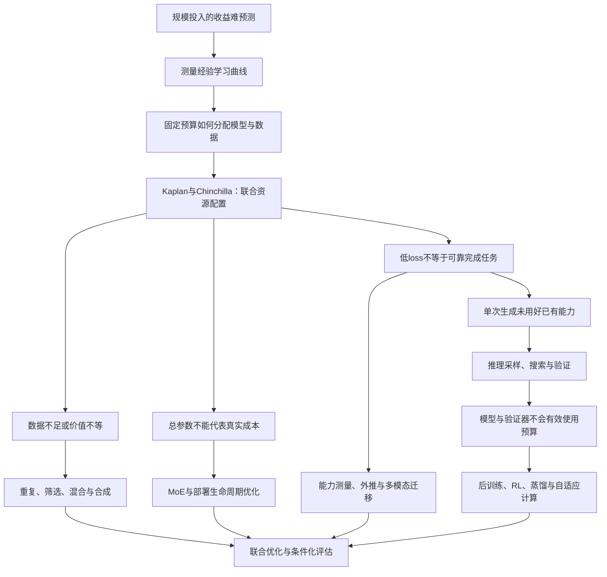
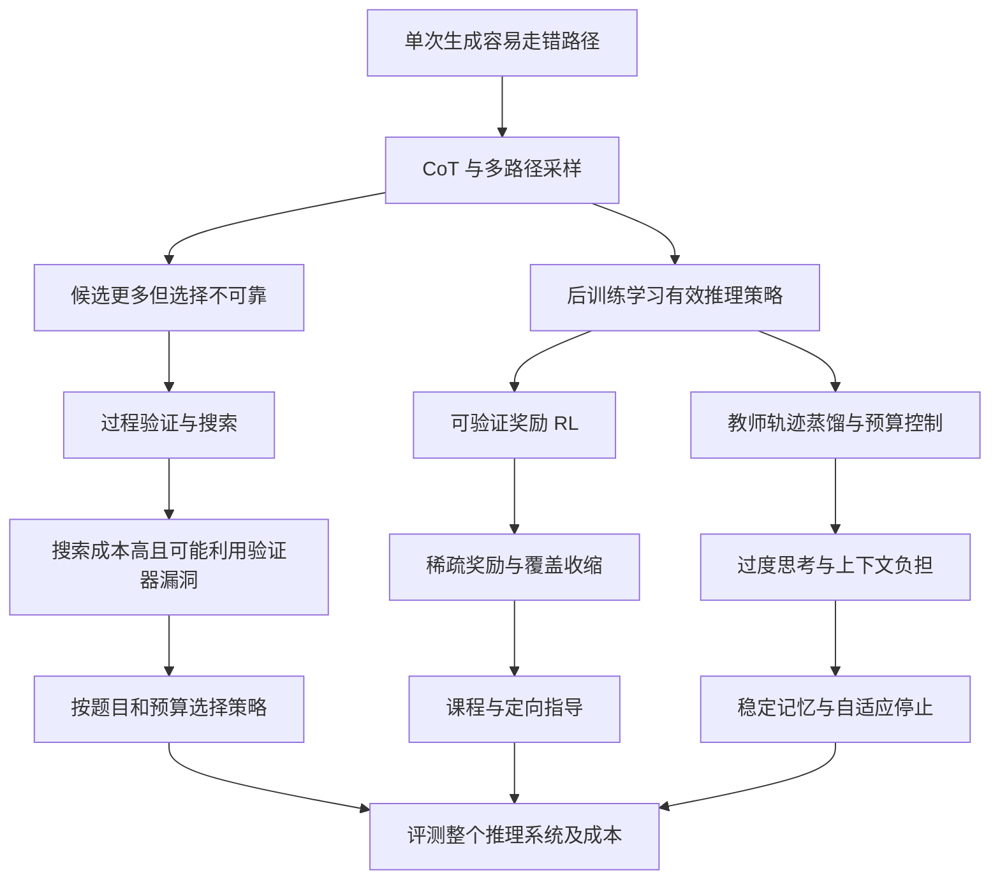

# Scaling Law：问题驱动的技术演化综述

版本 v0.1 · 检索与核验截至 2026-09-16 · 中文持续更新版

从“能否预测规模收益”到“如何联合分配预训练、后训练与推理预算”。本版含 45 条去重主源和独立社区雷达；属于代表性文献的叙事综合，非穷尽性系统综述，未独立复现实验。

图为概念综合，不是实测曲线；箭头不自动意味着已证实的历史因果。

阅读入口：[仓库说明](README.md) · [方法与范围](METHODOLOGY.md) · [文献索引](REFERENCES.md) · [更新日志](CHANGELOG.md)

---

## 导论：Scaling law 到底在回答什么问题？

训练大模型首先是一个资源决策问题：在尚未花完预算之前，能否知道增加模型容量、训练数据或计算会带来多少收益？如果每一种规模都必须训练到最后才知道效果，那么扩大实验本身就会越来越难承担。Hestness 等跨任务测量学习曲线，Kaplan 等进一步把语言模型的参数、数据和训练计算联系起来，使“更大可能更好”转变为可以拟合和比较的资源—性能关系。[Hestness et al., 2017](https://arxiv.org/abs/1712.00409)；[Kaplan et al., 2020](https://arxiv.org/abs/2001.08361)。

但能够预测增长，不等于已经知道怎样分配资源。Chinchilla 说明，在固定训练计算下，把预算过度放在参数而没有相应增加训练 token，可能低效。这一步把核心问题从“应不应该扩展”改成“应该沿哪个轴扩展”。随后，数据不足与质量差异、稀疏架构、部署成本、奖励反馈和推理时计算不断使这个优化问题增加新的约束。[Hoffmann et al., 2022](https://arxiv.org/abs/2203.15556)。

本综述的中心论点是：**scaling law 的演化，是研究者不断发现旧资源模型遗漏了什么，并重新求解最优分配的过程。** 这是对文献的综合解释，不是某篇论文提出的统一定理。

### 先把三个经常混用的问题拆开

| 层次 | 研究对象 | 能回答什么 | 不能直接推出什么 |
|---|---|---|---|
| 经验规律 | 给定配置下，损失或错误随规模变化的函数 | 已测区间如何变化，受控外推是否有效 | 任意规模、分布或任务都成立 |
| 资源最优 | 在预算约束下选择模型、数据与算法 | 哪个配置在指定目标上更划算 | 训练最优必然等于部署最优 |
| 能力与系统 | 在任务、接口和评测协议下的实际成功 | 系统能否可靠交付、成本多少 | 一个平均分完整刻画所有能力 |

这一区分贯穿全文。语言建模交叉熵下降、数学 pass@1 上升、best-of-N 找到正确答案和用户最终拿到正确结果，是不同的量。即使都随计算改善，也不能直接使用同一个指数或兑换关系。推理时计算研究尤其需要显式纳入候选选择与验证成本。[Snell et al., 2024](https://arxiv.org/abs/2408.03314)。

### 全文的问题地图

箭头是本综述的解释性连接。正文会区分直接回应前作、并行回答同一瓶颈和作者归纳的联系；不会把按年份排列自动写成历史因果。

### 怎样阅读

想理解经典争议，先读预训练章的 Kaplan—Chinchilla—复现链，再读数据和生命周期成本。想判断“test-time scaling 是否接棒”，先读后训练与推理章的 proposer、verifier 和策略分配，再读能力评估与负面结果。想跟踪新工作，先看社区雷达提出了哪个问题，再回到原始证据，最后判断它应改变正文哪一条因果连接。

首版以能够解释转折点的代表研究为核心，不按引用数或社媒曝光机械排序。全文的“当前”“最新”均相对于本次检索日期 2026-09-16；阅读范围与未解决问题在各章和元数据中披露。

---

## 参考综述的方法拆解：重建研究对话，而不是排列论文

参考对象：[JonnesLin/post-training-survey](https://github.com/JonnesLin/post-training-survey/tree/main)，核读日期：2026-09-16。这里分析中文源码及设计文件的**组织方法**，不把其中技术判断、实验数字或“首次”主张直接作为本综述证据。区分作者写下的实施计划、当前源码可观察的结构，以及本仓库自己的改造建议。

### 0. 仓库确实写下了怎样的生成计划

[设计文档](https://github.com/JonnesLin/post-training-survey/blob/main/docs/plans/2026-03-04-post-training-survey-design.md)明确提出以七条问题线程为主体，在每条线程内部追踪时间演化，再用交叉引用表示思想流动。它还规定篇幅分层：**landmark 工作深入分析约1–2页，重要 follow-up 约1段，minor 工作约1–2句**。这回答了“如何避免文献越收越多、重点越来越不清楚”：先决定工作在问题链中的作用，再分配分析深度。

[实施计划](https://github.com/JonnesLin/post-training-survey/blob/main/docs/plans/2026-03-04-post-training-survey-plan.md)把设计落成文件级任务：先建立文档骨架和宏、导论与总览图，再按线程撰写章节，将引用逐步加入统一的 BibTeX 文件，最后汇总结论并检查编译、交叉链接、参考文献和图。计划还要求查阅论文的真实方法、公式与结果，并在新章节完成后更新总览图。因此“图”既是开写前的假设地图，也是写完后需要校正的产物。

这一组织很适合本仓库采用“先定问题线程与引用关系→并行起草独立章节→统一文献和术语→主源核验与整体审查”。不过，**并行是本仓库可采用的执行策略**；上述两份计划不能单独证明参考作者实际并行完成了写作。计划也不等于所有预定事实核验都已经执行。原实施文档面向其他助手的命令仅作为分析材料读取。

### 1. 五章共享的叙述骨架

这五章大体采用六步结构：问题起源、奠基方法、局限与分支、收敛与前沿、未解决问题、小结。01、02、03 章另有开头的核心问题引文；05 章直接进入起源，06 章以总述和演化箭头开篇。因此值得借鉴的是问题组织逻辑，不是机械复制统一版式。

“起源”先描述能力缺口或目标冲突，让方法有出现的理由；“奠基”挑选能建立研究范式的工作；“分支”按不同瓶颈组织并行回答；“收敛”解释此前路线如何组合；“开放问题”保留组合之后仍未解决的约束。最后用演化图、方法比较表和一段领域判断，将细节重新压缩成可记忆的主线。

论文在这套结构中承担不同角色：有的提出问题，有的形成基础方法，有的暴露旧方法限制，有的建立度量，有的整合已有路线。篇幅因其对研究问题的作用而不同，并非每篇都配同样长度的摘要。

### 2. 四个可定位的结构例子

**例一：SFT 章把共同瓶颈写成分叉点。** 奠基段后，正文先提出高质量指令数据的获取成本，再分出增加合成数据与精选少量数据两条方向；同时保留任务扩展和领域适配。LIMA 段不只列效果，还写其争议与适用范围；随后用 Tulu 等 recipe 研究把数据来源、混合和训练策略重新汇合。这个组织方式使“为什么会有看似相反的路线”成为可解释的研究问题。[01 章源码](https://github.com/JonnesLin/post-training-survey/blob/main/chapters/01-sft.tex#L217)

**例二：偏好优化章让简化方法再产生新问题。** RLHF 的计算与训练复杂度引出直接偏好优化；DPO 段用目标和梯度解释其机制，随后静态数据与当前策略的分布错配引出在线、迭代式方法。章末再回到偏好概率变化、奖励泛化等问题。这里的关键是“解决了实现难题”并不自动等于“解决了监督质量和探索问题”。[02 章源码](https://github.com/JonnesLin/post-training-survey/blob/main/chapters/02-preference.tex#L364)

**例三：安全章由外部压力推动演化。** 它先承接指令遵循与偏好最大化，指出两者会遇到目标冲突；训练方案建立后，再用攻击暴露其边界，展开红队、攻击、防御、过度拒绝等分支；随后转向表示层控制与新能力带来的风险。此处研究史由“对手持续改变测试条件”推动，不能写成后来的方法彻底替代早期方法。[03 章源码](https://github.com/JonnesLin/post-training-survey/blob/main/chapters/03-safety.tex#L236)

**例四：多模态与 agent 章用能力依赖完成过渡。** 多模态章先将文本 SFT、偏好优化迁入视觉场景，再按幻觉、定位和视频等缺口分支；章末以理解屏幕与定位界面元素衔接环境操作。agent 章则先区分工具调用、轨迹训练、代码对齐和多工具协调，再借软件工程任务说明这些能力为何必须协同。跨章连接由具体能力依赖构成。[05 章结尾](https://github.com/JonnesLin/post-training-survey/blob/main/chapters/05-multimodal.tex#L1118)、[06 章汇合段](https://github.com/JonnesLin/post-training-survey/blob/main/chapters/06-agentic.tex#L302)

### 3. 提示框与交叉引用各做什么

| 源码装置 | 可观察的写作作用 | Scaling Law 中的对应写法 |
|---|---|---|
| `problembox` | 压缩当前缺口；分支前再次提出问题 | 明确受限资源、优化指标和旧假设失效条件 |
| `solutionbox` | 提炼方法机制、贡献或方案间取舍 | 解释为何改分配比例、数据策略或推理预算能改善目标 |
| `evolution` / `evolutionbox` | 将旧状态、变化机制和新状态显式连接 | 在箭头上写“改变了什么条件”，避免只写年份 |
| `openproblembox` | 把剩余限制转成可研究的问题 | 写清需要何种实验才能区分竞争解释 |
| `crossref` | 指向方法来源、能力前提或共同瓶颈 | 连接数据、系统、后训练与测试时计算，注明关系类型 |
| 比较表与演化图 | 便于横向核对机制、成本和限制 | 统一记录任务、预算、拟合范围与外推边界 |

这些装置并不只出现在章末：02 章在 RLVR 小节内部插入适用边界问题；05 章的开放问题会先承认已有缓解方法，再定位尚未解决的部分。因此更新综述时应修订旧问题的状态，而不是持续堆积“仍然开放”的清单。

交叉引用也有多种语义：01→02 是监督信号的补充，02→03 是监督者可靠性的共同问题，05→06 是视觉能力作为行动前提。把这些关系标明后，问题树才能成为研究网络，而非多份互不关联的小综述。

### 4. 可迁移的 meta-pattern 与必要改造

实施计划明确预设了“人工监督转向自动化”以及“质量与成本的权衡”两类跨线程 meta-pattern；这说明全书结论要回答共性机制，而非再列一遍论文。从这五章还能归纳三种反复出现的模式：方法奏效后，瓶颈转移到数据或评价；降低流程复杂度，可能引入覆盖、泛化或控制方面的新代价；分开的能力路线，会在真实任务和共享接口中重新组合。后三点是本次读者归纳，不能冒充作者结论章的完整列表。

Scaling Law 综述可据此围绕“预算应分给谁”组织：经验可预测性形成后，依次追问参数—数据分配、数据有效性、全生命周期成本、后训练与测试时计算，并保留并行的理论解释与评测分支。每个节点至少回答：修复哪个限制、为何有效、证据在什么范围成立、下一瓶颈是什么。

还需增强两点。第一，时间相邻只能证明先后；若原论文没有直接回应关系，应写“可看作针对同类限制”，避免虚构思想传承。第二，所谓收敛必须注明任务和时间范围，不能将多路线竞争写成全领域一致。参考源码本身也需要核验，例如 05 章 [第498行](https://github.com/JonnesLin/post-training-survey/blob/main/chapters/05-multimodal.tex#L498)与[第528行](https://github.com/JonnesLin/post-training-survey/blob/main/chapters/05-multimodal.tex#L528)对同一模型训练阶段的表述不同；这里仅指出不一致，不据此判定原论文的正确版本。

本仓库采用其问题驱动的组织思想，另行检索并核验 Scaling Law 主源；未复制图、长段文字或 LaTeX 模板。

### 5. 实际阅读范围

本次完整阅读了设计文档130行、实施计划431行；扫描了以下五个中文文件的章节标题、框与交叉引用位置，并细读下表行段。**章节部分是结构性抽样，未逐行审读五章全部正文，更未审读整本参考综述。** 未列出的正文、公式推导、实验数字、文献条目及大部分绘图代码未系统核查；不据本文件宣称完成技术事实审计。

| 中文源码 | 本次实际细读行段 |
|---|---|
| `01-sft.tex` | 1–82、89–122、169–242、330–365、367–403、533–600、685–865 |
| `02-preference.tex` | 1–70、231–275、349–390、408–447、475–594、645–659、745–767、866–965、1013–1040 |
| `03-safety.tex` | 1–84、126–160、216–267、425–485、601–634、762–846、891–915 |
| `05-multimodal.tex` | 1–61、260–311、387–450、474–569、895–1040、1090–1123 |
| `06-agentic.tex` | 1–50、115–245、300–338、630–653、730–844、912–960 |

上述表格记录五章结构审阅的范围。主编另读取了 README、前言、导论与结论框架，细读 04-reasoning 的起源、验证与RL衔接，抽读 07-efficiency 的成本起源及其 scaling 小节；详细范围见 [补充阅读记录](sources/editor-search-log.md)。本次没有逐行审读全书全部正文或核查其460余条引用。行号对应本轮本地源码快照；以上远程链接指向 `main`，后续更新时行号可能变化。

---

## 预训练 scaling law：从预测收益到重写资源分配问题

> 核验日期：2026-09-16。范围：经典预训练规律，以及数据、稀疏架构、部署成本和理论解释分支；以语言模型为主，视觉工作用于说明机制和边界。本章是问题驱动的叙述性综述，不声称穷尽检索或覆盖截至核验日的全部新论文。核心工作已从原论文 HTML 核查方法、结果或限制；其他工作按实际阅读深度标注于 [来源清单](sources/foundations.json)。未重跑实验，未逐式复算附录。文中的技术联系若无直接继承证据，只表示本综述的组织方式，不表示作者受到某篇论文直接启发。

### 1. 起点：在投入更多算力以前，能否预测它会买来什么？

深度学习早期的实际困难并非不知道“大模型、多数据可能有效”，而是不知道再投入一个数量级资源会带来多少改善，是否值得收集更多数据，或者当前平台期是不是实现出了问题。Hestness 等人在翻译、语言、图像与语音任务上，把不同数据规模下经过模型容量与超参数搜索的表现连成学习曲线，观察到中间区域的幂律改善，并区分了小数据下近似猜测、可预测改善以及最终饱和几个区域。这提供的是一种测量和工程预测方法，而不是“规模无限增长，能力无限增长”的证明。[Hestness et al., 2017](https://arxiv.org/html/1712.00409)

这一阶段留下的问题是：**即使能够预测增加数据的收益，固定预算下究竟应买更多参数，还是让模型读更多数据？** 两者不能独立最大化；规模律开始从学习曲线描述转向资源配置。

### 2. 从“大模型更好”到“给定预算，什么组合最好”

Kaplan 等人将 Transformer 的测试交叉熵与参数量、数据量、计算量放进同一经验框架。在其他因素不构成瓶颈的区间内，损失随单项资源呈幂律变化；其经过批量大小调整的计算最优估计给出 $N_{\mathrm{opt}}\propto C^{0.73}$，相应训练数据增长较慢。关键洞察是较大模型的样本效率可能更高，因此没有必要把每个模型训练到收敛：在固定预算下，较大模型提前停止可能优于较小模型充分训练。这里的 $N$ 主要使用非 embedding 参数口径，$C_{\min}$ 也并非未经调整的实测计算量，后来的比较必须保留这些定义。[Kaplan et al., 2020，§1、§6](https://arxiv.org/html/2001.08361)

但这没有终结分配问题。Hoffmann 等人的 Chinchilla 工作直接重新检验同一个问题：在相同 FLOPs 下系统改变参数量和训练 token 数，并用训练曲线包络、IsoFLOP 曲线和参数化损失拟合三种方法估计最优配置。它们支持参数与数据大致等比例增长；70B 参数、1.4T token 的 Chinchilla 在与 Gopher 相近训练计算预算下验证了“小一些、训练更久”的收益。变化不在于否定可预测性，而在于修正预算的分配比例。[Hoffmann et al., 2022，§3–5](https://arxiv.org/html/2203.15556)

将这一问题写成优化式，会比记住某个参数比例更有用。Chinchilla 的第三种方法采用

$$
L(N,D)=E+A N^{-\alpha}+B D^{-\beta},\qquad C\approx 6ND.
$$

这里 $L$ 是指定验证分布上的交叉熵，$N$ 是所选参数计数，$D$ 是处理过的训练 token 数；$E,A,B,\alpha,\beta$ 均来自特定训练设置的拟合。$6ND$ 是稠密模型训练计算量近似，并非适用于所有上下文长度、架构和系统的精确计费公式。[原论文公式 2、4](https://arxiv.org/html/2203.15556)

**下面是本综述对上述目标的代数解释。** 令 $D=C/(6N)$，在预算固定时求导：

$$
\alpha A N^{-\alpha}=\beta B D^{-\beta},
$$

$$
N_{\mathrm{opt}}\propto C^{\beta/(\alpha+\beta)},\qquad
D_{\mathrm{opt}}\propto C^{\alpha/(\alpha+\beta)}.
$$

条件表达得很清楚：最优点是两个可缩减误差项的边际收益平衡；当两个指数接近时，参数与数据随预算的增长指数才接近一半。所谓约 20 token/参数，是该类实验设置下的训练计算最优近似，既不是训练上限，也不是所有数据与架构共有的自然常数。原论文三种拟合方法给出的指数也并不完全相同。[Hoffmann et al., 2022，表 2、3](https://arxiv.org/html/2203.15556)

### 3. 为什么两条看起来都很平滑的曲线，会给出不同答案？

这使领域出现第一条关键支线：**不能只问公式是否拟合得好，还要问它拟合了什么实验过程。** Porian 等人直接研究 Kaplan 与 Chinchilla 的分歧，逐项检查输出层计算成本、过长 warmup、随规模变化的学习率和批量大小等因素。修正后，他们在两个数据集上得到接近 Chinchilla 的分配规律；学习率衰减本身不是解释差异的充分条件。这比“新数据推翻旧定律”更精确：一部分所谓规模效应，可能来自不同规模下优化程度不等或成本统计不一致。[Porian et al., 2024；所读版本 v4，2025](https://arxiv.org/html/2406.19146)

另一类审查针对拟合过程本身。Besiroglu 等人从 Chinchilla 图中重建数据，重做其第三种参数拟合，指出原报告的参数和置信区间存在问题；他们的新拟合反而更接近原论文前两种方法的趋势。因此，应把“参数与数据需要共同增长”这一较稳健结论，与“某组系数可以精确指导跨多个数量级外推”区分开。该复核依赖图像重建数据，不能当作获取原始全部训练日志后的完全复现。[Chinchilla Scaling: A replication attempt, 2024](https://arxiv.org/html/2404.10102)

由此形成一项贯穿全文的阅读准则：若论文声称修改 scaling law，先核查它改变的是**资源口径、优化质量、拟合区间、数据分布，还是优化目标**。这些变化都可能合理，但回答的未必是同一道题。

### 4. 数据分支一：当独立的新数据不再无限供应

Chinchilla 的主要实验处于不足一个 epoch 的训练范围。把读过的 token 数继续增长，默认意味着还可以获得相应的新样本；当这个前提不成立时，$D$ 不能同时代表“唯一信息量”和“处理过的数量”。[Hoffmann et al., 2022，§5](https://arxiv.org/html/2203.15556)

Muennighoff 等人因而将唯一数据预算、重复次数和模型容量分开，拟合重复 token 边际价值递减的规律。在其固定预算实验中，少量重复与使用新数据的差距可以很小，例如四个 epoch 的部分设置；但重复很多次后，收益明显衰减，个别训练还出现性能恶化。论文的饱和型公式不能完全描述这种恶化。它修复的是“每个 token 等价”的假设，而不是证明所有语料重复四遍都无代价；阈值依赖模型、数据与训练设置。[Scaling Data-Constrained Language Models, 2023，§3、§5–6](https://arxiv.org/html/2305.16264)

工程问题因此由“需要多少 token”变成“有多少独立数据、准备重复多少次、何时改变模型大小”。训练更多 epoch、增加模型参数、放宽数据过滤和加入异质语料，是不同操作，不能仅用总 token 数比较。

### 5. 数据分支二：如果样本价值不同，为什么只优化数量？

Sorscher 等人对“随机扩大数据集”的基线提出一个更根本的反问：若能选出更有信息量的样本，能否改变误差下降速度？他们在理论模型中展示理想筛选条件下超越幂律的可能性，并在图像任务上研究数据剪枝。限制也很实质：高质量筛选指标难找，已有指标未必能迁移到 ImageNet，筛选成本、类别平衡和训练轮数都会影响净收益。**这不是已经证明通用 LLM 的训练损失能够指数下降。**[Beyond neural scaling laws, 2022，§7](https://arxiv.org/html/2206.14486)

接下来的问题是如何排除“数据更好”其实来自架构或训练配方更好的混杂。DataComp-LM 提供固定实验框架，在多个模型规模下比较去重、过滤和混合策略，使数据处理成为可控变量。其结果支持模型辅助过滤的价值，但论文也明确说明未充分探索所有组合、运行间差异和 7B 以上模型，且主要评测偏语言理解。因此，质量应当相对于目标能力来定义，而不是一个对所有领域都成立的标量分数。[DataComp-LM, 2024，§1、§6；所读版本 v4，2025](https://arxiv.org/html/2406.11794)

数据混合又增加了一个维度：网页、代码、论文等领域之间存在收益分配问题。Data Mixing Laws 用小规模实验拟合混合比例与领域损失的关系，再结合模型、训练步数的外推，预测未试过的配方。它把“经验拍比例”变成可测量的优化，但预测仍绑定候选领域与目标分布；本章只用其摘要及主文引言核查这一路线，不据此断言任意跨规模配方都可迁移。[Ye et al., 2024](https://arxiv.org/abs/2403.16952)

这三项工作在本章中组成一条**问题上的联系**：选择哪些样本 → 如何公平比较处理策略 → 如何分配领域比例。它们不应被写成单一算法家族的必然继承史。

### 6. 数据分支三：合成数据是在补充信息，还是循环放大误差？

重复真实语料和使用模型生成的新文本不是一回事。后者改变了数据产生机制。Shumailov 等人研究递归地用生成模型输出训练下一代模型，展示有限采样等误差逐代累积、低概率事件信息丢失的现象，即 model collapse。本章核查的是其 arXiv v3《The Curse of Recursion》，不把未成功读取的 Nature 正式版当作已阅读全文的证据。它研究的是特定反馈过程，不能推出“只要包含合成样本，模型就一定退化”。[Shumailov et al., 2023；所读版本 v3，2024](https://arxiv.org/html/2305.17493)

Gerstgrasser 等人直接检验其中一个重要条件：旧数据是被替换，还是随合成数据一起积累？他们发现，在所测语言和其他生成任务中，保留原数据并累积历代数据可以避免对应的退化，并在线性模型中给出有界误差结果。但这种积累意味着数据量和计算需求也变化；它不是在所有固定预算、过滤方法和复杂分布下的无条件保证。[Is Model Collapse Inevitable?, 2024，§3、附录 E](https://arxiv.org/html/2404.01413)

因此，本综述把“合成数据能否继续 scaling”改写为可检验的问题：真实数据保留多少？生成过程有没有可验证的新监督？过滤会不会丢失尾部？评测是否独立于生成器？把这些条件抹掉，只比较合成 token 总量，会让正反结论显得矛盾。这里的条件清单是本综述的综合判断。

### 7. 架构分支：每增加一个参数，都必须每次调用它吗？

稠密模型的参数量与每 token 计算成本紧密相连，MoE 则允许每次只激活部分专家。Clark 等人因此把总容量和活动计算分开，研究 routed language models 的共同规律，并通过有效参数量比较不同路由方法。但其主要实验统一训练 130B token，没有同时完成对数据量的最优搜索。它提供的是新的坐标系，不能直接视为所有 MoE 的计算最优训练处方。[Unified Scaling Laws for Routed Language Models, 2022，§2、附录 F](https://arxiv.org/html/2202.01169)

Fine-Grained MoE 明确指出上述固定数据量限制，进一步把训练 token、参数和专家粒度纳入优化。更细的专家能够在活动参数数目不变时增加路由选择灵活性；但粒度过高会增加路由开销，计算收益也未必等价于实际训练时间收益。这里存在明确的技术继承：后者主文直接讨论前者限制。最终比较应分别报告总参数、活动参数、FLOPs、通信与内存，而不能拿“总参数相同”代替成本相同。[Scaling Laws for Fine-Grained Mixture of Experts, 2024，§3、§6](https://arxiv.org/html/2402.07871)

这条分支的意义是：架构不仅能移动损失曲线，也能改变资源之间的关系。它与数据分支可以组合；二者都要求重新测量，不能把稠密模型的系数直接搬过去。

### 8. 部署分支：训练最省，不等于整个生命周期最省

前述最优化主要把训练结束视为终点。若模型此后要回答大量请求，小模型每次调用的节省可能补偿额外预训练成本。Sardana 等人直接将推理需求加入 Chinchilla 型目标，得到在足够高的推理需求下，训练更小模型、喂更多数据的方案可能更优。他们还测试很高的 token/参数比例，并发现仅在常见比例区间拟合的公式可能高估额外数据的收益。该分析主要假设数据较充足，正好与数据受限路线形成不同约束条件。[Beyond Chinchilla-Optimal, 2023/2024，§1–2、§5](https://arxiv.org/html/2401.00448)

用一个简化账本可以理解这种变化：

$$
C_{\mathrm{life}}\approx 6ND_{\mathrm{train}}+2ND_{\mathrm{infer}}.
$$

这是用于说明训练与服务权衡的稠密模型近似；实际费用还取决于输入与输出长度、批处理、吞吐、内存带宽和硬件利用率。一个在训练 FLOPs 上偏离 Chinchilla 最优点的模型，可能恰好处于另一种需求下的总成本最优点。后文讨论的 test-time scaling 会进一步改变每次推理所用预算，因此应与这里的生命周期账本联动，而不是独立比较。

### 9. 理论分支：为什么会有幂律，它解释了什么？

预测曲线并不等于知道曲线的原因。Bahri 等人区分 variance-limited 与 resolution-limited 等机制，研究模型与数据规模的四类区域；平滑流形、核谱等假设能够产生不同的指数关系。这提醒我们，外观相似的幂律可以来自不同机制。受控模型上的推导与真实数据实验是理论证据的一部分，但并不构成“现代 Transformer 的全部行为已被一个定理解释”。[Explaining Neural Scaling Laws, 2021，§1](https://arxiv.org/html/2102.06701)

Michaud 等人的 Quantization Model 从另一方向出发：如果技能像离散单元，并按使用频率逐步习得，长尾频率分布可以产生整体平滑的损失曲线，同时容纳某些技能突然出现。作者也明确承认，真实任务是否足够离散、技能是否独立、参数与数据如何互相替代，仍有缺口。这里的 quantization 指假设的知识单元，不是低比特权重量化。[The Quantization Model of Neural Scaling, 2023，Discussion](https://arxiv.org/html/2303.13506)

这些路线目前更适合提供可检验假设，而不是替代经验测量。对综述而言，理论的价值在于指出哪些变量可能控制指数、何时应出现新区域；对工程而言，仍需独立验证外推误差。

### 10. 如何读到“今天”：从一个指数，转向约束与目标的集合

上述演化可以压缩成以下问题地图。箭头表示本综述的解释关系；只有正文明确说明的关系才有直接继承证据。

| 尚未解决的问题 | 新增的变量或改动 | 代表工作 | 新边界 |
|---|---|---|---|
| 扩大数据是否值得 | 跨规模学习曲线 | Hestness | 饱和区与任务差异 |
| 固定训练预算如何分配 | 联合优化 $N,D,C$ | Kaplan → Chinchilla | 优化器、成本口径与外推 |
| 新数据不足 | 唯一数据量与重复次数 | Muennighoff | 边际收益下降与过拟合 |
| token 价值不等 | 筛选、去重、领域比例 | Sorscher、DCLM、Data Mixing Laws | 选择偏差与目标依赖 |
| 数据由模型自己生成 | 生成—训练反馈与真实数据保留 | Shumailov → Gerstgrasser | 尾部覆盖与增长的计算需求 |
| 参数增长带来每步成本 | 活动参数、总参数、专家粒度 | Clark → Fine-Grained MoE | 路由、通信和内存 |
| 模型需要长期服务 | 推理需求进入目标函数 | Beyond Chinchilla | 流量假设与真实硬件成本 |
| 经验曲线缺少机制解释 | 流形、谱、技能频率假设 | Bahri、Michaud | 受控假设与真实模型的距离 |

截至本次核验，另一个值得继续精读的扩展是 2025 年的 *Scaling Laws for Optimal Data Mixtures*：它将模型大小、token 数与领域权重共同建模，并报告跨语言、多模态和视觉设置的预测。本章只完成原始摘要核查，尚未评审其外推实验和假设，故仅作为后续阅读入口，不作为已经确立的统一定律。[Shukor et al., 2025](https://arxiv.org/abs/2507.09404)

本章的综合判断是：这一研究方向先把规模增长变成可预测的投资，再把投资变成可优化的分配，随后不断修订分配所依赖的数据、架构和成本条件。更新综述时最值得记录的，不是又出现了一个更大的模型，而是**哪项旧前提被新证据修正，最优决策因此发生了什么变化**。

---

## 后训练与推理时 Scaling：从扩大模型到分配计算

> 检索与核验日期：2026-09-16。本文按问题链组织，覆盖具有解释力的代表性工作，不声称穷尽截至该日的论文。下文的“推动”“转向”主要表示研究问题之间的逻辑关系；只有原文明确引用并回应前作时，才视为直接研究承接。文献元数据、阅读深度与版本见 [frontier.json](sources/frontier.json)，检索记录见 [frontier-search-log.md](sources/frontier-search-log.md)。

### 1. 为什么预训练之后还需要一条 Scaling 路线？

预训练把计算投入共享参数，推理时则要为每道具体问题选择解题过程。即使模型掌握相关知识，直接生成一次答案仍可能走错路径。这个缺口把研究问题从“模型学到了多少”推进到“能否用额外计算更可靠地调用和组合已学能力”。**后训练改变生成分布；推理时计算决定如何使用该分布。两者互相影响，却是不同的预算轴。**

早期答案是让模型显式写出中间步骤。Chain-of-Thought 提示通过少量示范，使大模型在算术、常识与符号任务上改善表现；Self-Consistency 则针对单一路径的不稳定性，采样多条推理链并聚合最终答案。它们分别打开了“沿一条路径多算”和“尝试多条路径”两个方向，但没有自动解决如何控制成本、如何识别正确答案的问题。[CoT，2022](https://arxiv.org/abs/2201.11903)；[Self-Consistency，2022/2023](https://arxiv.org/abs/2203.11171)。

因此，本章采用三个操作层次：串行延长或修改一条轨迹、生成多个完整候选再选择、在尚未完成的推理前缀上搜索。这个划分比简单区分“长思考/多采样”更精确，因为树搜索会在中途改变后续计算分配。2026 年的评估研究进一步把模型、提示、解码器、证据、选择器、停止规则共同视为被测系统。[Hariri 等，§2–3](https://arxiv.org/html/2608.04001v2)。

需要先划清术语：预训练 scaling law 常拟合交叉熵损失与参数、数据、计算的函数关系；本章不少工作只测量特定任务准确率随预算的经验曲线。曲线向上，不等于已经找到跨模型、跨任务通用的幂律，也不保证每增加一份预算都改善结果。

### 2. 多采样为什么不够：从“多试几次”到计算最优策略

采样增加的是候选数量，用户需要的却是可靠的最终答案。如果某题单次正确概率是 $p$，在独立同分布采样且存在理想正确性检查器时，至少出现一次正确答案的概率为 $1-(1-p)^k$。这解释了为什么 pass@k 可以快速增加；但真实系统通常不知道哪一个候选正确。该式是概率模型下的推导，不是某种通用能力增长定律。

一条修复路线是训练验证器。Let's Verify Step by Step 比较过程监督与结果监督，让模型对中间步骤给出反馈；其作用是提供比只看最后答案更细的选择信号。代价是过程标签和验证计算，且验证器仍可能在搜索产生的新分布上犯错。[Lightman 等，2023/2024](https://arxiv.org/abs/2305.20050)。

接下来的问题变成：**同一预算应该用于更多独立候选、更深搜索，还是连续修订？** Snell 等把方法统一为改善 proposer 或利用 verifier，按模型相对难度选择策略。在 PaLM-2 与 MATH 设置中，合理分配预算可达到约四倍于特定 best-of-N 基线的效率；部分条件下，小模型配合额外推理计算能超过约十四倍参数量模型。限制同样关键：最难题收益很小；强化搜索可能利用验证器漏洞；难度估计成本未计入主要比较。因此，论文支持的是有条件的预算替代，不能改写成“小模型多想就能普遍替代大模型”。[Snell 等，§3、§5、§7](https://arxiv.org/html/2408.03314v1)。

Wu 等从另一个角度比较模型大小、投票、验证与树搜索的 FLOPs–准确率前沿，并提出 Rebase 分配搜索预算。其分析说明投票会受答案分布限制而饱和：高频错误不会因为采样更多就自动变成正确答案。于是，“扩大模型”和“改善推理算法”的最优组合随预算变化；在所测数学任务上，较小模型加合适搜索可以更划算。[Wu 等，§1、§3–4](https://arxiv.org/html/2408.00724v3)。

这组工作留下了后训练的新需求：如果基础模型根本不善于修订、探索或验证，外部搜索就会很贵。能否提前训练模型，让它更有效地消费测试时计算？

### 3. 从外部搜索到学会使用思考预算：o1 → R1 与蒸馏分支

OpenAI 的 o1 官方报告给出一条重要经验信号：增加强化学习训练计算，以及增加测试时思考计算，都能改善所示推理表现。这把“怎样搜索”扩展成“怎样训练一个善于利用额外计算的策略”。不过报告未公开足以完整复现的训练配方和统一拟合公式，图中的平滑增长也不能被当作已验证的无限外推定律。[Learning to reason with LLMs，2024](https://openai.com/index/learning-to-reason-with-llms/)。

DeepSeek-R1 使这一方向更可检查。R1-Zero 在已预训练的 DeepSeek-V3-Base 上直接做 RL，用数学答案、代码测试等可验证反馈，结合格式奖励；GRPO 用组内回报估计优势，减少对独立 critic 的需求。长推理、自检等行为随训练出现，但可读性与语言混杂等问题促成 R1 的冷启动数据、多阶段 SFT/RL 配方。这里“Zero”不表示从零知识学习，也不能把 R1-Zero 与最终 R1 的训练条件混为一谈。[DeepSeek-R1，§2](https://arxiv.org/html/2501.12948v1)。

自动验证降低了反馈扩张对逐条人工标注的依赖，也带来结构性边界：可检查的最终答案较适合数学和代码；开放研究、长程操作与开放式写作未必有可靠、廉价且难以投机的奖励。本综述据此归纳：后训练的扩张至少同时需要可用任务、可验证反馈和产生有用探索的策略，不能仅用 RL 步数概括。

蒸馏分支则回答另一个问题：不是重新发现全部推理行为，而是把强模型生成的推理轨迹传给较小模型。s1 在 Qwen2.5-32B-Instruct 上用经过难度、质量和多样性筛选的一千条样本做 SFT，再用 budget forcing 控制停止或追加“Wait”。初始论文报告 AIME24 从 50% 提升至 57%，同时明确继续延长会饱和并受上下文限制。它证明小量精挑训练数据可有效改变行为；但教师生成成本、底座预训练成本与测试时成本不能算成零，特定数学结果也不能表述为全能力超过教师或 R1。[s1，§2–6](https://arxiv.org/html/2501.19393v1)。

两条分支优化的是不同环节：RL 借反馈改变探索概率，蒸馏借教师轨迹提供额外监督。把它们统一叫作“更长 CoT”，会掩盖数据来源和能力来源的差别。

### 4. 更长是否总是更好：从延长轨迹到控制边际收益

当 budget forcing 成为廉价基线，新的失败模式也更容易观察：额外推理可能重复已完成工作、加入错误步骤，或把正确答案改错。TOPS 在不同推理长度训练设置中发现，最优长度随任务而变；它先让模型学习多种努力程度，再选择不同预算下最短的正确回答进行自改进。这把目标从“鼓励长”改为“为需要的题提供足够计算”。证据仍主要来自数学和有限底座，最短正确轨迹也依赖训练阶段可获得的正确性反馈。[Thinking-Optimal Scaling，§3–5](https://arxiv.org/html/2502.18080v1)。

2026 年的工作把这条修复链拆成两个不同问题。**第一是轨迹稳定性。** Min-Seek 针对强制延长后的重复与不稳定，保留较短的历史思考片段，并重排位置编码相关的 KV 缓存状态；在两个 R1 蒸馏模型、五类推理测试中，相比持续堆叠历史的 budget forcing 得到更稳定的曲线。其“可持续生成”来自记忆管理，并不等于难题准确率随时间无限增加；实验规模与每配置单次生成也限制了结论强度。[Min-Seek，§3–4，2026-01 预印本](https://arxiv.org/html/2601.09855v1)；[2026-03 正式发表于 Findings of EACL](https://aclanthology.org/2026.findings-eacl.153/)。

**第二是跨问题分配预算。** Adaptive Test-Time Compute Allocation 先离线估计不同采样预算的收益，再用轻量分类器预测每题预算。在数学实验中，这比统一给每题相同次数更有效。一个关键区别是，最难题不一定最值得追加计算：真正值得加预算的是尚未饱和、且确实会响应额外计算的题。该研究仍需离线效用表，采用离散预算；MATH 与 GSM8K 各抽取 200 题，并作 80/20 划分。路由特征包含一次 LLM 调用得到的归一化熵，主要成本比较则按采样预算计量，因此轻量分类器的成本不能代表完整路由成本；特征提取、生成长度与真实延迟还需端到端核算。预算迁移也尚不能由这些结果保证。[Zhai 等，§2、§5–6，2026-04](https://arxiv.org/html/2604.14853v1)。

按本综述的归纳，下一阶段应预测的是“再计算一次的预期收益”，而不仅是题目难度。停下来、换方法、找外部证据，也可能比继续生成更有价值。

### 旁支：优化得更用力，为什么反而可能变差？

在可验证推理成为焦点之前，RLHF 已暴露另一类瓶颈：奖励模型（RM）学到的是偏好的近似，持续提高它的分数，未必持续改善目标。Gao、Schulman 与 Hilton 在 2022 年把这一现象变成可测的 scaling 问题：用固定的 6B “gold RM”生成比较标签，训练不同容量的 proxy RM，再分别用 PPO 更新策略、用 best-of-N 筛选候选。两条路线都出现 proxy 分数继续提高、gold 分数先升后降的区域；因此失败并非只有训练阶段才会发生。[原文 §1–2、§3.5](https://arxiv.org/html/2210.10760v1)。

关键推进是联合考察**优化强度与评分器容量**。论文以 KL 散度的平方根度量策略偏移，并对相对初始策略的 gold 奖励拟合如下经验关系：

$$
\begin{aligned}
d &= \sqrt{D_{\mathrm{KL}}(\pi\Vert\pi_0)},\\
R_{\mathrm{BoN}} &= d(\alpha_{\mathrm{BoN}}-\beta_{\mathrm{BoN}}d),\\
R_{\mathrm{PPO}} &= d(\alpha_{\mathrm{PPO}}-\beta_{\mathrm{PPO}}\log d).
\end{aligned}
$$

系数随 RM 参数量呈平滑趋势，更大 RM 总体支持更高的 gold 奖励峰值；增加标签也能缓解过优化。它把“多优化是否有用”改写为“当前评分器能承受多少优化”。但这些是特定设置中的经验式，PPO 式在原点附近也不适用；KL 衡量分布偏移，不能当作跨算法相同的 FLOPs 预算。两种方法在相同 KL 下的收益差异，也不能被解释为相同实际算力下的效率差异；这要求把分布变化与训练、采样成本分别记账。[§3.1–3.3、§4.1](https://arxiv.org/html/2210.10760v1)。

最重要的边界是：**gold 只在合成实验中被定义为参照，它本身也是人类偏好的代理，并非人类真实意图。** 研究没有测完“标签偏好与实际意图不一致”的第二层偏差。与第 2 节验证器漏洞的联系是本综述的跨分支归纳：无论增加 PPO 更新还是推理时搜索，都会把压力集中到评分规则的误差上；扩张计算必须同时检查独立评估是否改善，不能只展示被优化分数上涨。这也促使后续研究关注新反馈和评分器更新，而非假定固定 RM 可以无限复用。[§4.3–4.5](https://arxiv.org/html/2210.10760v1)。

### 5. RL 到底扩展了能力，还是提高了抽中答案的概率？

o1/R1 的提升引出了一个无法仅靠 pass@1 回答的问题：性能改善来自新能力，还是原有解法变得更容易被采到？Yue 等比较基础模型与 RL 后模型的整条 pass@k 曲线，在所测数学、代码和视觉推理设置中发现：RL 模型在小 k 占优，但大 k 时基础模型可能覆盖更多可解题；困惑度及覆盖分析支持“当前配方主要重分配既有轨迹概率”的解释。[Does RL Really Incentivize…，v5，§3–5](https://arxiv.org/html/2504.13837v5)。

这项结果真正挑战的是“pass@1 提高即可证明能力边界扩张”的推断。有限 k 的失败不能证明正确解在分布中的概率严格为零；pass@k 还使用评测时的正确性判定，不能直接等同于部署时成功选出答案。因此，“RL 永远不会产生新能力”比实验支持的结论强得多。保持采样温度、长度、提示与检查规则一致，也是比较的必要条件。

2026 年 Curriculum RL 提出一个机制性修复：困难问题若整组 rollout 都失败，组内归一化奖励就没有可区分的学习信号。它先用采样定位边界附近的题，再给少量定向教师指导，最后用 RL 巩固；论文报告 pass@1 与 pass@256 同时改善。这个结果是“教师指导＋课程＋RL”扩大经验可解集合的证据，**不能用来宣称不借外部信息的纯 RL 已被证明突破底座上限**。[Curriculum RL，§3–5，2026-06](https://arxiv.org/html/2606.22317v1)。

与此同时，后训练本身也开始接受更系统的 scaling 测量。Tan 等在 Qwen2.5 的 0.5B–14B 范围做 54 组实验，发现所测条件下较大底座在固定后训练预算中更有效，高质量题目重复使用也能奏效。但这里的 test loss 定义为归一化错误率，非语言建模交叉熵；较大底座继承的预训练投入亦非相同。这给出的是特定 RL 配方的条件性规律，而不是“RL 的 Chinchilla 常数”。[Scaling Behaviors of LLM RL Post-Training，§2–3，2025-09](https://arxiv.org/html/2509.25300v1)。

### 6. “推理崩溃”争议教会了我们怎样评价 Scaling

The Illusion of Thinking 的价值在于改变评测自变量：不用单一考试分数概括能力，而是在 Hanoi、Blocks World 等可控制任务中提高问题复杂度。作者观察到低复杂度时普通模型更省计算、中等复杂度时思考模型受益、高复杂度时两者均出现崩溃；部分模型在失败区间还减少思考。这说明已有经验曲线不能不加条件地外推到更难的组合任务。[Shojaee 等，v3，§4](https://arxiv.org/html/2506.06941v3)。

但从特定输出协议失败进一步推到“模型没有推理能力”，需要额外证据。Lawsen 的评论质疑解的表示方式、完整动作序列要求与部分任务的可解性，并以输出可执行生成函数作为另一种测试。其 v2 修正了 v1 对输出长度的错误估计，承认许多崩溃发生在理论长度上限之前；替代表达实验规模也有限。因此既不能把原论文解释为普遍不可能性定理，也不能说一篇评论已推翻所有失败观察。[Lawsen，v2，§4–5](https://arxiv.org/html/2506.09250v2)。

正确的研究分叉是把三件事分开测：是否找到算法、能否忠实执行长序列、能否在给定接口和预算下交付可验证结果。允许调用代码会改变被评测系统，应分别报告模型直接作答和模型加工具的表现。

另一个边界来自知识任务。Zhao 等在禁止外部检索的 SimpleQA、FRAMES 设置中发现，延长思考未稳定提高事实准确率；幻觉率变化有时来自更愿意回答或更愿意弃答。作者同时发现启用思考相比不思考仍可能有益。这使结论更精确：**有思考的收益与继续增加思考的边际收益，不是同一个问题**；这些结果也不覆盖增加检索和工具调用的完整 test-time scaling。[Knowledge-Intensive Tasks，§3–5](https://arxiv.org/html/2509.06861v1)。

### 7. 怎样把这些曲线放进同一张研究地图？

图中的边表示本综述重建的问题—方案关系，不表示每对论文之间都存在直接影响。

| 想回答的问题 | 应报告的量 | 最容易混淆的解释 |
|---|---|---|
| 单次交付是否更可靠 | pass@1、抽样不确定性 | 当成全部潜在能力 |
| 候选中是否出现正确解 | 完整 pass@k 曲线、检查器 | 当成真实选择器的准确率 |
| 多算是否划算 | 端到端准确率–成本前沿 | 只数生成 token，漏算验证与搜索 |
| 长思考是否改善 | 同模型同任务下预算干预 | 用“难题通常更长”代替因果证据 |
| 后训练是否带来新覆盖 | 配对底座、匹配采样协议 | 把有限 k 没采到当作绝对不可达 |
| 系统是否能部署 | 延迟、吞吐、费用与准确率 | 把相同 token 数当作相同 FLOPs |

这张表是综述的报告建议；2026 年评估框架对其中候选库诊断、在线停止和完整系统边界给出了更形式化的区分。[Hariri 等，§3](https://arxiv.org/html/2608.04001v2)。

在实际阅读新论文时，还应检查增益的比较单位。例如，从50%到57%是增加7个百分点；若按相对比例表达则是14%，两种写法不能混用。小测试集上的单次准确率变化，也需要结合题目数、重复采样和不确定性理解。若选择器先看到全部候选，再回溯决定“本来可以何时停止”，那只能提供离线分析，不能直接当作在线省下的计算。以上是本综述的审阅原则，不是对任何单篇论文报告数字的重新估计。

同样需要区分三个预算实验：固定一个模型改变推理预算，测的是同一系统的资源响应；换一个更强底座再比较，测的是模型与算法组合；先增加后训练再获得更好的推理曲线，则同时改变了训练投入和推理效率。只有把这些实验分开，才知道新工作改善的是曲线上的某个点，还是把整条成本前沿向外推。这个区别也决定更新综述时应把一篇新论文接到哪个瓶颈之后。

为连接预训练章节，可以用一个记账式而非新的经验定律：

$$
C_{\mathrm{lifecycle}}=C_{\mathrm{pre}}+C_{\mathrm{post}}+
\sum_{i=1}^{Q}\left(C_{\mathrm{generate},i}+C_{\mathrm{verify},i}+C_{\mathrm{tool},i}\right).
$$

同一优化还要受延迟、内存和吞吐约束。它提示真正待解决的问题是联合分配：更强的底座可能提高探索起点，更好的后训练可能提高每份推理预算的收益，更好的验证可能把候选潜力转成实际成功。三项都需要在匹配成本和任务分布下比较，现有结果尚未给出普适的兑换率。

### 8. 本章下一次更新需要什么证据？

持续跟踪四类会改变叙事的进展：可复现的 RL 数据—计算—性能拟合；在匹配底座和采样条件下改变高 k 覆盖的结果；跨数学、知识与真实工具任务仍有效的自适应分配；以及能在统一协议中复现实用成本前沿的研究。新模型的高分可以加入材料库，但只有解决、暴露或重新定义上述瓶颈，才需要改写主线。

2026 年新增材料目前以预印本为主，本章已阅读其原文相关方法、实验与局限章节；尚未独立复现实验，不应把它们标成已形成共识。首次上线的核心结论仍是：Scaling 的研究对象已从单一模型大小，扩展为底座能力、学习信号、搜索策略、验证可靠性和预算分配共同组成的系统。

---

## 从 loss 到能力：评估尺度与多模态外推

> 更新：2026-09-16。本文补足一个常被省略的环节：训练资源可以预测某种损失，但损失如何映射到任务能力，需要另外建立证据。下文的连接是问题层面的综合，不代表各论文之间都存在直接的历史影响。

### 1. 能预测训练结果，为什么还不能直接预测能力？

[预训练篇](docs/01-pretraining-data-architecture.md)讨论给定预算能把平均损失降到哪里；实际决策却关心代码是否通过测试、视觉模型能否识别新概念。二者之间至少隔着任务分布、提示、解码方式和评分规则。相同的平均损失并不指定错误集中在哪些样本上，因此“loss有规律”与“每项能力都按同一规律增长”是两个命题。

GPT-4报告给出了一次有价值的连接实验：研究者利用计算量小约四个数量级的run，预测内部代码留出集的最终loss；另用小约三个数量级的run，预测HumanEval题目子集的平均log pass rate。后者单独拟合，而且只纳入小模型也曾答对、成功率能够估计的题目；最难15题未进入分桶预测，最容易一桶也出现偏差。报告没有披露模型大小、绝对训练算力和数据构建细节，外部难以完整复现。这支持“特定能力指标可以做事前预测”，尚不支持“任何能力都能从预训练loss直接推出”。[OpenAI，2023，§2–3](https://arxiv.org/html/2303.08774v6)

这里需要区分两种外推：**规模外推**是在固定测量流程下预测更大的模型；**测量外推**则把一个指标的规律扩展到另一种能力。前者成功不能自动证明后者。只有把这层差别保留下来，才能理解关于“涌现”和“规模失效”的争论。

### 2. 突然涌现的是能力，还是评分结果？

如果小模型分数接近零，大模型突然跳升，看起来就像出现了新的能力。但Schaeffer等追问：即使模型输出随规模平滑改善，评分函数本身是否足以制造跳变？在简化的独立token模型中，若单token正确率为$p$、答案长$L$个token，整段完全正确的概率约为$p^L$；逐token准确率平滑增长，也可能被长答案的exact match放大成陡峭曲线。离散选择题计分、测试样本不足和稀疏的规模采样进一步影响形状。论文在固定输出上更换指标，发现若干原先的涌现现象消失。[Schaeffer等，2023，§2–4](https://arxiv.org/html/2304.15004v2)

这没有证明所有涌现都是错觉；作者明确保留真实涌现的可能。也不能因此放弃exact match：实际交付的程序可能确实必须通过全部测试。合理做法是并列报告连续指标和任务成功率，解释从哪一层观察到转折。这个分支修复的是“把评分曲线形状直接解释为内部机制”的推断漏洞，留下的问题则是：排除测量伪影后，剩下的转折能否被提前预测？[同文，§7](https://arxiv.org/html/2304.15004v2)

### 3. 一条幂律装不下所有阶段，分段拟合能解决多少？

单一幂律默认在所考察区间保持一种趋势；真实任务却可能经历平台、加速、饱和，甚至先变差再改善。Caballero等提出Broken Neural Scaling Laws，用平滑连接的多个幂律区段表示斜率变化，在多个既有实验数据集上改善拟合和外推。这允许我们讨论“进入了另一种增长阶段”，而不必把任何转折都解释成scaling失效。[Caballero等，2022／ICLR 2023，§4–5](https://arxiv.org/html/2210.14891)

但更灵活的函数不等于能够预知任意新阶段。作者的四位数加法例子表明，要预测转折后的趋势，数据需要接近或跨过转折区；有噪声时要求更高。因而BNSL也明确暴露了预测边界：只观察远离转折的小规模模型，可能无法确定大规模阶段何时到来。[同文，§6](https://arxiv.org/html/2210.14891)

由此产生的研究要求是：把拟合范围和预测范围分开，公开预先登记的预测，再用更大规模run检验。一个“解释了所有已知点”的模型，与一个“准确预测了未见点”的模型，应在综述中获得不同强度的评价。

### 4. 跨模态的规律能迁移，指数和测量单位未必能迁移

语言之外，最早的问题是：平滑的资源—损失关系究竟来自文本的特殊性，还是更一般的统计学习过程？Henighan等把自回归建模扩展到图像、视频、图文与数学数据，观察到多种交叉熵都可以用幂律加常数描述。更有启发的是，生成loss接近平台时，下游图像分类仍可能改善：平均预测误差的小变化不必对应很小的任务价值。不过这些实验包含特定分辨率、token表示与模型族，不能据此给现代视觉语言系统指定一个通用指数。[Henighan等，2020，§1、§3–4](https://arxiv.org/html/2010.14701v2)

换成直接评价视觉任务，Scaling Vision Transformers关注的是模型、数据和训练时长共同形成的误差—计算量前沿。只扩大其中一项会遇到其余因素的瓶颈；论文用带低算力、高算力饱和项的曲线刻画这一现象。但分类错误率没有交叉熵的熵解释，不能把其拟合常数称为数据的不可约熵。图像切成多少patch也会改变实际计算负担，“一张图像”与“一个文本token”不是可直接互换的预算单位。[Zhai等，2021预印本／CVPR 2022，§2、附录](https://arxiv.org/html/2106.04560v2)

这两条路线共同支持的是一种实验方法：固定对象与训练配方，联合扫描主要资源，再检验外推。它们没有建立跨文本、图像、视频及交互任务共享同一参数的物理定律。

### 5. 监督能够扩大之后，瓶颈转向数据与迁移目标

视觉模型长期依赖预先定义的类别，扩大标签集合需要重新组织监督。CLIP把网页上的图文配对变成可扩展的训练信号，通过对比学习把图像与文本映射到共同空间，再用文本定义零样本分类任务。其方法选择也由效率驱动：识别正确图文配对，比逐字生成配文更适合当时的零样本识别预算。代价是能力边界仍受目标影响：原文报告计数、细粒度识别和部分分布外任务薄弱，开放词汇并不等于开放任务都解决了。[Radford等，2021，§2、§6](https://arxiv.org/html/2103.00020v1)

一旦架构和训练方法也随数据集一起变化，“扩大图文数据是否有效”便难以归因。DataComp直接控制CLIP训练流程和算力，让研究者在候选池上比较数据选择策略，并用38个下游数据集评价。它使数据质量成为可比较的实验变量，而不仅是样本总数。结果同时揭示下一层局限：ImageNet与整体均分高度相关，不代表它能替代每一个任务；个别数据集的关系明显不同，甚至出现负相关。[Gadre等，2023，§3、§5](https://arxiv.org/html/2304.14108v5)

这条链条可以概括为：固定标签限制监督扩展 → 自然语言监督扩大覆盖 → 控制训练条件后研究数据选择 → 发现“更好”的数据仍依赖迁移目标。这里的DataComp是图文基准，与预训练篇的DataComp-LM应分别讨论。

### 6. 2026年的评估前沿：规模究竟改善了谁的表现？

一个新方向是重新建模“分数—能力”的测量关系。Kearns的2026年研究在开放模型榜单上引入潜在能力和测量误差，尝试区分规模带来的共同变化与任务指标所测到的构念。它提出的价值在于不把榜单分数直接等同于潜在能力；但研究主要是观察性、探索性的因子分析，作者也承认缺少验证性分析，不能据此推断训练规模与特定能力之间的因果机制。[Kearns，2026，§2、§5](https://arxiv.org/html/2602.15532v1)

另一个方向是把总体准确率拆成分布与群体表现。Sarridis等比较194个公开视觉语言模型checkpoint，发现规模与ImageNet准确率的关系，并不稳定延伸到包含多重伪相关的UrbanCars最差群体准确率；部分控制数据、模型族等因素的比较也呈现这种分离。证据范围是所测OpenCLIP模型及少数已知群体结构的基准，不能推广为所有生成式VLM的结论，更不能概括成“scaling没有用”。它指出的是总体进步可能掩盖特定失误。[Sarridis等，2026，§4–5](https://arxiv.org/html/2607.28211v1)

这两篇2026材料在本版中属于前沿线索，不作为已确立的领域共识；检索截至2026-09-16，也不声称完整覆盖当年全部工作。

### 7. 读一条scaling curve时，应保留哪几层信息？

| 被拟合的对象 | 能直接回答的问题 | 仍需额外验证的外推 |
|---|---|---|
| 固定分布上的平均交叉熵 | 资源增加后预测误差如何变化 | 某项具体任务是否达标 |
| 任务成功率或log pass rate | 固定采样与评分流程下成功率如何变化 | 更换提示、任务分布和部署流程 |
| 多任务或多模型综合分数 | 指定样本中的整体相关趋势 | 共享潜在能力与因果解释 |
| 总体准确率 | 平均样本表现 | 最差群体、罕见情形和分布外表现 |

本综述后续更新优先吸收能改变这些边界的证据：事前预测在更大规模上失败或成功；更换评分规则后结论改变；在相同预算下通过数据或架构干预改变迁移结果；以及总体与局部表现出现可复现的分离。单独新增一个更高分的模型，不足以证明新的普适规律。

来源元数据与实际阅读范围见[extensions.json](sources/extensions.json)，检索过程见[检索日志](sources/extensions-search-log.md)。

---

## 社区讨论雷达：哪些争论值得写回 Scaling Law 综述？

检索日期：**2026-09-16**。本轮建立了 **12 条可回溯记录：X 3 条、YouTube 3 条、Reddit 6 条**。其中 6 条有达到本仓库筛选阈值的可见关注信号；3 条作为解释争议的对照；3 条 X 原帖链接可回溯，但互动数未能核验。这里的日期代表本轮检索时间，**不代表搜索索引中的浏览或投票数就是当日实时数值**。

社区的作用是暴露研究者和使用者尚未解决的问题。技术结论仍需回到论文、作者代码和官方报告：高观看量说明传播广，不能证明方法正确；讨论激烈也不等于结论已被独立复现。完整字段见 [community.json](sources/community.json)，检索轨迹及未纳入线索见 [community-search-log.md](sources/community-search-log.md)。

### 1. 如何操作化“讨论度高”

第一轮采用明确但保守的编辑筛选阈值：YouTube 搜索索引显示观看数 ≥100,000，或 Reddit 帖子 score ≥100，就标记为 `high_attention_proxy`。这只是优先阅读信号，不是统计意义的“热门”定义，更不是平台全量排名。X 因本次原帖访问返回 403，全部标记 `unverified`；第三方镜像声称的浏览、点赞不写入 X 指标。

`context_below_screening_threshold` 留给有技术辨析价值的样本，例如 Chinchilla 最优性误读和 Apple 论文的反驳。这样既能采集广泛传播的议题，也能保留小众但必要的异议。阈值只决定检索优先级，不决定论文的科学价值。

所有缺失计数记为 `null`，不是 0。Reddit score 与点赞总数、评论总数不同；某条高票回复不能当作主帖指标。当前没有可靠的评论总量，所以本轮更精确的表述是“可见关注信号”，不能声称测量了完整讨论强度。不同平台的观看、点赞、score 不求和，也不生成跨平台总榜。

### 2. 已观察到的传播样本

下面的计数均为 **2026-09-16 检索时返回的索引快照**；计数本身的采集时间未知。YouTube 读取范围是元数据和说明栏，没有完整观看视频或分析评论区。

| ID / 平台 | 帖子或视频 | 可见关注信号 | 状态与综述用途 |
|---|---|---:|---|
| YT-02 / YouTube | [Dave Plummer explains Deepseek R1](https://www.youtube.com/watch?v=r3TpcHebtxM)，2025-01-27 | 2,436,922 观看；128,000 赞 | 达到阈值；检索 R1 效率叙事 |
| YT-03 / YouTube | [Fireship: Did DeepSeek R1 just pop the AI bubble?](https://www.youtube.com/watch?v=Nl7aCUsWykg)，2025-01-27 | 3,884,394 观看；152,000 赞 | 达到阈值；区分效率改进与“规模失效” |
| YT-01 / YouTube | [AI Coffee Break: s1 / “wait…”](https://www.youtube.com/watch?v=XuH2QTAC5yI)，2025-03-23 | 5,544 观看；335 赞 | 未达阈值；技术解释样本 |
| RD-02 / Reddit | [DeepSeek R1 has been officially released!](https://www.reddit.com/r/LocalLLaMA/comments/1i5p549/deepseek_r1_has_been_officially_released/)，2025-01-20 | score +301 | 达到阈值；基准、实际编码与蒸馏 |
| RD-03 / Reddit | [讨论 Apple 的 The Illusion of Thinking](https://www.reddit.com/r/MachineLearning/comments/1l4nk5s)，2025-06-06 | score +103 | 达到阈值；推理边界与评测混淆 |
| RD-04 / Reddit | [讨论对 The Illusion of Thinking 的反驳](https://www.reddit.com/r/LocalLLaMA/comments/1lbgczn)，2025-06-14 | score +58 | 未达阈值；必须保留的相反解释 |
| RD-01 / Reddit | [New Llama scaling laws?](https://www.reddit.com/r/MachineLearning/comments/1eq95ga)，2024-08-12 | score +48 | 未达阈值；Chinchilla 常见误读 |
| RD-05 / Reddit | [There Will Be a Scientific Theory of Deep Learning](https://www.reddit.com/r/MachineLearning/comments/1sun588/there_will_be_a_scientific_theory_of_deep/)，2026-04-24 | score +263 | 达到阈值；经验规律与机制理论 |
| RD-06 / Reddit | [Thoughts About Scaling Law - Z.ai](https://www.reddit.com/r/LocalLLaMA/comments/1vsf9eg/thoughts_about_scaling_law_zai/)，2026-08-19 | score +519 | 达到阈值；新主张待主源核验 |

X 原帖另列，避免将“作者权威”误记为“互动热度”：

| ID | 原帖与关联主源 | 本次可验证范围 |
|---|---|---|
| X-01 | [Niklas Muennighoff 发布 s1](https://x.com/Muennighoff/status/1886405528777073134)；[作者仓库](https://github.com/simplescaling/s1)、[论文](https://arxiv.org/abs/2501.19393) | 作者仓库直接链接该帖；原帖 403；发布时间、点赞、回复、转发、浏览均 `null` |
| X-02 | [DeepSeek 发布 R1-Lite-Preview](https://x.com/deepseek_ai/status/1859200141355536422)；[官方公告](https://api-docs.deepseek.com/news/news1120/) | 原帖 URL 被 s1 论文引用，官方公告搜索索引可读；原帖 403；计数均 `null` |
| X-03 | [Jie Tang: Thoughts About Scaling Law](https://x.com/jietang/status/2089941544581403107)；[关联官方 blog](https://z.ai/blog/glm-5.3) | Reddit 与二级报道可回溯同一原帖；X 403，官方 blog 未返回正文；计数均 `null` |

### 3. 把讨论转成问题驱动的研究脉络

#### 3.1 “小模型继续训练有效，是否推翻了 Chinchilla？”

RD-01 的问题有价值，因为它暴露了目标函数的混淆：固定一次训练的 FLOPs，和固定部署尺寸、承担大量推理请求，是不同的优化问题。综述应从“给定训练预算如何分配参数和数据”自然转到“训练与服务的全生命周期怎样分配预算”。[Chinchilla](https://arxiv.org/abs/2203.15556) 提供前一问题的经验建模；[Beyond Chinchilla-Optimal](https://arxiv.org/abs/2401.00448) 将推理需求纳入目标，并检验极高 tokens-per-parameter 区间的外推误差。

因此后续文献的关联不是“小模型反例推翻旧定律”，而是**旧目标没有覆盖部署成本 → 改写成本目标 → 小模型长训练成为合理选择 → 极端区间又需要重新校准拟合**。这段因果链由主源支撑，Reddit 提供的是读者最容易卡住的入口。

#### 3.2 “R1 或 s1 便宜，是否说明继续扩大算力没有意义？”

R1 的两条百万观看视频和发布帖显示，方法效率与成本叙事能迅速进入大众讨论；它们不能单独支持“scaling 已失效”。[DeepSeek-R1 报告](https://arxiv.org/abs/2501.12948) 将 RL 训练、推理行为和小模型能力传递放在一起讨论；[s1](https://arxiv.org/abs/2501.19393) 则用已有 Qwen 基座、精选推理轨迹与 budget forcing 展示另一条可控测试时计算路线。

值得写入综述的下一问题是：**新增预算应花在基座预训练、RL、教师轨迹生成，还是每次测试时的额外计算？** 对少量 SFT 样本的计数不能代替全流程成本；R1-Lite-Preview 与正式 R1 也不能被当作同一实验。本雷达不从新闻视频提取训练成本数字或排行榜结论。

#### 3.3 “多想会变好”在什么条件下失效？

[Apple 的原研究](https://machinelearning.apple.com/research/illusion-of-thinking) 在受控拼图复杂度中区分低、中、高复杂度表现；[Lawsen 的 Comment v2](https://arxiv.org/abs/2506.09250v2) 质疑输出长度、评分和无解实例等混淆。RD-03 与 RD-04 的争论应转化成一组可验证的问题：预算是否可比，任务是否可解，答案表示是否迫使指数长度输出，工具使用是否改变任务定义？

这条分支不能压成“LLM 不会推理”或“反驳已证明完全没有边界”。原实验和反驳各自限定了论据成立的范围；反驳 v2 本身也说明更正了早期版本的部分内容。综述需要记录版本，并区分**增加计算的收益曲线**与**某个评测协议的失败点**。

#### 3.4 2026 年新增的问题：经验规律能否升级为机制解释？

RD-05 链接的 [2026 年观点论文](https://arxiv.org/abs/2604.21691) 主张把可解模型、可处理极限、宏观经验规律、超参数理论和普遍现象连接起来。这为综述增加“为什么会出现这样的指数、在哪些条件下可迁移”的理论分支；它是研究议程，不能写成统一理论已经完成。

RD-06 与 X-03 则是近期候选：它们把部署条件、MoE 与后训练预算放到同一讨论中。不过本轮未取得关联官方 blog 的可读正文，所以**只记录问题，不采纳其中具体新模型效果或架构机制主张**。该事件在两个平台出现，算跨平台传播，不算两次独立技术验证。

### 4. 更新时如何保持可比性

每次更新先检索最近 7–30 天，再补充作者回应、勘误和独立复现。以论文 DOI / arXiv ID、canonical URL 合并同一事件；保留旧观测，在新观测中追加计数、访问状态和证据时间，不能把最新数值覆盖成历史事实。

能够获得稳定计数后，可在同一平台、同一时间窗、相近频道或社区内报告中位数、分位数与增长率。当前种子样本具有选择性，尚不具备计算可靠“前 10% 热门”或互动增速的条件。后续若获得平台 API 或用户已授权的可读页面，再补全评论、转发和浏览数据；访问失败继续记 `null`，不推测缺失值。

每条候选只有在主源能回答“修复了哪一项前人限制、实验控制了什么、遗留什么 trade-off”后才进入综述正文。更新优先级依次是：会改变已有结论的反证与勘误、独立复现、改变资源配置的新证据，最后才是单纯高曝光的观点。没有改变认识的新转发，只更新雷达，不反复增加综述段落。

### 5. 本轮局限

本轮是有目的的种子检索，集中于英语社区、LLM 与指定的技术转折；搜索引擎可见性、频道体量、社区人口、标题情绪与历史积累都会影响计数。X 登录限制和 YouTube 评论缺失使跨平台覆盖不对称。中文及非英语讨论、负结果、较小研究团队和不使用社交平台的工作可能被低估。因此本表支持“哪些问题值得进一步核验”，不支持“全领域最受欢迎论文榜”或“社区已达成共识”。

---

## 综合：研究重心如何迁移，下一步什么证据最重要？

如果只把 scaling law 概括为“更大模型效果更好”，就无法解释为何同样的算力会产生不同质量的模型，也无法解释为什么较小模型可能值得训练更久，或为什么更长思考有时降低准确率。前文显示，领域经历了几次相互重叠的重心迁移。

第一，**从经验增益到可预测收益**。早期学习曲线把扩大实验的收益变成可以估计的量，研究者开始利用较小实验指导较大投入。其遗留问题是函数形式与可外推区间；低拟合误差不能单独保证跨数量级预测可靠。第二，**从单轴扩大到联合分配**。Kaplan、Chinchilla 与复现工作围绕参数、数据和训练计算的关系展开，说明最优配置依赖实际实验设计和成本口径。[Hestness](https://arxiv.org/abs/1712.00409)；[Kaplan](https://arxiv.org/abs/2001.08361)；[Chinchilla](https://arxiv.org/abs/2203.15556)；[Porian](https://arxiv.org/abs/2406.19146)。

第三，**从名义资源到有效资源**。重复 token 不是新信息，筛选后的数据不一定对每个任务都有更高价值，MoE 总参数不等于每步活动计算，FLOPs 也不等于延迟或费用。资源优化因此必须同时说明数据分布、架构、硬件和模型生命周期。[数据受限扩展](https://arxiv.org/abs/2305.16264)；[DataComp-LM](https://arxiv.org/abs/2406.11794)；[Routed LM](https://arxiv.org/abs/2202.01169)；[Beyond Chinchilla](https://arxiv.org/abs/2401.00448)。

第四，**从预测平均 loss 到优化任务系统**。推理时采样和搜索增加候选潜力，验证器把潜力转成可选答案，后训练则改变模型探索与使用预算的方式。这些方法相互补充，但可验证奖励、选择器可靠性与任务难度也成为新的瓶颈。现有结果支持条件化的成本前沿，不支持预训练、RL 和推理计算之间存在一个固定通用兑换率。[Snell](https://arxiv.org/abs/2408.03314)；[DeepSeek-R1](https://arxiv.org/abs/2501.12948)；[s1](https://arxiv.org/abs/2501.19393)。

这些迁移不是旧路线被完全替代。更好的基础模型可能提高 RL 探索成功率，更好的数据可能同时改善预训练和验证，推理产生的可靠轨迹又可能进入蒸馏。跨分支的关系比一条“预训练结束、推理接棒”的直线更有解释力。

### 把争议改写成可检验的问题

| 常见争议 | 本综述建议的可检验问法 | 会改变叙事的证据 |
|---|---|---|
| Scaling 是否撞墙？ | 哪个目标、预算区间、数据分布与系统配置出现收益下降？ | 多规模、同口径复现，以及改变约束后的反事实比较 |
| 数据快用完怎么办？ | 固定唯一数据、总计算与目标分布时，重复/筛选/合成各带来多少增益？ | 计入生成与筛选成本，保留真实数据对照及尾部评估 |
| 小模型多想能否替代大模型？ | 在相同端到端预算和延迟下，哪些题目适合预算替代？ | 完整计算账本、难度分层、真实选择器与跨任务复现 |
| RL 是否创造新能力？ | 匹配提示、采样、长度与检查器后，可解集合如何变化？ | 完整 pass@k 曲线、外部信息来源披露与多底座复现 |
| 长 CoT 是否代表推理？ | 增加预算是否因果改善交付结果？改变接口后结论是否保持？ | 随机化预算干预、动作执行/算法表示分离和工具成本 |
| 多模态是否复用语言规律？ | 视觉数据、编码器与语言主干的最优比例如何随目标变化？ | 独立改变各轴，报告不同分布与最差群体表现 |

此表是研究议程，不是声称所有条目已有答案。它也给持续更新设定门槛：一篇新论文如果只在熟悉基准刷新一个点，可以先进入文献索引；如果改变既有假设、给出反证、建立新的成本口径或修复关键失败模式，就应改写综述对应的连接。

### 本综述仍缺什么

首版尚不完整覆盖扩散模型、机器人、科学基础模型、长程 agent、硬件能耗与经济 scaling；多模态章只是对“能否迁移”问题的代表性检验。大规模工业训练的数据与成本披露有限，使跨机构配置往往不可直接比较。2026 年材料多数仍需后续复现，社区平台的检索索引也具有时间滞后和可见性偏差。

下一轮应优先做三件事：精读已经入队但只核验摘要的数据混合工作；跟踪可公开复现的后训练/推理成本前沿；补充多模态与工具任务中能够改变现有结论的受控实验。持续维护的产物应是越来越准确的问题地图，而不只是越来越长的论文列表。

---

## 文献索引

完整元数据保存在 [文献索引](REFERENCES.md)、[BibTeX](references.bib) 和 [结构化文献库](data/papers.json)。正文各项非平凡技术结论均附对应主源链接。

---

| 年份 | 文献与原始来源 | 阅读深度 | 版本/状态 |
|---|---|---|---|
| 2017 | [Deep Learning Scaling is Predictable, Empirically](https://arxiv.org/abs/1712.00409) | 原论文全文 HTML 中重点阅读摘要、§1–3、§5；查阅实验与方法片段，未逐项复算附录。 | v1 / paper |
| 2020 | [Scaling Laws for Autoregressive Generative Modeling](https://arxiv.org/abs/2010.14701) | full_text_targeted | v2, 2020-11-06 / research_paper |
| 2020 | [Scaling Laws for Neural Language Models](https://arxiv.org/abs/2001.08361) | 原论文全文 HTML 中重点阅读摘要、§1、§6及相关定义；未完整复算附录。 | v1 / paper |
| 2021 | [Explaining Neural Scaling Laws](https://arxiv.org/abs/2102.06701) | 原始摘要及全文HTML §1机制分类与条件；未逐式复算证明。 | 未完整记录 / paper |
| 2021 | [Learning Transferable Visual Models From Natural Language Supervision](https://arxiv.org/abs/2103.00020) | full_text_targeted | v1, 2021-02-26 / research_paper |
| 2021 | [Scaling Vision Transformers](https://arxiv.org/abs/2106.04560) | full_text_targeted | v2, 2022-06-20 / conference_paper |
| 2022 | [Beyond neural scaling laws: beating power law scaling via data pruning](https://arxiv.org/abs/2206.14486) | 原始摘要及全文 HTML §7讨论和限制；未逐式检查理论附录或全部视觉实验。 | 未完整记录 / paper |
| 2022 | [Broken Neural Scaling Laws](https://arxiv.org/abs/2210.14891) | full_text_targeted | Unversioned HTML accessed 2026-09-16; abstract page current v17, 2023-07-24 / conference_paper |
| 2022 | [Chain-of-Thought Prompting Elicits Reasoning in Large Language Models](https://arxiv.org/abs/2201.11903) | abstract_and_metadata | v6 / paper |
| 2022 | [Scaling Laws for Reward Model Overoptimization](https://arxiv.org/abs/2210.10760) | full_text_key_sections | v1 / paper |
| 2022 | [Self-Consistency Improves Chain of Thought Reasoning in Language Models](https://arxiv.org/abs/2203.11171) | abstract_and_metadata | v4 / paper |
| 2022 | [Training Compute-Optimal Large Language Models](https://arxiv.org/abs/2203.15556) | 原论文全文 HTML 中重点阅读§1–3、§4相关结果及§5限制；核查公式2、4和表2、3。 | v1 / paper |
| 2022 | [Unified Scaling Laws for Routed Language Models](https://arxiv.org/abs/2202.01169) | 原始摘要及全文HTML §2训练和参数定义、相关路由说明；附录F入口核查。 | 未完整记录 / paper |
| 2023 | [Are Emergent Abilities of Large Language Models a Mirage?](https://arxiv.org/abs/2304.15004) | full_text_targeted | v2, 2023-05-22 / research_paper |
| 2023 | [Beyond Chinchilla-Optimal: Accounting for Inference in Language Model Scaling Laws](https://arxiv.org/abs/2401.00448) | 全文HTML重点阅读引言、§2目标与公式，摘要中47次训练和高token比例结果；未实测硬件成本。 | 未完整记录 / paper |
| 2023 | [DataComp: In search of the next generation of multimodal datasets](https://arxiv.org/abs/2304.14108) | full_text_targeted | v5, 2023-10-20 / research_paper |
| 2023 | [GPT-4 Technical Report](https://arxiv.org/abs/2303.08774) | full_text_targeted | v6, 2024-03-04 / technical_report |
| 2023 | [Let's Verify Step by Step](https://arxiv.org/abs/2305.20050) | abstract_and_metadata | abstract page current / paper |
| 2023 | [Scaling Data-Constrained Language Models](https://arxiv.org/abs/2305.16264) | 全文 HTML 重点阅读§3方法及§5–7结果、限制；核查重复设置和四epoch实例。 | 未完整记录 / paper |
| 2023 | [The Curse of Recursion: Training on Generated Data Makes Models Forget](https://arxiv.org/abs/2305.17493) | 原论文HTML v3的摘要、引言、§3定义和误差机制；未把Nature正式版记为全文已读。 | v3 / paper |
| 2023 | [The Quantization Model of Neural Scaling](https://arxiv.org/abs/2303.13506) | 全文HTML摘要、引言和§7限制；核查v3日期2024-01-13；未重跑技能分解。 | v3 / paper |
| 2024 | [Chinchilla Scaling: A replication attempt](https://arxiv.org/abs/2404.10102) | 全文 HTML 重点阅读摘要、引言、数据重建与拟合说明；未运行作者代码。 | v2 / paper |
| 2024 | [Data Mixing Laws: Optimizing Data Mixtures by Predicting Language Modeling Performance](https://arxiv.org/abs/2403.16952) | 原始摘要与全文 HTML 引言核查；未精读全部方法、消融及附录；所读v2日期2025-03-20。 | v2 / paper |
| 2024 | [DataComp-LM: In search of the next generation of training sets for language models](https://arxiv.org/abs/2406.11794) | 全文 HTML 摘要、引言、§6限制及相关结果表；所读v4日期2025-04-21。 | v4 / paper |
| 2024 | [Inference Scaling Laws: An Empirical Analysis of Compute-Optimal Inference for LLM Problem-Solving](https://arxiv.org/abs/2408.00724) | full_text_key_sections | v3 / paper |
| 2024 | [Is Model Collapse Inevitable? Breaking the Curse of Recursion by Accumulating Real and Synthetic Data](https://arxiv.org/abs/2404.01413) | 全文HTML重点阅读语言实验设置和结果、附录E累积/替换的成本与误差分析。 | 未完整记录 / paper |
| 2024 | [Learning to reason with LLMs](https://openai.com/index/learning-to-reason-with-llms) | official_report_sections | 2024-09-12 official report / official_blog |
| 2024 | [Resolving Discrepancies in Compute-Optimal Scaling of Language Models](https://arxiv.org/abs/2406.19146) | 全文 HTML 重点阅读§1、§3逐项消融及§5；所读v4日期2025-01-19。 | v4 / paper |
| 2024 | [Scaling LLM Test-Time Compute Optimally can be More Effective than Scaling Model Parameters](https://arxiv.org/abs/2408.03314) | full_text_key_sections | v1 / paper |
| 2024 | [Scaling Laws for Fine-Grained Mixture of Experts](https://arxiv.org/abs/2402.07871) | 全文HTML重点阅读§3对前作限制、§4粒度定义及§6计算成本；未复现全部拟合。 | v1 / paper |
| 2025 | [Comment on The Illusion of Thinking: Understanding the Strengths and Limitations of Reasoning Models via the Lens of Problem Complexity](https://arxiv.org/abs/2506.09250) | full_text | v2; compared v1 / commentary_preprint |
| 2025 | [DeepSeek-R1: Incentivizing Reasoning Capability in LLMs via Reinforcement Learning](https://arxiv.org/abs/2501.12948) | full_text_key_sections | v1 / technical_report |
| 2025 | [Does Reinforcement Learning Really Incentivize Reasoning Capacity in LLMs Beyond the Base Model?](https://arxiv.org/abs/2504.13837) | full_text_key_sections | v5; compared v1 / paper |
| 2025 | [Scaling Behaviors of LLM Reinforcement Learning Post-Training: An Empirical Study in Mathematical Reasoning](https://arxiv.org/abs/2509.25300) | full_text_key_sections | v1 / preprint |
| 2025 | [Scaling Laws for Optimal Data Mixtures](https://arxiv.org/abs/2507.09404) | 原始arXiv摘要与元数据；全文待精读。 | v2 / paper |
| 2025 | [Test-Time Scaling in Reasoning Models Is Not Effective for Knowledge-Intensive Tasks Yet](https://arxiv.org/abs/2509.06861) | full_text_key_sections | v1 / preprint |
| 2025 | [The Illusion of Thinking: Understanding the Strengths and Limitations of Reasoning Models via the Lens of Problem Complexity](https://arxiv.org/abs/2506.06941) | full_text_key_sections | v3 / paper |
| 2025 | [Towards Thinking-Optimal Scaling of Test-Time Compute for LLM Reasoning](https://arxiv.org/abs/2502.18080) | full_text_key_sections | v1 / preprint |
| 2025 | [s1: Simple test-time scaling](https://arxiv.org/abs/2501.19393) | full_text_key_sections | v1 / paper |
| 2026 | [Adaptive Test-Time Compute Allocation for Reasoning LLMs via Constrained Policy Optimization](https://arxiv.org/abs/2604.14853) | full_text_key_sections | v1 / preprint |
| 2026 | [Curriculum Reinforcement Learning Can Incentivize Reasoning Capacity in LLMs Beyond the Base Model](https://arxiv.org/abs/2606.22317) | full_text_key_sections | v1 / preprint |
| 2026 | [Quantifying construct validity in large language model evaluations](https://arxiv.org/abs/2602.15532) | full_text_targeted | v1, 2026-02-17 / thesis_preprint |
| 2026 | [Scaling Vision-Language Models Is Not Enough to Mitigate Bias](https://arxiv.org/abs/2607.28211) | full_text_targeted | v1, 2026-07-30 / preprint |
| 2026 | [Test-Time Scaling in Reasoning LLMs: Inference Regimes, Evaluation, and Reproducibility](https://arxiv.org/abs/2608.04001) | full_text_key_sections | v2 / preprint |
| 2026 | [Thinking Long, but Short: Stable Sequential Test-Time Scaling for Large Reasoning Models](https://arxiv.org/abs/2601.09855) | full_text_key_sections | v1 / conference_paper |
