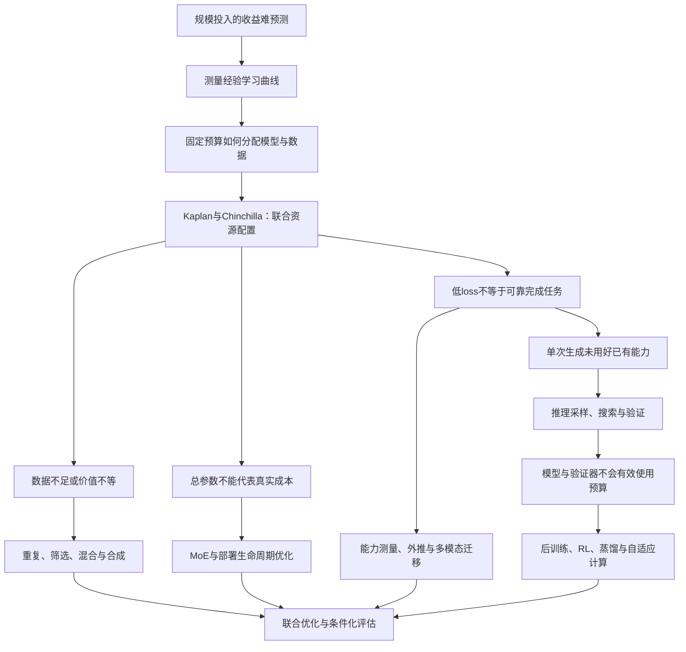

# Scaling Law：问题驱动的技术演化综述

版本 v0.3 · 检索与核验截至 2026-09-16 · 中文持续更新版

从“能否预测规模收益”到“如何联合分配预训练、后训练与推理预算”。本版含 161 条去重主源和独立社区雷达；属于代表性文献的叙事综合，非穷尽性系统综述，未独立复现实验。

图为概念综合，不是实测曲线；箭头不自动意味着已证实的历史因果。

阅读入口：[中文首页](README-zh.md) · [English edition](SURVEY.en.md) · [方法与范围](METHODOLOGY.md) · [文献索引](REFERENCES.md) · [更新日志](CHANGELOG.md)

---

## 导论：Scaling law 到底在回答什么问题？

训练大模型首先是一个资源决策问题：在尚未花完预算之前，能否知道增加模型容量、训练数据或计算会带来多少收益？如果每一种规模都必须训练到最后才知道效果，那么扩大实验本身就会越来越难承担。Hestness 等跨任务测量学习曲线，Kaplan 等进一步把语言模型的参数、数据和训练计算联系起来，使“更大可能更好”转变为可以拟合和比较的资源—性能关系。[Hestness et al., 2017](https://arxiv.org/abs/1712.00409)；[Kaplan et al., 2020](https://arxiv.org/abs/2001.08361)。

但能够预测增长，不等于已经知道怎样分配资源。Chinchilla 说明，在固定训练计算下，把预算过度放在参数而没有相应增加训练 token，可能低效。这一步把核心问题从“应不应该扩展”改成“应该沿哪个轴扩展”。随后，数据不足与质量差异、稀疏架构、部署成本、奖励反馈和推理时计算不断使这个优化问题增加新的约束。[Hoffmann et al., 2022](https://arxiv.org/abs/2203.15556)。

本综述的中心论点是：**scaling law 的演化，是研究者不断发现旧资源模型遗漏了什么，并重新求解最优分配的过程。** 这是对文献的综合解释，不是某篇论文提出的统一定理。

### 先把三个经常混用的问题拆开

| 层次 | 研究对象 | 能回答什么 | 不能直接推出什么 |
|---|---|---|---|
| 经验规律 | 给定配置下，损失或错误随规模变化的函数 | 已测区间如何变化，受控外推是否有效 | 任意规模、分布或任务都成立 |
| 资源最优 | 在预算约束下选择模型、数据与算法 | 哪个配置在指定目标上更划算 | 训练最优必然等于部署最优 |
| 能力与系统 | 在任务、接口和评测协议下的实际成功 | 系统能否可靠交付、成本多少 | 一个平均分完整刻画所有能力 |

这一区分贯穿全文。语言建模交叉熵下降、数学 pass@1 上升、best-of-N 找到正确答案和用户最终拿到正确结果，是不同的量。即使都随计算改善，也不能直接使用同一个指数或兑换关系。推理时计算研究尤其需要显式纳入候选选择与验证成本。[Snell et al., 2024](https://arxiv.org/abs/2408.03314)。

### 同一条曲线，可能在回答四种不同决策

理解后续分支，先明确预算在何处固定。第一种决策在训练开始前发生：总训练计算已定，应选择多大的模型、多少 token 与怎样的优化计划？第二种决策发生在数据与硬件条件给定后：唯一数据不足、内存装不下模型、上下文过长时，哪些变量仍能增加？第三种决策在上线前发生：较多请求是否值得用一次更长的训练换取每次更便宜的推理？第四种决策在请求到来后发生：这道题值得多生成、搜索、验证，还是应该停止？前三种更多改变系统本身，第四种在已训练系统上分配每题预算。[Chinchilla](https://arxiv.org/abs/2203.15556)；[数据受限扩展](https://arxiv.org/abs/2305.16264)；[生命周期成本](https://arxiv.org/abs/2401.00448)；[Snell 等](https://arxiv.org/abs/2408.03314)。

**本综述用下面的记账框架连接这些决策，而不把它当作已经拟合好的统一 scaling law：**

$$
C_{\mathrm{total}}=C_{\mathrm{pre}}+C_{\mathrm{post}}+
Q\,\mathbb{E}_{x}\left[C_{\mathrm{serve}}(x)\right].
$$

其中 $C_{\mathrm{serve}}$ 包含生成、选择/验证与工具调用；$Q$ 是预期请求量。若优化费用、延迟或能耗，需要分别建立相应账本，不能把它们直接塞进同一个 FLOPs 加法。请求分布也很重要：同样平均计算下，给简单题和困难题均匀分配，可能逊于按边际收益分配；但难度预测与停止判断本身也要计费。后文的任务自适应方法正是在近似求解这个尚不完全已知的优化问题。

这说明一种常见误读为什么反复出现。一个实验沿固定 $N$ 增加 $D$ 仍有收益，并不回答在固定 $C$ 下是否应该选择更大的 $N$；一个模型随着思考长度增加而更准，也不说明它比另一种模型在相同端到端成本下更划算。只有说清楚固定了什么、改变了什么、测量了什么，两篇看似冲突的论文才可能被放进同一段研究对话。

七章中反复使用的符号与指标见[变量和成本口径](docs/glossary.md)。特别注意：数据质量不是跨任务统一的标量，稀疏模型不能只报总参数，验证器辅助成功率不能只归功于生成器，精确匹配分数也不能直接当作内部能力的连续测量。

### 全文的问题地图

箭头是本综述的解释性连接。正文会区分直接回应前作、并行回答同一瓶颈和作者归纳的联系；不会把按年份排列自动写成历史因果。

更细的论文关系与分支理由见[研究对话地图](docs/research-map.md)。

### 怎样阅读

想理解经典争议，先读[可预测性与预算](docs/01-predictability-budget.md)的 Kaplan—Chinchilla—复现链，再读[数据](docs/02-data.md)和[部署成本](docs/03-architecture-deployment.md)。想判断“test-time scaling 是否接棒”，先读[后训练](docs/04-posttraining.md)和[推理时计算](docs/05-inference.md)中的 proposer、verifier 和策略分配，再读[能力评估](docs/06-theory-evaluation.md)与负面结果。想跟踪新工作，先看社区雷达提出了哪个问题，再回到原始证据，最后判断它应改变正文哪一条因果连接。

本文以能够解释转折点的代表研究为核心，不按引用数或社媒曝光机械排序。全文的“当前”“最新”均相对于本次检索日期 2026-09-16；阅读范围与未解决问题在各章和元数据中披露。

---

## T1　可预测性、预算与训练配方：同一条曲线究竟在比较什么？

> 核验日期：2026-09-16。范围：预训练的经验规律、预算分配、优化尺度、过量训练和能力外推。以原论文为证据，不声称穷尽截至核验日的文献。核心方法、实验和限制已从全文定点核查；未重跑实验或复算全部附录。来源与阅读深度见 [经典来源](sources/foundations.json)、[扩展来源](sources/expansion-foundations.json)。直接继承关系在正文注明，其余连接为本综述对问题演化的归纳。

### 1. 最初需要预测的，是增加资源的边际收益

早期工程问题不是不知道“大模型、多数据可能有用”，而是不知道再投入一个数量级资源会改善多少，当前平台期是任务上限还是实现出了问题。Hestness 等人在翻译、语言、图像、语音任务中同时调节模型容量和优化设置，测量数据量与泛化误差的关系，区分小数据近似猜测、幂律改善和最终饱和的区域。这使学习曲线成为规划工具，但没有证明所有任务能无限沿同一斜率改善。[Hestness et al., 2017](https://arxiv.org/html/1712.00409v1)

仅测量数据曲线仍不够：预算固定时，增加参数会减少能处理的训练 token。Kaplan 等人把参数、数据、训练计算放入同一经验框架，强调大模型更高的样本效率可能使“提前停止的大模型”胜过“充分训练的小模型”。其计算最优估计约为 $N_{\rm opt}\propto C^{0.73}$，但这里主要使用非 embedding 参数，计算也经过批大小调整；不能把这个指数从定义中剥离，直接与任何后来的 FLOPs 曲线比较。[Kaplan et al., 2020，§1、§6](https://arxiv.org/html/2001.08361v1)

#### 从损失预测到实际能力：GPT-3 与 Gopher 暴露了另一层问题

GPT-3 是这套资源观念走向实际模型的重要节点：从 125M 到 175B 的模型，在不更新权重的情况下接收任务示例，展示了上下文学习随规模变化的潜力。它让关注点从“交叉熵下降多少”转到“同一个预训练模型能否承担更多任务”。但这组结果不能同时回答训练预算最优、每项能力的因果来源和数据污染问题；原报告还披露了污染过滤的缺陷。用少量提示示例评估，不等于模型从未在预训练中接触相关知识。[Brown et al., 2020，§2–4](https://arxiv.org/html/2005.14165v4)

Gopher 进一步把不同规模放到广泛任务中比较：知识与阅读理解的改善较明显，某些逻辑和数学任务却没有同样受益，也存在随规模变差的任务。因此，预训练损失是压缩模型行为的指标，能力则是与任务分布、提示和评估共同作用的结果。这里不是“平均损失无用”，而是平均值不足以告诉我们哪项能力已经进入可预测的改善区间。[Rae et al., 2021/2022，§4.3](https://arxiv.org/html/2112.11446v2)

### 2. Chinchilla 修正的是资源分配，而非可预测性本身

Chinchilla 直接重做固定计算预算下的参数/token 分配实验，用训练曲线包络、IsoFLOP 曲线和参数化损失三条路径估计最优点。70B 参数、1.4T token 的模型在与 Gopher 相近训练计算预算下，验证了较小模型训练更久的收益。一个常用拟合是

$$
L(N,D)=E+A N^{-\alpha}+B D^{-\beta},\qquad C\approx6ND.
$$

这里的 $D$ 是处理过的 token，$L$ 属于指定验证分布，常数和指数来自特定训练配方；$6ND$ 只是稠密 Transformer 训练的近似，不包括所有上下文与系统开销。[Hoffmann et al., 2022，§3–5](https://arxiv.org/html/2203.15556v1)

**本综述的代数解释**是把 $D=C/(6N)$ 代入后令导数为零，得到

$$
\alpha A N^{-\alpha}=\beta B D^{-\beta},\qquad
N_{\rm opt}\propto C^{\beta/(\alpha+\beta)},\quad
D_{\rm opt}\propto C^{\alpha/(\alpha+\beta)}.
$$

最优配置平衡两种可缩减误差的边际收益；只有指数相近，参数与数据的预算指数才都接近二分之一。“约 20 token/参数”因此是训练目标和配方下的经验近似，不能当作阅读更多数据便无用的上限。原论文三种拟合方法的结果也并不完全一致。[原论文表 2、3](https://arxiv.org/html/2203.15556v1)

#### 平滑曲线为什么会给出不同的“最优”？

Porian 等人直接研究 Kaplan 与 Chinchilla 的差异，检查输出层成本、warmup、学习率和批大小随规模变化的影响；校正后在两个数据集上得到更接近 Chinchilla 的配置趋势。由此可见，观测到的规模效应可能混入了小模型优化不足或成本统计不一致，不能全部解释为模型容量的物理性质。[Porian et al., 2024；所读修订版](https://arxiv.org/html/2406.19146)

拟合本身也需要审计。Besiroglu 等人从图像重建 Chinchilla 数据，重做第三种参数拟合，指出参数及置信区间的问题；新拟合更接近论文前两种方法的趋势。这是有限材料上的复核，不是取得完整原始训练日志后的完全复现。较稳健的“模型与数据共同扩大”，应与较脆弱的“某组常数能精确外推四个数量级”分开看待。[Chinchilla Scaling: A replication attempt, 2024](https://arxiv.org/html/2404.10102)

### 3. 优化也是尺度变量：Tensor Programs 与 μP

上述分歧提出了更深的问题：如果宽度改变后，最佳学习率和更新幅度也随之改变，那么用一套未经校准的超参数连接出来的曲线，可能测量的是调参质量。反过来，每个大模型都从头搜索超参数又会消耗本应投入最终训练的预算。**需要迁移的不只是模型能力，还有训练配方。**

Tensor Programs IV 从无限宽参数化切入：某些极限把网络变成近似固定特征的核模型，另一些参数化则能保留特征学习。这个区别为后续 μP 提供理论基础，但不能直接推出真实语言模型的损失指数；它回答的是网络在宽度变化时怎样保持非平凡的学习动力学。[Yang & Hu, 2020/2022](https://arxiv.org/html/2011.14522v3)

Tensor Programs V 将这件事转化为 μTransfer：在小宽度模型上调参，再把合适的基准超参数迁移到大宽度模型。机制不是简单把全局学习率乘一个常数，而是协调不同张量的初始化、学习率和读出缩放，使更新对激活的影响保持合适量级。例如在其 Adam 配方下，若隐藏矩阵的宽度放大倍数是 $m$，对应学习率使用 $\eta_{\rm base}/m$；向量、输入和输出层采用不同规则。只取出其中一个缩放公式、保留其他标准参数化设置，并不等于实现了 μP。[Yang et al., 2022，表 3、附录 B](https://arxiv.org/html/2203.03466v2)

论文用约 40M 的代理模型为 6.7B GPT-3 类模型搜索超参数，所报告的调参预算约占大模型预训练 FLOPs 的 7%。这说明小模型不仅可估计损失曲线，还可能选择曲线背后的优化设置。但阅读实验细节很关键：其大模型对比存在位置编码差异，而且 μP run 因数值问题使用 FP32，基线使用 FP16。因此不能把全部下游差异纯粹归于参数化。宽度迁移的理论依据也比深度、批大小、序列长度迁移更强；正则化超参数没有相同保证。[原论文 §6.1、§7.4](https://arxiv.org/html/2203.03466v2)

本综述据此把一次规模实验的成本拆为“找配方”与“执行配方”。μP 的价值首先是降低前者及跨规模优化失配，而不是宣称更换参数化后所有幂律指数都会改善。这也解释了为什么新的 scaling paper 应报告调参预算和失败运行：它们决定一种方法能否真正指导下一次昂贵训练。

### 4. 对曲线的复核，需要比最终权重更多的信息

OPT 的贡献之一，是把大模型训练中难以从最终曲线看出的重启、损失异常和硬件问题写入日志。现实中的训练预算包含恢复失败与维护运行，并非仅由成功处理的 token 决定。其开放模型有助于外部分析，但比较 OPT、GPT-3 或其他家族时，数据、实现和配方仍不同，不能把同名参数规模当成完整控制变量。[Zhang et al., 2022，§2.5](https://arxiv.org/html/2205.01068v4)

Pythia 更明确地把“可以研究规模”作为设计目标：8 种规模、原始与去重两个数据版本，共 16 个模型；在各数据版本内控制顺序，并为每个模型提供 154 个检查点。它使研究者可以询问某种行为何时形成、是否随训练时刻和规模稳定变化。代价是统一安排并不自动构成每个规模各自的计算最优训练；同一套件适合回答动力学问题，不代表它已经解出最优预算问题。[Biderman et al., 2023，§2](https://arxiv.org/html/2304.01373v2)

OLMo 把开放范围继续扩展到数据、训练代码、日志、检查点及评估。它与 Pythia 的问题联系很明确：若要检验一个经验定律，必须允许别人重建产生数据点的过程。**本综述的判断**是，公开模型套件属于规模律的测量基础设施；它们的科学价值不应只由发布时的排行榜名次衡量。[Groeneveld et al., 2024](https://arxiv.org/html/2402.00838v4)

### 5. 偏离训练最优以后：LLaMA 与 overtraining 的新问题

Chinchilla 优化的是获得某种损失的训练成本。LLaMA 明确把推理成本放进设计动机：较小模型即使需要更多预训练 token，也可能更适合之后大量调用。其结果使“超出 Chinchilla 比例训练”成为实际需求，但跨家族成绩同时改变数据和配方，不能作为参数规模单一因素的消融。[Touvron et al., 2023，引言](https://arxiv.org/html/2302.13971v1)

这里的 overtraining 指超出训练计算最优的 token/参数比例，并不等于验证性能已经因过拟合下降。Gadre 等人因此问：离开最优前沿后，损失是否仍有稳定结构？他们测量 104 个模型、11M–6.9B 参数、三类语料，并覆盖 $M=D/N$ 从 5 到 640 的 token multiplier。令基础模型中 $\alpha=\beta=2\eta$，将 $M$ 与 $C\approx6ND$ 代入可得

$$
L(C,M)=E+\left(aM^\eta+bM^{-\eta}\right)C^{-\eta}.
$$

该表达式把“沿计算量扩展”与“选择训练多久”分开：在拟合有效的范围内，改变 $M$ 可以主要表现为曲线位置变化，而不必破坏共同的计算指数。它不是先验保证，实验中的指数近似、数据配方和优化设置都需要核查。[Gadre et al., 2024，§2–3](https://arxiv.org/html/2403.08540v2)

作者还用验证损失映射一组下游任务的平均误差。需要保留两个边界：任务集合经过小模型表现筛选；平均关系不能替代单任务预测，更不能自动覆盖后训练。其实验前也进行了超参数搜索，因此“预测所需小模型预算”不能误写成整个研究的总成本。本综述将这项结果理解为对部署导向训练提供可用插值与外推工具，而不是宣布任意长训练都有同样收益。[原论文实验设置与 §6](https://arxiv.org/html/2403.08540v2)

### 6. Llama 3：把预算预测与任务预测分成两步

Llama 3 报告展示了规模律在大训练 run 中怎样成为决策程序。研究者训练约 40M–16B 的小模型，覆盖约 $6\times10^{18}$ 到 $10^{22}$ FLOPs，在 IsoFLOP 曲线上寻找最低损失，再估计最优 token 数随计算量的变化。外推给出约 402B 参数与 16.55T token 的配置；考虑最小值附近的平坦区域，最终选择了 405B。这个过程比事后画一条线更接近规模律的工程用途：在目标训练前，明确候选配置和判断依据。[The Llama 3 Herd of Models，§3.2.1](https://arxiv.org/html/2407.21783v3)

能力预测是另一层：先拟合目标任务正确答案的负对数似然与训练计算之间的关系，再把该 NLL 映射为准确率。第二步不仅使用小模型，还包括 Llama 2 系列较大模型作为锚点；这些模型的数据与 tokenizer 并不完全相同。因而报告中的成功外推是具体管线的验证，不是“仅靠同分布小模型就能精确预测所有大模型任务”的证明。[同上，§3.2.1](https://arxiv.org/html/2407.21783v3)

报告还揭示了 token 计数的隐含变量：tokenizer 改进提高了每 token 可承载的字符数量。两个模型都训练一万亿 token，未必处理了相同文本体量。对损失的比较也要注意单位：不同词表上的每 token 交叉熵不可直接当作同一个量。因此，大模型技术报告应被拆成可检验的多个主张：配置选择、验证损失预测、任务映射与系统实现分别有没有对照，而不是把整个模型的成功压成一个“scaling works”。[同上，§3.1–3.3](https://arxiv.org/html/2407.21783v3)

### 7. 下一步应优化哪一笔账？

以上路线已经把问题从单一学习曲线推进到一个带条件的实验程序：先规定数据分布与评估目标，再保证不同规模有可比的优化质量，然后在明确成本口径下拟合，最后用未参与拟合的规模或任务检验。这个程序同时解释了为什么相互矛盾的“最优比例”可能都对：它们可能优化不同训练配方，或者面对不同部署需求。

当模型需要长期服务，目标还要加入调用数量、生成长度和硬件约束。这部分在 [T3 架构与部署](docs/03-architecture-deployment.md) 展开；当训练 token 不再等价于新的有效信息，则必须引入 [T2 数据](docs/02-data.md) 中的唯一数据量、混合比例、过滤和生成机制。尚未进入可靠外推区间的任务，应保留不确定性，而不是以较平滑的平均曲线代替它们。

---

## T2　数据瓶颈：从 token 数量到有效信息、混合与训练顺序

> 核验日期：2026-09-16。范围：唯一数据量、去重、选择、领域混合、数据课程、供给预测和合成反馈。区分原论文实验证据与本综述的机制归纳；未独立重跑数据处理或训练实验。阅读深度见 [经典来源](sources/foundations.json)、[扩展来源](sources/expansion-foundations.json)。仅摘要核验的 TinyStories、Phi-3、Scaling Laws for Transfer 等保留在来源库，未用作本章技术结论。

### 1. 数据成为瓶颈，是因为 D 同时承担了太多含义

在稠密预训练近似 $C\approx6ND$ 中，$D$ 首先是计算过程处理过的 token 数。但如果所有 token 都代表独立、同质的新信息，这个记账变量才能直接承担统计意义上的数据规模。实际语料有重复、有领域差异、有错误和训练测试重叠；相同 token 数也可能来自不同 tokenizer。**本综述的组织方式**是把这几个问题拆开：供给多少新内容、保留哪些内容、如何分配训练比例、按什么顺序训练，以及谁生成了新内容。它们共同改变收益曲线，但并非同一个“质量参数”。

Chinchilla 用于规模律拟合分析的训练运行不足一个 epoch，因此不能单靠其公式判断有限语料反复训练的价值。最终 1.4T token 模型的分域语料重复次数并非全部如此：原文表 A1 中 MassiveWeb 为 1.24 epoch，Wikipedia 为 3.40 epoch；分析运行与最终训练配方需要区分。Muennighoff 等人直接拆分唯一数据量、重复次数与模型容量，拟合重复 token 边际收益递减。在部分实验设置中重复四个 epoch 的差距较小，更多重复则明显衰减，个别运行出现恶化；其饱和型拟合不能完全表达这种恶化。这修正了每个 token 等价的假设，却没有给出“任意数据重复四遍都安全”的阈值。[Hoffmann et al., 2022，§5](https://arxiv.org/html/2203.15556v1)；[Muennighoff et al., 2023，§3、§5–6](https://arxiv.org/html/2305.16264)

由此，少数据场景下的选择不是只有扩大模型或停止训练。重复已有数据、放宽过滤、加入异质领域和生成新样本都能增加账面 $D$，但引入的偏差不同。比较这些策略时，应同时报告总处理量、唯一数据量及其来源，否则“数据效率提高”可能仅来自未说明的重复与分布变化。

### 2. 去重首先修复计数和评估，再谈质量

Lee 等人把长字符串重复与近似重复文档分开处理，比较去重前后的语言模型。在其 C4 实验中，去重减少了生成时的训练文本复制，也改善了训练数据使用效率。问题不只在于复制占用预算：训练与验证集之间的重叠，还会让验证损失显得比真正的新样本泛化更好。这样拟合出来的规模曲线即使平滑，也可能混入越来越强的记忆能力。[Deduplicating Training Data Makes Language Models Better，方法与实验](https://arxiv.org/html/2107.06499v2)

这并不与有限数据下“有意重复仍能改善”矛盾。去重研究主要清除语料收集过程带来的非预期重复与评测重叠；数据受限研究则询问清楚知道训练集是什么之后，再读一遍还有多少价值。**本综述的归纳**是，应先明确基本数据单位和重复来源，再计算 epoch；不能把“自然语料里的无控制重复”与“实验设计中的可追踪重采样”混为一谈。

Dolma 提供了可复核这种差别的基础设施：开放的大型语料和模块化质量、内容、去重流程，使过滤步骤可以分别替换与评估。其分析也提示，多个过滤器排除的内容未必高度重叠，逐项看似温和的处理叠加后，可能使剩余数据供应不足。因此筛选的净收益取决于保留率、可用语料池和训练需求，而不是过滤规则越多越好。[Soldaini et al., 2024，过滤与去重分析](https://arxiv.org/html/2402.00159v2)

### 3. 从随机扩充到主动选样：何时需要目标分布？

Sorscher 等人提出的挑战是：随机扩大数据集可能只是一个低效基线；如果选样器知道哪些样本最有信息，学习曲线能否改善得更快？其理论模型展示了理想筛选下超越幂律的可能，图像实验则揭示实际筛选指标并不容易迁移。选样成本、类别覆盖和训练轮数都影响净收益，因此不能将结果写成通用语言模型已经获得指数级误差下降。[Beyond neural scaling laws, 2022](https://arxiv.org/html/2206.14486)

DSIR 处理一个更具体、也更可操作的条件：**目标领域样本已经可得**。它用 hashed n-gram 等低维特征表达文档，在这个特征空间估计目标与原始语料的密度比，再进行重要性重采样。直观上，目标中常见、原始池中少见的特征组合被提高权重。与逐文档运行大型质量模型相比，这是一条更廉价的数据选择路线。[Data Selection for Language Models via Importance Resampling，方法与实验](https://arxiv.org/html/2302.03169v3)

其证据主要来自领域自适应的继续预训练和匹配训练 token 的对照：目标样本决定“选择什么”，低维近似决定哪些分布差异可以看见。它没有替研究者发现未知的通用目标，也不能保证 n-gram 匹配就覆盖语义正确性。由此产生一个真实分支：已知部署领域时可以优化分布匹配；未知未来任务时则需要更广泛的领域覆盖和鲁棒目标，两者没有统一最优的过滤分数。

### 4. FineWeb：为什么“教育质量”不是所有任务的质量？

FineWeb 将网页清洗做成一组可以用预训练结果检验的选择，形成约 15T token 的语料；FineWeb-Edu 则进一步用模型辅助的教育价值筛选，保留约 1.3T token。其意义不只是发布更大的数据集，而是把过滤阈值与训练后能力连接起来，用同类模型和训练设置评估处理步骤。[Penedo et al., 2024，§4](https://arxiv.org/html/2406.17557v2)

关键取舍出现在“好”的定义。教育型文本可增强学术知识与推理评测，但也改变非学术网页、社交语言及不同语言变体的覆盖。论文的比较显示，教育筛选版本和较广泛网页版本在不同域的困惑度并不全面一致。因此不能把一种基准上的优势直接改写成所有文本学习价值都更高；筛选器选择的是一个能力组合。[同上，§4.2、§6](https://arxiv.org/html/2406.17557v2)

DataComp-LM 从另一个方向约束这个问题：固定实验框架，跨多个模型规模比较数据处理，使架构与训练配置尽量不成为隐藏变量。它支持模型辅助过滤的价值，也明确有组合搜索、运行差异、大模型和评估覆盖的局限。FineWeb 与 DataComp-LM 在这里是共同应对“如何归因数据收益”的两条路线，并非一个算法直接取代另一个算法。[DataComp-LM, 2024，§6](https://arxiv.org/html/2406.11794)

由此，本综述把“高质量数据”视为一个必须附带目标与对照的结论：是同样训练预算下更低的指定域损失，还是更高的某组下游分数？评分模型的运行成本有没有计入？筛选后的容量够不够支持长训练？这些条件若不固定，较小而精选的数据与较大而多样的数据之间就无法公平比较。

### 5. Landmark：DoReMi 如何把未知下游任务变成可优化的混合问题

领域比例比逐文档打分更便宜，却仍有难题：按语料体量采样会过度代表大领域；平均损失最高的领域可能只是噪声多，并非最值得继续训练。DoReMi 的关键洞察，是把当前模型损失与一个参考模型比较，关注仍有可学空间的“超额损失”，而不是绝对难度。其域级目标可概括为

$$
\min_\theta\max_{\alpha\in\Delta}
\sum_i\alpha_i\,
\mathbb{E}_{x\sim D_i}
[\ell_\theta(x)-\ell_{\rm ref}(x)].
$$

$\alpha$ 是领域采样分布。实际算法还包含按 token 归一、超额损失截断、权重平滑和训练过程平均；这些处理不能在复现时被简写的式子替代。[Xie et al., 2023，§3、Algorithm 1](https://arxiv.org/html/2305.10429v4)

它首先训练参考模型，再用约 280M 的代理模型估计领域权重，最后用所得混合训练 8B 模型；迁移的是数据比例，并非直接把代理权重放大。在 Pile 的 22 个领域和另一组 GLaM 数据实验中，作者比较了领域损失与下游结果；报告的五个生成式一次示例任务平均提高约 6.5 个百分点，达到基线表现所需训练步数也减少。额外小模型计算约为所比较大模型预训练的 8%，因而评估收益时应保留这笔搜索成本。[原论文 §4](https://arxiv.org/html/2305.10429v4)

这个机制为什么可能有效？**本综述的解释**是参考模型给出了域间不同固有难度的基准，避免把所有资源追逐在无法减少的误差上，而分布鲁棒优化使代理暴露出被当前混合忽视的领域。其边界也来自同一机制：参考模型较弱或带偏差时，超额损失不再可靠；领域划分过粗时，某个大域内部的差异被平均；小模型认为值得学习的内容，对大模型未必有同样边际收益。论文的跨规模成功属于实证支持，不能当作任何代理尺寸与目标尺寸间都成立的定理。

### 6. 直接后继 RegMix：不再精确模拟训练，只学习配方排序

RegMix 明确将 DoReMi 等代理训练方法作为比较对象，提出另一种代理：让很多极小模型覆盖广泛混合比例，再回归“比例向量到验证损失”的关系。如果小模型给候选配方排出的顺序在大模型上大致稳定，就不必要求代理逐步复现大模型训练过程。[Liu et al., 2024/2025，§1、§3](https://arxiv.org/html/2407.01492v2)

其实验训练 512 个约 1M 非 embedding 参数、各读 1B token 的小代理，拟合回归器，并以多组 1B 模型验证混合排序。这里的 1M 有明确计数口径，不能误读为包括词嵌入在内的整个模型只有一百万参数。搜索成本约为一轮所比较 1B 模型训练的 2%，显示了小代理广泛覆盖配置空间的价值。[原论文方法与实验](https://arxiv.org/html/2407.01492v2)

限制同样具体：优化目标主要是 Pile-CC 验证损失，因其在该实验中与下游表现相关；这个目标未必适合医疗、代码或多语言服务。与 DoReMi 的比较还把后者的领域权重重新归一化到可用领域，作者承认这可能影响基线。因此，合理结论是“在该候选域、目标和规模区间，用小模型学排序可以降低搜索成本”，而不是“RegMix 已全面淘汰 DoReMi”。[原论文 §5 及比较说明](https://arxiv.org/html/2407.01492v2)

两者共享的前提是配方能跨规模迁移，区别在于怎样估计它：DoReMi 基于参考损失与动态鲁棒优化；RegMix 基于大量小实验的排序规律。原有 Data Mixing Laws 又尝试直接拟合领域比例与损失的函数关系，本综述对该项仅完成摘要和引言级核查，不据此添加更强的跨尺度结论。[Ye et al., 2024](https://arxiv.org/abs/2403.16952)

### 7. 静态比例仍不够：SmolLM2 把训练阶段变成新变量

当小模型长期训练，最适合早期的语料可能不适合末期。SmolLM2 的 1.7B 模型训练约 11T token，并在四个阶段调整网页、代码、数学和合成文本比例。它承接 FineWeb 等公开数据基础设施，把问题从“选一个最佳混合”推进到“在当前检查点继续喂什么”。报告中的数据实验有的从中间检查点出发，因为较弱的随机初始化小模型未必能够可靠评估较难数据的后期价值。[SmolLM2，§4.3–4.7](https://arxiv.org/html/2502.02737v1)

这提供了一个对代理设计的提醒：数据是否有用可能与模型已有能力相互作用。若只用从头训练的极小代理筛选，可能错过需要先具备基础知识才能利用的样本。但该报告不是已经建立了普适课程学习定律：后期同时发生数据改变、学习率衰减和额外计算，不能把最终增益全部归因于其中一种数据。训练中还出现过难以彻底解释的损失尖峰，说明完整训练配方仍包含未完全建模的因素。[同上，阶段分析与消融](https://arxiv.org/html/2502.02737v1)

SmolLM2 还展示了预训练与后训练的接口：基础模型的优势未必在沿用已有指令数据时自动变成指令模型优势，因此又需要配套的后训练数据。**本综述的归纳**是，数据最优性至少依赖三件事：模型规模、当前训练阶段和最终使用目标。只报告总 token 数无法区分这些情况；未来混合规律若要具有工程价值，应把代理检查点与训练阶段也写入可复核的定义。

### 8. Data wall 是条件预测，不能写成已经发生的事实

Villalobos 等人的 2024 修订版把公开人类文本的有效存量估计与训练需求增长联立，在趋势延续等假设下给出约 2026–2032 年可能触及供给约束的区间，中位估计约为 2028 年。它不是对 2026 年现状的实时确认，也不是宣称世界上的所有文本都将在某天耗尽；涉及的是给定来源、可用性与有效性假设下的训练供给。[Will we run out of data?，v2](https://arxiv.org/html/2211.04325v2)

这项预测与 overtraining 形成了重要联系：为降低后续推理成本，训练者可能让小模型读更多 token，导致相同计算预算下的数据需求改变。另一方面，放宽数据定义、重复训练、迁移或生成新数据又会改变供给模型。因此区间随需求目标与数据效率变化是合理的，不应因为某个系统继续发布便直接宣布“数据墙已被证伪”。真正要更新的是原预测的输入假设与可观测数据。[同上，§2–3](https://arxiv.org/html/2211.04325v2)

本综述据此区分三个层面：网页存量是否仍在增长；经过许可、清洗、去重和目标匹配后还能得到多少有效样本；模型对这些样本的利用效率是否提高。它们分别属于供给、处理与学习算法，不能只用互联网总字节数判断语言模型的训练余量。

### 9. 合成数据的关键不在来源标签，而在反馈机制

Shumailov 等人研究递归地用模型输出训练下一代的过程，展示有限采样等误差累积、尾部信息逐代丢失的 model collapse。这里核查的是 arXiv v3，而非把未读取的正式发表版当作阅读全文证据。其结论针对特定反馈机制，不能推出“只要含合成数据就必然退化”。[The Curse of Recursion，所读 v3](https://arxiv.org/html/2305.17493v3)

Gerstgrasser 等人直接检验一个关键条件：原始真实数据被替换，还是保留并与历代数据一起积累？在其任务与理论设置中，累积可以避免相应的退化。但数据和计算也随积累增加，所以它不是固定预算下所有策略都可免于 collapse 的证明。这是一条有直接问题继承的研究链：后继修改了前一结论依赖的数据更新机制。[Is Model Collapse Inevitable?, 2024](https://arxiv.org/html/2404.01413)

这与 DoReMi、FineWeb 和数据课程的讨论最终汇合：生成器、过滤器和采样器都在重写训练分布。综述更新时应记录真实数据保留率、验证方式、尾部覆盖和总成本，而非把“合成”视作一个足够解释好坏的二元标签。特别是代码测试、数学验证等能提供额外反馈的场景，与纯粹模仿上一代文本的循环不是同一个信息过程；相关实证链应与后训练章节共同阅读，而不从 collapse 实验直接外推。

### 10. 这一分支怎样继续更新？

值得跟踪的新工作应回答明确的旧问题：是否降低了选择数据的计算成本，是否证明比例能在更大模型上迁移，是否引入训练阶段，是否在同预算下保留更多尾部覆盖，或者修正了数据供给预测。没有对照、没有目标定义的“更高质量 token”很难成为可积累的知识。

这也给实际读论文提供了一张账本：唯一样本数、处理 token、选择成本、代理搜索成本、目标域损失、下游覆盖和评估独立性应一起阅读。某个选择器可以改善基准分数，却未必扩大数据总供应；某种合成机制可以增加供应，却未必提供新的可验证信息。把这些账目分开，问题链才不会在每一代模型发布时重新从“数据更好了”开始。

---

## T3　架构与部署：参数、FLOPs、显存和实际成本为何分开演化？

> 核验日期：2026-09-16。范围：稀疏专家、训练并行、精确注意力实现、KV 表示与服务、长上下文和生命周期预算。本文将算法成本、硬件表现和模型质量分别讨论；不将某篇论文中的加速倍数视为跨硬件通用常数。原始来源与阅读深度见 [经典来源](sources/foundations.json)、[扩展来源](sources/expansion-foundations.json)。未运行系统基准。

### 1. 当参数可以不被调用，规模律需要新的坐标

稠密模型中，参数量通常同时代表存储容量和每 token 计算规模。MoE 打破了这种绑定：模型可以拥有很多专家，每个 token 只调用少数。于是“模型大一倍”不再说明每步计算也大一倍；比较架构时至少要区分总参数、激活参数、数据量、FLOPs、内存与通信。下面的关系是本综述的账目划分，而不是认为这些指标已经有一个统一转换系数。

GShard 将条件计算与自动分片编译结合，把专家分散到设备上运行；其多语言翻译实验展示了扩展容量而计算成本增长较慢的可能。但它同时说明，参数稀疏不等于系统复杂度消失：路由、跨设备数据搬运和编译规模都必须处理。结果来自多语言翻译，不能不加说明地移植成自回归通用语言模型的同预算收益。[Lepikhin et al., 2020，§1–3](https://arxiv.org/html/2006.16668v1)

Switch Transformers 直接简化了路由问题：每个 token 选择一个专家而不是多个，以减少路由与通信，并用选择性高精度缓解路由数值不稳定。专家容量必须预留缓冲；太小会丢弃溢出 token，太大则浪费计算和内存。其 T5 式目标、C4 数据与 TPU 对照说明了速度和质量之间的可测权衡，而不是证明“专家越多、每步代价永远不变”。[Fedus et al., 2021/2022，§2](https://arxiv.org/html/2101.03961v3)

#### 从可运行架构到可预测配置

Clark 等人把活动计算与总容量分开，研究 routed language models 的共同规律，但主要实验固定训练 130B token，未完成数据量的联合最优搜索。Fine-Grained MoE 明确指出这一限制，将 token、参数与专家粒度共同纳入优化；更细的专家增加组合灵活性，也增加路由开销。这条链具有直接继承证据，说明稀疏模型的规模律不能仅把稠密公式中的参数换成“激活参数”。[Clark et al., 2022](https://arxiv.org/html/2202.01169)；[Scaling Laws for Fine-Grained Mixture of Experts, 2024](https://arxiv.org/html/2402.07871)

Mixtral 则展示了这种架构如何进入开放自回归模型：每层 8 个专家选 2 个，总参数约 47B、每 token 激活约 13B。报告主动提醒，服务内存按总参数计，路由与访存还会影响设备利用率，批量工作负载更容易获得较高算术强度。因此把它简称为“13B 模型的部署成本”会漏掉主要约束。[Jiang et al., 2024，§2、§3](https://arxiv.org/html/2401.04088v1)

### 2. Landmark：DeepSeekMoE 从“容量更多”转向“专家更有用”

传统专家若粒度很粗，一个专家可能同时承担不相干的知识；多个专家又可能重复学习普遍需要的信息。DeepSeekMoE 针对这两点提出细粒度分割与共享专家：将每个专家的中间维度缩小为原来的 $1/m$，专家数扩大到 $mE$，每个 token 调用数也相应扩大为 $mk$，尽量保持专家总参数和激活计算可比；再从这 $mk$ 个激活位置中划出 $|S|$ 个始终激活的共享专家，承担公共知识，非共享专家每次只选 $mk-|S|$ 个；共享专家占用原有激活预算。[Dai et al., 2024，§3](https://arxiv.org/html/2401.06066v1)

用省略残差与归一化的表达式说明，其层输出可写为

$$
y(x)=\sum_{s\in S}f_s(x)+
\sum_{i\in \mathrm{Top}_{mk-|S|}(g_{\bar{S}}(x))}g_i(x)f_i(x).
$$

$S$ 是共享专家集合，$\bar{S}$ 是其余非共享专家；后项仅从非共享集合选取 $mk-|S|$ 个路径。核心不是将组合数量本身当作能力，而是把公共内容和专门内容分配到不同路径，并让专门路径能够更灵活地组合。原论文在约 2B、100B token 的验证设置中做结构消融，再扩展到 16B、2T token；与同语料稠密参照的比较，比跨公司模型排行榜更接近回答架构改动的收益。[原论文 §4–5](https://arxiv.org/html/2401.06066v1)

仍需保留两项限制。第一，专家删除和性能消融可为分工提供证据，但不能证明每个专家具有清晰、独立的人类语义职责。第二，论文用同总参数的稠密模型作强参照，本综述不把它称为所有任务和训练预算下严格的性能上界。细分专家还意味着一个 token 可能联系更多设备，所以参数与 FLOPs 匹配没有消除通信差异。

#### 直接后继 V2：FFN 更省以后，瓶颈转移到 KV 和通信

DeepSeek-V2 明确继承这套专家结构，同时处理两个新约束。细粒度路由通过限制 token 涉及的设备数量控制通信；注意力侧则引入 MLA，将 key/value 联合压缩为低维潜变量。令每层缓存潜维数为 $d_c$，专门处理位置编码的 key 维数为 $d_R$，层数为 $\ell$，其每 token 缓存为约 $(d_c+d_R)\ell$ 个元素，相比标准多头缓存 $2h d_h\ell$ 降低了存储需求。[DeepSeek-V2，§2](https://arxiv.org/html/2405.04434v5)

这里有一个值得精读的机制细节：低秩压缩若能把上投影吸收入 query/output 矩阵，就无需每次完整恢复 KV；但 RoPE 的位置相关变换会破坏这种矩阵重排。V2 因此把位置相关部分解耦，而不是仅宣布“KV 做低秩就足够”。这也解释了为什么 MLA 的收益应连同架构和实现一起验证；报告中的缓存减少比例和吞吐增益不能直接视为任意模型的即插即用结果。[同上，§2.1.2–2.1.3](https://arxiv.org/html/2405.04434v5)

#### 直接后继 V3：负载均衡本身也可能损害模型目标

V3 沿用 MLA 与 DeepSeekMoE，但把均衡专家负载的主要机制移出辅助损失：根据专家过载或欠载情况调整路由偏置，用偏置影响选择，计算专家输出的权重仍来自原始亲和分数。需要特别说明，它仍保留很小的序列级辅助均衡损失，不能将“auxiliary-loss-free”理解为训练目标中完全不存在任何均衡项。[DeepSeek-V3，§2.1](https://arxiv.org/html/2412.19437v2)

其更大规模实现还结合 FP8、DualPipe 和跨节点通信优化。这里的证据是整套配方能够运行，并有局部消融；没有完全独立识别所有组件的贡献。报告中的 2.788M H800 GPU 小时覆盖正式训练阶段，按假设租价折算约 5.576M 美元，明确不包含前期研究与消融。这笔费用不能改写成整个项目的研发总成本，更不能仅按激活参数比例推导。[同上，表 1、§3](https://arxiv.org/html/2412.19437v2)

### 3. 训练模型放得下，不代表集群算得快

系统支线面对的是另一种限制：即使算法预算允许扩大模型，单卡显存也可能放不下参数、梯度和优化器状态。Megatron-LM 利用 Transformer 层结构做张量并行，减少朴素划分中的冗余通信，再与数据并行组合。其 8.3B、512 GPU 实验中的约 76% 是相对所选单卡基线的扩展效率，不是使用了 76% 的硬件理论峰值。这个区别直接影响如何把论文 FLOPs 换成采购或运行预算。[Shoeybi et al., 2019/2020](https://arxiv.org/html/1909.08053v4)

ZeRO 则从数据并行的重复存储切入，分阶段分片优化器状态、梯度和参数，使集群总显存更有效地服务一个模型。它没有让所有通信免费，也没有解决全部激活与临时缓冲开销；论文讨论“理论上能够容纳万亿参数”与“已经完成这个规模的训练”是不同证据级别。它与张量并行可以组合，回答的是不同内存和通信瓶颈。[Rajbhandari et al., 2019/2020](https://arxiv.org/html/1910.02054v3)

本综述将这类工作看作规模实验的可行域：一个数学上较优的 $N,D$ 配置，如果迫使模型跨越低带宽链路、使用过小微批次或频繁重计算，实际可能比次优 FLOPs 配置更慢。因此，比较训练最优点时应说明它针对理想算术预算，还是针对指定集群与截止时间的实际预算；前者不能自动代替后者。

### 4. Landmark：FlashAttention 为什么可以多算一些，却更快？

标准注意力需要计算 $QK^\top$、softmax 与乘 $V$。常规实现将二次大小的中间矩阵写入高带宽显存 HBM，再重新读出；在 GPU 上，这些搬运可能比部分算术更昂贵。FlashAttention 因而不先改变模型近似，而是重排精确计算：把输入分块放进更快的片上 SRAM，并用在线 softmax 维护全局归一化。[Dao et al., 2022，§2–3](https://arxiv.org/html/2205.14135v2)

在线计算的关键在于可以合并两块统计量。若旧块最大值和指数和为 $m,\ell$，新块为 $\tilde m,\tilde\ell$，合并后

$$
m'=\max(m,\tilde m),\qquad
\ell'=e^{m-m'}\ell+e^{\tilde m-m'}\tilde\ell.
$$

配套地重标输出累积量，就无需把完整注意力矩阵存入 HBM。反向传播再从输入块重算必要中间结果；算术工作可能增加，但读写减少，运行反而更快。它仍是二次算术复杂度的精确注意力，不能与线性注意力混称。[同上，Algorithm 1、Theorem 1–2](https://arxiv.org/html/2205.14135v2)

在 BERT-large、序列长度 512 的实验中，论文相对当时 MLPerf 1.1 训练记录报告约 15% 端到端加速；GPT-2、长度 1K 的实验相对所选实现报告约 3 倍。具体倍数依赖长度和基线，不是所有 Transformer 的共同增益。其分析把 SRAM 容量显式纳入 IO 复杂度，也不声称每一种 GPU、每个头维度都有相同优势。[原论文 §4.1](https://arxiv.org/html/2205.14135v2)

**本综述的判断**是，这项工作改变了 scaling law 的成本解释：同样的模型、token 和理论 FLOPs 可以因内存访问组织不同而有不同墙钟成本；这与“模型统计效率提高”必须分别记录。

#### 直接后继 FlashAttention-2：一次 IO 优化不会消除所有瓶颈

第二代发现第一代仍受线程块占用率、warp 间共享内存通信和非矩阵运算限制。它减少归一化等非矩阵 FLOPs，在序列维度增加并行，并重新分配 warp 的工作。A100 上的注意力内核约两倍加速和较高峰值利用率，说明“FLOPs 数相同”仍不意味着每个 FLOP 花费相同时间。[Dao, 2023，§3–4](https://arxiv.org/html/2307.08691v1)

这条明确的后继链不是从错误算法换成正确算法，而是在保持精确输出的条件下逐层移除系统瓶颈。它也留下新边界：内核加速不能直接成为整个训练 run 的相同比例加速；其他层、通信、优化器与数据加载仍占时间。更新综述时，应保存硬件、形状、精度、基线版本和测量的是内核还是端到端，而不是只保存“快了几倍”。

### 5. 服务瓶颈分两层：每个 token 存多少，以及存储空间浪费多少

自回归解码需要不断读取之前 token 的 KV；这与可并行处理输入的 prefill 具有不同资源特征。MQA 让不同 query 头共享一组 key/value，降低缓存与带宽需求，但改变了模型表示容量。GQA 是其直接扩展：将 query 头分组，每组共享 KV，在标准多头与单组共享之间取得折中，还研究了将已有多头检查点均值聚合后继续训练的转换方式。[Shazeer, 2019](https://arxiv.org/html/1911.02150v1)；[Ainslie et al., 2023，§2–3](https://arxiv.org/html/2305.13245v3)

忽略缓冲等开销，批量 $B$、上下文长度 $T$、层数 $\ell$、KV 头数 $h_{\rm KV}$、每头维度 $d_h$、每元素字节数 $b$ 时，KV 存储可记为

$$
M_{\rm KV}\approx 2BT\ell h_{\rm KV}d_h b.
$$

这是本综述按张量形状写出的账式，说明延长上下文、增加批量、压缩 KV 头和改变精度如何相互牵制。GQA 的 5% 额外训练计算转换结果来自其特定模型设置，不是任意检查点无损转换的保证；MLA 则用上一节介绍的另一种低维表示继续改变这一账式。

PagedAttention 处理的是正交问题：即使每个 token 的 KV 大小不变，给不同长度请求预留连续空间也会产生碎片和未使用容量。它把 KV 分成固定块、按需分配，允许非连续存储与前缀共享，再通过 vLLM 的调度扩大可服务批量。其收益是更有效地使用空间，不是压缩了每个 token 的表示。[Kwon et al., 2023，§1–4](https://arxiv.org/html/2309.06180v1)

因此，MQA/GQA/MLA 与分页管理可以组合：前者改变表示，后者改变分配。但两者都要回到工作负载检验；长请求、多样生成、共享前缀、低延迟单请求和大批量离线任务的收益不同。Pope 等人的推理分析正是把并行布局、批大小、上下文和延迟要求共同纳入，分别研究输入处理与逐 token 生成。最高吞吐配置未必满足交互延迟，最低延迟配置也未必最省每 token 成本。[Efficiently Scaling Transformer Inference, 2022](https://arxiv.org/html/2211.05102v1)

### 6. Context scaling：窗口能装下，不等于信息能用好

改善注意力实现后，长上下文仍需要训练分布与位置机制配合。Xiong 等人从 Llama 2 检查点继续预训练约 400B token，调整位置编码、长序列设置和数据混合；小模型使用更长训练窗口，大模型采用另一长度以控制成本。它提供了短上下文模型继续扩展的实证，也说明扩窗并非免费的配置改动。[Effective Long-Context Scaling of Foundation Models，§2、§4](https://arxiv.org/html/2309.16039v3)

论文比较不同数据混合时发现，文本质量与训练配方可以比单纯增加长文档比例更重要。综述不能把这些结果压成“加入长文档即可”；不同任务需要检索、整合或跨段推理，均需独立评估。这里的瓶颈已经从“内存能不能容纳序列”，转为“训练是否教会模型有效利用额外信息”。[同上，数据与训练课程消融](https://arxiv.org/html/2309.16039v3)

Mamba 选择另一条架构分支：不用 attention 保存可逐项检索的全部历史，而以输入相关的状态空间参数选择性更新状态。其基本形式是 $h_t=\bar A_t h_{t-1}+\bar B_t x_t,\ y_t=C_t h_t$，选择机制让信息保留依赖内容；硬件友好的 scan 解决输入相关参数破坏固定卷积形式后的计算问题。代价是历史被压入有限状态，线性序列复杂度并不自动保证与 attention 等价的精细检索能力。[Gu & Dao, 2023/2024，§2–3、§5](https://arxiv.org/html/2312.00752v2)

原报告跨语言、DNA 和音频研究序列建模；百万长度相关结果不能不区分模态地改写成百万 token 通用语言理解。**本综述的归纳**是，长上下文的研究应至少同时测量长度、信息密度、有效利用任务及运行成本。模型支持的最大窗口只是其中一个条件，不能单独代表能力规模。

### 7. 部署目标最终会反过来改变预训练

Sardana 等人把推理需求加入 Chinchilla 型目标：模型若将被大量调用，较小模型的服务节省可以补偿更长预训练。在足够高需求下，“较小、喂更多数据”可能是总成本更优的方案；但从常见 token/参数区间拟合的曲线，在极端长训练区域也可能高估额外数据的收益。[Beyond Chinchilla-Optimal, 2023/2024](https://arxiv.org/html/2401.00448)

一个解释这种变化的简化稠密账式是

$$
C_{\rm life}\approx6ND_{\rm train}+2ND_{\rm infer}.
$$

它省略了注意力长度、prefill/decode 区别、内存、通信及硬件利用率，只用于解释目标函数为什么改变。因此 [T1 的 overtraining](docs/01-predictability-budget.md) 和 [T2 的数据课程](docs/02-data.md) 不是偏离规模律的例外，而是在新的需求约束下重新分配资源。若后训练使模型每个请求生成更长推理，推理预算还会继续变化。

本综述由这些路线得到的共同判断是：系统创新可以把原来不可行的配置变为可行，架构创新可以改变容量与成本之间的关系，部署需求则可以改变什么叫“最优”。后续论文最值得更新的地方，是它修正了哪个约束、以什么对照证明净收益，以及新瓶颈出现在哪里。仅报更多总参数、更低激活参数或一次更高吞吐，都不足以完成这个论证。

---

## T4　后训练与强化学习：从反馈目标到可扩展推理策略

> 核验日期：2026-09-16。按问题、机制、实验条件与限制组织；逻辑承接不自动等于直接影响史。新增文献见 [expansion-frontier.json](sources/expansion-frontier.json)，既有转折与2026材料见 [frontier.json](sources/frontier.json)。阅读深度逐条记录，不声称完整覆盖截至该日全部论文。

### 1. 起点不是“模型还不够大”，而是目标、数据和反馈不一致

预训练扩展通常考察预测分布的损失。实际用户却关心回答是否遵循意图、证明是否成立、程序是否通过测试。这些目标之间有相关性，却不是同一个目标。后训练研究的起点，就是用有限的额外数据和计算，把底座已经拥有的知识重新组织成更合适的行为。这里必须同时记录三项预算：生成训练样本的预算、判断样本好坏的预算，以及更新参数的预算。只报告最后一项，会把搜索和教师成本藏起来。

InstructGPT 把这层错位具体化：先用示范做 SFT，再用人工排序训练奖励模型，最后用带约束的 PPO 优化偏好。其“小模型回答更受偏好”的结果发生在论文的人类评价提示分布中，不能翻译成“小模型普遍具有更强知识或数学能力”。它说明训练目标可以改变参数规模与用户效用的关系，也留下一个瓶颈：奖励来自有限标注，策略却会主动寻找奖励函数给高分的区域。[InstructGPT](https://arxiv.org/abs/2203.02155)

DPO 针对这条流程的复杂性，把特定的 KL 正则化奖励优化问题改写为偏好分类。令 $\pi_{\mathrm{ref}}$ 为参考策略，$\Delta_\theta$ 为偏好回答与非偏好回答相对参考策略的对数概率差，其核心损失是
$$
\mathcal{L}_{\mathrm{DPO}}=-\mathbb{E}_{(x,y_w,y_l)}
\log\sigma(\beta\Delta_\theta).
$$
这一重参数化减少了独立奖励模型和在线 RL 环节，并未让偏好数据自动覆盖策略未来会生成的所有错误。它的理论对应依赖奖励—偏好模型等设定；“实现更简单”与“所有任务都不再需要探索”是不同结论。[DPO，§4](https://arxiv.org/abs/2305.18290)

当任务有可执行检查器时，反馈来源可以从“人更喜欢哪个回答”转向“答案是否满足条件”。Tulu 3 的流程保留 SFT 与 DPO，然后在数学和指令约束任务上做 RLVR；这体现的是互补关系，而不是偏好学习被数学奖励全面取代。它还发现相近训练奖励未必带来相近测试表现，更强的初始模型往往更有利。OLMo 2 将这类后训练与公开的预训练模型、数据及检查点连接起来，使研究者更有条件分析收益来自哪个阶段。[Tulu 3，§6](https://arxiv.org/abs/2411.15124)、[OLMo 2，§5](https://arxiv.org/abs/2501.00656)

底座条件因此不能被当成背景噪声。Llemma 在 Code Llama 上继续训练数学文本和代码；MetaMath 用改写、反向提问等方式扩充已有数学问题；DeepSeekMath 把数学语料构建、持续预训练、监督微调与 RL 放在同一条训练链上。这些工作共同提醒我们：后续“零监督 RL”的零，通常指某个训练阶段没有人工推理轨迹，并不表示模型没有经过大规模知识、代码或合成数据训练。合成题目增加了表达和求解角度，也不等于增加同等数量的独立新事实。[Llemma，§2](https://arxiv.org/abs/2310.10631)、[MetaMath，§3](https://arxiv.org/abs/2309.12284)、[DeepSeekMath，§2–4](https://arxiv.org/abs/2402.03300)

### 2. 奖励过优化：为什么更多优化不一定改善真正目标

在可验证推理成为焦点之前，RLHF 已暴露另一类瓶颈：奖励模型（RM）学到的是偏好的近似，持续提高它的分数，未必持续改善目标。Gao、Schulman 与 Hilton 在 2022 年把这一现象变成可测的 scaling 问题：用固定的 6B “gold RM”生成比较标签，训练不同容量的 proxy RM，再分别用 PPO 更新策略、用 best-of-N 筛选候选。两条路线都出现 proxy 分数继续提高、gold 分数先升后降的区域；因此失败并非只有训练阶段才会发生。[原文 §1–2、§3.5](https://arxiv.org/html/2210.10760v1)。

关键推进是联合考察**优化强度与评分器容量**。论文以 KL 散度的平方根度量策略偏移，并对相对初始策略的 gold 奖励拟合如下经验关系：

$$
d = \sqrt{D_{\mathrm{KL}}(\pi\Vert\pi_0)}.
$$

$$
R_{\mathrm{BoN}} = d(\alpha_{\mathrm{BoN}}-\beta_{\mathrm{BoN}}d).
$$

$$
R_{\mathrm{PPO}} = d(\alpha_{\mathrm{PPO}}-\beta_{\mathrm{PPO}}\log d).
$$

系数随 RM 参数量呈平滑趋势，更大 RM 总体支持更高的 gold 奖励峰值；增加标签也能缓解过优化。它把“多优化是否有用”改写为“当前评分器能承受多少优化”。但这些是特定设置中的经验式，PPO 式在原点附近也不适用；KL 衡量分布偏移，不能当作跨算法相同的 FLOPs 预算。两种方法在相同 KL 下的收益差异，也不能被解释为相同实际算力下的效率差异；这要求把分布变化与训练、采样成本分别记账。[§3.1–3.3、§4.1](https://arxiv.org/html/2210.10760v1)。

最重要的边界是：**gold 只在合成实验中被定义为参照，它本身也是人类偏好的代理，并非人类真实意图。** 研究没有测完“标签偏好与实际意图不一致”的第二层偏差。与下一章验证器漏洞的联系是本综述的跨分支归纳：无论增加 PPO 更新还是推理时搜索，都会把压力集中到评分规则的误差上；扩张计算必须同时检查独立评估是否改善，不能只展示被优化分数上涨。这也促使后续研究关注新反馈和评分器更新，而非假定固定 RM 可以无限复用。[§4.3–4.5](https://arxiv.org/html/2210.10760v1)。

### 3. 关键节点一：自训练为什么能进步，又为什么会用尽自己的答案？

只有少量推理示范时，直接扩充人工标注很贵。STaR 的洞见是把模型偶尔答对的路径变成新的训练数据：生成推理及答案，保留答对的样本，再微调。对答错的问题，论文还尝试把正确答案告诉模型，让它反向构造解释，训练时再移除答案提示。原始方法每轮从原预训练模型重新微调，以减轻反复累积训练造成的过拟合；这不是简单地让同一个检查点无限续训。[STaR，§3–4](https://arxiv.org/abs/2203.14465)

机制可用一个共同的目标说明。设问题为 $x$，整条回答为 $y$，检查器返回非负奖励 $R(x,y)$，当前策略为 $\pi_t$。如果我们只保留高奖励回答，训练看到的分布就从 $\pi_t$ 变为
$$
q_{t+1}(y\mid x)=
\frac{R(x,y)\pi_t(y\mid x)}
{\mathbb{E}_{y'\sim\pi_t}[R(x,y')]}.
$$
随后最大化 $\mathbb{E}_{q_{t+1}}\log\pi_\theta(y\mid x)$，就是把更多概率质量移到已经找到的好解上。ReST-EM 用期望最大化的视角组织这类方法：二元奖励对应拒绝采样后的监督学习，并在数学与代码任务上研究模型规模、生成量和迭代的作用。[ReST-EM，§3–5](https://arxiv.org/abs/2312.06585)

这个公式也直接暴露出边界。若某题当前采样批次的奖励都是零，归一化分母的经验估计为零，该批次无法提供正例；这不意味着公式中的真实期望为零。若检查器把错误推理但正确答案的样本放行，错误步骤也会被强化。答案提示、教师模型、工具和搜索都可能给过程加入新信息，不能把这些条件下的收益归结成模型凭空创造知识。反过来，有限采样没找到答案，也不能证明底座对该题的正确概率严格为零。这是“支持集边界”争论需要区分的两件事。

ReST 的 Grow–Improve 流程解决另一个成本问题：先生成数据，再在同一批数据上多次离线改善，而不必每次参数更新都重新采样。其原始实验证据主要来自机器翻译和学习到的质量反馈；ReST-EM 则把可验证的问题求解与明确的奖励重加权联系起来。前者不能直接被当成数学二元奖励的等价实验，两者共享的是让昂贵生成样本被更充分使用的设计思想。[ReST](https://arxiv.org/abs/2308.08998)、[ReST-EM](https://arxiv.org/abs/2312.06585)

这一支线的下一步自然分叉：增加采样来扩大正例覆盖；用搜索在中间状态寻找更好的路径；用教师提供当前策略难以发现的轨迹；或者改变 RL 更新方式，让一个失败样本的不同步骤得到不同信用。判断进步来自哪一项，比把这些方法统一称为“自我进化”更有解释力。STaR 本身在不同数据集上的收益也不相同，因此没有建立“每轮自训练必然按固定速率改善”的规律。[STaR，§4–5](https://arxiv.org/abs/2203.14465)

### 4. 关键节点二：过程奖励究竟在预测真伪，还是预测未来成功？

最终答案反馈便宜，但只能告诉我们整条轨迹是否过关。Cobbe 等人的 verifier 工作把生成与选择分开：先产生多个答案，再训练模型挑出正确解。在 GSM8K 上，这让额外采样具有可利用的价值；同时，论文区分了单次生成表现与多次采样的覆盖情况，展示过度训练生成器可能损害样本多样性。由此产生的问题是：如果生成了十条答案，其中一条正确，我们能否可靠找到它？[Training Verifiers，§4](https://arxiv.org/abs/2110.14168)

仅检查结果，还可能接受含错误步骤的正确答案。Uesato 等人同时测量答案错误和推理过程错误，比较 outcome 与 process feedback；其结果在特定 GSM8K 实验中揭示标注成本、最终准确率与过程可靠性之间的差异，并非证明过程监督在所有预算下都占优。[Let's Verify Step by Step](https://arxiv.org/abs/2305.20050) 随后成为人工过程标签路线的重要节点，但标注每一步很昂贵，于是出现自动过程监督。[Uesato 等，§2–4](https://arxiv.org/abs/2211.14275)

Math-Shepherd 的办法是从每个前缀继续采样。对于前缀 $s$，一个常见软标签可写成
$$
\widehat{V}^\pi(s)=
\frac{1}{M}\sum_{j=1}^{M}
\mathbf{1}\{\mathrm{correct}(y_j)\}.
$$
其中 $y_j$ 表示从前缀 $s$ 按当前策略续写的第 $j$ 条回答。硬标签则可以取“至少有一次成功”。这样无需逐步人工标注，就能训练用于重排或 RL 的评分器。关键是上式估计的是**给定后续策略时，从这里继续完成任务的概率**，并不直接等于“这一步在逻辑上正确”的概率。[Math-Shepherd，§3](https://arxiv.org/abs/2312.08935)

考虑两个示意前缀：甲做了正确但困难的代数变换，续写模型往往失败；乙先写错，后来又自行纠正并答对。按后续成功率打分，乙可能高于甲；按严格步骤真伪打分，排序应相反。这不是一个评分器“突然失灵”的悖论，而是两个目标本来就不同。用于引导搜索时，可恢复性是有价值的信息；用于解释证明哪里第一次出错时，它又可能误导。综述必须在目标层面区分 value model、错误定位器与最终答案 verifier。

The Lessons of Developing Process Reward Models 把这个分歧做成实证检查：比较 Monte Carlo 续写标签、模型判断和人工监督，说明续写成功与步骤正确不能简单互换；同时提醒，只用 best-of-$N$ 的答案准确率评价 PRM，可能让偏向结果的评分器显得很强。论文结合共识过滤，并同时观察选择任务和步骤错误识别。这里可以支持“标签构造与评价目标应匹配”，不能推出“所有 Monte Carlo 标签都没有用”。[PRM Lessons，§2–4](https://arxiv.org/abs/2501.07301)

这条分歧解释了后来为什么不是一种 PRM 统一天下。有的模型主要估计搜索价值，有的定位第一处错误，有的对完整证明给分，有的把生成式检查过程也扩展成一条推理链。它们的标签成本、部署延迟和适用任务不同。用同一个“奖励模型准确率”把它们排在一张榜上，会掩盖决定实际效果的接口条件。

### 5. 从外部搜索到学会使用预算：o1 与 R1

OpenAI 的 o1 官方报告给出一条重要经验信号：增加强化学习训练计算，以及增加测试时思考计算，都能改善所示推理表现。这把“怎样搜索”扩展成“怎样训练一个善于利用额外计算的策略”。不过报告未公开足以完整复现的训练配方和统一拟合公式，图中的平滑增长也不能被当作已验证的无限外推定律。[Learning to reason with LLMs，2024](https://openai.com/index/learning-to-reason-with-llms/)。

DeepSeek-R1 使这一方向更可检查。R1-Zero 在已预训练的 DeepSeek-V3-Base 上直接做 RL，用数学答案、代码测试等可验证反馈，结合格式奖励；GRPO 用组内回报估计优势，减少对独立 critic 的需求。长推理、自检等行为随训练出现，但可读性与语言混杂等问题促成 R1 的冷启动数据、多阶段 SFT/RL 配方。这里“Zero”不表示从零知识学习，也不能把 R1-Zero 与最终 R1 的训练条件混为一谈。[DeepSeek-R1，§2](https://arxiv.org/html/2501.12948v1)。

自动验证降低了反馈扩张对逐条人工标注的依赖，也带来结构性边界：可检查的最终答案较适合数学和代码；开放研究、长程操作与开放式写作未必有可靠、廉价且难以投机的奖励。本综述据此归纳：后训练的扩张至少同时需要可用任务、可验证反馈和产生有用探索的策略，不能仅用 RL 步数概括。

### 6. 关键节点三：GRPO 的便宜来自哪里，优化偏置又藏在哪里？

长推理给 PPO 带来显存、价值估计和信用分配成本。DeepSeekMath 的 GRPO 以同题多条回答的相对奖励代替独立 critic 作为基线。对一组 $G$ 个回答，简化的 outcome advantage 是
$$
A_i=\frac{R_i-\bar{R}}{\operatorname{std}(R_1,\ldots,R_G)+\epsilon}.
$$
原始形式对每条序列内部按长度平均 token 的 clipped surrogate，再在组内平均，并带参考策略约束。省掉价值模型不等于省掉采样：得到可靠的相对信号仍需要多条 rollout，训练数据分布也决定哪些组有非零信号。[DeepSeekMath，§4](https://arxiv.org/abs/2402.03300)

长序列把这个目标中看似无害的归一化放大了。Dr. GRPO 指出，若每条回答的 token 梯度都乘 $1/T_i$，短正例的每个 token 获得更强推动，长负例的每个 token 则受到更轻惩罚；组内奖励标准差又改变了不同问题的相对权重。论文用固定长度尺度替代回答自身长度，并移除该奖励标准差归一化，研究这些选择对训练的影响。这里的“去偏”针对特定目标及归一化约定，不表示任何策略梯度估计从此无偏、稳定或普适最优。[Understanding R1-Zero-Like Training，§3](https://arxiv.org/abs/2503.20783)

为了看清为什么这影响 scaling，可以做一个目标层面的比较。把同一类负面轨迹由两千 token 延长到八千 token，在每序列平均的目标里，单个 token 的惩罚会减小；若额外 token 恰好是循环复述，训练可能没有按我们预想的力度阻止它。结果上看到“长度增长伴随奖励增长”，不能立即判断长思考是推理进步的必要原因，必须检查长度权重、截断和样本筛选。这是从目标形式推出的审计问题，不是对所有长推理模型的行为定论。

DAPO 从大规模训练配方处理相邻问题：提高 clipping 的上界以保留探索空间；动态采样过滤全对或全错、缺少组内相对信号的问题；采用全局 token 层面的损失聚合；对过长截断进行处理，以减少把未完成回答直接当成语义错误的噪声。四项设计对应不同失效机制。动态采样所丢弃的 rollout 仍消耗计算，而全局 token 归一化也不同于 Dr. GRPO 的固定分母，不能把二者写成同一个修改。[DAPO，§3](https://arxiv.org/abs/2503.14476)

两条路线的共同价值，是把“RL 能否继续扩展”从算法名称拉回到可检查的统计问题：有效训练信号占所有生成样本的比例是多少？长回答在目标里究竟占多大权重？训练集是否越来越只剩中等难度问题？探索是否因概率过早集中而丧失？这些量决定多花一倍 rollout 预算能否得到接近两倍有用数据。比较 GPU 小时或总体 FLOPs 时，还必须把过滤、失败与重采样全部计入。

### 7. 为什么序列目标、critic 和初始模型仍然重要？

GRPO 的组基线并未终结目标设计。GSPO 把重要性权重改为整条序列概率比的长度归一化形式：
$$
s_i=\exp\!\left(
\frac{1}{T_i}\sum_t
\log\frac{\pi_\theta(y_{it}\mid x,y_{i,<t})}
{\pi_{\mathrm{old}}(y_{it}\mid x,y_{i,<t})}
\right),
$$
然后在序列层面 clipping。作者特别研究了 MoE 训练稳定性：路由变化可能使局部 token 比值很不稳定，而序列聚合提供另一种控制方式。需注意 $s_i$ 是长度归一化的比值，不是普通的整条序列联合概率密度比；经验稳定性也不能推出所有 token 级重要性采样都在理论上无效。[GSPO，§4–5](https://arxiv.org/abs/2507.18071)

另一个分支重新认真训练 critic。Open-Reasoner-Zero 采用简化 PPO 配方、规则奖励及特定 GAE 设置，报告可扩展训练；VAPO 则围绕长推理的价值估计偏差与稀疏终点奖励，使用价值预训练和长度相关的信用分配设计。它们说明：“先省掉 critic”是一种工程选择，不是 critic 永久没有价值。两者也不是同一个配方，更不能把训练步数较少直接解释成等比例 FLOPs 更低。[ORZ，§2–3](https://arxiv.org/abs/2503.24290)、[VAPO，§3–4](https://arxiv.org/abs/2504.05118)

信用分配的困难可以用一个简单量级说明：终点信号若在较早位置被反复乘以 $0.95$，经过一百步只剩约 $0.006$。实际 GAE 比这个示意更复杂，但它足以解释为什么长回答里的早期决策可能难以收到有效反馈。缩短轨迹、估计过程价值、改变 advantage 传播与增加中间奖励，分别从不同位置处理同一个问题；中间奖励更密集，也同时增加了定义错误和可被利用的机会。

SimpleRL-Zoo 比较多个开放底座及训练选择，发现格式奖励、提示模板和数据难度的效果依赖初始模型。它使“某个模型出现了反思词语”不再足以证明训练创造了一种此前没有的能力：需要与同底座、同采样预算和同提示条件比较。ORZ 的数据消融又提醒，增加训练步数与增加问题多样性并非可互换资源，窄数据分布可能先达到瓶颈。[SimpleRL-Zoo，§2](https://arxiv.org/abs/2503.18892)、[ORZ，§3](https://arxiv.org/abs/2503.24290)

因此，面向 RL scaling 的实验表至少要报告底座版本、训练题分布、每题采样数、总 rollout token、更新 token、保留比例和测试解码设置。如果模型升级、奖励解析器变化、上下文延长同时发生，一条更陡的训练曲线不足以归因于算法本身。前述方法提供的是多个可扩展训练系统中的局部证据，尚不足以合成为跨底座、跨任务、跨奖励接口的固定幂律指数。

### 8. 支持集不足时：教师轨迹和自奖励各补什么？

如果当前策略很难采到成功轨迹，仅改变梯度形式可能不够。LUFFY 把更强教师的 off-policy 推理与当前策略的 on-policy 样本放在同一训练框架中，并调整策略塑形以避免教师关键动作因当前概率太低而几乎不产生有效学习信号。它回答的是“如何让外部成功轨迹有效参与探索和更新”。教师生成成本、教师能力及样本选择因此是方法的一部分；这种收益不能用来证明纯粹无外部信息的 RL 可以跨越同样边界。[Learning to Reason under Off-Policy Guidance，§3](https://arxiv.org/abs/2504.14945)

若困难主要在偏好标注成本，则出现另一条自奖励路线。Self-Rewarding Language Models 让模型生成候选、按评价提示评分，再构造偏好对迭代训练；它仍从人工示范及评价种子开始。CREAM 针对自评分噪声，以模型迭代之间的偏好一致性进行正则化。后一思路能抑制不稳定标签，却不能识别所有稳定的共同错误：两个阶段都认可一条错误答案，并不会因为“一致”就使它变真。[Self-Rewarding LMs，§2](https://arxiv.org/abs/2401.10020)、[CREAM，§3](https://arxiv.org/abs/2410.12735)

由此应区分三种反馈：执行器或形式系统提供的可检查反馈；训练于外部标签的学习评分器；模型自评产生的偏好。它们都能帮助训练，却有不同的误差相关结构。特别在生成器和评分器共同升级时，训练奖励上升可能来自答案改善，也可能来自二者越来越同意彼此。下一阶段需要更独立的留出检验、错误类型分析和分布变化测试。

### 9. 验证器自己也需要计算：从判分到检查推理

二元或逐步评分器常把复杂证明压成很小的输出。如果检查本身需要多步推理，就可以让 verifier 先推理再判断。ThinkPRM 用生成式验证轨迹监督模型，并研究增加验证计算的收益。其少标签结果依赖强教师生成的检查过程；论文方法涉及从已有步骤标签筛选验证轨迹，并非仅靠少量裸标签从头获得验证能力。其所报告的 MATH-500 选择与搜索实验使用抽取的 100 题子集（§4.1、附录 E.5），不是完整 500 题基准成绩。[Process Reward Models That Think，§3 及附录 E](https://arxiv.org/abs/2504.16828)

DeepSeekMath-V2 进一步把完整证明、自我分析、生成式 verifier 与检查批评是否有效的 meta-verifier 连起来，再用这些信号训练生成器与检查器。它处理的已不只是可直接比对字符串的最终数值答案。其高计算评估还包含多候选、多次验证和迭代精炼；相应成绩属于整套系统预算，而非一条普通单次回答。新增一层 verifier 并不自动得到形式正确性保证，最终可信度仍依赖标签、检查程序与独立评审。[DeepSeekMath-V2，§2–3](https://arxiv.org/abs/2511.22570)

这构成后训练与推理预算之间最重要的连接：较强 verifier 可以改善当次选择，也可以产生更好的训练样本；更好的生成器又改变 verifier 将面对的错误分布。因此二者共同扩展时，应冻结其中一个做消融，并在旧、新生成分布上交叉测试。只测当前生成器与当前 verifier 的配对，会看不到验证器是否真的学会更一般的判断。

### 10. RL 改变了可解范围，还是改变了采样概率？

o1/R1 的提升引出了一个无法仅靠 pass@1 回答的问题：性能改善来自新能力，还是原有解法变得更容易被采到？Yue 等比较基础模型与 RL 后模型的整条 pass@k 曲线，在所测数学、代码和视觉推理设置中发现：RL 模型在小 k 占优，但大 k 时基础模型可能覆盖更多可解题；困惑度及覆盖分析支持“当前配方主要重分配既有轨迹概率”的解释。[Does RL Really Incentivize…，v5，§3–5](https://arxiv.org/html/2504.13837v5)。

这项结果真正挑战的是“pass@1 提高即可证明能力边界扩张”的推断。有限 k 的失败不能证明正确解在分布中的概率严格为零；pass@k 还使用评测时的正确性判定，不能直接等同于部署时成功选出答案。因此，“RL 永远不会产生新能力”比实验支持的结论强得多。保持采样温度、长度、提示与检查规则一致，也是比较的必要条件。

2026 年 Curriculum RL 提出一个机制性修复：困难问题若整组 rollout 都失败，组内归一化奖励就没有可区分的学习信号。它先用采样定位边界附近的题，再给少量定向教师指导，最后用 RL 巩固；论文报告 pass@1 与 pass@256 同时改善。这个结果是“教师指导＋课程＋RL”扩大经验可解集合的证据，**不能用来宣称不借外部信息的纯 RL 已被证明突破底座上限**。[Curriculum RL，§3–5，2026-06](https://arxiv.org/html/2606.22317v1)。

与此同时，后训练本身也开始接受更系统的 scaling 测量。Tan 等在 Qwen2.5 的 0.5B–14B 范围做 54 组实验，发现所测条件下较大底座在固定后训练预算中更有效，高质量题目重复使用也能奏效。但这里的 test loss 定义为归一化错误率，非语言建模交叉熵；较大底座继承的预训练投入亦非相同。这给出的是特定 RL 配方的条件性规律，而不是“RL 的 Chinchilla 常数”。[Scaling Behaviors of LLM RL Post-Training，§2–3，2025-09](https://arxiv.org/html/2509.25300v1)。

这场争论同时取决于能力的定义和测量协议，详见[评估与外推边界](docs/06-theory-evaluation.md)。采样没有发现解与正确解概率严格为零之间，仍有不可由有限实验抹去的差距。

### 11. 与其他章节的连接

- **预训练／数据 → 后训练**：底座的正确轨迹概率与知识覆盖，决定自训练是否有正例以及 RL 的探索难度；对应 Llemma、DeepSeekMath、SimpleRL-Zoo。
- **后训练 → 推理预算**：训练改变单样本成功率与候选相关性，采样 scaling curve 随之改变；不能固定一条旧曲线外推新策略。
- **推理预算 → 后训练**：搜索、工具与 verifier 把额外计算变成可复用轨迹；对应 ReST、ReST-MCTS*、rStar-Math。
- **评估 → 两个阶段**：步骤正确性、可恢复性、最终答案与偏好是不同指标；对应 Uesato、Math-Shepherd、PRM Lessons。
- **架构 → 推理预算**：权重共享深度增加每题计算，同时改变延迟和训练稳定性；对应 Universal Transformers、Coconut 与 recurrent-depth 模型。

这些是本文按问题重建的连接。除论文明确讨论的继承关系外，不把箭头解释为作者之间已被证实的直接影响史。

下一章转向[推理预算与搜索](docs/05-inference.md)：后训练改变候选分布，系统仍需决定为每道题生成、搜索和检查多少次。更新本章应优先寻找同底座、同数据与完整成本口径下的受控扩展实验；新模型高分本身不能识别收益来自哪一个训练环节。

---

## T5　推理预算与搜索：如何把更多计算变成更可靠的答案

> 核验日期：2026-09-16。覆盖具有机制解释力的代表工作，2026材料仍多为预印本；未独立复现实验。来源、版本、阅读范围见 [frontier.json](sources/frontier.json)、[expansion-frontier.json](sources/expansion-frontier.json)；Hugging Face 作者博客由编辑主源库记录。

预训练把计算投入共享参数，推理时则为具体问题分配计算。Chain-of-Thought 通过中间步骤示范改变单条生成过程，Self-Consistency 通过多路径采样与答案聚合减轻单一路径的不稳定；它们打开串行和并行两个方向，但尚未解决成本与正确选择。[CoT](https://arxiv.org/abs/2201.11903)、[Self-Consistency](https://arxiv.org/abs/2203.11171)

本章还把尚未完成的前缀搜索单列，因为它能在中途重新分配预算。2026 年的评估框架把模型、提示、解码器、外部证据、选择器与停止规则共同视为被测系统；因此，下文不少曲线是特定系统准确率随预算的经验关系，并不自动构成跨模型通用幂律。[Hariri 等，§2–3](https://arxiv.org/html/2608.04001v2)

### 1. 从采样数量到成功率：覆盖与可选出之间隔着一个验证器

最直接的推理扩展是多生成几次。Large Language Monkeys 研究重复采样，发现一些任务的覆盖率随采样数持续增长，并拟合经验曲线。但 oracle 知道哪些样本正确，部署中的多数投票或奖励模型并不知道；论文观察到实际选择方法可能比覆盖率更早饱和。这使“pass@$k$ 提升”只能回答存在性问题，尚未回答最终交付用户的答案是否更可靠。[Large Language Monkeys，§3–4](https://arxiv.org/abs/2407.21787)

这里需要三个不同指标。coverage 是至少生成过一个正确样本的比例；selection accuracy 是选择器交付正确答案的比例；每题最终成功率还要约束真实预算，包括所有候选、所有验证、延迟和工具调用。一个方法可以显著改善第一项却不改善第二项，也可以改善第二项但在第三项上不划算。若只画横轴为样本数的图，不同回答长度与不同大小 verifier 的成本就会被抹平。

How Do Large Language Monkeys Get Their Power (Laws)? 给出重要解释：固定一道题，若每次独立采样成功率为 $p$，失败率是 $(1-p)^k$，不是幂律；对不同难度题目取平均后，则是
$$
F(k)=\int_0^1(1-p)^k f(p)\,dp .
$$
当难题区域的成功率密度近似 $f(p)\propto p^{\alpha-1}$，大 $k$ 时积分可呈 $k^{-\alpha}$ 型衰减。聚合后的幂律可以由题目难度混合产生，并不要求每道题的计算过程本身遵循幂律。[How Do Large Language Monkeys Get Their Power (Laws)?，§2–3](https://arxiv.org/abs/2502.17578)

这个解释带来两项可检验的推论。第一，更换题集会改变难题分布，因而可能改变拟合指数；第二，在独立采样模型下，若某部分题目的 $p$ 确为零，就会留下不能靠无限采样消除的失败底座。第二项是公式条件下的推论，并非由有限实验判定某道真实题“永远不会被模型答对”。温度、提示、工具或后训练改变之后，原来的 $p$ 和相关结构也会改变，旧曲线不再具有同等外推资格。

### 2. 从重复整条回答到搜索中间状态

独立采样会重复许多无效前缀。如果能发现一个中间步骤已经错误，就可以提前停止；若某个前缀显示出更高的成功希望，就把更多预算集中在那里。Tree of Thoughts 把思考单元、候选生成、状态评价与搜索策略分开，在 Game of 24、写作和填字等任务中使用树搜索。这一变化把“多想几次”变成“决定下一次从哪里想”。收益依赖可用的任务分解与状态评价，并不是任何长文本都天然拥有可靠搜索树。[Tree of Thoughts，§3](https://arxiv.org/abs/2305.10601)

LATS 把推理和行动放进同一搜索过程，结合环境反馈、MCTS 与反思。外部环境能提供模型自评缺少的信息，却也改变成本结构：搜索节点可能包含真实工具调用，回滚和重试未必廉价。对可重置的实验环境得到的搜索收益，需要重新检验才能推广到不可逆行动。后一句是部署条件上的推论，不是论文对所有真实系统的安全保证。[LATS，§4](https://arxiv.org/abs/2310.04406)

小模型的搜索还面临“自己生成、自己判断都弱”的困难。rStar 用多种推理动作构造搜索，并让另一模型参与互相验证；它尝试减少只依赖生成模型自评的问题。不过，两个模型同意不是统计独立的证据，共享训练数据和相近推理习惯仍会产生相关错误。有效性应通过真实正确率验证，不能由一致性定义本身保证。[rStar，§3](https://arxiv.org/abs/2408.06195)

当搜索轨迹可以反过来训练模型，单题额外计算就不再只服务当次回答。ReST-MCTS* 联合更新策略与过程价值模型，用搜索得到的路径和成功距离等信息构造监督；rStar-Math 进一步结合代码增强推理、过程偏好模型与多轮自训练。这些系统将搜索成本摊到后续很多推理请求，但小参数量并不意味着低总成本：大规模轨迹生成、评估和重训练都应计入。模型也从已有预训练权重出发，不能把“自训练”写成从零获得数学知识。[ReST-MCTS*，§3](https://arxiv.org/abs/2406.03816)、[rStar-Math，§3](https://arxiv.org/abs/2501.04519)

强反馈接口会进一步改变可行策略。DeepSeek-Prover-V1.5 利用 Lean 的检查结果训练，并在搜索时保留已被接受的证明前缀、从有效状态继续生成；它把错误定位从学习到的近似判断部分转移到形式工具。但证明检查器验证的是形式陈述中的推导，不能自动确认自然语言问题被完整、准确地形式化。这里的扩展能力来自模型、搜索与验证环境的组合，而非仅靠增加自然语言链长度。[DeepSeek-Prover-V1.5，§2–3](https://arxiv.org/abs/2408.08152)

### 3. 相同预算应该选采样、搜索还是修订？

接下来的问题变成：**同一预算应该用于更多独立候选、更深搜索，还是连续修订？** Snell 等把方法统一为改善 proposer 或利用 verifier，按模型相对难度选择策略。在 PaLM-2 与 MATH 设置中，合理分配预算可达到约四倍于特定 best-of-N 基线的效率；部分条件下，小模型配合额外推理计算能超过约十四倍参数量模型。限制同样关键：最难题收益很小；强化搜索可能利用验证器漏洞；难度估计成本未计入主要比较。因此，论文支持的是有条件的预算替代，不能改写成“小模型多想就能普遍替代大模型”。[Snell 等，§3、§5、§7](https://arxiv.org/html/2408.03314v1)。

Wu 等从另一个角度比较模型大小、投票、验证与树搜索的 FLOPs–准确率前沿，并提出 Rebase 分配搜索预算。其分析说明投票会受答案分布限制而饱和：高频错误不会因为采样更多就自动变成正确答案。于是，“扩大模型”和“改善推理算法”的最优组合随预算变化；在所测数学任务上，较小模型加合适搜索可以更划算。[Wu 等，§1、§3–4](https://arxiv.org/html/2408.00724v3)。

Hugging Face 的作者博客把这个问题接到可复现实验：在 MATH-500 上，用 1B／3B proposer 配合 8B PRM，比较 1–256 个候选预算并运行五个随机种子；DVTS 通过多个独立子树保留搜索多样性，降低单一路径过早占满预算的风险。它提供的是从论文策略到开放模型与工具实现的工程承接。比较中的候选预算并非统一端到端 FLOPs，生成器与验证器也有不同参数规模；因此“3B 系统超过 70B 单次模型”不能直接写成总计算成本更低。参数规模、显存占用、吞吐与累计推理成本需要分别报告。[Hugging Face 作者博客](https://huggingface.co/spaces/HuggingFaceH4/blogpost-scaling-test-time-compute)

### 4. 验证预算应花在哪里？

搜索使 verifier 的错误更重要：一个早期假阴性可能剪掉整条正确分支，一个被高估的前缀可能吸走大量预算。这与对完成答案做一次重排不同。若评分器预测的是可恢复性，就适合衡量继续探索的价值；若目标是找出第一处逻辑错误，就需要不同标签。前述 Math-Shepherd 与 PRM Lessons 的分歧，在这里变成计算分配问题而非术语争论。

可把总推理预算概念性地拆成
$$
C_{\mathrm{total}}
=C_{\mathrm{proposal}}+C_{\mathrm{verification}}
+C_{\mathrm{environment}}+C_{\mathrm{coordination}}.
$$
这只是记账式，不是已经被拟合的 scaling law。增加验证预算可能允许较弱生成器的候选被更好利用；也可能因为判分与生成共享错误，而收益很快饱和。把预算都用于验证也会遇到候选覆盖不足：若所有答案都错，完美选择器也无法交付正确答案。

因此，系统比较最好同时画三条曲线：固定生成器扩展验证计算；固定 verifier 扩展生成计算；在相同总成本下联合分配二者。PRM 的标签规模、验证模型参数、每个候选的检查 token 和候选数量是不同轴，不能只挑其中一个当作“测试计算”。ThinkPRM 和 DeepSeekMath-V2 让这一维度变得更加显式，但它们在特定数学设置中的结果，还没有给出适用于开放领域事实核验的统一最优比例。

### 5. 从“想得更久”到“何时应该停”

蒸馏分支则回答另一个问题：不是重新发现全部推理行为，而是把强模型生成的推理轨迹传给较小模型。s1 在 Qwen2.5-32B-Instruct 上用经过难度、质量和多样性筛选的一千条样本做 SFT，再用 budget forcing 控制停止或追加“Wait”。初始论文报告 AIME24 从 50% 提升至 57%，同时明确继续延长会饱和并受上下文限制。它证明小量精挑训练数据可有效改变行为；但教师生成成本、底座预训练成本与测试时成本不能算成零，特定数学结果也不能表述为全能力超过教师或 R1。[s1，§2–6](https://arxiv.org/html/2501.19393v1)。

长链经常包含重复核对、多条解法或已经无必要的延续。Do NOT Think That Much for 2+3=? 分析了这类 overthinking，并尝试用更短的正确轨迹进行监督或偏好优化。研究中的“第一次出现正确解”可以通过离线参考答案定位，线上系统却通常没有这个 oracle。因此，事后证明某段推理多余，不等于已经有了可部署的实时停止规则。[Overthinking，§2–3](https://arxiv.org/abs/2412.21187)

ThinkPrune 把预算限制直接写进训练：仅当在给定 token 限制内产出的回答正确时提供相应奖励，再逐步收紧预算。它把准确率—长度关系变成可优化的选择，而不是假设原始长链处处必要。论文的检查点选择允许验证准确率出现一定相对下降，因而其结论应表述为成本与准确率的折中，不能宣传成对所有任务无损压缩。[ThinkPrune，§3](https://arxiv.org/abs/2504.01296)

当 budget forcing 成为廉价基线，新的失败模式也更容易观察：额外推理可能重复已完成工作、加入错误步骤，或把正确答案改错。TOPS 在不同推理长度训练设置中发现，最优长度随任务而变；它先让模型学习多种努力程度，再选择不同预算下最短的正确回答进行自改进。这把目标从“鼓励长”改为“为需要的题提供足够计算”。证据仍主要来自数学和有限底座，最短正确轨迹也依赖训练阶段可获得的正确性反馈。[Thinking-Optimal Scaling，§3–5](https://arxiv.org/html/2502.18080v1)。

这与 DAPO 避免粗暴惩罚超长截断并不矛盾。前者明确改变任务为“在预算内解出”，后者努力避免训练系统的截断把尚未完成的合理推理错误标记成失败。一个研究部署约束，一个研究反馈噪声。相同的长度现象，在不同目标里可以需要相反的处理。正确比较方式是画预算约束下的准确率前沿，并分别检查容易题、困难题和分布外题，而不是只汇报平均 token 降幅。

进一步说，平均长度缩短可能来自少数长尾难题被提前放弃。若任务有严格延迟上限，尾部延迟可能比平均数更重要；若错误成本很高，置信度校准又可能比节约若干 token 更重要。这些是部署目标的变化，不存在一个脱离任务价值函数的“最佳思考长度”。固定预算与按题自适应预算应被放到相同题集和成本口径下比较。

### 6. 从单条轨迹稳定性到跨问题自适应分配

2026 年的工作把这条修复链拆成两个不同问题。**第一是轨迹稳定性。** Min-Seek 针对强制延长后的重复与不稳定，保留较短的历史思考片段，并重排位置编码相关的 KV 缓存状态；在两个 R1 蒸馏模型、五类推理测试中，相比持续堆叠历史的 budget forcing 得到更稳定的曲线。其“可持续生成”来自记忆管理，并不等于难题准确率随时间无限增加；实验规模与每配置单次生成也限制了结论强度。[Min-Seek，§3–4，2026-01 预印本](https://arxiv.org/html/2601.09855v1)；[2026-03 正式发表于 Findings of EACL](https://aclanthology.org/2026.findings-eacl.153/)。

**第二是跨问题分配预算。** Adaptive Test-Time Compute Allocation 先离线估计不同采样预算的收益，再用轻量分类器预测每题预算。在数学实验中，这比统一给每题相同次数更有效。一个关键区别是，最难题不一定最值得追加计算：真正值得加预算的是尚未饱和、且确实会响应额外计算的题。该研究仍需离线效用表，采用离散预算；MATH 与 GSM8K 各抽取 200 题，并作 80/20 划分。路由特征包含一次 LLM 调用得到的归一化熵，主要成本比较则按采样预算计量，因此轻量分类器的成本不能代表完整路由成本；特征提取、生成长度与真实延迟还需端到端核算。预算迁移也尚不能由这些结果保证。[Zhai 等，§2、§5–6，2026-04](https://arxiv.org/html/2604.14853v1)。

按本综述的归纳，下一阶段应预测的是“再计算一次的预期收益”，而不仅是题目难度。停下来、换方法、找外部证据，也可能比继续生成更有价值。

### 7. 增加计算一定要增加可读文本吗？

显式 CoT 把中间状态编码成文字，容易监督与查看，却让每个计算步骤都付出自回归解码成本。架构支线因此提出另一种问题：可否增加内部计算深度，而不要求每一步都变成一个词？Universal Transformers 早在 2018 年就用共享变换沿深度递归，并研究按位置适应计算量；所以“固定参数、增加迭代深度”不是推理模型时代才出现的概念。[Universal Transformers，§2](https://arxiv.org/abs/1807.03819)

Quiet-STaR 则研究在普通文本位置生成辅助 rationale，以其对后续 token 预测的帮助来学习何时、如何思考。它生成的是离散推理文本，尽管这些内容不必直接呈现在最终回答中；不能因为“用户看不见”就归类为连续 latent reasoning。该工作把思考训练从人工挑选的推理题推广到更广泛文本位置，同时留下额外采样成本与中间解释是否忠实的问题。[Quiet-STaR，§3–4](https://arxiv.org/abs/2403.09629)

Let's Think Dot by Dot 提供一个机制上的反例：在受控合成任务、专门训练的小模型里，没有语义内容的填充 token 也可以承载隐藏计算。这说明“输出看起来没有思考”不等于“计算没有发生”。但实验训练分布包含相应任务和填充模式，不能据此推断给任何前沿模型加一串点号都能普遍改善推理。[Let's Think Dot by Dot，§3–4](https://arxiv.org/abs/2404.15758)

Coconut 更直接地把上一阶段最后隐状态作为下一阶段输入，用连续状态替代部分语言推理步骤。训练以已有 CoT 作为课程，逐步移除前面的文字步骤、替换为 latent 步骤，再对剩余文本和答案施加学习信号。它不等于把一个普通语言模型的输出藏起来：反馈输入、训练路径与计算图都变了。连续状态省去显式文字，并不保证训练更便宜，串行 latent 阶段和反向传播仍有成本。[Coconut，§3–5](https://arxiv.org/abs/2412.06769)

Coconut 的结果还需要版本限定。此处读到 2026-08-23 更新的 v4 实验与附录，包含比早期版本更大的模型研究；不同模型、任务及对照下的收益并不一致。作者对 latent 空间保留多种路径的解释具有启发性，但不能直接升级为“每一个隐状态都实施了完整并行树搜索”。与文字 CoT 比较时，还要控制训练数据、总前向计算、停止策略和监督信息，才知道收益来自表示方式还是额外预算。

Recurrent Depth 路线把这件事做到模型主体：先得到输入表示 $e=P(x)$，再反复执行共享模块 $s_r=R(e,s_{r-1})$，最后由输出模块产生预测。论文训练了随机递归深度的 3.5B 模型，并采用截断反向传播等方法控制训练成本；推理时可调整递归次数。这引入一个与输出 token 不同的预算轴：同一个位置内部经过多少次计算。[Scaling up Test-Time Compute with Latent Reasoning，§3–4](https://arxiv.org/abs/2502.05171)

权重反复使用能增加每题计算，却不会按比例增加存储知识的独立参数。更深迭代也需要稳定状态动力学，并非想循环多少次就必然进步。因此不能把“计算量相当于某个更大模型”写成“获得了那个大模型同等知识容量”。这条支线的主要问题，已经从怎样采样更多答案，转成怎样训练一种在测试时继续计算仍然有用的内部状态演化。

### 8. 失效实验：复杂度、输出协议与知识缺口

The Illusion of Thinking 的价值在于改变评测自变量：不用单一考试分数概括能力，而是在 Hanoi、Blocks World 等可控制任务中提高问题复杂度。作者观察到低复杂度时普通模型更省计算、中等复杂度时思考模型受益、高复杂度时两者均出现崩溃；部分模型在失败区间还减少思考。这说明已有经验曲线不能不加条件地外推到更难的组合任务。[Shojaee 等，v3，§4](https://arxiv.org/html/2506.06941v3)。

但从特定输出协议失败进一步推到“模型没有推理能力”，需要额外证据。Lawsen 的评论质疑解的表示方式、完整动作序列要求与部分任务的可解性，并以输出可执行生成函数作为另一种测试。其 v2 修正了 v1 对输出长度的错误估计，承认许多崩溃发生在理论长度上限之前；替代表达实验规模也有限。因此既不能把原论文解释为普遍不可能性定理，也不能说一篇评论已推翻所有失败观察。[Lawsen，v2，§4–5](https://arxiv.org/html/2506.09250v2)。

正确的研究分叉是把三件事分开测：是否找到算法、能否忠实执行长序列、能否在给定接口和预算下交付可验证结果。允许调用代码会改变被评测系统，应分别报告模型直接作答和模型加工具的表现。

另一个边界来自知识任务。Zhao 等在禁止外部检索的 SimpleQA、FRAMES 设置中发现，延长思考未稳定提高事实准确率；幻觉率变化有时来自更愿意回答或更愿意弃答。作者同时发现启用思考相比不思考仍可能有益。这使结论更精确：**有思考的收益与继续增加思考的边际收益，不是同一个问题**；这些结果也不覆盖增加检索和工具调用的完整 test-time scaling。[Knowledge-Intensive Tasks，§3–5](https://arxiv.org/html/2509.06861v1)。

这些分歧应与[评估与外推边界](docs/06-theory-evaluation.md)合读：换输出接口或加入工具，改变的是被测系统。必须区分算法发现、长序列执行与给定预算下的最终交付。

### 9. 把分支放回同一张问题图

~~~mermaid
flowchart TD
  A[底座偶尔能答对但单次不可靠] --> B[多次采样]
  B --> C[覆盖增长但选择器先饱和]
  C --> D[结果验证与过程验证]
  D --> E[搜索有价值的前缀]
  E --> F[搜索轨迹用于自训练]
  F --> A
  D --> G[检查本身需要推理]
  G --> H[扩展验证预算]
  B --> I[重复生成与长链成本高]
  I --> J[预算内训练与自适应停止]
  I --> K[连续状态和共享递归深度]
  F --> L[训练目标及反馈偏差]
  L --> D
~~~

图中的环说明训练计算和推理计算可以互相转化，却不是随意可交换的资源。一次高成本搜索若只帮助一个请求，收益归属推理；若它产生可靠样本并训练出普遍更好的策略，成本可能在未来请求间摊薄。反之，用更多预训练改善参数内知识，不能保证替代当前题目所需的工具调用或组合搜索。预算最优解依赖请求量、任务分布、反馈可用性与错误代价。

| 看到的改善 | 首先要排除的混淆 | 能把结论推进一步的对照 |
|---|---|---|
| RL 后 pass@1 上升 | 底座、模板、长度或测试采样变化 | 同底座、同预算下的 pass@k 与错误类型 |
| best-of-N 上升 | oracle 选择或额外 verifier 成本 | 实际选择成功率与全流程计算 |
| PRM 分数更准 | 步骤真伪与未来可恢复性混淆 | 错误定位、搜索收益分别测试 |
| 思考链更长 | 归一化偏置、重复或截断规则 | 固定总 FLOPs 的准确率与长度分布 |
| 小模型达到强成绩 | 教师、搜索、训练数据生成成本未计入 | 完整预算账本与教师信息对照 |
| latent 深度有收益 | 训练分布改变或显式 CoT 对照不匹配 | 固定数据、固定前向计算及停止规则 |

这些检查不是要求所有方法采用同一实验，而是要求每条因果主张有相应对照。到目前为止，证据更支持多种条件化扩展关系：采样量与题目成功率分布有关，搜索与评价质量有关，RL 与底座和有效奖励信号有关，隐式深度与训练稳定性有关。把它们都压缩成“scaling law 仍然有效”或“scaling law 已经失效”，都会失去真正需要解释的机制。

为连接预训练章节，可以用一个记账式而非新的经验定律：

$$
C_{\mathrm{lifecycle}}=C_{\mathrm{pre}}+C_{\mathrm{post}}+
\sum_{i=1}^{Q}\left(C_{\mathrm{generate},i}+C_{\mathrm{verify},i}+C_{\mathrm{tool},i}\right).
$$

同一优化还要受延迟、内存和吞吐约束。它提示真正待解决的问题是联合分配：更强的底座可能提高探索起点，更好的后训练可能提高每份推理预算的收益，更好的验证可能把候选潜力转成实际成功。三项都需要在匹配成本和任务分布下比较，现有结果尚未给出普适的兑换率。

本章与[后训练与强化学习](docs/04-posttraining.md)共同构成训练—推理反馈循环。后续更新应优先加入能够改变因果解释的证据，例如同底座受控 RL 扩展、独立 verifier 的跨分布检验、真实总成本下的预算分配，以及连续深度在更大规模上的稳定外推。

---

## 第六章　理论与能力评估：幂律为何出现，又能预测什么？

> 更新：2026-09-16。问题线索 T6。本文把“解释 loss 的规律”与“预测任务能力”放在同一条证据链上，但不把两者当作同一个命题。章节之间的连接是本综述的问题综合，只有原文明确讨论的前作关系才视为历史影响。

[第一章](docs/01-predictability-budget.md)建立了资源与训练结果之间的经验关系；[数据篇](docs/02-data.md)和[架构篇](docs/03-architecture-deployment.md)说明改变配方会改变这条关系。然而，拟合成功还留下两个问题：为什么截然不同的模型都可能呈现幂律？即使平均预测误差可预测，我们能否知道一个模型何时会解某类题、通过某项测试？前者要求机制解释，后者要求建立测量与迁移的桥梁。

这两个问题必须相互约束。一种理论如果只复现光滑曲线，却不能说明何种干预会改变曲线，解释力有限；一种能力预测如果只拟合历史榜单，却不能在未见规模和训练配方上通过检验，也不能直接指导下一次大规模投入。

### 6.1 从拟合到解释：相同幂律可能来自不同机制

最初的经验工作表明，提高模型、数据与计算量，经常能够稳定降低测试损失。这里的“稳定”指一个训练配方和测量分布内的规律。把这一现象解释为自然定律之前，需要问：幂律来自数据的长尾、有限模型的表示分辨率、参数估计方差，还是优化过程逐步学习不同难度的特征？

Bahri 等人的 *Explaining Neural Scaling Laws* 将方差受限与分辨率受限等情形区分开来：前者关心有限采样或有限模型引入的波动，后者关心资源增加以后能够解析多少结构。平滑流形、核谱及目标函数的不同假设会产生不同指数关系。它的贡献是拆分机制，而不是给所有深度学习系统指定一个固定指数。理论条件仍需与实际数据和训练区域对应。[Bahri 等，2021](https://arxiv.org/abs/2102.06701)

因此，本章沿两条路线追踪解释的细化。第一条由长尾与核谱说明“尚未学会的信息还剩多少”；第二条把训练时间及特征演化纳入，追问“这些信息以多快的速度变得可学”。两条路线都能产生幂律，却不意味着它们对同一种网络同时成立。

> **研究问题。** 观察到 $L(x)-L_\infty\propto x^{-\alpha}$ 后，不能反向断言某一种微观机制为真。需要干预数据分布、任务难度、模型表示或优化方法，再检查指数与转折是否按理论预期改变。

### 6.2 一个可解的起点：长尾分布如何变成学习曲线？

Hutter 的 *Learning Curve Theory* 从一个刻意简化的模型出发。设类别或“特征”的出现概率为 $p_i$，标签无噪声；学习器记住见过的类别，遇到新类别仍然犯错。学习器不会把知识迁移到相似类别，因此唯一的问题是：经过 $n$ 次独立观测之后，下一个样本还落在未见类别中的概率有多大？对类别 $i$，未被看见的概率为 $(1-p_i)^n$，测试时再次出现的概率为 $p_i$，所以期望误差为

$$
\mathbb{E}[E_n]=\sum_{i=1}^{\infty}p_i(1-p_i)^n.
$$

这个表达式把“更多数据为何仍然有效”具体化了：常见类别很早被学会，后续误差逐渐由越来越罕见的类别主导。如果 $p_i\propto i^{-(1+\alpha)}$、$\alpha>0$，将和式近似为积分可得到

$$
\mathbb{E}[E_n]\propto n^{-\beta},\qquad \beta=\frac{\alpha}{1+\alpha}.
$$

也就是说，数据频率分布的一条长尾，可以在完全没有深层表示学习的模型里生成一条平滑学习曲线。这不是“神经网络只是记忆”的结论，而是一个反证性提醒：**仅凭曲线外形，无法辨认智能机制。** 同一个模型在有限个等概率类别上产生指数衰减；在把类别限定为有限词表的示例中，截断后的近似幂律也会在更大样本量处偏离；这不意味着有限 token 词表会使所有文本序列或技能类别也成为同样的有限集合。模型还说明瞬时误差与跨时间平均误差的方差不同，平滑操作有时会改变人们看到的曲线。[Hutter，2021，§2–5、附录 B](https://arxiv.org/abs/2102.04074v1)

这个方案解释了慢速率的一个来源，却付出了很强的简化代价：类别独立、标签确定、没有组合泛化，也没有训练参数和计算预算的联合瓶颈。附录对带噪标签的扩展把不可约噪声和参数估计误差加入，但仍未建立对现代 Transformer 的预测理论。作者明确把模型大小、计算量和真实深网作为待解决的问题。[同文，§6–7、附录 C](https://arxiv.org/abs/2102.04074v1)

Michaud 等的 *Quantization Model* 与这条路线在问题上相接：如果技能可分为频率不同的离散知识单元，逐个习得的局部变化，可以与整体平滑 loss 共存。这里的 quantization 是知识单元的假设，不是低比特权重量化。它使“整体平滑、局部突变”不再逻辑矛盾，却还需要回答技能是否足够离散、技能之间能否独立，以及同一能力能否由不同表示实现。[Michaud 等，2023，Discussion](https://arxiv.org/abs/2303.13506)

### 6.3 从信息覆盖到学习动力学：时间不是另一个数据量

长尾记忆模型没有解释表示能力，也没有解释训练过程。核方法提供了另一种拆分：把目标函数投影到不同谱模式上，学习误差是各模式未学会部分的总和。直观上，有些方向更容易被模型和优化器捕获，有些方向要付出更多样本或训练时间。谱衰减与目标能量的分布共同决定总体学习曲线。Bordelon 等 2020 年的核回归研究、Sharma 与 Kaplan 的流形维度解释、Maloney 等的随机特征可解模型，都属于这一背景；本版对这三篇仅完成摘要核验，其推导尚列为后续精读候选。[核谱主源](https://arxiv.org/abs/2002.02561v7)、[流形主源](https://arxiv.org/abs/2004.10802v1)、[随机特征主源](https://arxiv.org/abs/2210.16859v1)

真正进入计算分配，需要进一步区分“模型最终能表示多少”与“有限时间里已经学到多少”。Bordelon、Atanasov 与 Pehlevan 的 *A Dynamical Model of Neural Scaling Laws* 在随机特征模型中显式分析梯度下降。它用核特征值衰减和目标能量衰减刻画任务，给出训练时间、独立样本数和模型大小分别受限时的误差。有限时间相当于只学会一部分有效谱模式；有限模型和有限数据也形成容量或秩的瓶颈，但三者限制模式的方式不同，因此时间指数不必与参数指数相等。[Bordelon 等，2024，§4](https://arxiv.org/abs/2402.01092v4)

这解释了一个容易在经验式中被掩盖的差别：训练步骤增加可以反复处理同一批样本，独立数据量却不会随之增加。重复使用数据会逐步拉开训练与测试损失；把步骤直接当作新数据，会丢掉这项机制。同样，即使某个静态模型在数据量与参数量上具有对称形式，有限时间最优分配也未必要求对称增长。这里得到的是受控模型中的机制，不能据此改写大型语言模型的实测指数。

但核模型又暴露了自己的限制。该文比较线性化网络与实际学习特征的网络，发现后者可以以更好的计算缩放速度改善；固定核能解释某些形状，却低估了表征随训练改变的价值。这成为后续 *How Feature Learning Can Improve Neural Scaling Laws* 明确要修复的问题。[同文，§5.1–6](https://arxiv.org/abs/2402.01092v4)

### 6.4 特征学习何时改变指数，而不只是平移曲线？

后续工作保留可解性，同时允许特征随训练演化。它把有限模型的特征写成初始特征基底的可学习线性组合；一个参数控制特征变化速度，速度趋近于零时退回固定特征模型。投影约束保留了有限模型瓶颈：模型不能凭一个可自由变化的矩阵，无成本地获取整个无限特征空间。[Bordelon 等，2024／ICLR 2025，§2](https://arxiv.org/abs/2409.17858v2)

关键观察是，“难任务”必须相对于初始化时的核定义。若目标函数在初始核对应的再生核希尔伯特空间内，模型已有相对合适的表示；特征学习可以改善常数，却不一定改变渐近指数。若目标对初始表示而言足够困难，训练会增强原先不容易学习的方向，改变优化进程。用论文的 source 指数 $\beta$ 表示难度，在其无限宽、相应训练条件下，困难区域 $0<\beta<1$ 的时间缩放从 $t^{-\beta}$ 改善为 $t^{-2\beta/(1+\beta)}$。这里的 $\beta$ 与上一节 Hutter 模型的指数来自不同定义，不能直接比较。[同文，§4](https://arxiv.org/abs/2409.17858v2)

这个结果的意义不是“指数普遍翻倍”，而是给出一个干预预测：改变目标相对于初始表示的难度，特征学习对指数的收益应该发生变化。论文以圆周上具有不同 Fourier 谱的目标函数和非线性 MLP 检验这点，再考察视觉任务。对某些实验，理论很好描述了动态；在 CIFAR-5M 后期，实际网络改善仍比理论预测更快，显示当前特征组合模型还没有覆盖全部机制。[同文，§5–6](https://arxiv.org/abs/2409.17858v2)

它同时改变了与[第一章](docs/01-predictability-budget.md)的联系：如果方法干预能改变时间指数，原先的参数—训练时长最优分配就需要重新求解，不能只把旧曲线向下平移。尚未解决的部分包括交叉熵、Adam 等自适应优化器，以及有限深网能够创造超出初始特征张成空间的表示。当前理论研究应被理解为逐步缩小机制缺口，而非已经从第一原理推导出前沿 LLM 的预算配方。

| 解释路线 | 产生幂律的对象 | 可检验预测 | 仍然缺少什么 |
|---|---|---|---|
| 长尾覆盖 | 尚未观测的概率质量 | 改变频率尾部应改变数据曲线 | 组合泛化、参数与优化 |
| 分辨率／谱模式 | 未解析的表示方向 | 改变数据几何与目标谱应改变指数 | 训练中表示的演化 |
| 训练动力学 | 有限时间与有限资源共同限制 | 时间、样本和模型瓶颈可以不对称 | 更一般的网络与优化器 |
| 特征学习 | 训练改变有效核与学习方向 | 初始表示较难的任务可能改变指数 | 现代 LLM 的定量、事前预测 |

### 6.5 从 loss 到能力：预测链还缺一个函数

上面讨论的主要是误差或损失。实际决策关心的是程序能否运行、答案是否正确、长任务是否完成。一个平均交叉熵并没有说明错误集中在哪些样本，也没有指定提示、解码和评分方式。因此资源到能力至少要拆成两步：资源与训练配方决定某种模型状态；模型状态在特定任务和测量流程下产生结果。

GPT-4 技术报告提供了一个有价值的桥梁实验。研究者用较小计算量的 run 事前预测内部代码留出集的最终 loss；另行预测 HumanEval 题目子集的平均 log pass rate。两种预测使用不同目标，后者还受题目筛选和有限采样限制：最难的 15 道题没有进入分桶预测，部分桶也偏离预测。模型大小、绝对算力与数据构建未完全披露，外部复现受限。这支持“某些能力指标能做事前预测”，没有证明所有能力都可以由一个平均 loss 直接推出。[OpenAI，2023，§2–3](https://arxiv.org/html/2303.08774v6)

Du 等进一步问：固定训练条件以后，loss 是否比参数量更适合作为能力的坐标？他们在固定语料组成、tokenizer 和架构族下，训练不同大小、不同 token 数的模型，并观察中间 checkpoint。许多任务的性能点按 loss 排列以后，比按模型大小排列更接近共同趋势。这弥补了“较小但训练充分的模型可能超过较大模型”给参数轴带来的混淆；它说明参数量不是学习程度的充分统计量。[Du 等，2024，§2](https://arxiv.org/abs/2403.15796v3)

但这个坐标有条件：论文自己的局限部分指出，不同 tokenizer、不同语料的 loss 数值不能直接比较；架构和优化器也没有被全面扫描。它研究的是提示下的任务表现，不能自动涵盖经过不同微调、RL 或搜索流程的系统。于是，下一步不是寻找一个万能 loss 阈值，而是明确哪些条件固定时，loss 可以可靠地压缩模型状态。

### 6.6 涌现争论：评分函数、随机基线与预测边界

“小模型接近零，大模型突然改善”的曲线催生了涌现能力讨论。BIG-bench 与 Wei 等的研究提供了跨任务的观测背景；本版已核验其摘要，但未把它们列入新增精读完成量。[BIG-bench](https://arxiv.org/abs/2206.04615v3)、[Emergent Abilities](https://arxiv.org/abs/2206.07682v2)

Schaeffer 等追问的是一个更基础的识别问题：即使输出质量平滑改善，评分规则是否也能制造陡峭曲线？在简化的独立 token 模型里，若每个 token 正确概率为 $p$，长度为 $L$ 的答案完全正确的概率约为 $p^L$。逐 token 改善经过 exact match 这样的变换以后，可能表现为长期接近零、随后快速上升。离散计分、有限样本和稀疏模型规模进一步改变可见形状。论文在固定输出上更换指标，展示部分涌现现象消失，修复了“曲线陡峭就说明内部机制突变”的推断漏洞。[Schaeffer 等，2023，§2–4](https://arxiv.org/html/2304.15004v2)

Du 等的回应没有停留在“换成连续指标即可”。在其 MMLU、C-Eval 等实验中，正确选项概率和 Brier score 仍呈现相对于随机基线的转折。四选一任务中，完全不看题目、总给四个选项均匀概率的预测器，其未按选项数归一化的 Brier score 是 0.75；从更差的校准改善到这个水平，并不能证明模型已经学会区分问题答案。正确选项的概率增大，也需要结合错误选项的概率变化，才能说明辨别能力改善。[Du 等，§3、附录 C](https://arxiv.org/abs/2403.15796v3)

这两种结果不需要互相抹掉。Schaeffer 等证明了某些可见转折能够由测量产生，并未排除所有真实转折；Du 等展示连续指标本身也不是排除转折的充分条件，并未证明所有未来能力必然在某个普适阈值出现。二者共同要求更精确的提问：变化发生在模型输出分布、相对机会水平的任务能力，还是最终效用指标上？

因此本综述将“涌现”拆成三个可分别检验的命题：某个指标出现转折；该转折不能由已测试的测量变换解释；从预先规定的小规模数据能否预测该转折。第一项成立不自动推出后两项。实际程序确实可能必须全对才有用，故 exact match 的效用不能因它非线性就被取消；应同时报告中间连续信号和最终成功率。

### 6.7 数据与任务不对齐时，连下游 loss 也可能误导

上一节固定语料后讨论 loss；但[数据篇](docs/02-data.md)恰恰允许改变语料组成。Isik 等研究的缺口是：预训练越多，微调之后的任务是否一定更好？他们用 T5 模型在不同语言组成的数据上预训练，再在机器翻译任务上微调，同时测量下游交叉熵、BLEU 和 COMET。预训练量、微调数据量以及语言组成是分开考察的变量。[Isik 等，2024／ICLR 2025，§3–4](https://arxiv.org/abs/2402.04177v3)

实验的关键控制是每个预训练样本不重复使用，从而 checkpoint 的 token 数可以对应已使用数据量；微调阶段单独选择学习率。翻译语种与预训练语言分布较匹配时，任务分数和下游交叉熵通常同步改善。作者为任务分数提出对数形式，并用较小预训练量的前四个点拟合、其余点验证。但在部分英文到法文任务中，若预训练缺少目标语言且微调样本不足，增加预训练量可让 BLEU／COMET 波动乃至下降，**同时下游交叉熵仍然改善**。[同文，§4–5、附录 C](https://arxiv.org/abs/2402.04177v3)

这比“预训练 loss 与某个遥远任务不一致”更强：即使在下游分布上测量，平均概率质量的改善也不保证生成文本的任务评价同步提高。论文检查 BLEU 的分解，指出所测非单调性来自 n-gram precision 而非长度惩罚；但并未给出完整的语言学机制。不能把启发式语言对齐分数当作决定一切的因果变量——有些对齐较弱的设置仍然正常缩放，也不是所有缺少某种语言的预训练都会失败。

另一个边界来自微调数据量。所测翻译任务中，当监督数据已经足够充分，预训练的增量收益变小。这连接了[后训练篇](docs/04-posttraining.md)：预训练和微调不是两个互不相干的加分项，它们对同一任务的信息贡献可能部分重叠。尚需验证的是这些关系在 decoder-only 模型、复杂推理、不同解码策略和现代 RL 后训练中的稳定程度。该研究最可靠的实践启示，是在目标任务上保存随训练变化的结果，而不是只用一个 loss 代理决定继续增加哪种数据。

### 6.8 跨家族预测：从训练规模转向可观测能力坐标

每次训练多个尺寸的模型来研究一种能力成本很高；公开模型数量虽然更多，配方却各异，不能直接拼在同一条计算曲线上。Ruan 等的 *Observational Scaling Laws* 把这两个限制连接起来：先用标准基准成绩构造低维能力坐标，再用这些坐标预测更复杂的目标任务。在其主要基础模型分析中，77 个模型覆盖 21 个家族；前三个主成分解释了约 97% 的所选基准变化。[Ruan 等，2024，§3](https://arxiv.org/abs/2405.10938v3)

方法上要区分两个映射。家族内部，能力坐标与 log compute 近似关联；跨家族，目标任务分数通过共同能力坐标映射。这容许不同配方把计算量转换为能力的效率不同，也能纳入没有公开训练 FLOPs 的模型。模型训练成本不明时，预测所需的证据来自已有基准表现，因而它不是仅给训练预算就能预测任何未来模型的公式。

论文使用较弱与较强模型的留出划分，并限制 PCA、缺失值处理等预处理只在训练集拟合，避免把强模型信息提前泄入预测。它还从实验设计角度选择少量能力覆盖不同的模型，减小评价新方法的成本。这为研究 CoT、self-consistency 与简单 agent scaffold 的规模趋势提供了工具，并与[推理篇](docs/05-inference.md)相接：比较方法时，不必只用同一家公司发布的三种尺寸。[同文，§4–5](https://arxiv.org/abs/2405.10938v3)

边界同样清楚。主成分的含义取决于被选择的模型和基准，不是直接测得的认知器官；基准污染、家族内部配方异质性都可能破坏关系。该文主要研究提示与相对简单的推理干预，不能直接移用于大规模 RL、密集搜索或所有微调场景。2026 年 Kearns 的潜在能力和测量误差研究继续追问“榜单测到的是什么”，但其观察性、探索性的因子分析也不构成因果机制证明。[Ruan 等，§7](https://arxiv.org/abs/2405.10938v3)、[Kearns，2026](https://arxiv.org/html/2602.15532v1)

### 6.9 比曲线好看更重要：外推必须通过独立检验

Alabdulmohsin 等指出，多个参数组合可能在已经观察到的小规模区间几乎重合，却在更大规模处明显分离。因此最小样本内误差不一定选出最好外推的指数。其方法为小规模接近随机水平、中间过渡与后期幂律阶段建立兼容的函数形式，并用更大规模留出点的误差评价估计器。[Alabdulmohsin 等，2022，§3–4](https://arxiv.org/abs/2209.06640v2)

Caballero 等的 Broken Neural Scaling Laws 进一步容纳多个平滑连接的幂律区段，帮助描述平台、加速、双下降等形状。但它也明确展示：要预测一个转折，观察点常需要接近或跨过该区域；函数更灵活不意味着能从远处预知任意新阶段。[Caballero 等，2022／ICLR 2023，§4–6](https://arxiv.org/abs/2210.14891)

关于 inverse scaling、U 形反转、double descent 的候选文献也应放在这里理解。它们提出不同的非单调来源，不能仅凭曲线相似就归为同一机制；尤其不能把某些题目的下降概括成整个预训练规律失效。本版将这些条目保留为待精读分支，避免用摘要替代机制审查。

本章采用以下证据区分，后续更新也依此决定一项新结果应放在哪里：

| 证据类型 | 能支持的结论 | 不能直接支持的结论 |
|---|---|---|
| 理论模型中的推导 | 假设成立时的指数与干预预测 | 任意现代网络同样适用 |
| 已知规模点上的拟合 | 所选函数与历史数据相容 | 未见规模预测正确 |
| 留出较大规模验证 | 指定外推跨度内具有预测力 | 任意新配方与远距离外推有效 |
| 事前登记且之后验证 | 降低事后选择与回看偏差 | 跨所有任务的普适规律 |
| 多模型基准相关性 | 样本范围内共享变化与预测信号 | 训练变量对能力的因果效应 |

本章留下的开放问题可以具体化为：能否测量一个模型的表示变化，从而事前预测指数改变？能否在固定预算下分离更低 loss、不同数据组成与更好的任务对齐？能否在不泄漏目标任务信息的条件下预报能力转折？能否以独立评测验证自动评价器认为的进步？这些问题将在[多模态篇](docs/07-multimodal.md)再次出现：分类错误率、图像质量、动作误差和闭环成功率之间，同样不存在自动成立的换算关系。

阅读记录见 [新增主源元数据](sources/expansion-evaluation.json) 与 [扩展核验日志](docs/expansion-evaluation.md)。Hutter、Isik、Du 的正文及全部附录文字已读；其余新来源的定向阅读或摘要候选状态逐条记录。原有 GPT-4、Schaeffer、BNSL、Bahri、Michaud、Kearns 的阅读范围沿用对应来源文件。

---

## 第七章　视觉、多模态、扩散与机器人：扩大什么，才能改善目标能力？

> 更新：2026-09-16。问题线索 T7。跨领域迁移的是实验方法与资源分配问题，不预设共享一个指数。已阅读全文的核心包括 mixed-modal scaling、扩散推理搜索与机器人数据缩放；只读摘要的前沿或历史补充另作标注。

语言模型中的参数量和 token 数提供了方便的起点，却不是所有领域天然共享的单位。一张图像可以变成数百个 patch、数千个离散码，或一个连续 latent；一条机器人轨迹还包含环境、物体、动作与时间相关性。因此，把各领域都画在 log-log 坐标中，并不能证明它们遵循相同资源关系。

本章沿四个相接的问题展开：视觉监督能否规模化？把模态放进共享模型后何时出现协同？训练好的生成模型怎样继续利用推理算力？到了闭环机器人，扩大样本量究竟应该意味着增加重复演示，还是增加环境和任务覆盖？每次扩大能力范围，都需要重新定义资源、损失和最终成功。

### 7.1 从文本之外开始：规律相似，不意味着指标可互换

Henighan 等将自回归生成扩展到图像、视频、图文与数学数据，检验平滑资源—损失关系是否超出文本。多种交叉熵在受控条件下可以由幂律加常数描述；同时，生成 loss 接近平台时，下游图像分类仍然可能改善。它提供的是跨模态存在类似实验规律的证据，而不是“loss 相近就拥有相同能力”的结论。分辨率、tokenizer 与具体架构都是这些结果的条件。[Henighan 等，2020，§1、§3–4](https://arxiv.org/html/2010.14701v2)

在直接评价视觉任务的路线中，*Scaling Vision Transformers* 联合研究模型、数据与训练时长：固定其中一项会遮蔽另外两项的收益，误差—计算量前沿需要由资源组合决定。其曲线还考虑低算力和高算力区间的饱和。但分类错误率的拟合下限不是信息论意义的不可约熵；把图像划分为更多 patch 也会改变每次前向计算，不能只比较“训练了多少张图片”。[Zhai 等，2021／CVPR 2022](https://arxiv.org/html/2106.04560v2)

原始 ViT、大规模 ViT-22B 与 MAE 分别提示三条可扩展路线：减少架构对卷积的依赖、解决大规模训练稳定性、通过掩码自监督减少标注并节省编码计算。这些工作已核验原摘要，但本版未把其方法与消融全部复核，故作为历史跟进候选。它们不能仅因标题含“scale”就被视为完整资源最优定律。[ViT](https://arxiv.org/abs/2010.11929v2)、[ViT-22B](https://arxiv.org/abs/2302.05442v1)、[MAE](https://arxiv.org/abs/2111.06377v3)

这条视觉路线形成的第一个转变，是从“某个更大的网络得分更高”转向“不同数据量、模型量和训练量共同构成怎样的最优前沿”。第二个转变则来自监督本身：人工封闭标签难以无限扩充，自然语言能否成为覆盖更广的训练信号？

### 7.2 自然语言监督扩大了覆盖，也把瓶颈带回数据分布

CLIP 将网页图文配对转成对比学习信号，把图像与文本映射到共享表示，再用文字描述定义零样本分类。方法的意义不仅是新增一个架构，而是改变了可扩展监督的来源。代价也由目标决定：能够匹配图文，不等于计数、细粒度识别和全部分布外任务都已解决。论文自身对这些能力边界有明确讨论。[Radford 等，2021，§2、§6](https://arxiv.org/html/2103.00020v1)

但闭源数据会留下归因缺口：一个新 CLIP 模型更强，究竟来自模型更大、见过更多独立图文、重复训练更久，还是筛选规则更适合所测任务？Cherti 等以公开 LAION 数据和 OpenCLIP 系统扫描这些轴。实验区分**独立数据集大小**与**训练累计见过的图文样本数**，并针对不同训练长度单独设置 cosine schedule。这与[第一章](docs/01-predictability-budget.md)关于训练配方的教训一致：截取同一个长训练过程的中间 checkpoint，不一定等价于为较短预算优化的完整训练。[Cherti 等，2022／CVPR 2023，§3](https://arxiv.org/abs/2212.07143v2)

这个设计揭示了瓶颈之间的交替。固定累计训练量时，增加独立样本的收益可能不明显；增加训练量后，这项收益才出现。反过来，在独立数据较少时继续重复训练可能不再改善，换成更大的数据集后才恢复收益。由此不能只报告“数据扩大无效”或“多训练有效”，必须说明另外两个资源处于什么位置。[同文，§5](https://arxiv.org/abs/2212.07143v2)

更重要的限制是，OpenAI CLIP 与 OpenCLIP 在零样本分类和检索中的相对缩放优势不同。作者将其解释为预训练数据选择与下游任务亲和性不同的可能结果，但没有把这项假设证明为唯一原因：大型实验采样稀疏、超参数搜索有限，OpenAI 的私有数据也不能任意重跑。这个结果与[第六章](docs/06-theory-evaluation.md)的任务对齐问题相接——同一种模型族和相似目标，并不消除数据分布对迁移曲线的影响。

DataComp 进一步把数据选择放到受控比较中：固定训练流程和计算预算，让不同选择策略在候选图文池上竞争，并用 38 个下游数据集评估。这样，“高质量数据”才有可比较的操作定义。但 ImageNet 与平均表现高度相关，也不能代替每个任务；个别任务关系明显不同。[Gadre 等，2023，§3、§5](https://arxiv.org/html/2304.14108v5)

这条支线留下两个不同的后续方向。SigLIP 通过成对 sigmoid 目标减少对全局 softmax 归一化的依赖，使 batch 和正负样本对的作用更容易分开研究；JEST 则指出对比目标中的样本价值依赖同批其他样本，独立打分可能不如联合选择。它们分别改变目标和数据选择单位。本版已核验摘要，尚未完成相同计算预算下的全部成本与消融审查，因此不复述为已确认的通用提速倍数。[SigLIP](https://arxiv.org/abs/2303.15343v4)、[JEST](https://arxiv.org/abs/2406.17711v1)

> **阶段性结论。** 可扩展监督解决了“标签从哪里来”，公开控制实验解决了“改善由哪个变量造成”。下一步的问题是：如果多个模态共同占用一个模型，额外数据是在共享知识，还是争夺有限表示与优化能力？

### 7.3 Mixed-modal scaling：更多模态何时从竞争变成协同？

把语言、图像、语音等都变成 token，就可以用一个生成模型处理任意排列的模态序列。但统一表示只解决了输入格式；它没有保证共同训练会比独立训练更好。小模型可能同时学习多个分布，反而在每个分布上都不充分。

Aghajanyan 等的关键改动，是在单模态资源函数之外显式增加**模态交互项**。研究覆盖七种被定义为不同分布的模态或模态组合，使用图像离散 tokenizer、HuBERT 语音单元与文本 BPE；主要扫描的单模态和双模态模型从 8M 到 6.7B，另用 30B 模型检查外推。它先估计各模态自身随参数与数据变化的损失，再研究七组双模态配对；双模态实验各占一半 token，并非对所有模态任意配比的穷举。[Aghajanyan 等，2023，§3–5](https://arxiv.org/abs/2301.03728v1)

为了突出思想，可将论文的交互部分记为

$$
L_{ij}=\frac{L_i(N,D/2)+L_j(N,D/2)}{2}+\Delta_{ij},\qquad
\Delta_{ij}=-C_{ij}+A_{ij}N^{-\alpha_{ij}}+B_{ij}D^{-\beta_{ij}}.
$$

这里 $D$ 是混合训练 token 总量，每个模态贡献 $D/2$。依照原文式 4 与“相同每模态 token 数”的比较定义，基线由两个单模态模型组成：它们各有 $N$ 个参数，各自在本模态的 $D/2$ 个 token 上训练，取两者 loss 的等权平均；混合模型也有 $N$ 个参数，但训练于合计 $D$ 个 token。本式按这一等比例条件重写了原文的 $L(N,D_i)$ 与 $L(N,D_j)$，模型参数量与每模态数据量均须同时保留。$-C_{ij}$ 表示可能获得的协同，后两项表示有限容量和有限训练资源下的竞争成本。当竞争项大于协同项时，共享模型平均损失较差；资源增加后，竞争成本降低，才可能跨过 $\Delta_{ij}=0$ 的边界。这与“把单模态数据量相加，再套旧公式”有本质区别：额外模态既可能提供信息，也可能消耗有限资源。[同文，式 4–6](https://arxiv.org/abs/2301.03728v1)

研究者没有只停在历史拟合。对于 Speech/Text 组合，拟合给出的边界附近计算最优点约为 28.35B 参数、45.12B token；实际检验采用可用的 30B 架构和 50B token，给数据量留出余量。结果越过了论文定义的竞争边界。应保留这两个不同的数字：**45.12B 是拟合预测，50B 是该验证 run 的训练设置**。同时，一组语音—文本组合的成功验证，不等于每一种新模态都会在某个规模自然协同。[同文，§5.2.2](https://arxiv.org/abs/2301.03728v1)

这个交互视角还解释了为什么平均 loss 会掩盖训练内部的不均衡。论文观察到，共享模型整体 perplexity 平滑下降时，某一个子模态可能在较长训练区间停滞，随后再改善。扩大模型能够减少某些这样的停滞；交互参数还与 batch 设置和梯度尖峰数量相关。但这些相关性没有证明参数本身是因果机制，也不保证只扩大模型就能解决一切训练不稳定。[同文，§6](https://arxiv.org/abs/2301.03728v1)

尚未解决的边界来自表示、混合比例与目标。图像 tokenizer 的压缩率改变序列长度、视觉细节和每张图片的实际成本，语音 token 又有自己的信息丢失；因此不能把相同 token 数理解为相同语义信息。附录比较视觉与语音重建，正说明 tokenizer 是整个缩放系统的一部分。推广到不等比例混合、更多模态、长视频、不同任务损失以及感知—动作闭环，需要重新识别交互项，而不是照搬这组系数。

MM1 的摘要提供一条可继续追踪的工程路线：图像编码器、分辨率、图像 token 数及不同数据类型的混合，比某些连接器设计更影响其模型效果。这与本节“统一格式之后仍有资源和数据瓶颈”的问题一致，但 MM1 的具体消融尚属本版候选阅读范围，不能据摘要将其结论推广成所有 MLLM 的架构排序。[MM1，2024](https://arxiv.org/abs/2403.09611v4)

### 7.4 从理解到生成：扩散模型扩大的是哪一种计算？

视觉语言理解常用分类、检索或问答指标；图像生成还关心样本逼真程度、文本条件满足度和总体多样性。它们可能随同一个干预朝不同方向变化。因此扩散 scaling 需要同时保留训练目标、采样过程与最终评价，而不能只报告更低 FID。

已有摘要核验的三类工作说明了训练侧的演化。*Improved DDPM* 在改善 likelihood 与生成质量的同时研究逆过程方差，使较少采样前向调用仍可维持质量；latent diffusion 将主要生成过程移到压缩空间，减少像素空间计算；DiT 用 latent patch Transformer 替代 U-Net，并比较深度、宽度、token 数带来的前向 GFLOPs 与 FID 变化。三者分别改变采样参数化、表示空间和骨干架构，不能把收益全部归于“参数更多”。[Improved DDPM](https://arxiv.org/abs/2102.09672v1)、[Latent Diffusion](https://arxiv.org/abs/2112.10752v2)、[DiT](https://arxiv.org/abs/2212.09748v2)

*Scaling Rectified Flow Transformers* 又把噪声采样策略和图文 Transformer 架构放入大规模实验，连接验证损失与生成质量。这些是值得继续精读的训练侧节点；本版仅完成摘要和版本核验，尚不从中抽取统一训练最优指数。[Esser 等，2024](https://arxiv.org/abs/2403.03206v1)

推理侧出现一个更直接的矛盾：扩散生成本来就要多次调用网络，增加去噪步数自然增加计算，但收益往往很快饱和。继续扩大预算，是否只能接受几乎没有回报？这与[第五章](docs/05-inference.md)的推理资源配置形成同一个问题，只是这里的搜索对象从文本推理路径变成噪声和连续生成轨迹。

### 7.5 超过去噪步数：搜索噪声、选择路径与评价器过拟合

Ma 等的起点是：固定模型和采样流程后，初始噪声影响最终图像，不同噪声并非同样符合目标。于是，额外计算可以用于寻找更好的噪声，而不仅是把同一条生成轨迹积分得更精细。论文把设计空间分成两个轴：**verifier 负责定义什么是更好的候选；搜索算法负责决定如何寻找候选。**[Ma 等，2025，§2–3](https://arxiv.org/abs/2501.09732v1)

随机搜索最直接：生成多个完整候选，保留评价器得分最高的一个。它对应语言模型的 best-of-N，但也共享一个风险——评价器可能只奖励任务的一部分。论文先以知道最终评价方式的 oracle verifier 做概念验证；这类结果可以证明“候选里存在更好的样本”，却不是一般部署中可直接取得的能力，因为真实任务未必允许使用评价集统计量来筛选生成样本。

更现实的 verifier 使用 DINO、CLIP 或人类偏好相关模型。此时反例变得关键：按单张图像的分类置信度进行更强筛选，会逐步集中到评价器偏爱的高分区域；生成样本集的 precision 提高、recall 下降，体现了保真度与分布覆盖之间的权衡。论文观察到 Inception Score 改善却伴随 FID 在更大搜索预算下恶化，解释为选择过程丢失总体多样性。模型参数没有被更新，也仍然会发生代理目标过度优化。[同文，§3.1、附录 B](https://arxiv.org/abs/2501.09732v1)

因此后续改动不只增加候选数，还改变搜索几何。零阶局部搜索从一个噪声出发，比较附近候选并移动到较好的位置；路径搜索在中间噪声层级重新加噪、再去噪，选择保留的分支。局部性可以在一定程度上减缓整个样本集合向少数高分区域聚集，但不是永久保证：如果邻域扩大，类似多样性问题还会重新出现。它修复的是全局筛选过快集中所带来的部分限制，留下了如何设计兼顾单样本质量与群体多样性的 verifier。[同文，§3.2、附录 A–C](https://arxiv.org/abs/2501.09732v1)

文生图进一步暴露目标依赖。纯审美评分偏好风格与视觉表现，CLIPScore 重视图文匹配，ImageReward 则来自另一种偏好训练信号。更好看的图片可能更不符合复杂提示；在一般 DrawBench 评价中有用的评价器组合，也可能在强调属性绑定、空间关系和计数的 T2I-CompBench 上不占优。因此“组合越多评价器越好”仍然不成立，评价器必须与交付目标对应。[同文，§4](https://arxiv.org/abs/2501.09732v1)

预算比较也有三层。对固定模型，可以用网络前向调用次数 NFE 比较搜索与去噪；跨模型时，一次前向调用的成本不同，需要比较 FLOPs；在真实系统中，还需计入 verifier 调用、调度与延迟。论文跨尺寸比较使用估算 GFLOPs，给出小模型加搜索在部分预算区域超过大模型无搜索的结果，并指出基础模型过弱时收益有限。它不支持“任何小模型都可用无限搜索替代训练”。自动评分器、模型评审和估算成本也不足以替代完整人类偏好实验或部署账本。[同文，§5、附录 A.5](https://arxiv.org/abs/2501.09732v1)

| 增加推理预算的方式 | 新增的计算用在哪里 | 主要瓶颈 |
|---|---|---|
| 更多去噪步骤 | 同一条采样轨迹的数值求解 | 达到模型与求解误差共同平台 |
| 更多完整候选 | 扩大初始噪声覆盖 | verifier 质量、筛选偏差、多样性 |
| 局部噪声搜索 | 逐步改善一个候选区域 | 局部最优、邻域设置、评价器偏差 |
| 中间路径搜索 | 在生成过程里分支并选择 | 中间状态难评价、额外调用成本 |

2025 年的 classical search 工作把局部 Langevin 搜索与广度／深度树搜索联系起来；2026 年 IPR 则尝试不依赖外部 verifier，在顺序混合噪声生成中对部分区域重新加噪，并以其余区域为条件修订，从而改善全局约束一致性。这些已核验摘要的新方向分别追问“怎样更有效搜索”与“缺少评价器时能否修订”。本版将它们列为候选，尚不以约束型视觉谜题的结果宣称通用图像生成已获得新的普适规律。[Classical Search](https://arxiv.org/abs/2505.23614v2)、[IPR](https://arxiv.org/abs/2605.19317v1)

### 7.6 到机器人：更多轨迹不等于更多独立信息

机器人把输入和输出连回环境：动作改变下一次观测，错误可能逐步累积，同一条演示中的相邻帧高度相关。“一百万动作 token”既不能等同于一百万独立样本，也不能说明覆盖了多少环境、物体或技能。研究的起点因此从数量问题变成数据组成与泛化协议问题。

RT-1、RT-2 和 Open X-Embodiment 提供三条相接的路线：共享高容量策略吸收多任务数据；把动作表示为 token，迁移网页视觉语言知识；标准化多机器人数据并研究跨 embodiment 正迁移。本版对三者仅核验原摘要及版本，保留为待精读历史节点。它们分别缓解数据共享、语义迁移和异构数据利用，却没有单独回答在固定采集预算下应增加什么样的真实轨迹。[RT-1](https://arxiv.org/abs/2212.06817v2)、[RT-2](https://arxiv.org/abs/2307.15818v1)、[Open X-Embodiment](https://arxiv.org/abs/2310.08864v9)

Lin 等的 *Data Scaling Laws in Imitation Learning for Robotic Manipulation* 把问题收窄到可控的单任务泛化：环境个数、物体个数、每种条件下的演示次数，究竟哪一个最有效？研究者用 UMI 手持夹爪采集演示，以 DINOv2 视觉编码器加 Diffusion Policy 学习动作，先在倒水动作和鼠标摆放两类任务上扫描数据轴，再把采集策略验证到折毛巾和拔充电器。[Lin 等，2024／ICLR 2025，§1–4](https://arxiv.org/abs/2410.18647v4)

研究不是只拿训练集切分后的动作 MSE 当结果。模型在未见环境、未见物体或两者同时变化的条件下执行闭环 rollout；任务被拆成有明确标准的阶段，并计算归一化评分。测试同一批策略时随机打乱顺序，尽量固定物体与机器人的初始条件。这样，比较的是实际执行泛化，而不只是静态动作预测误差。

结果支持一个具有采集意义的判断：环境和物体多样性增加时，泛化评分改善；固定这些条件，只增加演示次数，收益较早饱和。附录还将总演示数近似相同的点重新连接，多样性收益仍然存在。但这是从已有实验中构造的近似等样本量比较，并非每个条件都严格完全等量的新实验，不能夸大控制强度。[同文，§4、附录 G.2](https://arxiv.org/abs/2410.18647v4)

### 7.7 机器人“scaling law”的边界藏在哪里？

这项研究最值得保留的，不只有正结果，还有它对拟合边界的说明。幂律拟合的纵轴是 $1-$归一化评分，而非训练 loss 或最终成功率；横轴是环境、物体或环境—物体组合数。主要拟合只有六个规模点，作者因而没有再拟合不可约误差项。文中据此外推鼠标任务达到 0.99 归一化评分需要约 1,191 个环境—物体组合，但**该预测没有通过那么大规模的数据采集验证**。[同文，§4.2](https://arxiv.org/abs/2410.18647v4)

相对更扎实的结果是采集策略的局部迁移：在任务难度相近的设置中，多采不同环境、每个环境搭配一个新物体、每组合约 50 次演示的建议，被用于两个新任务。四项任务在八个新环境下得到约 85%–92.5% 的平均成功率；这些数字不是对所有新任务和任意环境的保证。新环境中仍有明显差异，例如倒水任务某一环境的成功率只有 40%。研究正文里的广泛泛化措辞，必须由实际任务和测试范围来约束。[同文，§5、附录 G.4](https://arxiv.org/abs/2410.18647v4)

任务定义也重要。论文的“倒水”测试把瓶盖拧紧，并不实际把水倒出，评分衡量的是抓取、瓶口与杯子对齐及放回动作；折毛巾任务也有预先折过和初始倾角范围等条件。这样的协议可以检验明确的动作技能，却不能被改写成对流体操作或任意状态布料整理的完整验证。[同文，附录 D](https://arxiv.org/abs/2410.18647v4)

同一篇实验还直接连接[第六章](docs/06-theory-evaluation.md)的评估问题：LoRA 设置的动作 MSE 更低，但闭环评分低于全量微调；增大视觉编码器改善所测任务，而增大动作 U-Net 没有同样收益。一个系统内部不同模块已经处于不同瓶颈，不能用总参数量概括。更低的离线代理损失，也不足以替代真实执行评价。[同文，§6、附录 E.1](https://arxiv.org/abs/2410.18647v4)

由此形成的研究链是：更大数据集让策略具有泛化潜力 → 必须拆解多样性与重复数量 → 必须在闭环未见环境测试 → 再检查数据规律是否跨任务、算法和硬件成立。作者明确没有解决任务级泛化、RL 数据缩放或复杂灵巧操作，主要结论也依赖一种策略学习路线。2026 年 AXIS 的社区采集、自动任务生成和任务快照评测，提出了扩大任务覆盖的新工程方向；本版仅核验摘要，将其保留为数据引擎候选，而不视作上述单任务幂律已获得跨任务验证。[Lin 等，§7](https://arxiv.org/abs/2410.18647v4)、[AXIS，2026](https://arxiv.org/abs/2607.21588v1)

### 7.8 跨领域共同留下的瓶颈：平均进步与目标进步之间

本章四条路线反复出现同一个结构。CLIP 增加覆盖以后，瓶颈转向数据分布与迁移目标；共享生成模型增加模态以后，瓶颈转向竞争与协同；扩散推理增加搜索以后，瓶颈转向评价器与多样性；机器人增加轨迹以后，瓶颈转向环境覆盖、数据采集和闭环评价。

这些不是四个互不相干的案例。它们共同表明，资源本身需要带上质量、结构与用途：独立图文和重复曝光不同；同样 token 数可以对应不同信息压缩；更多候选需要可靠的选择机制；更多动作记录未必扩大环境覆盖。它们也共同说明，代理目标和最终能力必须分别建立证据。

2026 年 Sarridis 等对 194 个公开视觉语言模型 checkpoint 的分析提供了另一种提醒：规模与 ImageNet 总体准确率的关系，未必稳定延伸到 UrbanCars 中存在多重伪相关的最差群体准确率。该结果范围是所测模型与有限基准，并不能概括所有生成式 VLM；其价值在于提示平均改善可能掩盖特定失误。[Sarridis 等，2026，§4–5](https://arxiv.org/html/2607.28211v1)

| 分支 | 应记录的资源单位 | 最终目标应另行验证 | 优先更新的问题 |
|---|---|---|---|
| 视觉／图文表征 | 独立图文、累计曝光、两侧编码器、分辨率 | 逐任务迁移、分布外与群体表现 | 数据选择与目标改变是否改写前沿 |
| 混合模态生成 | 各模态 token、比例、tokenizer、共享容量 | 单模态退化与联合任务能力 | 竞争边界能否跨组合、比例外推 |
| 扩散生成与搜索 | 训练计算、生成调用、搜索及 verifier 成本 | 多样性、提示满足、独立偏好评价 | 更多搜索何时开始过度优化代理目标 |
| 机器人 | 环境、对象、任务、embodiment、独立轨迹 | 闭环成功与未见条件泛化 | 单任务规律能否扩展到多任务与新平台 |

下一轮更新不应仅添加更大的模型发布。更能改变脉络的证据是：一项预测在更大规模的留出实验中成功或失败；相同预算下某个新数据或架构选择改变了瓶颈；跨目标或跨群体评价推翻了平均分给出的排序；一种方法把原先无法廉价获得的反馈转成可扩展信号。这些结果才能决定下一条研究分支为何出现。

主源与阅读范围见 [新增元数据](sources/expansion-evaluation.json) 和 [核验日志](docs/expansion-evaluation.md)。对 Aghajanyan、Ma、Lin 已读完整正文及全部附录文字、表格与图注，未逐张目视审阅全部图像，也没有复现实验；Cherti 为正文定向阅读。其余新增节点明确保留摘要候选状态，原有来源沿用 [extensions.json](sources/extensions.json) 中的阅读记录。

---

## 社区讨论雷达：哪些争论值得写回 Scaling Law 综述？

检索日期：**2026-09-16**。本轮建立了 **18 条可回溯记录：X 4 条、YouTube 6 条、Reddit 8 条**。其中 8 条达到筛选阈值，7 条作为课程或争议对照，3 条 X 原帖的互动数仍无法核验。这里的日期代表本轮检索时间，**不代表搜索索引中的浏览或投票数就是当日实时数值**。

社区的作用是暴露研究者和使用者尚未解决的问题。技术结论仍需回到论文、作者代码和官方报告：高观看量说明传播广，不能证明方法正确；讨论激烈也不等于结论已被独立复现。完整字段见 [community.json](sources/community.json)，检索轨迹及未纳入线索见 [community-search-log.md](sources/community-search-log.md)。

### 1. 如何操作化“讨论度高”

第一轮采用明确但保守的编辑筛选阈值：YouTube 搜索索引显示观看数 ≥100,000，或 Reddit 帖子 score ≥100，就标记为 `high_attention_proxy`。这只是优先阅读信号，不是统计意义的“热门”定义，更不是平台全量排名。X 使用明确标注的观看数 ≥100,000 作为同样的阅读优先信号；当前仅 X-04 取得低于阈值的原帖索引观看数，其余三条仍未核验。第三方镜像声称的浏览、点赞不写入 X 指标。

`context_below_screening_threshold` 留给有技术辨析价值的样本，例如 Chinchilla 最优性误读和 Apple 论文的反驳。这样既能采集广泛传播的议题，也能保留小众但必要的异议。阈值只决定检索优先级，不决定论文的科学价值。

所有缺失计数记为 `null`，不是 0。Reddit score 与点赞总数、评论总数不同；某条高票回复不能当作主帖指标。当前没有可靠的评论总量，所以本轮更精确的表述是“可见关注信号”，不能声称测量了完整讨论强度。不同平台的观看、点赞、score 不求和，也不生成跨平台总榜。

### 2. 已观察到的传播样本

下面的计数均为 **2026-09-16 检索时返回的索引快照**；计数本身的采集时间未知。YouTube 读取范围是元数据和说明栏，没有完整观看视频或分析评论区。

| ID / 平台 | 帖子或视频 | 可见关注信号 | 状态与综述用途 |
|---|---|---:|---|
| YT-02 / YouTube | [Dave Plummer explains Deepseek R1](https://www.youtube.com/watch?v=r3TpcHebtxM)，2025-01-27 | 2,436,922 观看；128,000 赞 | 达到阈值；检索 R1 效率叙事 |
| YT-03 / YouTube | [Fireship: Did DeepSeek R1 just pop the AI bubble?](https://www.youtube.com/watch?v=Nl7aCUsWykg)，2025-01-27 | 3,884,394 观看；152,000 赞 | 达到阈值；区分效率改进与“规模失效” |
| YT-01 / YouTube | [AI Coffee Break: s1 / “wait…”](https://www.youtube.com/watch?v=XuH2QTAC5yI)，2025-03-23 | 5,544 观看；335 赞 | 未达阈值；技术解释样本 |
| RD-02 / Reddit | [DeepSeek R1 has been officially released!](https://www.reddit.com/r/LocalLLaMA/comments/1i5p549/deepseek_r1_has_been_officially_released/)，2025-01-20 | score +301 | 达到阈值；基准、实际编码与蒸馏 |
| RD-03 / Reddit | [讨论 Apple 的 The Illusion of Thinking](https://www.reddit.com/r/MachineLearning/comments/1l4nk5s)，2025-06-06 | score +103 | 达到阈值；推理边界与评测混淆 |
| RD-04 / Reddit | [讨论对 The Illusion of Thinking 的反驳](https://www.reddit.com/r/LocalLLaMA/comments/1lbgczn)，2025-06-14 | score +58 | 未达阈值；必须保留的相反解释 |
| RD-01 / Reddit | [New Llama scaling laws?](https://www.reddit.com/r/MachineLearning/comments/1eq95ga)，2024-08-12 | score +48 | 未达阈值；Chinchilla 常见误读 |
| RD-05 / Reddit | [There Will Be a Scientific Theory of Deep Learning](https://www.reddit.com/r/MachineLearning/comments/1sun588/there_will_be_a_scientific_theory_of_deep/)，2026-04-24 | score +263 | 达到阈值；经验规律与机制理论 |
| RD-06 / Reddit | [Thoughts About Scaling Law - Z.ai](https://www.reddit.com/r/LocalLLaMA/comments/1vsf9eg/thoughts_about_scaling_law_zai/)，2026-08-19 | score +519 | 达到阈值；新主张待主源核验 |

补充了与 scaling law 直接相关的研究者讲座和工程复现讨论。课程的阅读价值不依赖达到热度阈值；所有视频均只核验元数据及说明栏。

| ID / 平台 | 帖子或视频 | 索引关注信号 | 接入问题线 |
|---|---|---:|---|
| YT-04 / YouTube | [Jared Kaplan 在 YC 的 scaling 讲座](https://www.youtube.com/watch?v=p8Jx4qvDoSo)，2025-07-29 发布 | 60,347 观看；965 赞 | 研究者如何连接预训练、RL 与计算效率；讲座举行于 2025-06-16 |
| YT-05 / YouTube | [Stanford CS336 2026 Lecture 9](https://www.youtube.com/watch?v=Q15rhEWZPQ4)，2026-04-30 | 12,604 观看；173 赞 | 基础课程入口 |
| YT-06 / YouTube | [Stanford CS336 2026 Lecture 11](https://www.youtube.com/watch?v=vTfEyOyzV9E)，2026-05-19 | 8,699 观看；128 赞 | 同一课程的后续讲授 |
| RD-07 / Reddit | [HF 作者发布搜索复现与 DVTS](https://www.reddit.com/r/LocalLLaMA/comments/1hfw14v/)，2024-12-16 | score +507 | 高关注；生成器、验证器与成本应一起比较 |
| RD-08 / Reddit | [o3 与 test-time scaling 讨论](https://www.reddit.com/r/LocalLLaMA/comments/1hirf2f/)，2024-12-20 | score +142 | 高关注；预算收益与本地部署约束 |

X 原帖另列，避免将“作者权威”误记为“互动热度”：

| ID | 原帖与关联主源 | 本次可验证范围 |
|---|---|---|
| X-01 | [Niklas Muennighoff 发布 s1](https://x.com/Muennighoff/status/1886405528777073134)；[作者仓库](https://github.com/simplescaling/s1)、[论文](https://arxiv.org/abs/2501.19393) | 作者仓库直接链接该帖；原帖 403；发布时间、点赞、回复、转发、浏览均 `null` |
| X-02 | [DeepSeek 发布 R1-Lite-Preview](https://x.com/deepseek_ai/status/1859200141355536422)；[官方公告](https://api-docs.deepseek.com/news/news1120/) | 原帖 URL 被 s1 论文引用，官方公告搜索索引可读；原帖 403；计数均 `null` |
| X-03 | [Jie Tang: Thoughts About Scaling Law](https://x.com/jietang/status/2089941544581403107)；[关联官方 blog](https://z.ai/blog/glm-5.3) | Reddit 与二级报道可回溯同一原帖；X 403，官方 blog 未返回正文；计数均 `null` |

| X-04 | [HF 搜索结果传播帖](https://x.com/kimmonismus/status/1869337064740938145)，2024-12-18 | 原帖索引显示 7,143 Views；直接页面正文未返回；其他未标注数字不解释为赞或转发。与 RD-07 是同一研究事件 |

### 3. 把讨论转成问题驱动的研究脉络

#### 3.1 “小模型继续训练有效，是否推翻了 Chinchilla？”

RD-01 的问题有价值，因为它暴露了目标函数的混淆：固定一次训练的 FLOPs，和固定部署尺寸、承担大量推理请求，是不同的优化问题。综述应从“给定训练预算如何分配参数和数据”自然转到“训练与服务的全生命周期怎样分配预算”。[Chinchilla](https://arxiv.org/abs/2203.15556) 提供前一问题的经验建模；[Beyond Chinchilla-Optimal](https://arxiv.org/abs/2401.00448) 将推理需求纳入目标，并检验极高 tokens-per-parameter 区间的外推误差。

因此后续文献的关联不是“小模型反例推翻旧定律”，而是**旧目标没有覆盖部署成本 → 改写成本目标 → 小模型长训练成为合理选择 → 极端区间又需要重新校准拟合**。这段因果链由主源支撑，Reddit 提供的是读者最容易卡住的入口。

#### 3.2 “R1 或 s1 便宜，是否说明继续扩大算力没有意义？”

R1 的两条百万观看视频和发布帖显示，方法效率与成本叙事能迅速进入大众讨论；它们不能单独支持“scaling 已失效”。[DeepSeek-R1 报告](https://arxiv.org/abs/2501.12948) 将 RL 训练、推理行为和小模型能力传递放在一起讨论；[s1](https://arxiv.org/abs/2501.19393) 则用已有 Qwen 基座、精选推理轨迹与 budget forcing 展示另一条可控测试时计算路线。

值得写入综述的下一问题是：**新增预算应花在基座预训练、RL、教师轨迹生成，还是每次测试时的额外计算？** 对少量 SFT 样本的计数不能代替全流程成本；R1-Lite-Preview 与正式 R1 也不能被当作同一实验。本雷达不从新闻视频提取训练成本数字或排行榜结论。

#### 3.3 “多想会变好”在什么条件下失效？

[Apple 的原研究](https://machinelearning.apple.com/research/illusion-of-thinking) 在受控拼图复杂度中区分低、中、高复杂度表现；[Lawsen 的 Comment v2](https://arxiv.org/abs/2506.09250v2) 质疑输出长度、评分和无解实例等混淆。RD-03 与 RD-04 的争论应转化成一组可验证的问题：预算是否可比，任务是否可解，答案表示是否迫使指数长度输出，工具使用是否改变任务定义？

这条分支不能压成“LLM 不会推理”或“反驳已证明完全没有边界”。原实验和反驳各自限定了论据成立的范围；反驳 v2 本身也说明更正了早期版本的部分内容。综述需要记录版本，并区分**增加计算的收益曲线**与**某个评测协议的失败点**。

#### 3.4 2026 年新增的问题：经验规律能否升级为机制解释？

RD-05 链接的 [2026 年观点论文](https://arxiv.org/abs/2604.21691) 主张把可解模型、可处理极限、宏观经验规律、超参数理论和普遍现象连接起来。这为综述增加“为什么会出现这样的指数、在哪些条件下可迁移”的理论分支；它是研究议程，不能写成统一理论已经完成。

RD-06 与 X-03 则是近期候选：它们把部署条件、MoE 与后训练预算放到同一讨论中。不过本轮未取得关联官方 blog 的可读正文，所以**只记录问题，不采纳其中具体新模型效果或架构机制主张**。该事件在两个平台出现，算跨平台传播，不算两次独立技术验证。

#### 3.5 “3B 超过 70B”究竟比较了什么？

RD-07 提供了一个比转述标题更有用的研究对话。发帖作者发布基于开放模型的搜索实验，读者马上追问：小生成器之外还有多大的验证器？256 次候选与大模型单次生成相比，是否真的节省计算？作者在回复中说明，未完成严格 FLOPs 比较，并认为大量采样的 3B 系统可能不如 70B 计算高效，但显存需求使其更容易部署。这里的回复是作者对自己实验的补充说明，仍应与正式技术材料一起阅读。[原帖及作者回应](https://www.reddit.com/r/LocalLLaMA/comments/1hfw14v/)。

[作者技术文章](https://huggingface.co/spaces/HuggingFaceH4/blogpost-scaling-test-time-compute) 的生成器、验证器和搜索算法共同构成被测系统。这个案例推动的问题不是“参数已无意义”，而是**在模型放得下、延迟可接受的约束内，如何组合生成和验证计算**。它与[架构与部署](docs/03-architecture-deployment.md)章讨论相同的成本口径问题，又直接承接[推理时预算](docs/05-inference.md)章的搜索分配。

RD-08 将这种技术变化与 o3 的公众讨论联系起来，但社区对尚未公开训练过程的猜测没有足够证据。本综述仅采用其显式提出的预算问题，不采用“预训练已停止进步”之类推断。X-04 的传播标题同样压缩了实验条件，因此一次完整的更新应把**标题 → 作者实验 → 评论追问 → 作者限定 → 综述修订**连起来，而不是只新增一个热门链接。

### 4. 更新时如何保持可比性

每次更新先检索最近 7–30 天，再补充作者回应、勘误和独立复现。以论文 DOI / arXiv ID、canonical URL 合并同一事件；保留旧观测，在新观测中追加计数、访问状态和证据时间，不能把最新数值覆盖成历史事实。

能够获得稳定计数后，可在同一平台、同一时间窗、相近频道或社区内报告中位数、分位数与增长率。当前种子样本具有选择性，尚不具备计算可靠“前 10% 热门”或互动增速的条件。后续若获得平台 API 或用户已授权的可读页面，再补全评论、转发和浏览数据；访问失败继续记 `null`，不推测缺失值。

每条候选只有在主源能回答“修复了哪一项前人限制、实验控制了什么、遗留什么 trade-off”后才进入综述正文。更新优先级依次是：会改变已有结论的反证与勘误、独立复现、改变资源配置的新证据，最后才是单纯高曝光的观点。没有改变认识的新转发，只更新雷达，不反复增加综述段落。

### 5. 本轮局限

本轮是有目的的种子检索，集中于英语社区、LLM 与指定的技术转折；搜索引擎可见性、频道体量、社区人口、标题情绪与历史积累都会影响计数。X 登录限制和 YouTube 评论缺失使跨平台覆盖不对称。中文及非英语讨论、负结果、较小研究团队和不使用社交平台的工作可能被低估。因此本表支持“哪些问题值得进一步核验”，不支持“全领域最受欢迎论文榜”或“社区已达成共识”。

---

## 综合：研究重心如何迁移，下一步什么证据最重要？

如果只把 scaling law 概括为“更大模型效果更好”，就无法解释为何同样的算力会产生不同质量的模型，也无法解释为什么较小模型可能值得训练更久，或为什么更长思考有时降低准确率。前文显示，领域经历了几次相互重叠的重心迁移。

第一，**从经验增益到可预测收益**。早期学习曲线把扩大实验的收益变成可以估计的量，研究者开始利用较小实验指导较大投入。其遗留问题是函数形式与可外推区间；低拟合误差不能单独保证跨数量级预测可靠。第二，**从单轴扩大到联合分配**。Kaplan、Chinchilla 与复现工作围绕参数、数据和训练计算的关系展开，说明最优配置依赖实际实验设计和成本口径。[Hestness](https://arxiv.org/abs/1712.00409)；[Kaplan](https://arxiv.org/abs/2001.08361)；[Chinchilla](https://arxiv.org/abs/2203.15556)；[Porian](https://arxiv.org/abs/2406.19146)。

第三，**从名义资源到有效资源**。重复 token 不是新信息，筛选后的数据不一定对每个任务都有更高价值，MoE 总参数不等于每步活动计算，FLOPs 也不等于延迟或费用。资源优化因此必须同时说明数据分布、架构、硬件和模型生命周期。[数据受限扩展](https://arxiv.org/abs/2305.16264)；[DataComp-LM](https://arxiv.org/abs/2406.11794)；[Routed LM](https://arxiv.org/abs/2202.01169)；[Beyond Chinchilla](https://arxiv.org/abs/2401.00448)。

第四，**从预测平均 loss 到优化任务系统**。推理时采样和搜索增加候选潜力，验证器把潜力转成可选答案，后训练则改变模型探索与使用预算的方式。这些方法相互补充，但可验证奖励、选择器可靠性与任务难度也成为新的瓶颈。现有结果支持条件化的成本前沿，不支持预训练、RL 和推理计算之间存在一个固定通用兑换率。[Snell](https://arxiv.org/abs/2408.03314)；[DeepSeek-R1](https://arxiv.org/abs/2501.12948)；[s1](https://arxiv.org/abs/2501.19393)。

这些迁移不是旧路线被完全替代。更好的基础模型可能提高 RL 探索成功率，更好的数据可能同时改善预训练和验证，推理产生的可靠轨迹又可能进入蒸馏。跨分支的关系比一条“预训练结束、推理接棒”的直线更有解释力。

### 把争议改写成可检验的问题

| 常见争议 | 本综述建议的可检验问法 | 会改变叙事的证据 |
|---|---|---|
| Scaling 是否撞墙？ | 哪个目标、预算区间、数据分布与系统配置出现收益下降？ | 多规模、同口径复现，以及改变约束后的反事实比较 |
| 数据快用完怎么办？ | 固定唯一数据、总计算与目标分布时，重复/筛选/合成各带来多少增益？ | 计入生成与筛选成本，保留真实数据对照及尾部评估 |
| 小模型多想能否替代大模型？ | 在相同端到端预算和延迟下，哪些题目适合预算替代？ | 完整计算账本、难度分层、真实选择器与跨任务复现 |
| RL 是否创造新能力？ | 匹配提示、采样、长度与检查器后，可解集合如何变化？ | 完整 pass@k 曲线、外部信息来源披露与多底座复现 |
| 长 CoT 是否代表推理？ | 增加预算是否因果改善交付结果？改变接口后结论是否保持？ | 随机化预算干预、动作执行/算法表示分离和工具成本 |
| 多模态是否复用语言规律？ | 视觉数据、编码器与语言主干的最优比例如何随目标变化？ | 独立改变各轴，报告不同分布与最差群体表现 |

此表是研究议程，不是声称所有条目已有答案。它也给持续更新设定门槛：一篇新论文如果只在熟悉基准刷新一个点，可以先进入文献索引；如果改变既有假设、给出反证、建立新的成本口径或修复关键失败模式，就应改写综述对应的连接。

### 本综述仍缺什么

本轮已扩展到扩散模型和机器人，并将其置于新的数据与反馈约束下比较；科学基础模型、长程 agent、硬件能耗与经济 scaling 仍待更充分综合。大规模工业训练的数据与成本披露有限，使跨机构配置往往不可直接比较。2026 年材料多数仍需后续复现，社区平台的检索索引也具有时间滞后和可见性偏差。

后续维护优先把已核验但仅停留在摘要的候选升级为可讨论的方法与证据；跟踪可公开复现的后训练/推理成本前沿；补充工具任务和跨分布评估。持续维护的产物应是越来越准确的问题地图，而不只是越来越长的论文列表。

### 跨章关系比单个最优指数更重要

数据、架构、反馈和评估之间至少有四条会相互改变的连接。数据筛选改变训练分布，因此也改变验证器能够可靠判断的区域；架构与缓存改变每份推理预算能容纳的候选数，因此会移动搜索策略的实际成本前沿；搜索产生的可靠轨迹可以进入后训练，从而把一次性的推理成本转化为之后可摊销的策略能力；评测协议改变又可能使这些收益在新任务中缩小或消失。这些是前文证据支持的研究组织方式，不是所有论文共享的一套精确动力学。

由此，判断新工作的重要性可以更具体：它是在原有曲线上到达更大规模、改变曲线本身、改变可用资源的价格，还是改变了被衡量的目标？四者都可能有价值，但需要不同对照实验。持续更新时，应首先修改受影响的问题和假设，再补相应论文；这样后来的读者才能看清一个结论为何成立、为何后来需要收缩，以及哪条分支仍值得继续。

---

## 变量、指标与成本口径

本文的公式服务于比较实验和说明机制。同一个符号在不同原论文中可能定义不同；以下是本综述的阅读约定，不替代论文自己的定义。

| 符号/指标 | 本综述的约定 | 比较时必须保留的条件 |
|---|---|---|
| $N$ | 模型参数数目 | 是否包含 embedding；稀疏模型另报总参数与活动参数 |
| $D$ | 处理过的训练 token 总数 | tokenizer、唯一数据量、重复 epoch 与上下文长度 |
| $U$ | 唯一训练数据的规模 | token 去重、文档去重和语义去重的口径不同 |
| $C$ | 已注明边界的计算预算 | 训练/推理、前后向、路由、验证器、工具与数据生成是否计入 |
| $L$ | 指定分布与评分规则下的损失 | 交叉熵、归一化错误率、FID 等不能直接共用参数 |
| $Q$ | 模型生命周期内请求数 | 请求长度、并发量、目标质量、硬件和延迟要求 |
| pass@1 | 一次采样正确的概率或其估计 | 采样温度、提示、长度限制和检查器 |
| pass@k | $k$ 个候选中至少一个正确的概率或其估计 | 通常依赖评测检查器；不表示部署选择器必然找得到正确项 |
| maj@k | 对候选答案做多数聚合的正确率 | 答案规范化、相同错误的相关性和并列票处理 |
| best-of-N | 按评分器选择候选的策略 | $N$ 是策略超参数；最终正确率取决于生成器与评分器 |
| GPU-hours | 占用加速器的时间总和 | 设备型号、利用率、精度、通信及等待开销 |
| 延迟/吞吐 | 每请求等待时间/每单位时间完成量 | batching 可使二者的优化方向不同 |

语言模型中常用的 $C_{\mathrm{train}}\approx 6ND$ 是稠密 Transformer 的近似训练账本；推理中按参数与生成 token 估算计算同样有适用条件。长上下文的注意力开销、KV cache、prefill/decode、稀疏路由及硬件利用率都需要另查。不能因为两个系统生成相同数量的 token，就声称它们计算、费用或时延相同。[Chinchilla](https://arxiv.org/abs/2203.15556)；[HF 开放模型推理计算实验](https://huggingface.co/spaces/HuggingFaceH4/blogpost-scaling-test-time-compute)。

“Compute-optimal”需要同时给出目标和约束。固定一次训练 FLOPs 下最小化验证 loss，与固定模型尺寸下追求最高质量，与给定服务需求下最小化生命周期费用，是三道不同的问题。[Beyond Chinchilla-Optimal](https://arxiv.org/abs/2401.00448)。

“Overtraining”在这里指超过某个训练计算最优配比的长训练，不自动意味着统计上的 overfitting。“Emergence”描述某个测量下的变化形状，不自动证明内部机制发生离散跃迁。“Scaling law”也并非凡是更大的模型得分更高：有意义的规律还需要资源定义、多个规模点、函数形式、拟合区间与外推检验。[Schaeffer 等](https://arxiv.org/abs/2304.15004)。

“能力边界”尤其容易被混用。有限次采样没有成功，只能说明在当前协议和预算下未观察到成功；不是证明正确解概率严格为零。反过来，海量采样曾成功一次，也不是证明系统能在现实预算中稳定交付。正文因此分别讨论候选覆盖、候选选择与最终可靠性。[RL 能力边界研究](https://arxiv.org/abs/2504.13837)；[推理时计算分配](https://arxiv.org/abs/2408.03314)。

---

## 参考综述的方法与首版差距：完整阅读复核

复核日期：2026-09-16。参考对象是 [JonnesLin/post-training-survey](https://github.com/JonnesLin/post-training-survey)，本文件分析其组织方法与实际执行效果，不把其中技术结论视为已经核验的主源事实。

### 阅读范围与可复核统计

首轮仅作章节结构抽样，未达到用户要求的“仔细阅读”。本轮已经完整分块阅读本地取得的中文源码：前言 72 行、导论 311 行、结论 520 行，以及下表七章全部正文、表格和图的源码；终端截断处另外补读。也完整阅读了 [design（130 行）](https://github.com/JonnesLin/post-training-survey/blob/main/docs/plans/2026-03-04-post-training-survey-design.md) 与 [plan（431 行）](https://github.com/JonnesLin/post-training-survey/blob/main/docs/plans/2026-03-04-post-training-survey-plan.md)。这是全文阅读，不是对其中每篇引用论文的独立复核；未把英文版、research 研究笔记及全部 proposal 附件算作已读。

统计直接来自该快照源码，汉字数按 Unicode U+4E00–U+9FFF 计算，不包括英语、公式和标点；引用数合并 `cite/citep/citet/landmark` 中的键并去重。不能用源码字符数冒充 PDF 页数。

| 中文章 | 行数 | 汉字数 | 本章唯一引用键 | landmark 标记次数 | crossref 次数 |
|---|---:|---:|---:|---:|---:|
| [01 SFT](https://github.com/JonnesLin/post-training-survey/blob/main/chapters/01-sft.tex) | 865 | 7,550 | 54 | 8 | 11 |
| [02 Preference](https://github.com/JonnesLin/post-training-survey/blob/main/chapters/02-preference.tex) | 1,040 | 7,389 | 61 | 12 | 7 |
| [03 Safety](https://github.com/JonnesLin/post-training-survey/blob/main/chapters/03-safety.tex) | 915 | 8,956 | 49 | 8 | 11 |
| [04 Reasoning](https://github.com/JonnesLin/post-training-survey/blob/main/chapters/04-reasoning.tex) | 1,080 | 8,977 | 51 | 12 | 11 |
| [05 Multimodal](https://github.com/JonnesLin/post-training-survey/blob/main/chapters/05-multimodal.tex) | 1,123 | 8,632 | 103 | 8 | 15 |
| [06 Agentic](https://github.com/JonnesLin/post-training-survey/blob/main/chapters/06-agentic.tex) | 960 | 11,820 | 56 | 10 | 22 |
| [07 Efficiency](https://github.com/JonnesLin/post-training-survey/blob/main/chapters/07-efficiency.tex) | 809 | 6,539 | 49 | 11 | 13 |

七章合计 6,792 行、239,108 个源码字符、59,863 个汉字。[references.bib](https://github.com/JonnesLin/post-training-survey/blob/main/references.bib) 有 **468 个条目且键唯一**；所有所读中文章节实际使用 **440 个唯一引用键**，均在 bib 中存在，另有 28 个 bib 条目未在这些章节出现。七章 landmark 标记合计 69 次，含重复论文与较短条目，不能换算为 69 篇各写两页的深入分析。全部中文章节共 115 次 crossref；七章有 21 个 Problem、14 个 Solution、42 个 Open Problem 框。这些数字说明其覆盖和组织投入，不能代替事实准确性评估。

### 真正值得借鉴的结构

设计文档明确采用七条 problem thread，而非七种方法的孤立介绍。章内顺序为问题起源、奠基方法、限制与分支、汇合和前沿、未解问题；章间用交叉引用记录方法的来源、迁移和依赖。计划将篇幅分为 landmark 1–2 页、重要 follow-up 一段、次要工作 1–2 句。实际源码并非机械兑现每篇页数，而是对关键节点同时给问题形式化、方法机制、实验对照和新限制。

这套写法的最小单元是“一个可争论的研究命题及其证据”，并非一条带链接的摘要。FLAN 节先解释如何构造 instruction 与 held-out task cluster，再分开讨论任务数、模型数和 instruction 的消融；于是读者理解的不是“FLAN 有效”，而是实验如何将任务迁移与训练数据记忆区分开。该段为 52 行、1,757 个源码字符（英文很多，汉字 480）；后接 T0 的架构与规模对照，再进入 InstructGPT 的真实用户数据，两者是互补证据，不宜硬写成后一篇修复前一篇。

DPO 是更强的机制展开范例：源码第 375–444 行先给 KL 正则化目标，再给最优策略、重参数化、配分函数抵消、最终偏好损失和梯度权重解释。接下来变体按修改的假设分类，下一分支转向离线分布与当前策略不匹配。这种衔接使“简化训练”与“采样覆盖不足”形成同一研究对话。Scaling law 应对应展开预算约束下的最优分配推导、指数对决策的影响，以及拟合协议不同为何使决策不同，而不能只展示一个公式后跳到下一篇。

Safety 章没有套用单一时间线：CAI 处理标注扩展，Safe RLHF 处理目标冲突，攻击研究不断从外部暴露失败模式，表示工程再改变控制层级。Safe RLHF 节 75 行中把标注解耦、reward/cost 双模型、CMDP、对偶变量和迭代数据串起来。对应到 scaling law，数据、架构、验证器和系统成本应当是围绕不同瓶颈的并行路线，箭头不能都解释为后者战胜前者。

LLaVA 节把视觉接入结构、数据生成、两阶段冻结/解冻和评估展开到 92 行、3,255 字符，再与 instruction-aware Q-Former 比较信息保留和 token 开销。多模态章末则把感知、定位能力自然转到下一章的屏幕操作。这提示 scaling 综述应从视觉 token 的预算进入机器人轨迹和环境覆盖，先说明计量对象变了，再讨论是否存在可迁移的规律。

效率章也并非 LoRA 清单：从内存、标注、迭代周期三个成本出发，推导低秩更新，解释 QLoRA 三个互补部件，再扩展到数据选择、蒸馏和 RL 开销。其 GRPO 部分把公式交给 Preference 章，仅解释本章的成本含义，避免每章复制一遍。同一篇 scaling 论文跨章节出现时，也应明确它在该处承担的新问题，而非重复摘要。

### 图、框、表和结论怎样参与论证

Problem 框给出当前方法留下的具体矛盾；Solution 框压缩机制；Evolution 箭头应承载关系的理由；Open Problem 框则应列出哪些证据尚不能排除。这些元素服务于段落推理，并不替代推理。章末比较表的列随问题变化：偏好章关心 learned RM 与 online/offline，视觉章关心 bridge，agent 章关心 action space，效率章关心资源类型。Scaling 综述不能所有章节都套“标题—年份—贡献”，应比较独立变量、被控变量、指标、外推范围和成本核算。

[导论](https://github.com/JonnesLin/post-training-survey/blob/main/chapters/00-introduction.tex)承担领域边界、读者假设、七线程和跨线程地图；[前言](https://github.com/JonnesLin/post-training-survey/blob/main/chapters/00-preface.tex)提供线性读、线程跳读、全图导航三种入口。[结论](https://github.com/JonnesLin/post-training-survey/blob/main/chapters/08-conclusion.tex)不只是章节摘要：先给宏观趋势，再抽象 reformulation、数据质量、自我改进、技术迁移、评价瓶颈等重复模式，最后由这些模式推出联合研究问题。我们的结论也必须从前文的证据回推，避免未在正文建立依据的新主张突然出现。

生成计划的实际顺序是先搭建排版及语义宏，再写导论与总图，逐章研究和扩充统一 bibliography，最后检查引用、图和编译。它要求查询论文方法、公式和结果；文件中的执行命令是参考作者的工作记录，不是本项目指令。并行分工是本项目可采用的实施方式，不能仅凭该计划宣称参考仓库确实并行生成过。

### 首版具体差在哪里，重做应怎样验收

首版 45 条研究材料更接近一份有来源的导读：覆盖不足只是一个症状。关键缺口包括理论机制只有短段、视觉/具身只是扩展提示、缺少不同外推模型的假设比较、缺少数据/任务/评价协议对结论的影响分析，以及跨章联系多为文字提醒。参考作品单章已有 49–103 个唯一引用键；因此将首版称为与其同等深度不合适。

重做的验收单位应该是完整论证链：每个核心 thread 至少有能够展开机制的 landmark、说明分歧的对照工作、明确作用域的反例或失败分析、分支重新连接的段落，以及具体未解问题。理论章节必须区分产生幂律的不同机制；能力章节必须区分损失、指标与真实任务效用；多模态与具身章节必须重新定义数据和成本单位。新增候选不自动计入“已综合”覆盖率，摘要核验不冒充全文阅读，书目数量不作为质量完成标准。

### 参考作品也需要批判性阅读

结构值得学习，但其中已有可见的内部不一致和过度概括。例如多模态章第 498 行附近与第 528 行附近给 LLaVA-OneVision 的三阶段训练写出不同版本；Preference 章先称 GRPO 不需要独立 reward model，随后又明确奖励可以来自 ORM/PRM；Reasoning 与 Preference 两章对 DAPO dynamic sampling 的解释不同。SFT 章将 data-constrained language modeling 结果写成 instruction-tuned 规律，而 Efficiency 章又说明该工作主要研究 pretraining。以上是源码内部对照，不等于已经替作者逐篇裁决。

对本题尤其危险的是把 phi-1 的特定任务优势表述成“打破 scaling law”，或把随日历时间的 benchmark 改善直接叫独立 scaling law。改训练分布后的效率提升不自动推翻固定分布规律；年份也不能替代可控资源变量。重做应保留首版对来源、版本、适用范围的认真核验，同时补足参考作品那种机制密度和研究对话。结构模仿与技术事实核验必须分开完成。

---

## 文献索引

完整元数据保存在 [文献索引](REFERENCES.md)、[BibTeX](references.bib) 和 [结构化文献库](data/papers.json)。正文各项非平凡技术结论均附对应主源链接。

---

| 年份 | 文献与原始来源 | 阅读深度 | 版本/状态 | 正文位置 |
|---|---|---|---|---|
| 2017 | [Deep Learning Scaling is Predictable, Empirically](https://arxiv.org/abs/1712.00409) | 正文定向阅读 | v1 / 论文/预印本 | [01](docs/01-predictability-budget.md) |
| 2018 | [Universal Transformers](https://arxiv.org/abs/1807.03819) | 正文定向阅读 | v3 / 论文/预印本 | [05](docs/05-inference.md) |
| 2019 | [A Constructive Prediction of the Generalization Error Across Scales](https://arxiv.org/abs/1909.12673) | 摘要/元数据 | v2 / 论文/预印本 | 索引／待深入综合 |
| 2019 | [Deep Double Descent: Where Bigger Models and More Data Hurt](https://arxiv.org/abs/1912.02292) | 摘要/元数据 | v1 / 论文/预印本 | 索引／待深入综合 |
| 2019 | [Fast Transformer Decoding: One Write-Head is All You Need](https://arxiv.org/abs/1911.02150) | 正文定向阅读 | v1 / 论文/预印本 | [03](docs/03-architecture-deployment.md) |
| 2019 | [Megatron-LM: Training Multi-Billion Parameter Language Models Using Model Parallelism](https://arxiv.org/abs/1909.08053) | 正文定向阅读 | v4 / 论文/预印本 | [03](docs/03-architecture-deployment.md) |
| 2019 | [ZeRO: Memory Optimizations Toward Training Trillion Parameter Models](https://arxiv.org/abs/1910.02054) | 正文定向阅读 | v3 / 论文/预印本 | [03](docs/03-architecture-deployment.md) |
| 2020 | [A Neural Scaling Law from the Dimension of the Data Manifold](https://arxiv.org/abs/2004.10802) | 摘要/元数据 | v1 / 论文/预印本 | [06](docs/06-theory-evaluation.md) |
| 2020 | [An Image is Worth 16x16 Words: Transformers for Image Recognition at Scale](https://arxiv.org/abs/2010.11929) | 摘要/元数据 | v2 / 论文/预印本 | [07](docs/07-multimodal.md) |
| 2020 | [Feature Learning in Infinite-Width Neural Networks](https://arxiv.org/abs/2011.14522) | 正文定向阅读 | v3 / 论文/预印本 | [01](docs/01-predictability-budget.md) |
| 2020 | [GShard: Scaling Giant Models with Conditional Computation and Automatic Sharding](https://arxiv.org/abs/2006.16668) | 正文定向阅读 | v1 / 论文/预印本 | [03](docs/03-architecture-deployment.md) |
| 2020 | [Language Models are Few-Shot Learners](https://arxiv.org/abs/2005.14165) | 正文定向阅读 | v4 / 论文/预印本 | [01](docs/01-predictability-budget.md) |
| 2020 | [Scaling Laws for Autoregressive Generative Modeling](https://arxiv.org/abs/2010.14701) | 正文定向阅读 | v2 / 论文/预印本 | [07](docs/07-multimodal.md) |
| 2020 | [Scaling Laws for Neural Language Models](https://arxiv.org/abs/2001.08361) | 正文定向阅读 | v1 / 论文/预印本 | [01](docs/01-predictability-budget.md) |
| 2020 | [Spectrum Dependent Learning Curves in Kernel Regression and Wide Neural Networks](https://arxiv.org/abs/2002.02561) | 摘要/元数据 | v7 / 论文/预印本 | [06](docs/06-theory-evaluation.md) |
| 2021 | [Deduplicating Training Data Makes Language Models Better](https://arxiv.org/abs/2107.06499) | 正文定向阅读 | v2 / 论文/预印本 | [02](docs/02-data.md) |
| 2021 | [Explaining Neural Scaling Laws](https://arxiv.org/abs/2102.06701) | 正文定向阅读 | 见元数据 / 论文/预印本 | [06](docs/06-theory-evaluation.md) |
| 2021 | [High-Resolution Image Synthesis with Latent Diffusion Models](https://arxiv.org/abs/2112.10752) | 摘要/元数据 | v2 / 论文/预印本 | [07](docs/07-multimodal.md) |
| 2021 | [Improved Denoising Diffusion Probabilistic Models](https://arxiv.org/abs/2102.09672) | 摘要/元数据 | v1 / 论文/预印本 | [07](docs/07-multimodal.md) |
| 2021 | [Learning Curve Theory](https://arxiv.org/abs/2102.04074) | 全文文字 | v1 / 论文/预印本 | [06](docs/06-theory-evaluation.md) |
| 2021 | [Learning Transferable Visual Models From Natural Language Supervision](https://arxiv.org/abs/2103.00020) | 正文定向阅读 | v1 / 论文/预印本 | [07](docs/07-multimodal.md) |
| 2021 | [Masked Autoencoders Are Scalable Vision Learners](https://arxiv.org/abs/2111.06377) | 摘要/元数据 | v3 / 论文/预印本 | [07](docs/07-multimodal.md) |
| 2021 | [Scaling Language Models: Methods, Analysis & Insights from Training Gopher](https://arxiv.org/abs/2112.11446) | 正文定向阅读 | v2 / 论文/预印本 | [01](docs/01-predictability-budget.md) |
| 2021 | [Scaling Laws for Transfer](https://arxiv.org/abs/2102.01293) | 摘要/元数据 | v1 / 论文/预印本 | 索引／待深入综合 |
| 2021 | [Scaling Vision Transformers](https://arxiv.org/abs/2106.04560) | 正文定向阅读 | v2 / 论文/预印本 | [07](docs/07-multimodal.md) |
| 2021 | [Switch Transformers: Scaling to Trillion Parameter Models with Simple and Efficient Sparsity](https://arxiv.org/abs/2101.03961) | 正文定向阅读 | v3 / 论文/预印本 | [03](docs/03-architecture-deployment.md) |
| 2021 | [Training Verifiers to Solve Math Word Problems](https://arxiv.org/abs/2110.14168) | 正文定向阅读 | v2 / 论文/预印本 | [04](docs/04-posttraining.md) |
| 2022 | [A Solvable Model of Neural Scaling Laws](https://arxiv.org/abs/2210.16859) | 摘要/元数据 | v1 / 论文/预印本 | [06](docs/06-theory-evaluation.md) |
| 2022 | [Beyond neural scaling laws: beating power law scaling via data pruning](https://arxiv.org/abs/2206.14486) | 正文定向阅读 | 见元数据 / 论文/预印本 | [02](docs/02-data.md) |
| 2022 | [Beyond the Imitation Game: Quantifying and extrapolating the capabilities of language models](https://arxiv.org/abs/2206.04615) | 摘要/元数据 | v3 / 论文/预印本 | [06](docs/06-theory-evaluation.md) |
| 2022 | [Broken Neural Scaling Laws](https://arxiv.org/abs/2210.14891) | 正文定向阅读 | v17 / 论文/预印本 | [06](docs/06-theory-evaluation.md) |
| 2022 | [Chain-of-Thought Prompting Elicits Reasoning in Large Language Models](https://arxiv.org/abs/2201.11903) | 摘要/元数据 | v6 / 论文/预印本 | [05](docs/05-inference.md) |
| 2022 | [Efficiently Scaling Transformer Inference](https://arxiv.org/abs/2211.05102) | 正文定向阅读 | v1 / 论文/预印本 | [03](docs/03-architecture-deployment.md) |
| 2022 | [Emergent Abilities of Large Language Models](https://arxiv.org/abs/2206.07682) | 摘要/元数据 | v2 / 论文/预印本 | [06](docs/06-theory-evaluation.md) |
| 2022 | [FlashAttention: Fast and Memory-Efficient Exact Attention with IO-Awareness](https://arxiv.org/abs/2205.14135) | 正文定向阅读 | v2 / 论文/预印本 | [03](docs/03-architecture-deployment.md) |
| 2022 | [Inverse scaling can become U-shaped](https://arxiv.org/abs/2211.02011) | 摘要/元数据 | v5 / 论文/预印本 | 索引／待深入综合 |
| 2022 | [OPT: Open Pre-trained Transformer Language Models](https://arxiv.org/abs/2205.01068) | 正文定向阅读 | v4 / 论文/预印本 | [01](docs/01-predictability-budget.md) |
| 2022 | [PaLM: Scaling Language Modeling with Pathways](https://arxiv.org/abs/2204.02311) | 摘要/引言 | v5 / 论文/预印本 | 索引／待深入综合 |
| 2022 | [RT-1: Robotics Transformer for Real-World Control at Scale](https://arxiv.org/abs/2212.06817) | 摘要/元数据 | v2 / 论文/预印本 | [07](docs/07-multimodal.md) |
| 2022 | [Reproducible scaling laws for contrastive language-image learning](https://arxiv.org/abs/2212.07143) | 正文定向阅读 | v2 / 论文/预印本 | [07](docs/07-multimodal.md) |
| 2022 | [Revisiting Neural Scaling Laws in Language and Vision](https://arxiv.org/abs/2209.06640) | 正文定向阅读 | v2 / 论文/预印本 | [06](docs/06-theory-evaluation.md) |
| 2022 | [STaR: Bootstrapping Reasoning With Reasoning](https://arxiv.org/abs/2203.14465) | 正文定向阅读 | v2 / 论文/预印本 | [04](docs/04-posttraining.md) |
| 2022 | [Scalable Diffusion Models with Transformers](https://arxiv.org/abs/2212.09748) | 摘要/元数据 | v2 / 论文/预印本 | [07](docs/07-multimodal.md) |
| 2022 | [Scaling Laws for Reward Model Overoptimization](https://arxiv.org/abs/2210.10760) | 正文定向阅读 | v1 / 论文/预印本 | [04](docs/04-posttraining.md) |
| 2022 | [Self-Consistency Improves Chain of Thought Reasoning in Language Models](https://arxiv.org/abs/2203.11171) | 摘要/元数据 | v4 / 论文/预印本 | [05](docs/05-inference.md) |
| 2022 | [Solving math word problems with process- and outcome-based feedback](https://arxiv.org/abs/2211.14275) | 正文定向阅读 | v1 / 论文/预印本 | [04](docs/04-posttraining.md) |
| 2022 | [Tensor Programs V: Tuning Large Neural Networks via Zero-Shot Hyperparameter Transfer](https://arxiv.org/abs/2203.03466) | 正文定向阅读 | v2 / 论文/预印本 | [01](docs/01-predictability-budget.md) |
| 2022 | [Training Compute-Optimal Large Language Models](https://arxiv.org/abs/2203.15556) | 正文定向阅读 | v1 / 论文/预印本 | [01](docs/01-predictability-budget.md)、[02](docs/02-data.md) |
| 2022 | [Training language models to follow instructions with human feedback](https://arxiv.org/abs/2203.02155) | 正文定向阅读 | v1 / 论文/预印本 | [04](docs/04-posttraining.md) |
| 2022 | [Unified Scaling Laws for Routed Language Models](https://arxiv.org/abs/2202.01169) | 正文定向阅读 | 见元数据 / 论文/预印本 | [03](docs/03-architecture-deployment.md) |
| 2022 | [Will we run out of data? Limits of LLM scaling based on human-generated data](https://arxiv.org/abs/2211.04325) | 正文定向阅读 | v2 / 论文/预印本 | [02](docs/02-data.md) |
| 2023 | [Are Emergent Abilities of Large Language Models a Mirage?](https://arxiv.org/abs/2304.15004) | 正文定向阅读 | v2 / 论文/预印本 | [06](docs/06-theory-evaluation.md) |
| 2023 | [Beyond Chinchilla-Optimal: Accounting for Inference in Language Model Scaling Laws](https://arxiv.org/abs/2401.00448) | 正文定向阅读 | 见元数据 / 论文/预印本 | [03](docs/03-architecture-deployment.md) |
| 2023 | [Beyond Human Data: Scaling Self-Training for Problem-Solving with Language Models](https://arxiv.org/abs/2312.06585) | 正文定向阅读 | 见元数据 / 论文/预印本 | [04](docs/04-posttraining.md) |
| 2023 | [Data Selection for Language Models via Importance Resampling](https://arxiv.org/abs/2302.03169) | 正文定向阅读 | v3 / 论文/预印本 | [02](docs/02-data.md) |
| 2023 | [DataComp: In search of the next generation of multimodal datasets](https://arxiv.org/abs/2304.14108) | 正文定向阅读 | v5 / 论文/预印本 | [07](docs/07-multimodal.md) |
| 2023 | [Direct Preference Optimization: Your Language Model is Secretly a Reward Model](https://arxiv.org/abs/2305.18290) | 正文定向阅读 | v3 / 论文/预印本 | [04](docs/04-posttraining.md) |
| 2023 | [DoReMi: Optimizing Data Mixtures Speeds Up Language Model Pretraining](https://arxiv.org/abs/2305.10429) | 正文定向阅读 | v4 / 论文/预印本 | [02](docs/02-data.md) |
| 2023 | [Effective Long-Context Scaling of Foundation Models](https://arxiv.org/abs/2309.16039) | 正文定向阅读 | v3 / 论文/预印本 | [03](docs/03-architecture-deployment.md) |
| 2023 | [Efficient Memory Management for Large Language Model Serving with PagedAttention](https://arxiv.org/abs/2309.06180) | 正文定向阅读 | v1 / 论文/预印本 | [03](docs/03-architecture-deployment.md) |
| 2023 | [FlashAttention-2: Faster Attention with Better Parallelism and Work Partitioning](https://arxiv.org/abs/2307.08691) | 正文定向阅读 | v1 / 论文/预印本 | [03](docs/03-architecture-deployment.md) |
| 2023 | [GPT-4 Technical Report](https://arxiv.org/abs/2303.08774) | 正文定向阅读 | v6 / 报告 | [06](docs/06-theory-evaluation.md) |
| 2023 | [GQA: Training Generalized Multi-Query Transformer Models from Multi-Head Checkpoints](https://arxiv.org/abs/2305.13245) | 正文定向阅读 | v3 / 论文/预印本 | [03](docs/03-architecture-deployment.md) |
| 2023 | [Inverse Scaling: When Bigger Isn't Better](https://arxiv.org/abs/2306.09479) | 摘要/元数据 | v2 / 论文/预印本 | 索引／待深入综合 |
| 2023 | [LLaMA: Open and Efficient Foundation Language Models](https://arxiv.org/abs/2302.13971) | 正文定向阅读 | v1 / 论文/预印本 | [01](docs/01-predictability-budget.md) |
| 2023 | [Language Agent Tree Search Unifies Reasoning Acting and Planning in Language Models](https://arxiv.org/abs/2310.04406) | 正文定向阅读 | v3 / 论文/预印本 | [05](docs/05-inference.md) |
| 2023 | [Let's Verify Step by Step](https://arxiv.org/abs/2305.20050) | 摘要/元数据 | 见元数据 / 论文/预印本 | [04](docs/04-posttraining.md) |
| 2023 | [Llemma: An Open Language Model For Mathematics](https://arxiv.org/abs/2310.10631) | 正文定向阅读 | 见元数据 / 论文/预印本 | [04](docs/04-posttraining.md) |
| 2023 | [Mamba: Linear-Time Sequence Modeling with Selective State Spaces](https://arxiv.org/abs/2312.00752) | 正文定向阅读 | v2 / 论文/预印本 | [03](docs/03-architecture-deployment.md) |
| 2023 | [Math-Shepherd: Verify and Reinforce LLMs Step-by-step without Human Annotations](https://arxiv.org/abs/2312.08935) | 正文定向阅读 | v3 / 论文/预印本 | [04](docs/04-posttraining.md) |
| 2023 | [MetaMath: Bootstrap Your Own Mathematical Questions for Large Language Models](https://arxiv.org/abs/2309.12284) | 正文定向阅读 | v4 / 论文/预印本 | [04](docs/04-posttraining.md) |
| 2023 | [Open X-Embodiment: Robotic Learning Datasets and RT-X Models](https://arxiv.org/abs/2310.08864) | 摘要/元数据 | v9 / 论文/预印本 | [07](docs/07-multimodal.md) |
| 2023 | [Pythia: A Suite for Analyzing Large Language Models Across Training and Scaling](https://arxiv.org/abs/2304.01373) | 正文定向阅读 | v2 / 论文/预印本 | [01](docs/01-predictability-budget.md) |
| 2023 | [RT-2: Vision-Language-Action Models Transfer Web Knowledge to Robotic Control](https://arxiv.org/abs/2307.15818) | 摘要/元数据 | v1 / 论文/预印本 | [07](docs/07-multimodal.md) |
| 2023 | [Reinforced Self-Training (ReST) for Language Modeling](https://arxiv.org/abs/2308.08998) | 正文定向阅读 | v2 / 论文/预印本 | [04](docs/04-posttraining.md) |
| 2023 | [Scaling Data-Constrained Language Models](https://arxiv.org/abs/2305.16264) | 正文定向阅读 | 见元数据 / 论文/预印本 | [02](docs/02-data.md) |
| 2023 | [Scaling Laws for Generative Mixed-Modal Language Models](https://arxiv.org/abs/2301.03728) | 全文文字 | v1 / 论文/预印本 | [07](docs/07-multimodal.md) |
| 2023 | [Scaling Vision Transformers to 22 Billion Parameters](https://arxiv.org/abs/2302.05442) | 摘要/元数据 | v1 / 论文/预印本 | [07](docs/07-multimodal.md) |
| 2023 | [Sigmoid Loss for Language Image Pre-Training](https://arxiv.org/abs/2303.15343) | 摘要/元数据 | v4 / 论文/预印本 | [07](docs/07-multimodal.md) |
| 2023 | [The Curse of Recursion: Training on Generated Data Makes Models Forget](https://arxiv.org/abs/2305.17493) | 正文定向阅读 | v3 / 论文/预印本 | [02](docs/02-data.md) |
| 2023 | [The Quantization Model of Neural Scaling](https://arxiv.org/abs/2303.13506) | 正文定向阅读 | v3 / 论文/预印本 | [06](docs/06-theory-evaluation.md) |
| 2023 | [TinyStories: How Small Can Language Models Be and Still Speak Coherent English?](https://arxiv.org/abs/2305.07759) | 摘要/引言 | v2 / 论文/预印本 | 索引／待深入综合 |
| 2023 | [Tree of Thoughts: Deliberate Problem Solving with Large Language Models](https://arxiv.org/abs/2305.10601) | 正文定向阅读 | v2 / 论文/预印本 | [05](docs/05-inference.md) |
| 2024 | [2 OLMo 2 Furious](https://arxiv.org/abs/2501.00656) | 正文定向阅读 | v3 / 论文/预印本 | [04](docs/04-posttraining.md) |
| 2024 | [A Dynamical Model of Neural Scaling Laws](https://arxiv.org/abs/2402.01092) | 正文定向阅读 | v4 / 论文/预印本 | [06](docs/06-theory-evaluation.md) |
| 2024 | [CREAM: Consistency Regularized Self-Rewarding Language Models](https://arxiv.org/abs/2410.12735) | 正文定向阅读 | v5 / 论文/预印本 | [04](docs/04-posttraining.md) |
| 2024 | [Chinchilla Scaling: A replication attempt](https://arxiv.org/abs/2404.10102) | 正文定向阅读 | v2 / 论文/预印本 | [01](docs/01-predictability-budget.md) |
| 2024 | [Data Mixing Laws: Optimizing Data Mixtures by Predicting Language Modeling Performance](https://arxiv.org/abs/2403.16952) | 摘要/引言 | v2 / 论文/预印本 | [02](docs/02-data.md) |
| 2024 | [Data Scaling Laws in Imitation Learning for Robotic Manipulation](https://arxiv.org/abs/2410.18647) | 全文文字 | v4 / 论文/预印本 | [07](docs/07-multimodal.md) |
| 2024 | [Data curation via joint example selection further accelerates multimodal learning](https://arxiv.org/abs/2406.17711) | 摘要/元数据 | v1 / 论文/预印本 | [07](docs/07-multimodal.md) |
| 2024 | [DataComp-LM: In search of the next generation of training sets for language models](https://arxiv.org/abs/2406.11794) | 正文定向阅读 | v4 / 论文/预印本 | [02](docs/02-data.md) |
| 2024 | [DeepSeek-Prover-V1.5: Harnessing Proof Assistant Feedback for Reinforcement Learning and Monte-Carlo Tree Search](https://arxiv.org/abs/2408.08152) | 正文定向阅读 | v1 / 论文/预印本 | [05](docs/05-inference.md) |
| 2024 | [DeepSeek-V2: A Strong, Economical, and Efficient Mixture-of-Experts Language Model](https://arxiv.org/abs/2405.04434) | 正文定向阅读 | v5 / 报告 | [03](docs/03-architecture-deployment.md) |
| 2024 | [DeepSeek-V3 Technical Report](https://arxiv.org/abs/2412.19437) | 正文定向阅读 | v2 / 报告 | [03](docs/03-architecture-deployment.md) |
| 2024 | [DeepSeekMath: Pushing the Limits of Mathematical Reasoning in Open Language Models](https://arxiv.org/abs/2402.03300) | 正文定向阅读 | v3 / 论文/预印本 | [04](docs/04-posttraining.md) |
| 2024 | [DeepSeekMoE: Towards Ultimate Expert Specialization in Mixture-of-Experts Language Models](https://arxiv.org/abs/2401.06066) | 正文定向阅读 | v1 / 报告 | [03](docs/03-architecture-deployment.md) |
| 2024 | [Do NOT Think That Much for 2+3=? On the Overthinking of o1-Like LLMs](https://arxiv.org/abs/2412.21187) | 正文定向阅读 | v2 / 论文/预印本 | [05](docs/05-inference.md) |
| 2024 | [Dolma: an Open Corpus of Three Trillion Tokens for Language Model Pretraining Research](https://arxiv.org/abs/2402.00159) | 正文定向阅读 | v2 / 论文/预印本 | [02](docs/02-data.md) |
| 2024 | [How Feature Learning Can Improve Neural Scaling Laws](https://arxiv.org/abs/2409.17858) | 正文定向阅读 | v2 / 论文/预印本 | [06](docs/06-theory-evaluation.md) |
| 2024 | [How predictable is language model benchmark performance?](https://arxiv.org/abs/2401.04757) | 摘要/元数据 | v1 / 论文/预印本 | 索引／待深入综合 |
| 2024 | [Inference Scaling Laws: An Empirical Analysis of Compute-Optimal Inference for LLM Problem-Solving](https://arxiv.org/abs/2408.00724) | 正文定向阅读 | v3 / 论文/预印本 | [05](docs/05-inference.md) |
| 2024 | [Is Model Collapse Inevitable? Breaking the Curse of Recursion by Accumulating Real and Synthetic Data](https://arxiv.org/abs/2404.01413) | 正文定向阅读 | 见元数据 / 论文/预印本 | [02](docs/02-data.md) |
| 2024 | [Language models scale reliably with over-training and on downstream tasks](https://arxiv.org/abs/2403.08540) | 正文定向阅读 | v2 / 论文/预印本 | [01](docs/01-predictability-budget.md) |
| 2024 | [Large Language Monkeys: Scaling Inference Compute with Repeated Sampling](https://arxiv.org/abs/2407.21787) | 正文定向阅读 | v3 / 论文/预印本 | [05](docs/05-inference.md) |
| 2024 | [Learning to reason with LLMs](https://openai.com/index/learning-to-reason-with-llms) | 官方报告选段 | 见元数据 / 技术文章 | [04](docs/04-posttraining.md) |
| 2024 | [Let's Think Dot by Dot: Hidden Computation in Transformer Language Models](https://arxiv.org/abs/2404.15758) | 正文定向阅读 | v1 / 论文/预印本 | [05](docs/05-inference.md) |
| 2024 | [MM1: Methods, Analysis & Insights from Multimodal LLM Pre-training](https://arxiv.org/abs/2403.09611) | 摘要/元数据 | v4 / 论文/预印本 | [07](docs/07-multimodal.md) |
| 2024 | [Mixtral of Experts](https://arxiv.org/abs/2401.04088) | 正文定向阅读 | v1 / 论文/预印本 | [03](docs/03-architecture-deployment.md) |
| 2024 | [Mutual Reasoning Makes Smaller LLMs Stronger Problem-Solvers](https://arxiv.org/abs/2408.06195) | 正文定向阅读 | v1 / 论文/预印本 | [05](docs/05-inference.md) |
| 2024 | [OLMo: Accelerating the Science of Language Models](https://arxiv.org/abs/2402.00838) | 正文定向阅读 | v4 / 论文/预印本 | [01](docs/01-predictability-budget.md) |
| 2024 | [Observational Scaling Laws and the Predictability of Language Model Performance](https://arxiv.org/abs/2405.10938) | 正文定向阅读 | v3 / 论文/预印本 | [06](docs/06-theory-evaluation.md) |
| 2024 | [Phi-3 Technical Report: A Highly Capable Language Model Locally on Your Phone](https://arxiv.org/abs/2404.14219) | 摘要/元数据 | v4 / 报告 | 索引／待深入综合 |
| 2024 | [Quiet-STaR: Language Models Can Teach Themselves to Think Before Speaking](https://arxiv.org/abs/2403.09629) | 正文定向阅读 | v2 / 论文/预印本 | [05](docs/05-inference.md) |
| 2024 | [ReST-MCTS*: LLM Self-Training via Process Reward Guided Tree Search](https://arxiv.org/abs/2406.03816) | 正文定向阅读 | v3 / 论文/预印本 | [05](docs/05-inference.md) |
| 2024 | [RegMix: Data Mixture as Regression for Language Model Pre-training](https://arxiv.org/abs/2407.01492) | 正文定向阅读 | v2 / 论文/预印本 | [02](docs/02-data.md) |
| 2024 | [Resolving Discrepancies in Compute-Optimal Scaling of Language Models](https://arxiv.org/abs/2406.19146) | 正文定向阅读 | v4 / 论文/预印本 | [01](docs/01-predictability-budget.md) |
| 2024 | [Scaling LLM Test-Time Compute Optimally can be More Effective than Scaling Model Parameters](https://arxiv.org/abs/2408.03314) | 正文定向阅读 | v1 / 论文/预印本 | [05](docs/05-inference.md) |
| 2024 | [Scaling Laws for Downstream Task Performance of Large Language Models](https://arxiv.org/abs/2402.04177) | 全文文字 | v3 / 论文/预印本 | [06](docs/06-theory-evaluation.md) |
| 2024 | [Scaling Laws for Fine-Grained Mixture of Experts](https://arxiv.org/abs/2402.07871) | 正文定向阅读 | v1 / 论文/预印本 | [03](docs/03-architecture-deployment.md) |
| 2024 | [Scaling Rectified Flow Transformers for High-Resolution Image Synthesis](https://arxiv.org/abs/2403.03206) | 摘要/元数据 | v1 / 论文/预印本 | [07](docs/07-multimodal.md) |
| 2024 | [Scaling test-time compute with open models](https://huggingface.co/spaces/HuggingFaceH4/blogpost-scaling-test-time-compute) | 全文文字 | 网页观测版 / 技术文章 | [05](docs/05-inference.md) |
| 2024 | [Self-Rewarding Language Models](https://arxiv.org/abs/2401.10020) | 正文定向阅读 | v3 / 论文/预印本 | [04](docs/04-posttraining.md) |
| 2024 | [The FineWeb Datasets: Decanting the Web for the Finest Text Data at Scale](https://arxiv.org/abs/2406.17557) | 正文定向阅读 | v2 / 论文/预印本 | [02](docs/02-data.md) |
| 2024 | [The Llama 3 Herd of Models](https://arxiv.org/abs/2407.21783) | 正文定向阅读 | v3 / 报告 | [01](docs/01-predictability-budget.md) |
| 2024 | [Training Large Language Models to Reason in a Continuous Latent Space](https://arxiv.org/abs/2412.06769) | 正文定向阅读 | v4 / 论文/预印本 | [05](docs/05-inference.md) |
| 2024 | [Tulu 3: Pushing Frontiers in Open Language Model Post-Training](https://arxiv.org/abs/2411.15124) | 正文定向阅读 | 见元数据 / 论文/预印本 | [04](docs/04-posttraining.md) |
| 2024 | [Understanding Emergent Abilities of Language Models from the Loss Perspective](https://arxiv.org/abs/2403.15796) | 全文文字 | v3 / 论文/预印本 | [06](docs/06-theory-evaluation.md) |
| 2025 | [Comment on The Illusion of Thinking: Understanding the Strengths and Limitations of Reasoning Models via the Lens of Problem Complexity](https://arxiv.org/abs/2506.09250) | 全文文字 | v2 / 论文/预印本 | [05](docs/05-inference.md) |
| 2025 | [DAPO: An Open-Source LLM Reinforcement Learning System at Scale](https://arxiv.org/abs/2503.14476) | 正文定向阅读 | v2 / 论文/预印本 | [04](docs/04-posttraining.md) |
| 2025 | [DeepSeek-R1: Incentivizing Reasoning Capability in LLMs via Reinforcement Learning](https://arxiv.org/abs/2501.12948) | 正文定向阅读 | v1 / 报告 | [04](docs/04-posttraining.md) |
| 2025 | [DeepSeekMath-V2: Towards Self-Verifiable Mathematical Reasoning](https://arxiv.org/abs/2511.22570) | 正文定向阅读 | v1 / 论文/预印本 | [04](docs/04-posttraining.md) |
| 2025 | [Does Reinforcement Learning Really Incentivize Reasoning Capacity in LLMs Beyond the Base Model?](https://arxiv.org/abs/2504.13837) | 正文定向阅读 | v5 / 论文/预印本 | [04](docs/04-posttraining.md) |
| 2025 | [Group Sequence Policy Optimization](https://arxiv.org/abs/2507.18071) | 正文定向阅读 | v2 / 论文/预印本 | [04](docs/04-posttraining.md) |
| 2025 | [How Do Large Language Monkeys Get Their Power (Laws)?](https://arxiv.org/abs/2502.17578) | 正文定向阅读 | v1 / 论文/预印本 | [05](docs/05-inference.md) |
| 2025 | [Inference-Time Scaling for Diffusion Models beyond Scaling Denoising Steps](https://arxiv.org/abs/2501.09732) | 全文文字 | v1 / 论文/预印本 | [07](docs/07-multimodal.md) |
| 2025 | [Inference-time Scaling of Diffusion Models through Classical Search](https://arxiv.org/abs/2505.23614) | 摘要/元数据 | v2 / 论文/预印本 | [07](docs/07-multimodal.md) |
| 2025 | [Learning to Reason under Off-Policy Guidance](https://arxiv.org/abs/2504.14945) | 正文定向阅读 | v5 / 论文/预印本 | [04](docs/04-posttraining.md) |
| 2025 | [Open-Reasoner-Zero: An Open Source Approach to Scaling Up Reinforcement Learning on the Base Model](https://arxiv.org/abs/2503.24290) | 正文定向阅读 | 见元数据 / 论文/预印本 | [04](docs/04-posttraining.md) |
| 2025 | [Process Reward Models That Think](https://arxiv.org/abs/2504.16828) | 正文定向阅读 | 见元数据 / 论文/预印本 | [04](docs/04-posttraining.md) |
| 2025 | [Scaling Behaviors of LLM Reinforcement Learning Post-Training: An Empirical Study in Mathematical Reasoning](https://arxiv.org/abs/2509.25300) | 正文定向阅读 | v1 / 论文/预印本 | [04](docs/04-posttraining.md) |
| 2025 | [Scaling Laws for Optimal Data Mixtures](https://arxiv.org/abs/2507.09404) | 摘要/元数据 | v2 / 论文/预印本 | 索引／待深入综合 |
| 2025 | [Scaling up Test-Time Compute with Latent Reasoning: A Recurrent Depth Approach](https://arxiv.org/abs/2502.05171) | 正文定向阅读 | v2 / 论文/预印本 | [05](docs/05-inference.md) |
| 2025 | [SimpleRL-Zoo: Investigating and Taming Zero Reinforcement Learning for Open Base Models in the Wild](https://arxiv.org/abs/2503.18892) | 正文定向阅读 | v3 / 论文/预印本 | [04](docs/04-posttraining.md) |
| 2025 | [SmolLM2: When Smol Goes Big -- Data-Centric Training of a Small Language Model](https://arxiv.org/abs/2502.02737) | 正文定向阅读 | v1 / 报告 | [02](docs/02-data.md) |
| 2025 | [Test-Time Scaling in Reasoning Models Is Not Effective for Knowledge-Intensive Tasks Yet](https://arxiv.org/abs/2509.06861) | 正文定向阅读 | v1 / 论文/预印本 | [05](docs/05-inference.md) |
| 2025 | [The Illusion of Thinking: Understanding the Strengths and Limitations of Reasoning Models via the Lens of Problem Complexity](https://arxiv.org/abs/2506.06941) | 正文定向阅读 | v3 / 论文/预印本 | [05](docs/05-inference.md) |
| 2025 | [The Lessons of Developing Process Reward Models in Mathematical Reasoning](https://arxiv.org/abs/2501.07301) | 正文定向阅读 | v2 / 论文/预印本 | [04](docs/04-posttraining.md) |
| 2025 | [ThinkPrune: Pruning Long Chain-of-Thought of LLMs via Reinforcement Learning](https://arxiv.org/abs/2504.01296) | 正文定向阅读 | v1 / 论文/预印本 | [05](docs/05-inference.md) |
| 2025 | [Towards Thinking-Optimal Scaling of Test-Time Compute for LLM Reasoning](https://arxiv.org/abs/2502.18080) | 正文定向阅读 | v1 / 论文/预印本 | [05](docs/05-inference.md) |
| 2025 | [Understanding R1-Zero-Like Training: A Critical Perspective](https://arxiv.org/abs/2503.20783) | 正文定向阅读 | v2 / 论文/预印本 | [04](docs/04-posttraining.md) |
| 2025 | [VAPO: Efficient and Reliable Reinforcement Learning for Advanced Reasoning Tasks](https://arxiv.org/abs/2504.05118) | 正文定向阅读 | v3 / 论文/预印本 | [04](docs/04-posttraining.md) |
| 2025 | [rStar-Math: Small LLMs Can Master Math Reasoning with Self-Evolved Deep Thinking](https://arxiv.org/abs/2501.04519) | 正文定向阅读 | v1 / 论文/预印本 | [05](docs/05-inference.md) |
| 2025 | [s1: Simple test-time scaling](https://arxiv.org/abs/2501.19393) | 正文定向阅读 | v1 / 论文/预印本 | [05](docs/05-inference.md) |
| 2026 | [AXIS: A Growable Community-Driven Data Engine for Scalable Robot Manipulation](https://arxiv.org/abs/2607.21588) | 摘要/元数据 | v1 / 论文/预印本 | [07](docs/07-multimodal.md) |
| 2026 | [Adaptive Test-Time Compute Allocation for Reasoning LLMs via Constrained Policy Optimization](https://arxiv.org/abs/2604.14853) | 正文定向阅读 | v1 / 论文/预印本 | [05](docs/05-inference.md) |
| 2026 | [Curriculum Reinforcement Learning Can Incentivize Reasoning Capacity in LLMs Beyond the Base Model](https://arxiv.org/abs/2606.22317) | 正文定向阅读 | v1 / 论文/预印本 | [04](docs/04-posttraining.md) |
| 2026 | [Inference-Time Scaling in Diffusion Models through Iterative Partial Refinement](https://arxiv.org/abs/2605.19317) | 摘要/元数据 | v1 / 论文/预印本 | [07](docs/07-multimodal.md) |
| 2026 | [Quantifying construct validity in large language model evaluations](https://arxiv.org/abs/2602.15532) | 正文定向阅读 | v1 / 论文/预印本 | [06](docs/06-theory-evaluation.md) |
| 2026 | [Scaling Vision-Language Models Is Not Enough to Mitigate Bias](https://arxiv.org/abs/2607.28211) | 正文定向阅读 | v1 / 论文/预印本 | [07](docs/07-multimodal.md) |
| 2026 | [Test-Time Scaling in Reasoning LLMs: Inference Regimes, Evaluation, and Reproducibility](https://arxiv.org/abs/2608.04001) | 正文定向阅读 | v2 / 论文/预印本 | [05](docs/05-inference.md) |
| 2026 | [Thinking Long, but Short: Stable Sequential Test-Time Scaling for Large Reasoning Models](https://arxiv.org/abs/2601.09855) | 正文定向阅读 | v1 / 论文/预印本 | [05](docs/05-inference.md) |
