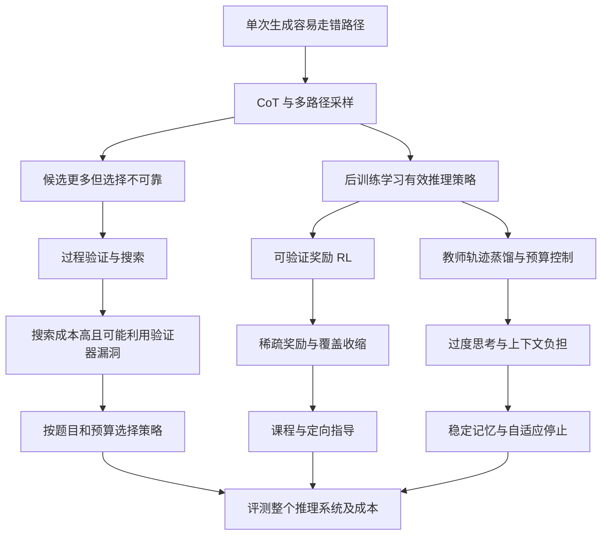

# 后训练与推理时 Scaling：从扩大模型到分配计算

> 检索与核验日期：2026-09-16。本文按问题链组织，覆盖具有解释力的代表性工作，不声称穷尽截至该日的论文。下文的“推动”“转向”主要表示研究问题之间的逻辑关系；只有原文明确引用并回应前作时，才视为直接研究承接。文献元数据、阅读深度与版本见 [frontier.json](../sources/frontier.json)，检索记录见 [frontier-search-log.md](../sources/frontier-search-log.md)。

## 1. 为什么预训练之后还需要一条 Scaling 路线？

预训练把计算投入共享参数，推理时则要为每道具体问题选择解题过程。即使模型掌握相关知识，直接生成一次答案仍可能走错路径。这个缺口把研究问题从“模型学到了多少”推进到“能否用额外计算更可靠地调用和组合已学能力”。**后训练改变生成分布；推理时计算决定如何使用该分布。两者互相影响，却是不同的预算轴。**

早期答案是让模型显式写出中间步骤。Chain-of-Thought 提示通过少量示范，使大模型在算术、常识与符号任务上改善表现；Self-Consistency 则针对单一路径的不稳定性，采样多条推理链并聚合最终答案。它们分别打开了“沿一条路径多算”和“尝试多条路径”两个方向，但没有自动解决如何控制成本、如何识别正确答案的问题。[CoT，2022](https://arxiv.org/abs/2201.11903)；[Self-Consistency，2022/2023](https://arxiv.org/abs/2203.11171)。

因此，本章采用三个操作层次：串行延长或修改一条轨迹、生成多个完整候选再选择、在尚未完成的推理前缀上搜索。这个划分比简单区分“长思考/多采样”更精确，因为树搜索会在中途改变后续计算分配。2026 年的评估研究进一步把模型、提示、解码器、证据、选择器、停止规则共同视为被测系统。[Hariri 等，§2–3](https://arxiv.org/html/2608.04001v2)。

需要先划清术语：预训练 scaling law 常拟合交叉熵损失与参数、数据、计算的函数关系；本章不少工作只测量特定任务准确率随预算的经验曲线。曲线向上，不等于已经找到跨模型、跨任务通用的幂律，也不保证每增加一份预算都改善结果。

## 2. 多采样为什么不够：从“多试几次”到计算最优策略

采样增加的是候选数量，用户需要的却是可靠的最终答案。如果某题单次正确概率是 $p$，在独立同分布采样且存在理想正确性检查器时，至少出现一次正确答案的概率为 $1-(1-p)^k$。这解释了为什么 pass@k 可以快速增加；但真实系统通常不知道哪一个候选正确。该式是概率模型下的推导，不是某种通用能力增长定律。

一条修复路线是训练验证器。Let's Verify Step by Step 比较过程监督与结果监督，让模型对中间步骤给出反馈；其作用是提供比只看最后答案更细的选择信号。代价是过程标签和验证计算，且验证器仍可能在搜索产生的新分布上犯错。[Lightman 等，2023/2024](https://arxiv.org/abs/2305.20050)。

接下来的问题变成：**同一预算应该用于更多独立候选、更深搜索，还是连续修订？** Snell 等把方法统一为改善 proposer 或利用 verifier，按模型相对难度选择策略。在 PaLM-2 与 MATH 设置中，合理分配预算可达到约四倍于特定 best-of-N 基线的效率；部分条件下，小模型配合额外推理计算能超过约十四倍参数量模型。限制同样关键：最难题收益很小；强化搜索可能利用验证器漏洞；难度估计成本未计入主要比较。因此，论文支持的是有条件的预算替代，不能改写成“小模型多想就能普遍替代大模型”。[Snell 等，§3、§5、§7](https://arxiv.org/html/2408.03314v1)。

Wu 等从另一个角度比较模型大小、投票、验证与树搜索的 FLOPs–准确率前沿，并提出 Rebase 分配搜索预算。其分析说明投票会受答案分布限制而饱和：高频错误不会因为采样更多就自动变成正确答案。于是，“扩大模型”和“改善推理算法”的最优组合随预算变化；在所测数学任务上，较小模型加合适搜索可以更划算。[Wu 等，§1、§3–4](https://arxiv.org/html/2408.00724v3)。

这组工作留下了后训练的新需求：如果基础模型根本不善于修订、探索或验证，外部搜索就会很贵。能否提前训练模型，让它更有效地消费测试时计算？

## 3. 从外部搜索到学会使用思考预算：o1 → R1 与蒸馏分支

OpenAI 的 o1 官方报告给出一条重要经验信号：增加强化学习训练计算，以及增加测试时思考计算，都能改善所示推理表现。这把“怎样搜索”扩展成“怎样训练一个善于利用额外计算的策略”。不过报告未公开足以完整复现的训练配方和统一拟合公式，图中的平滑增长也不能被当作已验证的无限外推定律。[Learning to reason with LLMs，2024](https://openai.com/index/learning-to-reason-with-llms/)。

DeepSeek-R1 使这一方向更可检查。R1-Zero 在已预训练的 DeepSeek-V3-Base 上直接做 RL，用数学答案、代码测试等可验证反馈，结合格式奖励；GRPO 用组内回报估计优势，减少对独立 critic 的需求。长推理、自检等行为随训练出现，但可读性与语言混杂等问题促成 R1 的冷启动数据、多阶段 SFT/RL 配方。这里“Zero”不表示从零知识学习，也不能把 R1-Zero 与最终 R1 的训练条件混为一谈。[DeepSeek-R1，§2](https://arxiv.org/html/2501.12948v1)。

自动验证降低了反馈扩张对逐条人工标注的依赖，也带来结构性边界：可检查的最终答案较适合数学和代码；开放研究、长程操作与开放式写作未必有可靠、廉价且难以投机的奖励。本综述据此归纳：后训练的扩张至少同时需要可用任务、可验证反馈和产生有用探索的策略，不能仅用 RL 步数概括。

蒸馏分支则回答另一个问题：不是重新发现全部推理行为，而是把强模型生成的推理轨迹传给较小模型。s1 在 Qwen2.5-32B-Instruct 上用经过难度、质量和多样性筛选的一千条样本做 SFT，再用 budget forcing 控制停止或追加“Wait”。初始论文报告 AIME24 从 50% 提升至 57%，同时明确继续延长会饱和并受上下文限制。它证明小量精挑训练数据可有效改变行为；但教师生成成本、底座预训练成本与测试时成本不能算成零，特定数学结果也不能表述为全能力超过教师或 R1。[s1，§2–6](https://arxiv.org/html/2501.19393v1)。

两条分支优化的是不同环节：RL 借反馈改变探索概率，蒸馏借教师轨迹提供额外监督。把它们统一叫作“更长 CoT”，会掩盖数据来源和能力来源的差别。

## 4. 更长是否总是更好：从延长轨迹到控制边际收益

当 budget forcing 成为廉价基线，新的失败模式也更容易观察：额外推理可能重复已完成工作、加入错误步骤，或把正确答案改错。TOPS 在不同推理长度训练设置中发现，最优长度随任务而变；它先让模型学习多种努力程度，再选择不同预算下最短的正确回答进行自改进。这把目标从“鼓励长”改为“为需要的题提供足够计算”。证据仍主要来自数学和有限底座，最短正确轨迹也依赖训练阶段可获得的正确性反馈。[Thinking-Optimal Scaling，§3–5](https://arxiv.org/html/2502.18080v1)。

2026 年的工作把这条修复链拆成两个不同问题。**第一是轨迹稳定性。** Min-Seek 针对强制延长后的重复与不稳定，保留较短的历史思考片段，并重排位置编码相关的 KV 缓存状态；在两个 R1 蒸馏模型、五类推理测试中，相比持续堆叠历史的 budget forcing 得到更稳定的曲线。其“可持续生成”来自记忆管理，并不等于难题准确率随时间无限增加；实验规模与每配置单次生成也限制了结论强度。[Min-Seek，§3–4，2026-01 预印本](https://arxiv.org/html/2601.09855v1)；[2026-03 正式发表于 Findings of EACL](https://aclanthology.org/2026.findings-eacl.153/)。

**第二是跨问题分配预算。** Adaptive Test-Time Compute Allocation 先离线估计不同采样预算的收益，再用轻量分类器预测每题预算。在数学实验中，这比统一给每题相同次数更有效。一个关键区别是，最难题不一定最值得追加计算：真正值得加预算的是尚未饱和、且确实会响应额外计算的题。该研究仍需离线效用表，采用离散预算；MATH 与 GSM8K 各抽取 200 题，并作 80/20 划分。路由特征包含一次 LLM 调用得到的归一化熵，主要成本比较则按采样预算计量，因此轻量分类器的成本不能代表完整路由成本；特征提取、生成长度与真实延迟还需端到端核算。预算迁移也尚不能由这些结果保证。[Zhai 等，§2、§5–6，2026-04](https://arxiv.org/html/2604.14853v1)。

按本综述的归纳，下一阶段应预测的是“再计算一次的预期收益”，而不仅是题目难度。停下来、换方法、找外部证据，也可能比继续生成更有价值。

## 旁支：优化得更用力，为什么反而可能变差？

在可验证推理成为焦点之前，RLHF 已暴露另一类瓶颈：奖励模型（RM）学到的是偏好的近似，持续提高它的分数，未必持续改善目标。Gao、Schulman 与 Hilton 在 2022 年把这一现象变成可测的 scaling 问题：用固定的 6B “gold RM”生成比较标签，训练不同容量的 proxy RM，再分别用 PPO 更新策略、用 best-of-N 筛选候选。两条路线都出现 proxy 分数继续提高、gold 分数先升后降的区域；因此失败并非只有训练阶段才会发生。[原文 §1–2、§3.5](https://arxiv.org/html/2210.10760v1)。

关键推进是联合考察**优化强度与评分器容量**。论文以 KL 散度的平方根度量策略偏移，并对相对初始策略的 gold 奖励拟合如下经验关系：

$$
\begin{aligned}
d &= \sqrt{D_{\mathrm{KL}}(\pi\Vert\pi_0)},\\
R_{\mathrm{BoN}} &= d(\alpha_{\mathrm{BoN}}-\beta_{\mathrm{BoN}}d),\\
R_{\mathrm{PPO}} &= d(\alpha_{\mathrm{PPO}}-\beta_{\mathrm{PPO}}\log d).
\end{aligned}
$$

系数随 RM 参数量呈平滑趋势，更大 RM 总体支持更高的 gold 奖励峰值；增加标签也能缓解过优化。它把“多优化是否有用”改写为“当前评分器能承受多少优化”。但这些是特定设置中的经验式，PPO 式在原点附近也不适用；KL 衡量分布偏移，不能当作跨算法相同的 FLOPs 预算。两种方法在相同 KL 下的收益差异，也不能被解释为相同实际算力下的效率差异；这要求把分布变化与训练、采样成本分别记账。[§3.1–3.3、§4.1](https://arxiv.org/html/2210.10760v1)。

最重要的边界是：**gold 只在合成实验中被定义为参照，它本身也是人类偏好的代理，并非人类真实意图。** 研究没有测完“标签偏好与实际意图不一致”的第二层偏差。与第 2 节验证器漏洞的联系是本综述的跨分支归纳：无论增加 PPO 更新还是推理时搜索，都会把压力集中到评分规则的误差上；扩张计算必须同时检查独立评估是否改善，不能只展示被优化分数上涨。这也促使后续研究关注新反馈和评分器更新，而非假定固定 RM 可以无限复用。[§4.3–4.5](https://arxiv.org/html/2210.10760v1)。

## 5. RL 到底扩展了能力，还是提高了抽中答案的概率？

o1/R1 的提升引出了一个无法仅靠 pass@1 回答的问题：性能改善来自新能力，还是原有解法变得更容易被采到？Yue 等比较基础模型与 RL 后模型的整条 pass@k 曲线，在所测数学、代码和视觉推理设置中发现：RL 模型在小 k 占优，但大 k 时基础模型可能覆盖更多可解题；困惑度及覆盖分析支持“当前配方主要重分配既有轨迹概率”的解释。[Does RL Really Incentivize…，v5，§3–5](https://arxiv.org/html/2504.13837v5)。

这项结果真正挑战的是“pass@1 提高即可证明能力边界扩张”的推断。有限 k 的失败不能证明正确解在分布中的概率严格为零；pass@k 还使用评测时的正确性判定，不能直接等同于部署时成功选出答案。因此，“RL 永远不会产生新能力”比实验支持的结论强得多。保持采样温度、长度、提示与检查规则一致，也是比较的必要条件。

2026 年 Curriculum RL 提出一个机制性修复：困难问题若整组 rollout 都失败，组内归一化奖励就没有可区分的学习信号。它先用采样定位边界附近的题，再给少量定向教师指导，最后用 RL 巩固；论文报告 pass@1 与 pass@256 同时改善。这个结果是“教师指导＋课程＋RL”扩大经验可解集合的证据，**不能用来宣称不借外部信息的纯 RL 已被证明突破底座上限**。[Curriculum RL，§3–5，2026-06](https://arxiv.org/html/2606.22317v1)。

与此同时，后训练本身也开始接受更系统的 scaling 测量。Tan 等在 Qwen2.5 的 0.5B–14B 范围做 54 组实验，发现所测条件下较大底座在固定后训练预算中更有效，高质量题目重复使用也能奏效。但这里的 test loss 定义为归一化错误率，非语言建模交叉熵；较大底座继承的预训练投入亦非相同。这给出的是特定 RL 配方的条件性规律，而不是“RL 的 Chinchilla 常数”。[Scaling Behaviors of LLM RL Post-Training，§2–3，2025-09](https://arxiv.org/html/2509.25300v1)。

## 6. “推理崩溃”争议教会了我们怎样评价 Scaling

The Illusion of Thinking 的价值在于改变评测自变量：不用单一考试分数概括能力，而是在 Hanoi、Blocks World 等可控制任务中提高问题复杂度。作者观察到低复杂度时普通模型更省计算、中等复杂度时思考模型受益、高复杂度时两者均出现崩溃；部分模型在失败区间还减少思考。这说明已有经验曲线不能不加条件地外推到更难的组合任务。[Shojaee 等，v3，§4](https://arxiv.org/html/2506.06941v3)。

但从特定输出协议失败进一步推到“模型没有推理能力”，需要额外证据。Lawsen 的评论质疑解的表示方式、完整动作序列要求与部分任务的可解性，并以输出可执行生成函数作为另一种测试。其 v2 修正了 v1 对输出长度的错误估计，承认许多崩溃发生在理论长度上限之前；替代表达实验规模也有限。因此既不能把原论文解释为普遍不可能性定理，也不能说一篇评论已推翻所有失败观察。[Lawsen，v2，§4–5](https://arxiv.org/html/2506.09250v2)。

正确的研究分叉是把三件事分开测：是否找到算法、能否忠实执行长序列、能否在给定接口和预算下交付可验证结果。允许调用代码会改变被评测系统，应分别报告模型直接作答和模型加工具的表现。

另一个边界来自知识任务。Zhao 等在禁止外部检索的 SimpleQA、FRAMES 设置中发现，延长思考未稳定提高事实准确率；幻觉率变化有时来自更愿意回答或更愿意弃答。作者同时发现启用思考相比不思考仍可能有益。这使结论更精确：**有思考的收益与继续增加思考的边际收益，不是同一个问题**；这些结果也不覆盖增加检索和工具调用的完整 test-time scaling。[Knowledge-Intensive Tasks，§3–5](https://arxiv.org/html/2509.06861v1)。

## 7. 怎样把这些曲线放进同一张研究地图？

图中的边表示本综述重建的问题—方案关系，不表示每对论文之间都存在直接影响。

| 想回答的问题 | 应报告的量 | 最容易混淆的解释 |
|---|---|---|
| 单次交付是否更可靠 | pass@1、抽样不确定性 | 当成全部潜在能力 |
| 候选中是否出现正确解 | 完整 pass@k 曲线、检查器 | 当成真实选择器的准确率 |
| 多算是否划算 | 端到端准确率–成本前沿 | 只数生成 token，漏算验证与搜索 |
| 长思考是否改善 | 同模型同任务下预算干预 | 用“难题通常更长”代替因果证据 |
| 后训练是否带来新覆盖 | 配对底座、匹配采样协议 | 把有限 k 没采到当作绝对不可达 |
| 系统是否能部署 | 延迟、吞吐、费用与准确率 | 把相同 token 数当作相同 FLOPs |

这张表是综述的报告建议；2026 年评估框架对其中候选库诊断、在线停止和完整系统边界给出了更形式化的区分。[Hariri 等，§3](https://arxiv.org/html/2608.04001v2)。

在实际阅读新论文时，还应检查增益的比较单位。例如，从50%到57%是增加7个百分点；若按相对比例表达则是14%，两种写法不能混用。小测试集上的单次准确率变化，也需要结合题目数、重复采样和不确定性理解。若选择器先看到全部候选，再回溯决定“本来可以何时停止”，那只能提供离线分析，不能直接当作在线省下的计算。以上是本综述的审阅原则，不是对任何单篇论文报告数字的重新估计。

同样需要区分三个预算实验：固定一个模型改变推理预算，测的是同一系统的资源响应；换一个更强底座再比较，测的是模型与算法组合；先增加后训练再获得更好的推理曲线，则同时改变了训练投入和推理效率。只有把这些实验分开，才知道新工作改善的是曲线上的某个点，还是把整条成本前沿向外推。这个区别也决定更新综述时应把一篇新论文接到哪个瓶颈之后。

为连接预训练章节，可以用一个记账式而非新的经验定律：

$$
C_{\mathrm{lifecycle}}=C_{\mathrm{pre}}+C_{\mathrm{post}}+
\sum_{i=1}^{Q}\left(C_{\mathrm{generate},i}+C_{\mathrm{verify},i}+C_{\mathrm{tool},i}\right).
$$

同一优化还要受延迟、内存和吞吐约束。它提示真正待解决的问题是联合分配：更强的底座可能提高探索起点，更好的后训练可能提高每份推理预算的收益，更好的验证可能把候选潜力转成实际成功。三项都需要在匹配成本和任务分布下比较，现有结果尚未给出普适的兑换率。

## 8. 本章下一次更新需要什么证据？

持续跟踪四类会改变叙事的进展：可复现的 RL 数据—计算—性能拟合；在匹配底座和采样条件下改变高 k 覆盖的结果；跨数学、知识与真实工具任务仍有效的自适应分配；以及能在统一协议中复现实用成本前沿的研究。新模型的高分可以加入材料库，但只有解决、暴露或重新定义上述瓶颈，才需要改写主线。

2026 年新增材料目前以预印本为主，本章已阅读其原文相关方法、实验与局限章节；尚未独立复现实验，不应把它们标成已形成共识。首次上线的核心结论仍是：Scaling 的研究对象已从单一模型大小，扩展为底座能力、学习信号、搜索策略、验证可靠性和预算分配共同组成的系统。
