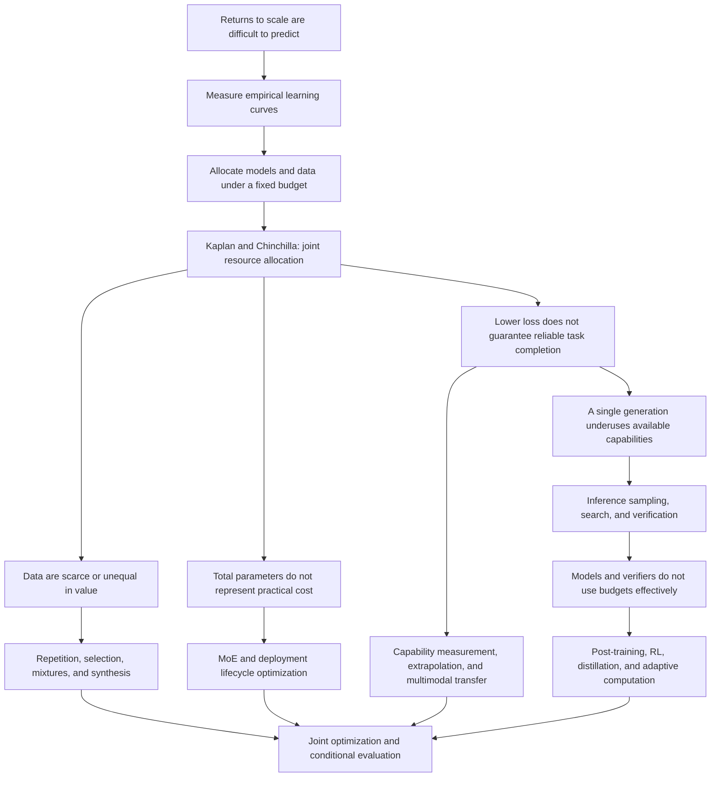

# Introduction: What Questions Do Scaling Laws Answer?

Training a large model begins with a resource decision: before spending the budget, can we estimate the benefits of adding model capacity, training data, or computation? If every configuration must be trained to completion before its performance is known, larger experiments become increasingly difficult to afford. Hestness and colleagues measured learning curves across tasks; Kaplan and colleagues subsequently connected language-model parameters, data, and training computation, turning the intuition that larger models might perform better into resource–performance relationships that could be fitted and compared. [Hestness et al., 2017](https://arxiv.org/abs/1712.00409); [Kaplan et al., 2020](https://arxiv.org/abs/2001.08361).

Predicting improvement, however, does not by itself identify the right allocation. Chinchilla showed that, at fixed training compute, allocating too much of the budget to parameters without a corresponding increase in training tokens can be inefficient. The central question shifted from whether to scale to which dimension to scale. Data scarcity and quality differences, sparse architectures, deployment costs, reward feedback, and inference-time computation subsequently added further constraints to this optimization problem. [Hoffmann et al., 2022](https://arxiv.org/abs/2203.15556).

The central argument of this survey is that **scaling-law research evolves as researchers discover what existing resource models omit and solve the allocation problem again.** This is a synthesis of the literature, not a unified theorem proposed by any one paper.

## Separate Three Questions That Are Often Conflated

| Level | Object of study | What it can answer | What does not follow directly |
|---|---|---|---|
| Empirical regularities | How loss or error changes with scale under a specified configuration | Behavior in the measured range and the validity of controlled extrapolation | Validity at arbitrary scales, distributions, or tasks |
| Resource optimality | Choosing models, data, and algorithms under a budget | Which configuration is more efficient for the stated objective | That training optimality also implies deployment optimality |
| Capabilities and systems | Actual success under a task, interface, and evaluation protocol | Whether a system delivers reliably and at what cost | That one average score completely describes its capabilities |

This distinction runs throughout the survey. Lower language-model cross-entropy, higher mathematical pass@1, finding a correct candidate among N samples, and delivering a correct answer to a user are different quantities. Even when all improve with computation, they need not share an exponent or conversion rule. Inference-time scaling in particular requires explicit accounting for selection and verification costs. [Snell et al., 2024](https://arxiv.org/abs/2408.03314).

## The Same Curve Can Address Four Different Decisions

To understand the subsequent branches, first identify where the budget is fixed. The first decision occurs before training: given total training compute, what model size, token count, and optimization schedule should we choose? The second arises once data and hardware constraints are known: when unique data are scarce, the model does not fit in memory, or context is too long, which variables remain available to increase? The third occurs before deployment: does a sufficiently large request volume justify longer training once in exchange for cheaper inference on every request? The fourth occurs when a request arrives: should this problem receive more generation, search, or verification, or should computation stop? The first three primarily change the system; the fourth allocates a per-problem budget within a trained system. [Chinchilla](https://arxiv.org/abs/2203.15556); [data-constrained scaling](https://arxiv.org/abs/2305.16264); [lifecycle costs](https://arxiv.org/abs/2401.00448); [Snell et al.](https://arxiv.org/abs/2408.03314).

**The following accounting framework connects these decisions; it is not presented as an already fitted, unified scaling law:**

$$
C_{\mathrm{total}}=C_{\mathrm{pre}}+C_{\mathrm{post}}+
Q\,\mathbb{E}_{x}\left[C_{\mathrm{serve}}(x)\right].
$$

Here, $C_{\mathrm{serve}}$ includes generation, selection or verification, and tool use; $Q$ is the expected request volume. Optimizing monetary cost, latency, or energy requires separate accounting rather than inserting those quantities into the same FLOP sum. The request distribution also matters: at the same average compute, assigning equal budgets to easy and difficult problems may underperform allocation by marginal benefit. Predicting difficulty and deciding when to stop also incur costs. The task-adaptive methods discussed later approximate this incompletely known optimization problem.

This explains a recurring misinterpretation. An experiment showing continued gains from increasing $D$ at fixed $N$ does not determine whether a larger $N$ is preferable at fixed $C$. Likewise, a model becoming more accurate with longer thinking does not establish that it is more efficient than another model at equal end-to-end cost. Apparently conflicting papers can be placed in the same research conversation only after identifying what was fixed, what changed, and what was measured.

Definitions used throughout the seven chapters appear in the [glossary and cost conventions](glossary.md). In particular, data quality is not a universal scalar across tasks; sparse models require more than total parameter counts; verifier-assisted success cannot be attributed solely to the generator; and exact-match scores are not direct continuous measurements of internal capability.

## A Map of the Research Questions

The arrows represent the survey's explanatory connections. The text distinguishes direct responses to prior work, parallel approaches to the same bottleneck, and editorial synthesis; chronological ordering is not automatically treated as historical causation.

A more detailed account of paper relationships and branching rationales is available in the [research conversation map (Chinese)](../research-map.md).

## Reading Paths

For the classical allocation debate, start with the Kaplan–Chinchilla–reanalysis chain in [predictability and budgets](01-predictability-budget.md), then read [data](02-data.md) and [deployment costs](03-architecture-deployment.md). To assess whether test-time scaling is taking over, begin with the proposers, verifiers, and allocation policies in [post-training](04-posttraining.md) and [inference-time computation](05-inference.md), then examine [capability evaluation](06-theory-evaluation.md) and negative results. To follow new work, first identify the question raised in the community radar, return to the primary evidence, and decide which connection in the narrative should change.

This survey prioritizes representative studies that explain turning points rather than mechanically ranking papers by citations or social-media exposure. References to “current” or “latest” are relative to the search date, September 16, 2026. Reading scope and unresolved issues are disclosed in the chapters and metadata.
