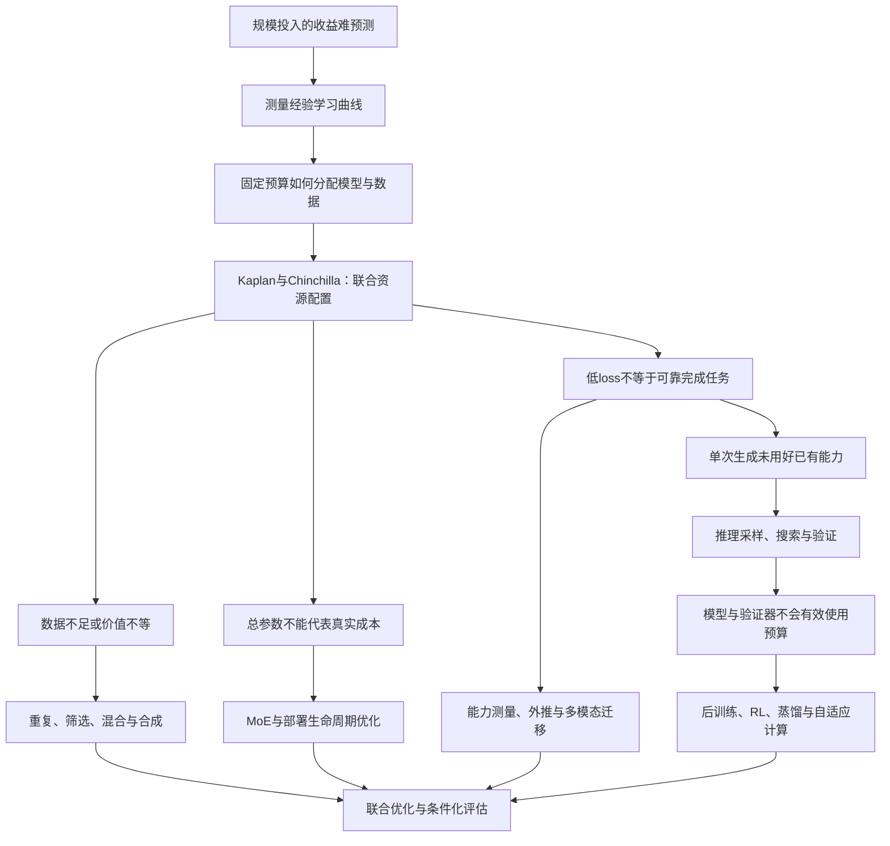

# 导论：Scaling law 到底在回答什么问题？

训练大模型首先是一个资源决策问题：在尚未花完预算之前，能否知道增加模型容量、训练数据或计算会带来多少收益？如果每一种规模都必须训练到最后才知道效果，那么扩大实验本身就会越来越难承担。Hestness 等跨任务测量学习曲线，Kaplan 等进一步把语言模型的参数、数据和训练计算联系起来，使“更大可能更好”转变为可以拟合和比较的资源—性能关系。[Hestness et al., 2017](https://arxiv.org/abs/1712.00409)；[Kaplan et al., 2020](https://arxiv.org/abs/2001.08361)。

但能够预测增长，不等于已经知道怎样分配资源。Chinchilla 说明，在固定训练计算下，把预算过度放在参数而没有相应增加训练 token，可能低效。这一步把核心问题从“应不应该扩展”改成“应该沿哪个轴扩展”。随后，数据不足与质量差异、稀疏架构、部署成本、奖励反馈和推理时计算不断使这个优化问题增加新的约束。[Hoffmann et al., 2022](https://arxiv.org/abs/2203.15556)。

本综述的中心论点是：**scaling law 的演化，是研究者不断发现旧资源模型遗漏了什么，并重新求解最优分配的过程。** 这是对文献的综合解释，不是某篇论文提出的统一定理。

## 先把三个经常混用的问题拆开

| 层次 | 研究对象 | 能回答什么 | 不能直接推出什么 |
|---|---|---|---|
| 经验规律 | 给定配置下，损失或错误随规模变化的函数 | 已测区间如何变化，受控外推是否有效 | 任意规模、分布或任务都成立 |
| 资源最优 | 在预算约束下选择模型、数据与算法 | 哪个配置在指定目标上更划算 | 训练最优必然等于部署最优 |
| 能力与系统 | 在任务、接口和评测协议下的实际成功 | 系统能否可靠交付、成本多少 | 一个平均分完整刻画所有能力 |

这一区分贯穿全文。语言建模交叉熵下降、数学 pass@1 上升、best-of-N 找到正确答案和用户最终拿到正确结果，是不同的量。即使都随计算改善，也不能直接使用同一个指数或兑换关系。推理时计算研究尤其需要显式纳入候选选择与验证成本。[Snell et al., 2024](https://arxiv.org/abs/2408.03314)。

## 全文的问题地图

箭头是本综述的解释性连接。正文会区分直接回应前作、并行回答同一瓶颈和作者归纳的联系；不会把按年份排列自动写成历史因果。

## 怎样阅读

想理解经典争议，先读预训练章的 Kaplan—Chinchilla—复现链，再读数据和生命周期成本。想判断“test-time scaling 是否接棒”，先读后训练与推理章的 proposer、verifier 和策略分配，再读能力评估与负面结果。想跟踪新工作，先看社区雷达提出了哪个问题，再回到原始证据，最后判断它应改变正文哪一条因果连接。

首版以能够解释转折点的代表研究为核心，不按引用数或社媒曝光机械排序。全文的“当前”“最新”均相对于本次检索日期 2026-09-16；阅读范围与未解决问题在各章和元数据中披露。
