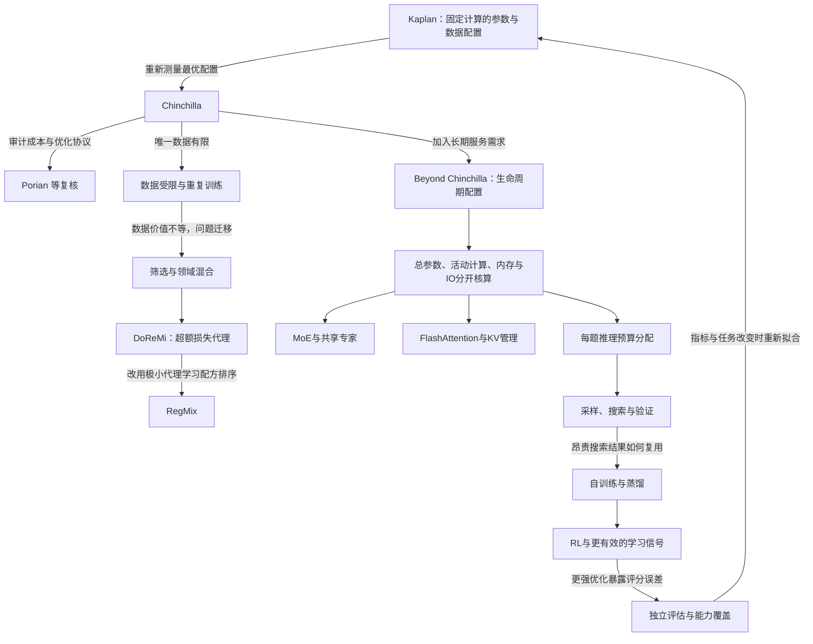

# 研究对话地图：每条连接改变了什么？

这张地图与[正文覆盖统计](evidence-map.md)用途不同：后者回答引用了多少来源，本页解释关键工作为什么应该一起阅读。**直接回应**表示后作明确重测、比较或修改前作；**问题迁移**和**并行路线**则是综述为组织证据建立的关系。

这里的回路是实验和信息相互影响，不表示一套已经被证明收敛的统一学习算法。

| 研究连接 | 前一步尚未解决的问题 | 后一步真正改变的量 | 新的限制与阅读入口 |
|---|---|---|---|
| Kaplan → Chinchilla → 复核 | 固定预算配比的估计为何差异很大？ | 规模扫描、训练长度、成本统计与优化协议 | 不能把单一比例当通用常数；[T1](01-predictability-budget.md) |
| Chinchilla → 数据受限 | 更多处理 token 是否仍代表更多新信息？ | 唯一数据量与重复次数分离 | 重复边际收益与数据分布相关；[T2](02-data.md) |
| DoReMi → RegMix | 数据混合搜索本身太贵，小代理能否迁移？ | 从参考损失动态重加权转向配方排序预测 | 目标域、可用域和代理区间限制迁移；[T2](02-data.md) |
| Routed LM → Fine-Grained MoE | 固定数据量无法解出稀疏模型的联合最优 | 增加训练 token 与专家粒度两个轴 | 路由与通信仍需计费；[T3](03-architecture-deployment.md) |
| DeepSeekMoE → V2 → V3 | 专家分工之后，缓存、通信与均衡又制约扩展 | 共享/细粒度专家、MLA、负载调节与系统实现 | 不能从整套配方成绩单独识别每个部件；[T3](03-architecture-deployment.md) |
| FlashAttention → FlashAttention-2 | 少访问显存后，硬件并行仍不充分 | IO组织、非矩阵算术与warp工作分配 | 内核加速不等于整个训练同比例加速；[T3](03-architecture-deployment.md) |
| STaR / ReST / ReST-EM | 少量示范下如何复用已发现的成功轨迹？ | 生成、筛选、奖励重加权与迭代训练 | 有限正例覆盖与检查器错误；[T4](04-posttraining.md) |
| 人工过程反馈 → Math-Shepherd → PRM Lessons | 步骤标签贵，自动续写标签是否等同逻辑正确？ | 从人工判断改为未来成功率，再核查二者的差异 | 搜索价值与错误定位有不同目标；[T4](04-posttraining.md) |
| GRPO → Dr. GRPO / DAPO / GSPO | 长轨迹、归一化和路由变化怎样影响更新？ | 信用与长度权重、有效采样、序列概率比 | 改善局部偏置不等于统一最优RL配方；[T4](04-posttraining.md) |
| 多采样 → 验证与搜索 → 自适应分配 | 找到过正确解，为什么仍交付错误答案？ | 候选选择、中间搜索和每题预算策略 | 验证成本、选择误差与停止判断；[T5](05-inference.md) |
| 平均loss → 任务分数 → 外推检验 | 平滑损失能否预测具体能力跃迁？ | 测量函数、任务难度、模型族与留出规模 | 解释已知点与预测未见点不同；[T6](06-theory-evaluation.md) |
| 语言token → 图文/生成/机器人 | 资源单位变了，哪些规律还能沿用？ | 模态配比、采样过程、轨迹与环境覆盖 | 指数、成本和数据独立性必须重测；[T7](07-multimodal.md) |

表格是正文的导航；每条机制、数值和证据边界均在相应章节附原始论文。它也定义了更新方式：新工作先接到具体遗留问题，再判断属于修复、反例、替代目标还是并行方案；没有合适连接的材料先保留在候选库。
